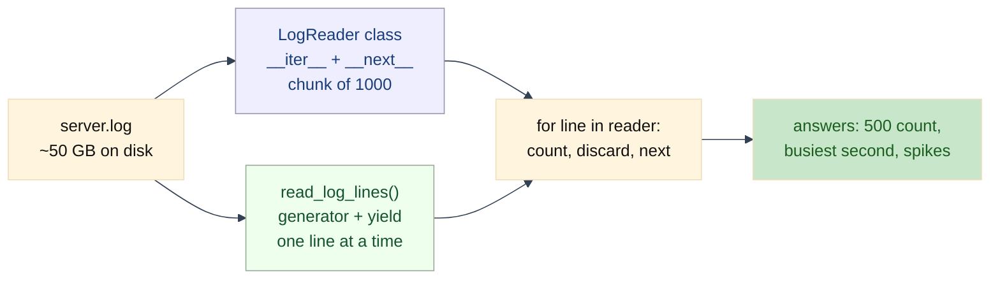

# Lab: The Memory-Efficient Data Pipeline — Iterators and Generators

Difficulty: Intermediate | ~40 min | Requires Lab 1 basics

## 1. Lab Title

**The Memory-Efficient Data Pipeline** — processing a log file far larger than
RAM using class-based iterators and generator functions.

## 2. Problem Statement

Your service writes one line per request to `server.log`. A 5:00 PM traffic
spike pushes the file to **~50 GB**, and ops needs two answers fast:

1. **How many requests returned a `500` error?**
2. **At which seconds did the server get overwhelmed?**

A naive `readlines()` would copy the whole file into RAM and swap the machine to
death. The fix is lazy reading: pull lines one at a time, count, and discard.
This lab builds the reader two ways — a class-based iterator and a generator
function — and measures the memory difference with `sys.getsizeof()`.

## 3. Input Data

A real 50 GB log is awkward to ship, so the notebook **generates a
deterministic fake one** in Section 2 using `random.seed(42)`. Every learner
produces the identical file, so all outputs in this document are reproducible.

Format of `data/server.log` (one request per line):

```
2026-08-09 12:34:56 GET /api/items 200
```

Field order: `date time method path status`. Most seconds carry 5–60 requests,
but 2% of seconds carry 150–500 — those bursts are the "spikes" we detect.

## 4. Processing

1. Warm up: `iter()`, `next()`, `StopIteration`.
2. Generate `data/server.log` (deterministic, ~141k lines).
3. Baseline: `readlines()` into a list; record `sys.getsizeof()`.
4. Part 1: hand-written `LogReader` class implementing `__iter__` + `__next__`,
   reading in chunks of 1000 lines.
5. Part 1 use: count total lines and `500` errors through the class.
6. Part 2: the same reader as a generator function using `yield`.
7. Part 2 use: verify the generator's counts match the class exactly.
8. Find the busiest second and count spike seconds with `itertools.groupby`.
9. Compare object sizes: `sys.getsizeof(list)` vs `sys.getsizeof(generator)`.
10. Present all three readers as a `tabulate` table.

## 5. Output

All values below were captured from a clean run of the notebook.

- `data/server.log` written: **5,846,826 bytes** (140,610 lines).
- Baseline: `Lines read at once: 140610`, `sys.getsizeof(list): 1140568 bytes`.
- Class iterator: `Total lines (class iterator): 140610`, `500 errors (class
  iterator): 28321`.
- Generator: `Total lines (generator): 140610`, `500 errors (generator):
  28321`, `Totals match: True`.
- Spikes: `Busiest second: ('00:13:38', 500)`; `Seconds with > 100 requests:
  76`.
- Memory: `readlines() list object: 1140568 bytes`, `generator object: 232
  bytes`, `Ratio: 4916.2 x`.

Final comparison table:

```
+--------------------------+-------------------+-----------------+
| Approach                 | Lines in memory   | Object size     |
+==========================+===================+=================+
| readlines() list         | 140,610 lines     | 1,140,568 bytes |
+--------------------------+-------------------+-----------------+
| LogReader class          | chunk of 1000     | 48 bytes        |
+--------------------------+-------------------+-----------------+
| read_log_lines generator | 1 line at a time  | 232 bytes       |
+--------------------------+-------------------+-----------------+
```

## 6. Tech Stack

| Tool | Version | Why |
| --- | --- | --- |
| Python | 3.9+ | stdlib only for the core logic |
| `sys.getsizeof` | stdlib | container memory measurement |
| `itertools.groupby` | stdlib | lazy grouping of consecutive seconds |
| `random` | stdlib | deterministic log generation |
| `tabulate` | 0.10.0 | report-ready table output |

No APIs, no accounts, no GPU, no network access required.

## 7. Underlying Concepts

**The iterator protocol.** A `for` loop calls `iter(obj)` to get an iterator,
then `next(iterator)` repeatedly until the iterator raises `StopIteration`. You
can implement that protocol by hand with `__iter__` and `__next__`.

**Generators.** A function containing `yield` is a generator. Calling it does
not run the body; it returns an iterator. Each `next()` runs the body up to the
next `yield`, returns that value, and *suspends* the function frame — local
variables and position are remembered. The next call resumes right after the
`yield`. This is lazy evaluation: values are produced on demand, not in bulk.

**Why this matters for big files.** `readlines()` builds a list of *all* lines
at once. A generator keeps one file handle and one saved position — the file
never has to fit in memory.



**Lazy grouping with `groupby`.** `itertools.groupby` groups *consecutive*
equal keys without loading them all: it holds one group at a time. Because the
log is time-sorted, grouping by the timestamp field finds per-second counts in
one pass. **Single-pass caveat:** generators are exhausted after one loop —
re-call the generator to re-read.

**Reading `sys.getsizeof` honestly.** It reports bytes owned by the container
itself. For a list it counts the array of *pointers* (8 bytes per line), not
the string objects — so the true saving is even larger than the table shows.
For a generator it counts the frame and file-handle state, which is why the two
numbers are thousands of orders apart.

## 8. Prerequisites

- Python 3.9+ installed.
- Comfortable with `for` loops, functions, `with open(...)`, and f-strings.
- Lab 1's functional-style comfort is a plus but not required.

## 9. Environment Setup

```bash
python --version
python -m venv .venv
.venv\Scripts\activate        # Windows
source .venv/bin/activate     # macOS/Linux
pip install tabulate==0.10.0 notebook
jupyter notebook
```

Open `lab-memory-efficient-data-pipeline.ipynb`. The first cell installs the
pinned dependency (`tabulate==0.10.0`) automatically.

## 10. Step-wise Development Instructions

### Step 1 — Warm up: the iterator protocol

A `for` loop does three things under the hood: call `iter(obj)` to get an
iterator, call `next(iterator)` to pull each value, and treat `StopIteration` as
the end of the stream. Two of those pieces — `next()` and `StopIteration` — are
things you can write yourself, as later steps will. A **generator** is a
function whose body contains `yield`: calling it returns an iterator that runs
one step per `next()`.

```python
numbers = iter([10, 20, 30])
print(next(numbers))
try:
    print(next(numbers))
except StopIteration:
    print("StopIteration - the iterator is exhausted")
```

### Step 2 — Generate the log

A real 50 GB log is awkward to ship, so the notebook *generates* a
deterministic fake one. `random.seed(42)` makes it reproducible: every learner
gets the exact same file. Each line is `date time method path status`, e.g.
`2026-08-09 12:34:56 GET /api/items 200`. Seconds carry a mostly-flat 5–60
requests, but 2% of seconds are 150–500 request bursts — the spikes we want to
detect.

```python
import os, random
random.seed(42)
os.makedirs("data", exist_ok=True)
paths = ["/api/items", "/api/users", "/api/orders", "/static/app.js"]
with open("data/server.log", "w", encoding="utf-8") as f:
    for second in range(3600):
        burst = random.random() < 0.02
        count = random.randint(150, 500) if burst else random.randint(5, 60)
        for _ in range(count):
            hh, mm, ss = second // 3600, second % 3600 // 60, second % 60
            stamp = f"2026-08-09 {hh:02d}:{mm:02d}:{ss:02d}"
            path = random.choice(paths)
            method = random.choice(["GET", "GET", "POST"])
            status = random.choice(["200", "200", "200", "404", "500"])
            f.write(f"{stamp} {method} {path} {status}\n")
```

### Step 3 — Baseline with `readlines()`

`readlines()` loads the entire file into one list of strings. The code is simple
and *correct* — on a small log. Print the size of the list object and keep that
number in mind; it is the thing we will shrink: the list holds a pointer to
every one of the 140,610 lines.

```python
with open("data/server.log", encoding="utf-8") as f:
    lines_list = f.readlines()
print("Lines read at once:", len(lines_list))
print("sys.getsizeof(list):", sys.getsizeof(lines_list), "bytes")
```

### Step 4 — Part 1: the class-based iterator

The iterator protocol needs two methods: `__iter__` must return an iterator
object — here, itself — and `__next__` must return the next value or raise
`StopIteration`. Our `LogReader` reads the file in chunks of `chunk_size` lines:
when the buffer is empty, `__next__` fills it with up to 1000 lines, and at EOF
it closes the file and raises `StopIteration`. Only a slice of the file is ever
in memory at once — this is the hand-written version of lazy reading.

```python
class LogReader:
    def __init__(self, path, chunk_size=1000):
        self.path = path
        self.chunk_size = chunk_size
        self.file = None
        self.buffer = []
        self.index = 0

    def __iter__(self):
        self.file = open(self.path, encoding="utf-8")
        self.buffer = []
        self.index = 0
        return self

    def __next__(self):
        if self.index == len(self.buffer):
            self.buffer = []
            for _ in range(self.chunk_size):
                line = self.file.readline()
                if not line:
                    break
                self.buffer.append(line)
            self.index = 0
            if not self.buffer:
                self.file.close()
                raise StopIteration
        line = self.buffer[self.index]
        self.index += 1
        return line
```

### Step 5 — Use the class iterator

Drop the class into an ordinary `for` loop. Nothing about the loop changes —
`for` just calls `next()` under the hood until `StopIteration`. Count total
lines and `500` errors through the iterator; the counting logic looks identical
to a plain file loop.

```python
total_class = 0
errors_class = 0
for line in LogReader("data/server.log"):
    total_class += 1
    if line.split()[-1] == "500":
        errors_class += 1
```

### Step 6 — Part 2: the generator refactor

Writing a class with `__iter__` and `__next__` is the *verbose* way to build an
iterator. A **generator function** is the same idea with dramatically less
boilerplate: `yield` hands back the next value and remembers where the function
was; the next call resumes right after the `yield`. The `with` block also closes
the file for us when the loop finishes. Same reading semantics, ~30 lines
shorter.

```python
def read_log_lines(path):
    with open(path, encoding="utf-8") as f:
        for line in f:
            yield line
```

### Step 7 — Verify, then find spikes

A rewrite is only safe if it produces the same numbers — run the same counting
loop over the generator and confirm it matches Part 1. Then `itertools.groupby`
groups consecutive lines by their second: it yields `(timestamp, count)` pairs
and holds only one group at a time, so the whole thing stays lazy. `max` finds
the busiest second, and the generator expression counts seconds above 100
requests.

```python
from itertools import groupby

def seconds_and_counts(lines):
    for ts, group in groupby(lines, key=lambda line: line.split()[1]):
        yield ts, sum(1 for _ in group)

print(max(seconds_and_counts(read_log_lines("data/server.log")), key=lambda kv: kv[1]))
n_spikes = sum(1 for ts, n in seconds_and_counts(read_log_lines("data/server.log")) if n > 100)
```

### Step 8 — Measure the memory payoff

`sys.getsizeof()` reports the bytes owned by the container *itself*: the list
holds a pointer to every line (~1.1 MB), while the generator object holds a file
object and a saved position (232 bytes). Same log file, same answers — one of
them is thousands of times lighter.

```python
import sys

gen = read_log_lines("data/server.log")
list_size = sys.getsizeof(lines_list)
gen_size = sys.getsizeof(gen)
print("readlines() list object:", list_size, "bytes")
print("generator object:", gen_size, "bytes")
print("Ratio:", round(list_size / gen_size, 1), "x")
```

### Step 9 — Present as a table

`tabulate` turns a list of rows into a clean grid for a report. (Note:
`sys.getsizeof` on the list measures the list of *pointers*, not the string
objects themselves — the true memory saving is even bigger than the table
shows.)

```python
from tabulate import tabulate

rows = [
    ["readlines() list", f"{len(lines_list):,} lines", f"{list_size:,} bytes"],
    ["LogReader class", "chunk of 1000", f"{sys.getsizeof(LogReader('data/server.log')):,} bytes"],
    ["read_log_lines generator", "1 line at a time", f"{gen_size:,} bytes"],
]
print(tabulate(rows, headers=["Approach", "Lines in memory", "Object size"], tablefmt="grid"))
```

## 11. Optional Exercise

Rewrite the generator to yield **chunks of lines** instead of single lines:

```python
def read_log_chunks(path, chunk_size=1000):
    with open(path, encoding="utf-8") as f:
        while True:
            lines = []
            for _ in range(chunk_size):
                line = f.readline()
                if not line:
                    break
                lines.append(line)
            if not lines:
                break
            yield lines
```

Loop over `read_log_chunks("data/server.log")`, counting total lines and `500`
errors by iterating *inside* each chunk, and confirm the totals still match the
answers from Part 1 (140,610 lines, 28,321 errors). Why might chunked reading
be preferable to one-line-at-a-time on a slow disk? (Fewer round-trips to the
filesystem.)

## 12. What We Learnt

- An iterator hands out values one at a time via `next()` and ends with
  `StopIteration`; `for` loops drive this automatically.
- A class-based iterator implements `__iter__` + `__next__` and can read in
  controlled chunks.
- A generator function with `yield` is the same idea with far less boilerplate
  — the function pauses at `yield` and resumes on the next call.
- Lazy pipelines let you analyze data far larger than RAM: keep one item (or
  one chunk) in memory and stream the rest.
- `groupby` groups consecutive items in one lazy pass; generators are
  single-pass, so re-call them to re-read.
- `sys.getsizeof()` compares container overhead — and shows the list holding
  ~5,000× the memory of the equivalent generator.
