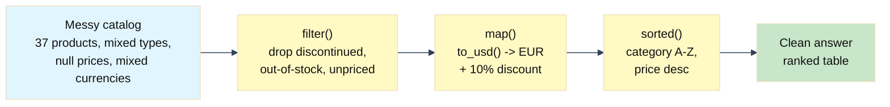

# Lab: Functional Data Wrangling with Lambda Functions

Difficulty: Beginner | ~25 min | Requires basic Python (lists, dicts, functions)

---

## 1. Lab Title

**Functional Data Wrangling with Lambda Functions**

In this lab, we will learn **lambda functions** — Python's anonymous, one-expression
functions — and how to compose them with `filter()`, `map()`, and `sorted()` to turn a
messy JSON product catalog into a clean, ranked table in one pipeline.

---

## 2. Problem Statement / Use Case Overview

You are a data analyst at an online electronics store. Marketing exported the product
catalog to JSON, and it's messy: prices are sometimes strings or `null`, some are
buried in a nested `pricing` dict that records its own currency, and stock counts go
missing. Your manager wants a quick answer: *which products are actually sellable —
not discontinued, in stock, and with a usable price — priced in euros at a 10%
clearance discount, ranked by category and then by price?* Rather than write a `def`
per step, this lab composes `filter()`, `map()`, and `sorted()` with short **lambdas**
into one clean pipeline.

---

## 3. Input Data

A JSON file, `data/product_catalog.json`, shipped with the lab: **37 product
dictionaries** across 5 categories, deliberately messy (missing fields, string and
`null` prices, mixed currencies) so you practice defending against real-world data.
Nothing to download, no API keys.

---

## 4. Processing

1. **Warm up on plain numbers** — try each of the four tools (`lambda`, `map`,
   `filter`, `sorted`) on a simple list of numbers, no mess to distract you.
2. **Inspect the mess** — print the actual price types and stock values so you know
   what your code has to survive.
3. **Part 1 — `filter()` + lambda**: keep only products that are *not* discontinued,
   *have* stock greater than zero (defaulting to `qty`, then to `0`), *and* have a
   usable (non-`None`) price.
4. **Part 2 — normalize, then reshape with `map()` + lambda**: first a small named
   function `to_usd()` normalizes the mixed currencies (`USD`/`EUR`/`GBP`) to a single
   USD figure; then the lambda converts to euros (rate 0.92), applies a 10% discount,
   and rounds to 2 decimals.
5. **Part 3 — `sorted()` + lambda key**: order the final dictionaries by category
   (A–Z), then by price within each category, highest first — one tuple key.
6. **Full pipeline**: compose `filter → map → sorted` into a single expression.

---

## 5. Output

Each cell prints the result of the step it just demonstrated. The final output is a
ranked table of 21 sellable products, in euros with a 10% clearance discount, ordered
by category (A-Z) and then by price (highest first), with columns for `Category`,
`Name`, `Price (EUR)`, and `Sale (EUR)`.

---

## 6. Tech Stack

- **Python 3.9+** — `json` (loading the catalog) and `lambda` / `map` / `filter` /
  `sorted` are all built into the standard library.
- **tabulate == 0.10.0** — used only to display the final result as a neat table.
- **Data file:** `data/product_catalog.json` ships with the lab.

No GPU, no API keys, no paid services. Runs on any laptop CPU with a few MB of RAM.

---

## 7. Underlying Concepts

### A lambda is an anonymous function

A **lambda** is a function without a name, written `lambda parameters: expression`.
The expression is *automatically returned*, so no `return` keyword is needed — but a
lambda can hold only a single expression. Its value here is exactly that you can write
a small transformation inline, where it is used, instead of scattering one-use `def`
functions through the notebook.

### The three functional tools

- **`map(function, iterable)`** applies the function to every item and returns the
  results. It is a *transform* step: same number of items in, same number out. Here it
  is used to *reshape* — turning each messy product dictionary into a clean one.
- **`filter(function, iterable)`** keeps only the items for which the function returns
  `True`. It is a *selection* step: usually fewer items come out than went in.
- **`sorted(iterable, key=function)`** returns a new list in a chosen order. The `key`
  function is called once per item, and `sorted()` orders the items by the values that
  key returns. Without a `key`, `sorted()` on a list of dictionaries would fail —
  Python can't compare whole dictionaries.

Both `map()` and `filter()` return lazy objects, which is why the lab wraps them in
`list()` to see the results.

### Defending against messy data (the whole point of Part 1)

A JSON export is not a clean API — numbers arrive as strings, `null` means "no value",
fields go missing, and the same field is sometimes stored under a different key. Three
tricks do most of the work:

- **`.get(key, default)`** returns `default` instead of raising `KeyError` when the
  key is absent. Chained with a second key — `product.get("stock", product.get("qty", 0))`
  — it walks two candidate keys and returns `0` only when both are missing.
- **`float()`** coerces string prices (`"34.99"` → `34.99`) so arithmetic works on
  mixed data. You must first make sure the price isn't `None` — a JSON `null` decodes
  to Python `None`, and `float(None)` would crash.
- **Currency normalization** — when prices arrive in different currencies, comparing
  or summing them is meaningless until every price is in the same unit. `to_usd()`
  converts `EUR` and `GBP` prices to USD before the lab applies the EUR conversion.

This is why the filter runs *first*: once discontinued, out-of-stock, and unpriceable
products are gone, the later stages can assume the records are well-formed.

### Multi-key sorting with a tuple key

`sorted()` compares key values once per item. If the key returns a **tuple**, Python
compares the first element, breaking ties with the second (then the third, and so on).
That gives two-level sorting — but only in *ascending* order for both. To make one
element sort descending while the other stays ascending, negate the numeric one:
`(product["category"], -product["price_eur"])`. The minus sign flips only the price.

### How the pieces connect



Read pipelines from the **inside out**: the innermost function runs first. `filter`
runs on the raw catalog, `map` reshapes what survived, and `sorted` ranks the final
dictionaries.

---

## 8. Prerequisites

- Basic Python: lists, dictionaries, `for` loops, and simple `def` functions.
- Comfort with reading `dict.get(key, default)` and type conversions like `float()`.
  If you've never used `.get()`, the lab explains it inline in Part 1.
- No prior functional programming or lambda experience needed — that's the whole point
  of this lab.
- No accounts, API keys, or hardware requirements.

---

## 9. Environment / Dependencies Setup

You need Python 3.9 or newer. This lab uses only the standard library — `json`,
`lambda`, `map()`, `filter()`, `sorted()` — plus one third-party package to display
the final table:

```bash
# Check your Python version (must be 3.9+)
python --version

# Install the one dependency
pip install tabulate==0.10.0
```

The notebook's **Step 1 — Install the dependency** cell runs
`pip install tabulate==0.10.0`, so running that cell installs everything you need. Keep
the `data/` folder with `product_catalog.json` next to the notebook.

---

## 10. Step-wise Development Instructions

Work through the notebook cell by cell. Each step is explained below with the exact
code that runs.

### Step 0 — Warm up on plain numbers(Optional)

Before the messy catalog, see the four tools in their simplest form on a list of
numbers — same syntax, no missing fields to defend against. `list()` materializes the
lazy results of `map()` and `filter()`.

```python
# A lambda is an anonymous one-expression function; the value after the colon
# is returned implicitly.
double = lambda x: x * 2
print(double(5))

# map() applies a function to every item; list() materializes the lazy result.
numbers = [1, 2, 3, 4, 5]
doubled = list(map(lambda x: x * 2, numbers))
print(doubled)

# filter() keeps only the items where the lambda returns True.
evens = list(filter(lambda x: x % 2 == 0, numbers))
print(evens)

# sorted() reorders; the key lambda picks what to sort by, and -x flips the
# order to descending.
ranked_numbers = sorted(numbers, key=lambda x: -x)
print(ranked_numbers)
```

This prints `10`, `[2, 4, 6, 8, 10]`, `[2, 4]`, and `[5, 4, 3, 2, 1]`.

### Step 1 — Install the dependency

The lab uses one third-party package: `tabulate`, which turns a list of rows into a
clean text table. Everything else — `json`, `lambda`, `map`, `filter`, `sorted` — is
built into Python, so this is the only install you'll ever need.

```python
import sys
print(sys.executable)          # confirm which Python the kernel uses
!{sys.executable} -m pip install tabulate==0.10.0
```

### Step 2 — Load the messy catalog

Read the catalog from the JSON file that ships with the lab. Because the notebook runs
from the lab folder, the relative path `data/product_catalog.json` works. The result is
exactly the kind of inconsistent export described in Section 3.

```python
# Manual open/load/close; Python's "with" statement automates this — covered in Lab 2.
import json

f = open("data/product_catalog.json", encoding="utf-8")
catalog = json.load(f)
f.close()

print("Loaded", len(catalog), "product records.")
```

This prints `Loaded 37 product records.`

**Note on `with`.** The lines above open the file, load the JSON, and close it — that's
the manual way to read a file. Python also has a **`with` statement** that opens the
file and closes it for you automatically, even if the code inside the block raises an
error. We don't use it in this lab; it's covered in detail in **Lab 2 (The Safe Resource
Vault — Context Managers)**.

### Step 3 — Inspect the mess

Before transforming anything, look at the actual types and missing values so you know
what your code must survive. Prices come as `float`, `str`, and `None`; three records
report `MISSING` stock; three carry `status: "unavailable"`.

```python
# Print each product's price type and stock value. .get() with a default of
# "MISSING" lets the loop run even for records with no stock key at all.
for product in catalog:
    price = product.get("price", product.get("pricing", {}).get("base"))
    stock = product.get("stock", product.get("qty", "MISSING"))
    print(product["id"], "| price type:", type(price).__name__,
          "| price:", repr(price), "| stock:", repr(stock),
          "| status:", product.get("status", "-"))
```

### Step 4 — Part 1: select with `filter()`

Remove discontinued, out-of-stock, and unpriced products in one `filter()` call. The
lambda does the defensive tricks from Section 7: `.get()` supplies a default when a
field is missing (walking `stock`, then `qty`, then `0`), and the final check drops
records whose price is `None` — you can't sell a product you can't price.

```python
# PART 1 — keep only products you could actually sell today.
# The predicate checks three things: not discontinued, some stock (> 0, counting
# the "qty" fallback key), and a usable price (not None).
active = list(filter(
    lambda product: not product["discontinued"]
                    and product.get("stock", product.get("qty", 0)) > 0
                    and product.get("price", product.get("pricing", {}).get("base")) is not None,
    catalog,
))

print("Active, in-stock products:", len(active))
for product in active:
    print(" ", product["id"], product["name"])
```

This prints `Active, in-stock products: 21` followed by the 21 product ids.

### Step 5a — Part 2a: normalize currency to USD

Prices arrive in three currencies depending on where the record stored them, so a
small named function `to_usd()` normalizes every price to a single USD figure first.
It is a `def`, not a lambda, on purpose — it is reused by the rest of the lab
(Steps 7–8), and squeezing two lookup paths plus a currency table into one expression
would be unreadable.

```python
# PART 2a — normalize the mixed currencies to one unit: USD.
# to_usd() extracts the price from either location and converts it to USD, so every
# product is in the same unit before the EUR conversion and discount apply.
usd_per_currency = {"USD": 1.0, "EUR": 1.08, "GBP": 1.27}
usd_to_eur = 0.92
discount_rate = 0.10


def to_usd(product):
    if product.get("price") is not None:
        return float(product["price"]) * usd_per_currency[product.get("currency", "USD")]
    nested = product.get("pricing", {})
    return float(nested["base"]) * usd_per_currency[nested.get("currency", "USD")]
```

### Step 5b — Part 2b: convert, discount, round with `map()`

Now every price is one USD figure, so a single `map()` with a lambda reshapes each
active product into a clean dictionary: USD → euros (rate 0.92), then a 10% clearance
discount for the sale price, rounding both to 2 decimals.

```python
# PART 2b — convert to EUR, apply the 10% clearance discount, round to 2 decimals.
# One map() with a lambda reshapes each active product into a clean dictionary.
priced = list(map(lambda product: {
    "name": product["name"],
    "category": product["category"],
    "price_eur": round(to_usd(product) * usd_to_eur, 2),
    "sale_eur": round(to_usd(product) * usd_to_eur * (1 - discount_rate), 2),
}, active))

for product in priced:
    print(product["category"], "-", product["name"], "-> EUR", product["price_eur"])
```

### Step 6 — Part 3: order with `sorted()` and a tuple key

Sort by category (A–Z), then by price within each category, highest first. The `key`
lambda returns a tuple; Python compares the first element and breaks ties with the
second. The minus sign on the price flips only that element to descending.

```python
# PART 3 — order by category (A-Z), then by price within each category,
# highest first. A tuple key lets sorted() compare two values at once; the
# minus sign flips the price to descending without touching the category.
ranked = sorted(priced, key=lambda product: (product["category"], -product["price_eur"]))

for product in ranked:
    print(product["category"], "-", product["name"], "- EUR", product["price_eur"])
```

### Step 7 — The close cousin: list comprehensions

Everything `map()` does can also be written as a **list comprehension**. Both build
the same list; knowing both lets you read (and write) either style in other people's
code.

```python
# map() + lambda and a list comprehension build the same list; pick whichever
# reads better for the task at hand. This is the comprehension twin of Part 2.
priced_alt = [{
    "name": product["name"],
    "category": product["category"],
    "price_eur": round(to_usd(product) * usd_to_eur, 2),
    "sale_eur": round(to_usd(product) * usd_to_eur * (1 - discount_rate), 2),
} for product in active]

print("map() and comprehension agree:", priced_alt == priced)
```

### Step 8 — The payoff: one expression, three tools

Compose the whole job — filter the mess, reshape it, rank it — as one pipeline. Read
it inside out: `filter` runs first, then `map`, then `sorted`. The lambdas are
repeated here deliberately so you can see the full composition in one place; in a real
script you'd factor them into named functions (see Step 10) once they're used more
than once.

```python
# The whole job in one expression: filter the mess, reshape it, rank it.
# Read inside out — filter runs first, then map, then sorted.
final = sorted(
    map(
        lambda product: {
            "name": product["name"],
            "category": product["category"],
            "price_eur": round(to_usd(product) * usd_to_eur, 2),
            "sale_eur": round(to_usd(product) * usd_to_eur * (1 - discount_rate), 2),
        },
        filter(
            lambda product: not product["discontinued"]
                            and product.get("stock", product.get("qty", 0)) > 0
                            and product.get("price", product.get("pricing", {}).get("base")) is not None,
            catalog,
        ),
    ),
    key=lambda product: (product["category"], -product["price_eur"]),
)

print("Final ranked list:", len(final), "products")
```

### Step 9 — Present the result as a table

A list of dictionaries is correct but hard to scan. `tabulate` turns the rows into a
clean, grid-styled table with column headers — a much better way to read the answer.

```python
# A list of dictionaries is correct but hard to scan. tabulate turns rows into
# a clean text table with column headers — a much better way to read results.
from tabulate import tabulate

rows = [(product["category"], product["name"], product["price_eur"], product["sale_eur"]) for product in final]
print(tabulate(rows, headers=["Category", "Name", "Price (EUR)", "Sale (EUR)"], tablefmt="grid"))
```

### Step 10 — When a lambda is the wrong tool(Optional)

Finally, the judgment call. The Part 1 predicate is used twice in this lab (Steps 4
and 8) and has three moving parts — the discontinued flag, the missing stock across
two keys, and the `null` price check. Written as a named function it reads cleanly and
can be reused without re-typing the whole expression. Same result either way; the named
version wins when the logic grows.

```python
# Lambdas win for one-line predicates. But this predicate has three moving
# parts (discontinued flag, missing stock across two keys, null price) — enough
# that a named function reads better and can be reused without re-typing it.
def is_active(product):
    stock = product.get("stock", product.get("qty", 0))
    price = product.get("price", product.get("pricing", {}).get("base"))
    return not product["discontinued"] and stock > 0 and price is not None

via_function = list(filter(is_active, catalog))
via_lambda = list(filter(
    lambda product: not product["discontinued"]
                    and product.get("stock", product.get("qty", 0)) > 0
                    and product.get("price", product.get("pricing", {}).get("base")) is not None,
    catalog,
))

print("Same result:", via_function == via_lambda, "| kept:", len(via_function))
```

---

## 11. Optional Exercise

Swap the target currency: instead of euros, price everything in **pounds sterling**
(rate `usd_to_gbp = 0.79`). Rename `usd_to_eur` to `usd_to_gbp`, the `price_eur` and
`sale_eur` fields to `price_gbp` and `sale_gbp`, and update the table headers and
print statements accordingly. Because the same rate multiplies every price, the
Part 3 ranking order must stay identical — confirm that by comparing the order of the
final table to the one in Section 5.

---

## 12. What We Learnt

- **`filter()` with a lambda** selects: `not discontinued and stock > 0 and price`
  drops the products you can't sell, in one expression.
- **`.get(key, default)`** defends against missing fields — including walking two
  candidate keys (`stock`, then `qty`) before giving up and returning `0`.
- **A `None` price is a missing value**: JSON exports use `null` for "no data", and
  your code must check for it before calling `float()`.
- **Normalize mixed currencies early**: one `to_usd()` function converts every record
  to the same unit, so the conversion and discount apply uniformly.
- **`map()` with a lambda** reshapes data: nested, mixed-type dictionaries become
  flat, clean records with converted prices and discounts applied.
- **`sorted()` with a tuple key** sorts by two (or more) fields at once, and negating
  a numeric key element (`-price`) flips just that one to descending.
- Pipelines read **inside out**: `filter → map → sorted` turns a messy catalog into a
  ranked answer in one expression.
- **filter first**: cleaning the data early lets later stages assume well-formed
  records.
- **When not to use a lambda**: logic that is reused or grows past one expression
  belongs in a named `def` function — lambdas shine for one-off single expressions.
