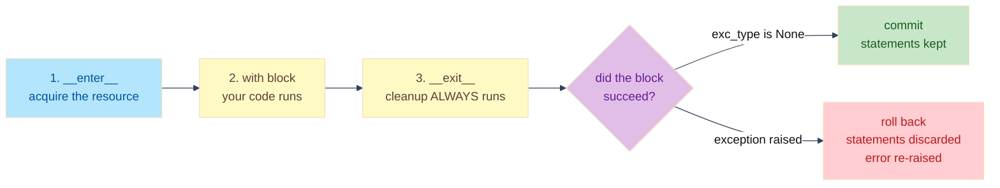

# Lab: The Safe Resource Vault — Context Managers

Difficulty: Beginner | ~25 min | Requires basic Python (functions, classes, try/except)

---

## 1. Lab Title

**The Safe Resource Vault — Context Managers**

In this lab you'll build a simulated database resource manager that *guarantees* cleanup
even when code crashes mid-operation — then turn it into a commit-on-success,
roll-back-on-error transaction.

---

## 2. Problem Statement / Use Case Overview

You maintain the backend of a multi-user web app. Every request opens a database
connection, and most run a *transaction* — several statements that must all succeed or
all be undone. A crash mid-request must never leave a connection open or a
half-finished transaction behind.

Hand-rolling cleanup with `try/finally` everywhere is easy to forget and easy to get
wrong. Python's **`with` statement** solves this with **context managers**: objects
that release their resource *always*, whether your code succeeded or raised an error.
This lab builds three of them — a class-based connection manager, its compact
`contextlib` twin, and a transaction that commits on success and rolls back on error —
and proves each one cleans up even when the block crashes.

---

## 3. Input Data

There is **no external input data**. The "database" is a class that prints what a real
connection would do, so you can see the lifecycle without setting up a server. The only
file touched is `vault_notes.txt`, created by the notebook itself. Nothing to download,
no API keys.

---

## 4. Processing

1. **Warm up** — use `with open(...)` on a real file and confirm it closes itself,
   then run a minimal `__enter__` / `__exit__` class to watch the protocol live.
2. **Part 1 — a class-based context manager**: implement `__enter__` / `__exit__` on a
   `DatabaseConnection` class, run a normal block, then deliberately raise an exception
   *inside* the block to prove the connection still closes.
3. **Part 2 — the `@contextlib.contextmanager` shortcut**: rewrite the same manager as
   a generator function with `yield`, and crash the block again to prove the `finally`
   teardown still runs.
4. **Part 3 — a transaction context manager**: commit the statements when the block
   succeeds, and roll them back (discard them) when it raises.
5. **The ledger** — render every resource and its outcome as a table with `tabulate`.

---

## 5. Output

Each step prints a short confirmation of its lifecycle — e.g. `Closing users
connection...` before any error surfaces, `COMMIT 2 statement(s)` after a successful
block, `ROLLBACK 1 statement(s)` after a failed one. The final output is a ledger table
of every resource (`Resource`, `Action`, `Outcome`) showing each one ended `closed`,
`committed`, or `rolled back`.

---

## 6. Tech Stack

- **Python 3.9+** — the entire lab runs on the standard library:
  - `with` statement (built-in),
  - `contextlib.contextmanager` (the only import),
  - `try/finally` and `try/except` (built-in),
  - `tabulate == 0.10.0` — used only to render the final ledger table.

No GPU, no API keys, no paid services. Runs on any laptop CPU with a few MB of RAM.

---

## 7. Underlying Concepts

### What the `with` statement guarantees

`with` is a *contract*: when the block starts, Python calls `__enter__()` on the
object; when the block ends — by finishing normally **or** by raising an exception —
Python *always* calls `__exit__()`. That unconditional second call is the whole point.
A resource acquired in `__enter__` is released in `__exit__`, so a crash can't leak it.

### The `__enter__` / `__exit__` protocol

A context manager is any object with two methods:

- `__enter__(self)` — setup. Returns the value bound by `as` (usually `self`).
- `__exit__(self, exc_type, exc_value, traceback)` — teardown. Python passes the
  exception info, or three `None`s when the block succeeded. `__exit__` returns a
  boolean: `False` lets a raised exception keep propagating to your `try/except`;
  `True` swallows it. Returning `False` is almost always right — cleanup shouldn't hide
  errors.

### The `@contextlib.contextmanager` shortcut

Writing a class with two methods is verbose for a tiny manager. `contextlib` lets you
write the same thing as a **generator function**: everything above the `yield` runs on
entry, everything below it runs on exit. The generator must wrap its teardown in
`try/finally` — that `finally` is exactly what `__exit__`'s unconditional call does for
the class version. `contextlib` then does the bookkeeping: it calls `next()` on your
generator to start the block, resumes it at the `yield` when the block ends, and throws
the exception into the generator if the block raised.

### The commit / rollback decision

A transaction is a context manager with a *choice*. In `__exit__`, `exc_type is None`
means the block finished cleanly → **commit** (keep the statements). Any other value
means a crash → **roll back** (discard the statements) and re-raise. Because the
exception reaches `__exit__` automatically, the decision is impossible to forget.

### How the pieces connect



Step 3 is the guarantee: whether the block succeeds or raises, `__exit__` runs and the
cleanup happens before control leaves the `with` statement.

### Nested resources

Real code often needs several resources at once — a transaction *inside* a connection,
a file *inside* a lock. Python supports nested `with` blocks directly:

```python
with DatabaseConnection("payments") as connection:
    with DatabaseTransaction(connection) as transaction:
        transaction.execute("INSERT ...")
```

The inner `with` exits first (transaction), then the outer one (connection). Cleanup
runs in the reverse order of acquisition, like a stack.

---

## 8. Prerequisites

- Basic Python: functions, simple classes (`__init__`, methods), and `try/except`.
- No prior context-manager experience needed — that's the whole point of this lab.
- No accounts, API keys, or hardware requirements.

---

## 9. Environment / Dependencies Setup

You need Python 3.9 or newer. The lab uses only the standard library (`with`,
`try/finally`, `contextlib`) plus one third-party package to render the ledger table:

```bash
# Check your Python version (must be 3.9+)
python --version

# Install the one dependency
pip install tabulate==0.10.0
```

The notebook's **first cell** runs `!pip install tabulate==0.10.0`, so running it
installs everything you need.

---

## 10. Step-wise Development Instructions

Work through the notebook cell by cell. Each step is explained below with the exact
code that runs.

### Step 1 — Install the dependency

The lab uses one third-party package: `tabulate`, which renders the final ledger as a
clean table. Everything else — `with`, `contextlib`, `try/finally` — is built into
Python.

```python
!pip install tabulate==0.10.0
```

### Step 2 — Warm up: the `with` statement

Two warm-up cells, no simulated database yet.

First, see the guarantee on something real. `open()` returns a file that implements the
context manager protocol; `with` calls its `__exit__` (which closes the file) when the
block ends. After the block, `note_file` still refers to the file object, but `.closed`
is `True`.

```python
# A real file: the with statement closes it automatically when the block ends.
with open("vault_notes.txt", "w", encoding="utf-8") as note_file:
    note_file.write("The vault always closes what it opens.\n")

print("After the with block, is the file closed?", note_file.closed)
```

This prints `After the with block, is the file closed? True`.

Second, the protocol in miniature, with no real resource at all. `TinyVault` defines the
two methods directly: `__enter__` runs on entry and returns the object; `__exit__` runs
when the block ends — whether it finished or raised. Its three arguments carry the
exception info (`exc_type`, `exc_value`, `traceback`), or three `None`s when the block
succeeded; here they're ignored, we just print. `__exit__` returns `False` — the
"don't hide any error" convention used everywhere below.

```python
# __enter__ runs at the start of the with block, __exit__ at the end — always.
class TinyVault:
    def __enter__(self):
        print("entering")
        return self

    def __exit__(self, exc_type, exc_value, traceback):
        print("exiting")
        # return False lets exceptions propagate to the caller.
        return False

with TinyVault():
    print("inside the block")
```

This prints, in order: `entering`, `inside the block`, `exiting`. `entering` comes from
`__enter__` and `exiting` from `__exit__` — that unconditional second call is the whole
point, and the rest of the lab leans on it.

### Step 3 — Part 1: a class-based connection manager

Now build your own context manager. `DatabaseConnection` implements the two protocol
methods: `__enter__` "opens" the connection and returns it; `__exit__` always "closes"
it — and `return False` means "don't hide any error the block may have raised". Run the
block normally first: you'll see open → work → close, three lines in order.
(`as connection` binds whatever `__enter__` returns — `self` — and Part 3 uses that
binding.)

```python
# Part 1 — a class-based context manager.
class DatabaseConnection:
    def __init__(self, db_name):
        self.db_name = db_name

    def __enter__(self):
        print(f"Opening {self.db_name} connection...")
        return self  # `as connection` binds this

    def __exit__(self, exc_type, exc_value, traceback):
        print(f"Closing {self.db_name} connection...")
        return False  # re-raise errors from the block

with DatabaseConnection("users") as connection:
    print("Running a query inside the block...")
```

### Step 4 — Part 1: prove cleanup on error

The real test: crash *inside* the block. Watch the output order — `Closing users
connection...` prints *before* `Caught outside` — so the cleanup ran, then the error
propagated to the `try/except`. That is the guarantee, working.

```python
# Crash inside the block: __exit__ still runs.
try:
    with DatabaseConnection("users") as connection:
        raise ValueError("query timed out mid-request")
except ValueError as error:
    print("Caught outside the block:", error)
```

### Step 5 — Part 2: the `@contextlib.contextmanager` shortcut

Same manager, written as a generator. *Preview: we're using a decorator here to create
a context manager in a shorter form — you don't need to understand how decorators work
yet; Lab 4 covers them in detail.* The `try/finally` around the `yield` is the key:
`finally` runs no matter how the block body exits, which is exactly the guarantee
`__exit__` provides in the class version — just with less boilerplate.

```python
# Part 2 — the same manager via @contextmanager.
import contextlib

@contextlib.contextmanager
def database_connection(db_name):
    print(f"Opening {db_name} connection...")
    # try/finally mirrors __exit__: teardown always runs.
    try:
        yield  # the with block body runs here
    finally:
        print(f"Closing {db_name} connection...")

with database_connection("orders") as connection:
    print("Running a query inside the block...")
```

### Step 6 — Part 2: the same guarantee, fewer lines

Crash the decorator version too. The `finally` block runs first, so the connection
closes before the `RuntimeError` reaches the caller — the same behavior as the class
version.

```python
# The decorator version survives a crash too.
try:
    with database_connection("orders") as connection:
        raise RuntimeError("replica went offline")
except RuntimeError as error:
    print("Caught outside the block:", error)
```

### Step 7 — Part 3: a transaction that commits on success

Now the payoff. `DatabaseTransaction.__exit__` inspects `exc_type`: `None` means the
block finished cleanly, so the transaction *commits* (the statements are kept); any
other value means the block raised, so it rolls back (and Part 3's next step shows the
details). The transaction is nested *inside* a connection `with` block — on the way out,
the transaction exits first, then the connection. `as transaction` binds `__enter__`'s
return value (`self`), so the block can call `transaction.execute(...)`.

```python
# Part 3 — a transaction: commit on success, roll back on error.
class DatabaseTransaction:
    def __init__(self, connection):
        self.connection = connection
        self.statements = []  # the log, kept on commit, cleared on rollback

    def execute(self, statement):
        self.statements.append(statement)
        print("  executing:", statement)

    def __enter__(self):
        print(f"BEGIN transaction on {self.connection.db_name}")
        return self

    def __exit__(self, exc_type, exc_value, traceback):
        if exc_type is None:  # block succeeded -> commit
            print(f"COMMIT {len(self.statements)} statement(s)")
        else:
            print(f"ROLLBACK {len(self.statements)} statement(s)")
            self.statements.clear()  # discard the failed work
        return False  # let the error reach the caller

with DatabaseConnection("payments") as connection:
    with DatabaseTransaction(connection) as transaction:
        transaction.execute("INSERT INTO payments VALUES (1, 49.99)")
        transaction.execute("UPDATE accounts SET balance = balance - 49.99 WHERE id = 7")

print("Transaction log stored:", transaction.statements)
```

### Step 8 — Part 3: the roll-back path

Same transaction, but the block raises before finishing. `__exit__` sees the exception,
*clears* the `statements` list — the failed work is discarded, nothing is committed —
and re-raises so the caller can handle the error.

```python
# The block raises, so __exit__ rolls the work back instead of committing.
try:
    with DatabaseConnection("payments") as connection:
        with DatabaseTransaction(connection) as transaction:
            transaction.execute("INSERT INTO payments VALUES (2, 199.99)")
            raise RuntimeError("payment gateway timed out")  # simulate a mid-transaction crash
except RuntimeError as error:
    print("Caught outside the block:", error)

print("Statements kept after rollback:", transaction.statements)
```

### Step 9 — The vault ledger

Finally, collect every resource from this lab and how its operation ended, and render
the ledger as a table with `tabulate`. Every row ends in a state where the resource was
handled — closed, committed, or rolled back. That's the vault's whole promise.

```python
from tabulate import tabulate

ledger = [
    ["vault_notes.txt", "write notes", "closed"],
    ["users connection", "SELECT + crash", "closed, error surfaced"],
    ["orders connection", "SELECT", "closed"],
    ["payments transaction", "2 statements", "committed"],
    ["payments transaction", "1 statement", "rolled back"],
]

print(tabulate(ledger, headers=["Resource", "Action", "Outcome"], tablefmt="grid"))
```

---

## 11. Optional Exercise

Rewrite the `DatabaseTransaction` **class** as a `@contextlib.contextmanager` generator
function — no class, keeping the exact same behavior. The block should still be able to
call `transaction.execute(...)`, and your function must print `BEGIN transaction` on
entry, `COMMIT n statement(s)` when the block succeeds, and `ROLLBACK n statement(s)`
(clearing the statements) plus re-raise when it fails. Prove the roll-back still
happens by wrapping a raising block in `try/except` and confirming the statements list
comes out empty. (Hint: a `try/except` with an `else` clause around the `yield` is the
generator equivalent of checking `exc_type is None`.)

---

## 12. What We Learnt

- **`with` is a contract**: `__enter__` runs on entry and `__exit__` *always* runs on
  exit — normal completion or exception.
- **`__enter__` sets up and returns the resource**; `__exit__` is where cleanup lives.
- **`__exit__` receives `(exc_type, exc_value, traceback)`** — three `None`s mean the
  block succeeded; anything else means it raised.
- **`return False` re-raises errors** (don't hide them); `return True` swallows them.
- **`@contextlib.contextmanager`** turns a generator into a context manager with no
  class to write: one function whose `yield` splits setup from teardown.
- **`try/finally` around the `yield`** is what makes decorator teardown unconditional —
  the machinery behind the guarantee.
- **A transaction is a context manager with a decision**: commit when `exc_type is
  None`, roll back (and clear the statements) otherwise.
- **Nested `with` blocks** release resources in reverse order — inner first, outer
  last.
- The happy path only proves the code *can* work; context managers are how it keeps
  working when things go wrong — the production difference.
