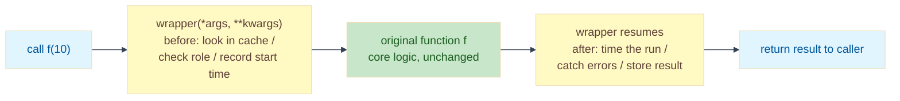

# Lab: The Metaprogramming Toolkit — Decorators, Closures, and Caching

Difficulty: Intermediate | ~40 min | Requires basic Python (functions, classes, try/except)

---

## 1. Lab Title

**The Metaprogramming Toolkit** — wrapping existing functions with four
decorators (`@timer`, `@authenticate`, `@retry`, `@cache`) so you can add
logging, performance tracking, security, and caching to a messy codebase
*without modifying the core functions themselves*.

---

## 2. Problem Statement / Use Case Overview

You inherit a working but messy backend: nobody knows how slow the functions
are, the sensitive ones are callable by anyone, flaky network calls fail the
whole request, and expensive results get recomputed over and over.

**Decorators** wrap a function with another function, so the core stays
untouched while timing, security, retry, and caching happen *around* it. This
lab builds a four-decorator toolkit (`@timer`, `@authenticate`, `@retry`,
`@cache`) from scratch — closures, `*args/**kwargs`, `functools.wraps` — and
proves each one with a working demo.

---

## 3. Input Data

Not required — all four functions (`find_primes`, `delete_user`,
`fetch_orders`, `expensive`) are defined in-code. No external files, datasets,
or API keys.

---

## 4. Processing

1. **Part 1 — `@timer`**: measure and print elapsed time, returning the
   function's result untouched.
2. **Part 2 — `@authenticate(role="admin")`**: a *decorator factory* that checks
   a shared user state and raises `PermissionError` on a role mismatch.
3. **Part 3 — `@retry(max_attempts=3)`**: re-run a function that raises
   `ConnectionError`, then give up with a clear error after the attempts run out.
4. **Part 4 — `@cache`**: memoize results in a closure-held dict keyed by the
   call's arguments, skipping re-computation on a hit.

---

## 5. Output

Not required — each decorator prints its own result when you run the notebook.
No separate output files are produced.

---

## 6. Tech Stack

- **Python 3.9+** — the entire lab runs on the standard library:
  - `functools.wraps` — preserves a wrapped function's name and docstring,
  - `time.perf_counter` — high-precision timing for `@timer`.

No GPU, no API keys, no paid services. Runs on any laptop CPU with a few MB of RAM.

---

## 7. Underlying Concepts

### Functions are objects

In Python, `def` creates a function just like `x = 5` creates a number.
That means you can:

- Pass a function to another function (like an argument)
- Return a function from another function (like a result)

This is the key fact that makes decorators possible. A decorator is just a
function that takes a function and returns a new function.

### The @ syntax is just shorthand

This code:

```python
@timer
def find_primes(limit): ...
```

does exactly the same thing as:

```python
def find_primes(limit): ...
find_primes = timer(find_primes)
```

The `@` just saves you a line. After either one, the name `find_primes` points
to the new wrapper function, not the original. Every call to `find_primes()`
now runs through that wrapper.

### Closures: the wrapper remembers

Imagine you have a function inside a function:

```python
def outer(x):
    def inner():
        print(x)  # inner can see x from outer
    return inner
```

When `inner` is returned and `outer` finishes, Python doesn't throw away the
`x` variable. It keeps it alive because `inner` still needs it. This is called
a **closure** — the wrapper function "closes over" a variable from its parent.

Decorators use closures to remember things:

- `@timer` remembers the original function
- `@authenticate` remembers the required role
- `@retry` remembers the attempt budget
- `@cache` remembers the entire cache dict

### `*args, **kwargs`: forward any arguments

A decorator must work on any function, whether it takes 0 arguments or 10.

`*args` collects all positional arguments into a tuple. `**kwargs` collects
all keyword arguments into a dict.

So when you write:

```python
def wrapper(*args, **kwargs):
    result = func(*args, **kwargs)
```

the wrapper can pass along any arguments to `func`, no matter what they are.
The decorator never needs to know the signature.

### `functools.wraps`: preserve the name

Without `@functools.wraps(func)`, a wrapped function loses its name:

```python
def timer(func):
    def wrapper(*args, **kwargs):
        # ...
        return result
    return wrapper

@timer
def find_primes(limit): ...

print(find_primes.__name__)  # prints "wrapper" — oops!
```

That breaks debugging and documentation tools. `@functools.wraps(func)` copies
the original name and docstring onto the wrapper:

```python
def timer(func):
    @functools.wraps(func)
    def wrapper(*args, **kwargs):
        # ...
        return result
    return wrapper

print(find_primes.__name__)  # now prints "find_primes" — correct!
```

### Decorator factories: adding arguments

`@timer` takes the function directly, but what if you want to pass arguments
like `@retry(max_attempts=3)`?

A **decorator factory** is a function that returns a decorator.

It works in three steps:

1. `@retry(max_attempts=3)` calls the `retry` function with `max_attempts=3`
2. `retry` returns a `decorator` function
3. `decorator` wraps your actual function and returns the `wrapper`

So there are three levels of nesting:

- `retry` level: holds the `max_attempts` value
- `decorator` level: holds the original function
- `wrapper` level: runs on each call

Each level has its own closure.

### Separation of concerns

Without decorators, every function would need the same boilerplate:

- Log the start and end time
- Check permissions
- Retry on failure
- Check the cache first

That's a lot of copy-paste. Decorators separate these concerns from the core
logic.

The core function does one thing: compute the answer. Decorators do everything
else: time it, secure it, retry it, cache it. You can add, remove, or reorder
decorators without touching the function itself.

### How a decorated call flows



The wrapper is the only code that sees both sides of the call. Whatever happens
inside the core function, the wrapper can act before, act after, or — with
`@retry` — *not return at all* until the call finally succeeds or the budget is
spent.

---

## 8. Prerequisites

- Comfortable writing functions and `try/except`.
- A basic idea of what a dict is (used for user state and the cache).
- No prior decorator experience needed — that is the whole point of this lab.
- No accounts, API keys, or hardware requirements.

---

## 9. Environment / Dependencies Setup

Python 3.9+. From the lab folder:

```bash
python --version                    # must be 3.9+
python -m venv .venv                # optional but recommended
.venv\Scripts\activate              # Windows (macOS/Linux: source .venv/bin/activate)
pip install notebook
jupyter notebook lab-metaprogramming-toolkit.ipynb
```

The lab uses only the Python standard library — no extra packages to install.

---

## 10. Step-wise Development Instructions

Work through the notebook cell by cell. Each step is explained before the code
it runs.

### Step 0 — Warm up: functions are objects

A quick warm-up: `shout` takes a function and returns a new one that uppercases
its result. The name `greet` is rebound to the wrapper. Notice
`greet.__name__` is now `wrapper` — that is the problem `functools.wraps`
solves later.

```python
def shout(func):
    def wrapper(name):
        return func(name).upper() + "!"
    return wrapper

def greet(name):
    return f"hello {name}"

greet = shout(greet)
print(greet("team"))
print("function name is now:", greet.__name__)
```

Output: `HELLO TEAM!` then `function name is now: wrapper`.

### Step 1 — Part 1: the `@timer` decorator

The pattern every decorator in this lab follows: `timer` takes `func`, defines a
`wrapper`, and returns it. Inside the wrapper, `time.perf_counter()` is read
before and after the real call; the elapsed time is printed, and the result is
passed through untouched. `@functools.wraps(func)` copies `func`'s name and
docstring onto the wrapper so introspection keeps working. `@timer` above
`find_primes` is shorthand for `find_primes = timer(find_primes)`.

```python
# functools.wraps copies the original name/docstring onto the wrapper
# so introspection keeps working. time.perf_counter gives us high-precision
# timing.
import functools
import time

# --- @timer decorator ---
# timer takes a function, defines a wrapper that records start/end time,
# prints the elapsed seconds, and returns the original result.
def timer(func):
    @functools.wraps(func)
    def wrapper(*args, **kwargs):
        start = time.perf_counter()
        result = func(*args, **kwargs)
        elapsed = time.perf_counter() - start
        print(f"{func.__name__} ran in {elapsed:.4f}s")
        return result
    return wrapper

# Apply @timer to find_primes - this is shorthand for
# find_primes = timer(find_primes), so the name now points at the wrapper.
@timer
def find_primes(limit):
    return [n for n in range(2, limit + 1)
            if all(n % d for d in range(2, int(n ** 0.5) + 1))]

primes = find_primes(2000)
print("primes found:", len(primes))
```

The output is the elapsed time (the number varies per machine) and
`primes found: 303`.

### Step 2 — Part 2: the `@authenticate` decorator factory

`@authenticate(role="admin")` needs an argument, so `authenticate` is a factory:
calling it with the role returns the real `decorator`, which in turn returns the
`wrapper`. The wrapper consults a shared `current_user` dict. On a role mismatch
it raises `PermissionError`; otherwise it calls the wrapped function. The demo
runs the delete as an admin, then flips `current_user["role"]` to `"viewer"` and
shows the same call now denied — with the core `delete_user` unchanged.

```python
# --- @authenticate decorator factory ---
# authenticate(role) returns the real decorator, which wraps the function.
# The wrapper reads a shared current_user dict and raises PermissionError
# if the role does not match. Three levels: authenticate holds the role,
# decorator holds the function, wrapper holds the call state.
# Simulated global state — in production this would come from a session or DB.
current_user = {"name": "alice", "role": "admin"}

def authenticate(role):
    def decorator(func):
        @functools.wraps(func)
        def wrapper(*args, **kwargs):
            if current_user.get("role") != role:
                raise PermissionError(
                    f"{current_user['name']} needs role '{role}'")
            return func(*args, **kwargs)
        return wrapper
    return decorator

# Demo: alice is admin, so delete_user(7) works. Then we flip the role
# to viewer and the same call gets denied - core function never changed.
@authenticate(role="admin")
def delete_user(user_id):
    return f"Deleted user {user_id}"

print(delete_user(7))

current_user["role"] = "viewer"
try:
    delete_user(7)
except PermissionError as error:
    print("Denied:", error)
```

The output shows `Deleted user 7` then `Denied: alice needs role 'admin'`.

### Step 3 — Part 3: the `@retry` decorator

`retry(max_attempts=3)` is another factory. The wrapper loops through the
attempt budget; each `ConnectionError` is caught, reported, and the loop moves
on. Success returns immediately. If every attempt fails, the last error is
re-raised as a `RuntimeError` *after* the loop. The demo drives a deterministic
`flaky` counter so output is reproducible: two failures then success, and — with
the counter reset to five — three failures then give-up.

```python
# --- @retry decorator factory ---
# retry(max_attempts) returns a decorator. The wrapper loops through the
# attempt budget, catching ConnectionError on each failure. On success
# it returns immediately. If every attempt fails, the last error is
# re-raised as RuntimeError after the loop is exhausted.
def retry(max_attempts=3):
    def decorator(func):
        @functools.wraps(func)
        def wrapper(*args, **kwargs):
            for attempt in range(1, max_attempts + 1):
                try:
                    return func(*args, **kwargs)
                except ConnectionError as error:
                    print(f"Attempt {attempt} failed: {error}")
                    last_error = error
            raise RuntimeError(
                f"giving up after {max_attempts} attempts: {last_error}")
        return wrapper
    return decorator

# Demo: flaky has 2 failures left, so @retry catches both then succeeds.
# Simulated failure counter — in production this would be a real network call.
flaky = {"failures_left": 2}

@retry(max_attempts=3)
def fetch_orders():
    if flaky["failures_left"] > 0:
        flaky["failures_left"] -= 1
        raise ConnectionError("gateway timed out")
    return ["order A", "order B"]

print(fetch_orders())

# Give up path: more failures than attempts, so the loop exhausts
# and RuntimeError is raised.
flaky["failures_left"] = 5
try:
    fetch_orders()
except RuntimeError as error:
    print(error)
```

The output is two `Attempt N failed: gateway timed out` lines followed by
`['order A', 'order B']`, then three attempt lines and
`giving up after 3 attempts: gateway timed out`.

### Step 4 — Part 4: the `@cache` decorator

`cache` creates the `store` dict in its own scope, so every decorated function
gets its own private cache via the closure. `key = args` is a tuple of the
positional arguments — hashable, so it works as a dict key. On a hit the wrapped
function is never called; on a miss it is computed and stored. The demo calls
`expensive(10)` twice: the first prints `computing expensive ...`, the second is
silent and instant.

```python
# --- @cache decorator ---
# cache creates a store dict in its own scope, so each decorated function
# gets its own private cache. key = args (a tuple, so it is hashable).
# On a hit the wrapped function is never called; on a miss it is computed
# and stored. Exercise 5 extends this to include keyword arguments.
def cache(func):
    store = {}

    @functools.wraps(func)
    def wrapper(*args, **kwargs):
        key = args
        if key not in store:
            print(f"computing {func.__name__} ...")
            store[key] = func(*args, **kwargs)
        return store[key]
    return wrapper

# Demo: expensive(10) prints "computing" on the first call,
# then returns instantly on the second call (cache hit).
# expensive(12) computes again because the key differs.
@cache
def expensive(n):
    time.sleep(0.02)  # pretend this is a slow computation
    return n ** 2

print(expensive(10))
print(expensive(10))  # cached: no "computing" line, returns instantly
print(expensive(12))
```

The output prints `computing expensive ...` once, then `100`, `100`, then
`computing expensive ...` again and `144` for the new argument.

---

## 11. Optional Exercise

Extend `@cache` so keyword arguments are part of the cache key: replace
`key = args` with `key = (args, frozenset(kwargs.items()))`. To prove it works,
give `expensive` a keyword parameter — `def expensive(n, debug=False):` — then
call `expensive(10)` twice, and between them call `expensive(10, debug=True)`.
The `debug=True` call must compute again (its key differs), while the repeated
`expensive(10)` must hit the cache (no `computing` line). This proves keyword
arguments are now part of the cache key.

---

## 12. What We Learnt

- **Functions are objects** — they can be passed to and returned from other
  functions, which is the raw material of every decorator.
- **`@decorator` is sugar** for `f = decorator(f)`; a decorator takes a function
  and returns a replacement (a wrapper).
- **Closures** let a wrapper remember state from its enclosing scope across
  calls — the original function, the required role, the retry budget, or the
  cache dict.
- **`*args, **kwargs`** let a wrapper forward any arguments to the wrapped
  function without knowing its signature.
- **`functools.wraps`** copies `__name__` and `__doc__` onto the wrapper so
  debugging and introspection aren't broken.
- **Decorator factories** (`@authenticate(role=...)`, `@retry(max_attempts=...)`)
  add arguments by making the decorator itself a returned function.
- **Aspect-oriented programming** separates cross-cutting concerns — timing,
  security, resilience, caching — from core business logic, letting you add,
  remove, or reorder them without touching the functions they protect.
- The happy path only proves a function works; decorators are how you make it
  *production-ready* without rewriting it.
