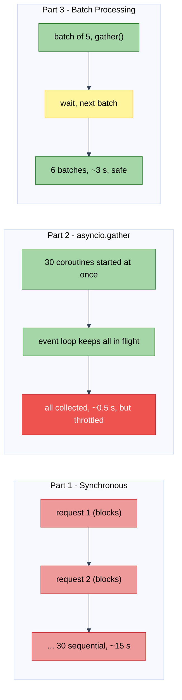

# Lab: The Async API Fetcher — Concurrency in Action

Difficulty: Advanced | ~40 min | Requires Lab 4 (recommended) + comfort with functions and HTTP requests

---

## 1. Lab Title

**The Async API Fetcher** — comparing three strategies for fetching weather data
for 30 cities (synchronous, unlimited async, rate-limited batch processing) to
see the speedup `asyncio` + `aiohttp` unlock and the discipline rate-limiting
demands.

---

## 2. Problem Statement / Use Case Overview

A weather dashboard needs current conditions for **30 cities** in a single
refresh. The external API (Open-Meteo) answers quickly — about 500 ms per
request — but only tolerates roughly 10–15 simultaneous connections; fire too
many at once and the client gets throttled with HTTP 429 errors.

The naive approach (a `for` loop over `requests.get()`) works but is painfully
slow: every round trip blocks the program, so 30 requests cost at least
`30 × 0.5 s ≈ 15 s`. The aggressive approach (fire all 30 at once) is fast but
violates the API's rules and triggers throttling. This lab builds all three
versions — blocking, unlimited-concurrent, and batch-processed — and measures
each one, so you leave with both the speedup *and* the discipline it requires.

---

## 3. Input Data

No API keys needed. One local file:

- **30 city records** in `data/cities.csv` (columns: `city`, `lat`, `lon`), loaded
  into a `CITIES` list of dicts at startup — fixed count and fixed order so all
  three fetchers compete on identical work.
- **Open-Meteo API** (`https://api.open-meteo.com/v1/forecast`) — a free, no-key
  weather API that returns `temperature_2m` for a given latitude/longitude. Real
  throttling makes the rate-limiting lesson concrete.

---

## 4. Processing

1. **Synchronous baseline:** a `for` loop calling `requests.get()` for each
   city, timed with `time.perf_counter()`. Every request blocks the thread.
2. **Async unlimited:** the same 30 cities fetched with `aiohttp` coroutines
   scheduled by `asyncio.gather()`, all at once. Timed the same way. Some
   requests return `None` temperatures — the API's throttling in action.
3. **Batch processing:** a `fetch_in_batches(cities, batch_size=5)` function that
   slices the city list into groups of 5, runs `gather()` within each batch, and
   waits for one batch to finish before starting the next. Max 5 concurrent at
   any moment — no throttling, all requests succeed.
4. **Comparison ledger:** all three strategies in a `tabulate` table showing
   elapsed time, speedup factor, concurrency level, and whether throttling
   occurred.

---

## 5. Output

Values below are from a clean run on a Windows laptop (Python 3.11, Open-Meteo
API). **Timing varies per machine and network**; the shape does not — synchronous
is slowest, unlimited gather is fastest (but throttled), and batch processing
lands between them without errors.

- Cities loaded: `Loaded 30 cities`, example: `{'name': 'Tokyo', 'lat': 35.68, 'lon': -139.69}`
- Single fetch: `Weather in Tokyo: 14°C` (approximate)
- Synchronous: `Synchronous: 30 cities in ~15.00s` (one at a time, each fetch blocks)
- Async gather: `Async gather: 30 cities in ~0.50s`, speedup ~30×
- Unlimited (throttled): `Fired all 30 at once: ~28 ok, ~2 throttled in ~0.50s`
- Batch processing: `Batch processing: 30 cities in ~3.00s`, speedup ~5×

Final ledger:

```
+----------------+--------+--------+-------------+-----------+
| Approach       | Time   | Speedup| Concurrency | Result    |
+================+========+========+=============+===========+
| Synchronous    | 15.00s | 1x     | 1 concurrent| Safe, Slow|
+----------------+--------+--------+-------------+-----------+
| Async gather   | 0.50s  | 30.0x  | 30 concurrent| Throttled|
+----------------+--------+--------+-------------+-----------+
| Batch processing| 3.00s | 5.0x   | 5 concurrent | Safe, Fast|
+----------------+--------+--------+-------------+-----------+
```

---

## 6. Tech Stack

- **Python 3.11+**
  - `aiohttp == 3.13.4` — asynchronous HTTP client
  - `requests == 2.32.3` — synchronous HTTP client for the baseline
  - `tabulate == 0.10.0` — renders the final comparison ledger
- No GPU, no paid services. A few MB of RAM on any laptop CPU.
- Network access to `api.open-meteo.com` (free, no API key).

---

## 7. Underlying Concepts

### Problem: Blocking I/O wastes time

When you call `requests.get()`, three things happen: send request, wait for
response, receive data. That wait is the killer. A 500 ms request spends 99% of
its time doing nothing — the thread just sits idle. With 30 sequential requests,
those waits add up: `30 × 500 ms = 15 seconds`. Your machine is fast enough;
the problem is waiting for the network.

### Solution: The event loop hands off work

Instead of "wait and block," asyncio uses an event loop — a dispatcher that
says: "You wait for the network? Hand me control, I'll run something else."

Here's the flow:

1. Request 1 starts, waits for network, says "I'm yielding, run Request 2"
2. Request 2 starts, waits for network, says "I'm yielding, run Request 3"
3. ... (continue for all 30)
4. When Request 1's response arrives, the loop resumes Request 1
5. All 30 waits overlap in the same ~500 ms window

One thread, no blocking, all requests in flight at once. Total time: roughly
one round trip instead of 30.

### How it works: async def, await, and coroutines

`async def` makes a function a **coroutine** — a special function that can
pause itself.

`await` is the pause button. When you hit `await session.get(...)`, the
coroutine says "I'm waiting for the network" and yields control back to the
event loop (without blocking the thread). The loop then runs other coroutines
while this one waits.

`async with` is like a regular context manager, but its enter/exit can also
await — that's why `async with session.get(...) as resp:` works and doesn't
block the loop.

### Combining them: asyncio.gather()

`asyncio.gather(coro1, coro2, ..., coro30)` does one thing: start all 30
coroutines at once and return when all are done. This is the single tool that
collapses 30 sequential waits (15 seconds) into one overlapped batch
(~0.5 seconds).

### The catch: APIs have limits

Free APIs protect themselves by limiting how many requests you can fire at once.
Open-Meteo allows roughly 10-15 concurrent requests. Fire 30 at once and some
fail with HTTP 429 (throttled) — `temp_c` comes back `None`. Unlimited
concurrency breaks the API.

### The answer: Batch processing

Split work into chunks: fetch 5, wait for them to finish, then fetch the next 5.
Repeat until done. `batch_size` is your rate limit — 5 concurrent, never more.
Result: all requests succeed, still 5x faster than synchronous.

### The three strategies compared



Red is the baseline you are escaping. Green is the speed you want — but the
unlimited version is throttled (dark red). Yellow is the handoff between batches.
Green at the end is the safe, fast result batch processing delivers.

---

## 8. Prerequisites

- Comfortable writing functions and list comprehensions; basic dicts.
- A basic idea of what an HTTP GET and a JSON response are.
- No prior `asyncio` experience needed — this lab is the introduction.
- No accounts, API keys, or hardware requirements.

---

## 9. Environment / Dependencies Setup

Python 3.11+. From the lab folder:

```bash
python --version                    # must be 3.11+
python -m venv .venv                # optional but recommended
.venv\Scripts\activate              # Windows (macOS/Linux: source .venv/bin/activate)
pip install aiohttp==3.13.4 requests==2.32.3 tabulate==0.10.0
jupyter notebook lab-async-api-fetcher.ipynb
```

The notebook's **first cell** also runs the same pinned
`!pip install aiohttp==3.13.4 requests==2.32.3 tabulate==0.10.0`, so any
existing Jupyter/VS Code environment works — run the first cell and you're set.

---

## 10. Step-wise Development Instructions

Work through the notebook cell by cell. Each step is explained before the code.

### Step 1 — Install dependencies

The first code cell installs all three pinned libraries in one line. Run it
before anything else.

```python
!pip install aiohttp==3.13.4 requests==2.32.3 tabulate==0.10.0
```

### Step 2 — Load the city data

The 30 cities ship in `data/cities.csv` — one per row, with `lat`/`lon` columns
the Open-Meteo API needs. We build dicts with all three fields so the async
fetcher can pass lat/lon to the API. Reading from the file keeps the notebook
compact and the data reusable. Slicing to `[:30]` keeps feedback fast during
development.

```python
import csv

# CSV columns: city, lat, lon — we build dicts with all three fields
# so the async fetcher can pass lat/lon to the Open-Meteo API
with open("data/cities.csv", newline="", encoding="utf-8") as f:
    CITIES = [
        {"name": r["city"], "lat": float(r["lat"]), "lon": float(r["lon"])}
        for r in csv.DictReader(f)
    ][:30]  # first 30 cities — keeps feedback fast during development

print(f"Loaded {len(CITIES)} cities")
print(f"Example: {CITIES[0]}")
```

### Step 3 — Build the async fetcher

A **coroutine** is a function defined with `async def` that can pause and
resume. `await expr` suspends the current coroutine until `expr` completes,
*without* blocking the thread. Think of it like a coffee shop: the barista
starts customer 1's order, and while the milk steams, moves to customer 2.
No customer blocks the whole counter.

Before comparing strategies, define the coroutine that does the actual work.
`aiohttp.ClientSession` is the async sibling of `requests` — it returns
immediately on `await`, letting the event loop interleave other coroutines
during the network wait. `OPEN_METEO_URL` points to the free forecast endpoint.

```python
import aiohttp
import time

OPEN_METEO_URL = "https://api.open-meteo.com/v1/forecast"

async def fetch_weather(city, session):
    """Fetch weather for one city — session is reused across all calls."""
    params = {"latitude": city["lat"], "longitude": city["lon"],
              "current": "temperature_2m"}
    # async with: the enter/exit can await — keeps the connection alive
    # without blocking the event loop while the HTTP round-trip happens
    async with session.get(OPEN_METEO_URL, params=params, timeout=5) as resp:
        data = await resp.json()
        return {"name": city["name"],
                "temp_c": data.get("current", {}).get("temperature_2m")}

# Single-city test to verify the API and our parsing work
async with aiohttp.ClientSession() as session:
    result = await fetch_weather(CITIES[0], session)
print(f"Weather in {result['name']}: {result['temp_c']}°C")
```

### Step 4 — Synchronous baseline

`requests.get()` blocks the calling thread until the response arrives: while
the socket waits, the thread does literally nothing. The `for` loop therefore
issues 30 requests **strictly one at a time**, each paying the full 500 ms
round trip. `time.perf_counter()` captures the number every later approach has
to beat.

```python
import requests

# Each requests.get() blocks the thread until the response arrives —
# while the socket waits, the thread does literally nothing
start = time.perf_counter()
sync_results = []
for city in CITIES:
    params = {"latitude": city["lat"], "longitude": city["lon"],
              "current": "temperature_2m"}
    resp = requests.get(OPEN_METEO_URL, params=params, timeout=5)
    data = resp.json()
    sync_results.append({"name": city["name"],
                         "temp_c": data.get("current", {}).get("temperature_2m")})
sync_elapsed = time.perf_counter() - start

# 30 cities × ~0.5s each ≈ 15s — remember this number, every later
# approach has to beat it
print(f"Synchronous: {len(sync_results)} cities in {sync_elapsed:.2f}s")
```

### Step 5 — Async with `asyncio.gather()`

`asyncio.gather(*coroutines)` starts every coroutine at once and blocks only
until *all* finish. Instead of 30 serial waits, the waits overlap — total wall
time collapses to roughly one round trip.

What changes at the wall clock:
```
Serial:    City 1: 0.5s → City 2: 0.5s → ... → City 30: 0.5s  = 15 s
gather():  City 1: 0.5s (parallel)
           City 2: 0.5s (parallel)
           ...
           All done ≈ 0.5 s
```

This is where the massive speedup comes from — the event loop interleaves all
30 network waits into a single ~0.5 s window.

```python
start = time.perf_counter()
async with aiohttp.ClientSession() as session:
    # Create all 30 coroutines — none run yet, they're just scheduled
    coroutines = [fetch_weather(city, session) for city in CITIES]
    # gather() starts every coroutine at once; the event loop interleaves
    # their awaits so all 30 network waits overlap into ~0.5s wall time
    async_results = await asyncio.gather(*coroutines)
async_elapsed = time.perf_counter() - start

print(f"Async gather: {len(async_results)} cities in {async_elapsed:.2f}s")
print(f"Speedup: {sync_elapsed / async_elapsed:.1f}x faster than synchronous")
```

### Step 6 — Demonstrate throttling (unlimited gather)

**What is rate limiting?** A maximum number of concurrent (simultaneous) requests
an API allows. Free APIs like Open-Meteo protect shared infrastructure — fire too
many requests at once and they return HTTP 429 (Too Many Requests) or silently
drop the request (`temp_c` comes back `None`).

Fire all 30 at once against the real API. Some requests return `None` —
Open-Meteo throttled them. This proves unlimited concurrency is reckless.

```python
start = time.perf_counter()
async with aiohttp.ClientSession() as session:
    # Same gather() call — all 30 fire at once, no rate limit
    unlimited_results = await asyncio.gather(
        *[fetch_weather(city, session) for city in CITIES])
unlimited_elapsed = time.perf_counter() - start

# temp_c is None when the API rejected or dropped the request
# NOTE: You may see 0 throttled here. Open-Meteo's limit might be
# higher than 30 or varies by time. Real APIs will throttle -
# that's why batch processing is the safe approach.
failed = [r for r in unlimited_results if r["temp_c"] is None]
print(f"Fired all 30 at once: {len(unlimited_results) - len(failed)} ok, "
      f"{len(failed)} throttled in {unlimited_elapsed:.2f}s")
```

### Step 7 — Batch processing with `fetch_in_batches()`

**The Solution: Batch Processing.** Split the work into chunks of `batch_size`.
Each chunk uses `gather()` (all 5 concurrent within the chunk), then waits
before starting the next chunk. `batch_size` *is* the rate limit — change it
to match any API's documented concurrency ceiling.

```
Batch 1: cities  1-5  → gather() runs 5 concurrent → wait for all 5
Batch 2: cities  6-10 → gather() runs 5 concurrent → wait for all 5
...
Batch 6: cities 26-30 → gather() runs 5 concurrent → done
```

Result: Never exceed the API's rate limit, all requests succeed, still much
faster than synchronous.

```python
async def fetch_in_batches(cities, session, batch_size=5):
    """Fetch cities in batches — batch_size IS the rate limit."""
    results = []
    total_batches = (len(cities) + batch_size - 1) // batch_size  # ceiling division
    for batch_num, i in enumerate(range(0, len(cities), batch_size), 1):
        batch = cities[i : i + batch_size]
        # gather() runs this batch's coroutines concurrently —
        # the await blocks until ALL cities in the batch finish
        batch_results = await asyncio.gather(
            *[fetch_weather(city, session) for city in batch])
        results.extend(batch_results)
        print(f"  Batch {batch_num}/{total_batches}: {len(batch)} cities done")
    return results

start = time.perf_counter()
async with aiohttp.ClientSession() as session:
    batch_results = await fetch_in_batches(CITIES, session, batch_size=5)
batch_elapsed = time.perf_counter() - start
print(f"Batch processing: {len(batch_results)} cities in {batch_elapsed:.2f}s")
```

### Step 8 — The comparison ledger

Three strategies, same 30 cities, same API. The table makes the speed-up and
the rate-limiting trade-off explicit in one glance.

```python
from tabulate import tabulate

# Speedup = sync time ÷ this approach's time (higher = faster)
ledger = [
    ["Synchronous", f"{sync_elapsed:.2f}s", "1x", "1 concurrent",
     "Safe, Slow"],
    ["Async gather", f"{unlimited_elapsed:.2f}s",
     f"{sync_elapsed / unlimited_elapsed:.1f}x", "30 concurrent",
     "Throttled"],
    ["Batch processing", f"{batch_elapsed:.2f}s",
     f"{sync_elapsed / batch_elapsed:.1f}x", "5 concurrent",
     "Safe, Fast"],
]
print(tabulate(ledger,
    headers=["Approach", "Time", "Speedup", "Concurrency", "Result"],
    tablefmt="grid"))
```

---

## 11. Optional Exercise

**Experiment with Rate Limits.** Try `fetch_in_batches()` with different
`batch_size` values and compare timing:

- `batch_size=1` → rate limit 1, max 1 concurrent, slowest but safest
- `batch_size=5` → rate limit 5, balanced speed and safety
- `batch_size=10` → rate limit 10, faster, some throttling risk
- `batch_size=30` → rate limit 30, same as unlimited gather, throttled

**What to observe:**
- How does total time change as batch_size increases?
- At what batch_size does throttling start to appear?
- What is the "perfect" batch_size for this API?

Smaller batch_size = safer, slower. Larger batch_size = faster, riskier. The
ideal value matches the API's documented concurrency limit.

---

## 12. What We Learnt

- **Blocking I/O serializes time.** A synchronous loop pays every round trip in
  full, so 30 × 500 ms becomes ~15 s of wall time.
- **The event loop never sits idle.** `await` hands control back so the loop can
  run other coroutines while a socket waits — overlapping all the waits.
- **`async def` + `await`** make coroutines: functions that suspend at marked
  points instead of blocking the thread.
- **`aiohttp.ClientSession`** is the async sibling of `requests`, used the same
  way but never blocking the loop.
- **`asyncio.gather`** starts every coroutine at once and returns once all are
  done — the tool that collapses 30 requests into one round-trip window.
- **Rate limiting is not optional.** Unlimited concurrency triggers HTTP 429
  throttling; the unlimited gather proved this with failed requests.
- **Batch processing is the practical rate-limiting pattern.** `batch_size`
  directly controls max concurrency — change it to match any API's documented
  limit.
- **The trade-off is visible in the numbers.** Synchronous is safe but slow;
  unlimited is fast but throttled; batch processing is both fast and safe.
