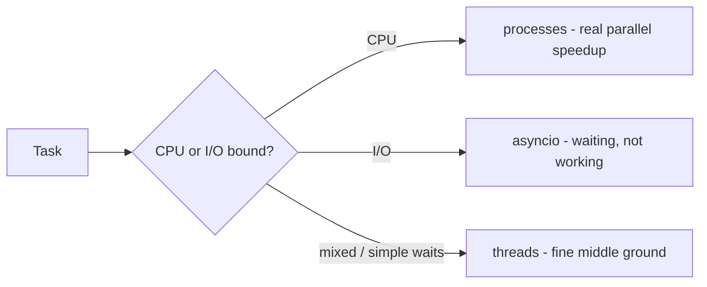

# Lab: Threading vs Multiprocessing vs asyncio — Which Concurrency Tool When?

Difficulty: Advanced | ~45 min | Requires Lab 5 (recommended) + comfort with functions and `time.perf_counter()`

---

## 1. Lab Title

**Threading vs Multiprocessing vs asyncio** — run the same CPU-bound task
(blurring 100 synthetic images in pure Python) and the same I/O-bound task
(100 fake 50 ms network calls) under four execution strategies — sequential,
threads, asyncio, processes — and watch the results *invert*. The GIL decides
who wins and who wastes your time.

---

## 2. Problem Statement / Use Case Overview

A team must pick a concurrency tool for a real workload. Before anyone writes a
line of code they need one fact: **is the work CPU-bound (computing) or
I/O-bound (waiting)?** This lab answers that question empirically. The same
four strategies are timed against both kinds of work. CPU work: threads and
asyncio stay at the baseline, processes win. I/O work: asyncio crushes
everything, threads do well, and processes are now wasteful overkill. Two
ledgers at the end tell the whole story.

---

## 3. Input Data

No external files, no API keys, no network. Three in-code inputs:

- **100 synthetic images** — grids of pixel brightness values, generated by
  `make_image()` in `workloads.py`. Fixed size (100×100) and fixed count, so
  every strategy competes on identical work.
- **A pure-Python `blur()` filter** — nested loops averaging each pixel's 3×3
  neighbourhood. 100% CPU-bound: no I/O and no C helpers, so the GIL is never
  released while it runs.
- **100 fake network calls** — `fetch(n)` (in `workloads.py`) just sleeps
  50 ms to simulate one round trip. Fully deterministic and offline.

`workloads.py` is a deliberate part of the design: the work lives in an
importable module so `ProcessPoolExecutor` *worker processes* can load it by
name. A function defined only inside a notebook cell cannot be shipped to
another process on Windows/macOS (spawn).

---

## 4. Processing

1. **Part 1 — sequential baseline.** Blur all 100 images in a plain loop,
   timed with `time.perf_counter()`.
2. **Part 2 — threads.** The same task via `ThreadPoolExecutor` — expect no
   speedup, the GIL lets only one thread compute at a time.
3. **Part 2 (cont.) — asyncio.** The same task as one coroutine — also no
   speedup, because the coroutine never `await`s, so the event loop has
   nothing to switch to.
4. **Part 3 — processes.** The same task via `ProcessPoolExecutor` — each
   process has its own interpreter and its own GIL, so the blurs run on
   several cores at once — expect a real speedup.
5. **Part 4 — I/O-bound.** Repeat the full comparison on 100 fake 50 ms
   requests in one cell. The winners invert: asyncio collapses ~5 s into
   ~0.05 s, threads come second, processes pay startup overhead and lose.
6. **Ledgers.** Two tables built with `tabulate`, one per bottleneck.

---

## 5. Output

Real numbers from a clean run (Windows 11, Python 3.13, 4 cores). Numbers
vary from machine to machine and run to run — the *shape* is what matters:
threads ≈ asyncio ≈ baseline on CPU work, processes clearly faster; then the
table inverts on I/O work, with asyncio ahead by two orders of magnitude.

```
CPU-bound: blurring 100 images of 100x100 (lower is better)
+----------------+-----------+---------------+
| strategy       | elapsed   | vs baseline   |
+----------------+-----------+---------------+
| sequential     | 1.50s     | 1x            |
| threads        | 1.55s     | 1.0x          |
| asyncio        | 1.49s     | 1.0x          |
| processes      | 0.44s     | 3.4x          |
+----------------+-----------+---------------+

I/O-bound: 100 fake 50 ms requests (lower is better)
+----------------+-----------+---------------+
| strategy       | elapsed   | vs baseline   |
+----------------+-----------+---------------+
| sequential     | 5.03s     | 1x            |
| threads        | 0.65s     | 7.7x          |
| asyncio        | 0.05s     | 100.6x        |
| processes      | 0.55s     | 9.1x          |
+----------------+-----------+---------------+
```

---

## 6. Tech Stack

- **Python 3.11+** (this lab needs nothing newer; 3.10 also works)
- **`tabulate == 0.10.0`** — renders the two comparison ledgers
- Everything else is the **standard library**: `ThreadPoolExecutor`,
  `ProcessPoolExecutor`, `asyncio`, `time`, `concurrent.futures`
- No GPU, no paid services, no external network. A few hundred MB of RAM on
  any laptop CPU.

---

## 7. Underlying Concepts

- **CPU-bound vs I/O-bound.** Computing stresses the CPU; waiting (network,
  disk) leaves the CPU idle. The right concurrency tool depends on which one
  you have.
- **The GIL.** CPython's Global Interpreter Lock allows bytecode from only one
  thread at a time *per process*. Threads in one process cannot compute in
  parallel — but they can all wait for I/O simultaneously, because `sleep` and
  socket reads release the lock.
- **Threads** (`ThreadPoolExecutor`): cheap to create, share memory, good at
  hiding I/O waits, useless for CPU-bound work.
- **Processes** (`ProcessPoolExecutor`): each worker is a fresh interpreter
  with its own GIL, so CPU work really runs in parallel. Costs: slow startup
  (spawn) and pickling data between processes.
- **asyncio**: one thread, tasks that cooperatively switch at
  `await`. Nearly free, but a coroutine that never awaits never yields, so
  pure CPU work gets no benefit.



---

## 8. Prerequisites

- Lab 1–5, especially the asyncio basics from Lab 5 (`async def`, `await`,
  `asyncio.gather`).
- Comfort with list comprehensions, `with` blocks, and `time.perf_counter()`.
- No prior threading or multiprocessing experience required.

---

## 9. Environment / Dependencies Setup

From the lab folder (`Lab6/`):

```bash
pip install tabulate==0.10.0
jupyter notebook lab-concurrency-models.ipynb
```

The notebook's first cell runs the same `pip install`. Run the notebook **from
the `Lab6` folder** — it imports the sibling module `workloads.py`, and the
worker *processes* import it too, so the current folder must be on the path.

Only `tabulate` is third-party; `concurrent.futures`, `asyncio`, and `time`
are standard library.

---

## 10. Step-wise Development Instructions

### Step 1 — Sanity-check the workload

The whole lab stands on `workloads.py`. Open it: `make_image` builds a fake
100×100 image, `blur` is a pure-Python box blur, `IMAGES` holds 100 of them.
We also define a small `timeit` helper that wraps `time.perf_counter()` so
every benchmark below stays one line instead of three.

```python
import time
from workloads import blur, fetch, IMAGES

def timeit(fn, *args):
    """Run fn(*args), return (result, elapsed_seconds)."""
    start = time.perf_counter()       # high-resolution wall-clock timer
    result = fn(*args)
    return result, time.perf_counter() - start

# Sanity check: one blur works and costs real CPU time
blur(IMAGES[0])
print(f"Task: blur {len(IMAGES)} images of {len(IMAGES[0])}x{len(IMAGES[0])}")
```

### Step 2 — Part 1: the sequential baseline

A plain list comprehension, one image at a time. This number is the bar every
other strategy must beat.

```python
# Sequential: blur all images one at a time - the baseline to beat
_, cpu_seq = timeit(lambda: [blur(img) for img in IMAGES])
print(f"sequential: 100 images in {cpu_seq:.2f}s")
```

### Step 3 — Part 2: threads on CPU work

`ThreadPoolExecutor` hands the 100 blurs to up to N worker threads. The OS
may schedule several threads at once, but the GIL lets only one execute Python
bytecode at a time. Expect the elapsed time to stay ≈ the baseline — the cost
of the GIL, not of the pool.

```python
from concurrent.futures import ThreadPoolExecutor

def run_threads(work_fn, items):
    """Distribute work_fn across items using a thread pool."""
    with ThreadPoolExecutor() as pool:
        return list(pool.map(work_fn, items))

# Threads on CPU work: GIL blocks true parallelism, so expect ~baseline
_, cpu_threads = timeit(lambda: run_threads(blur, IMAGES))
print(f"threads: 100 images in {cpu_threads:.2f}s")
```

### Step 4 — Part 2 (cont.): asyncio on CPU work

The coroutine wraps the same comprehension but **never awaits**. `await` is the
only place a coroutine hands control back to the event loop; with no `await`,
no switching happens — the coroutine just runs start to finish, like the
sequential loop. Expect ≈ baseline again.

```python
import asyncio

async def process_images():
    # Pure CPU: the coroutine never awaits, so the loop never gets the wheel.
    return [blur(img) for img in IMAGES]

# asyncio on CPU: coroutine never awaits, so event loop never gets control.
# Result: runs start-to-finish like sequential, no speedup.
start = time.perf_counter()
await process_images()
cpu_async = time.perf_counter() - start
print(f"asyncio: 100 images in {cpu_async:.2f}s")
```

### Step 5 — Part 3: processes on CPU work

`ProcessPoolExecutor` starts fresh Python interpreters, each with its own GIL.
The 100 blurs genuinely run on as many cores at once. Expect the first real
speedup. (The pool's startup cost lands inside the timing — the Optional
Exercise isolates it.)

```python
from concurrent.futures import ProcessPoolExecutor

def run_processes(work_fn, items):
    """Distribute work_fn across items using a process pool."""
    with ProcessPoolExecutor() as pool:
        return list(pool.map(work_fn, items))

# Processes on CPU work: each process has its own GIL, real parallelism
_, cpu_proc = timeit(lambda: run_processes(blur, IMAGES))
print(f"processes: 100 images in {cpu_proc:.2f}s")
```

### Step 6 — Part 4: the I/O-bound task (all four strategies)

`fetch` comes from `workloads.py`, for the same reason as `blur` — the process
pool's workers must be able to import it by name. It fakes a network call:
sleep 50 ms, then return. 100 of them take ~5 s sequentially, because the CPU
sits idle the whole time. The same four strategies now compete on this I/O
workload — and the winners invert.

```python
N = 100

# Sequential I/O: 100 x 50ms = ~5s, CPU sits idle the whole time
_, io_seq_elapsed = timeit(lambda: [fetch(i) for i in range(N)])
print(f"sequential: {N} requests in {io_seq_elapsed:.2f}s")

# Threads on I/O: sleep() releases the GIL, so threads wait in parallel
_, io_threads_elapsed = timeit(lambda: run_threads(fetch, range(N)))
print(f"threads: {N} requests in {io_threads_elapsed:.2f}s")

# asyncio on I/O: need async def for the event loop.
# Processes use fetch from workloads.py (can't pickle inline functions).
async def fetch_async(n):
    await asyncio.sleep(0.05)  # same 50 ms, but the loop switches tasks meanwhile
    return n * 2

start = time.perf_counter()
await asyncio.gather(*[fetch_async(i) for i in range(N)])
io_async_elapsed = time.perf_counter() - start
print(f"asyncio: {N} requests in {io_async_elapsed:.2f}s")

# Processes on I/O: spawn overhead + no GIL benefit for waiting = slowest
_, io_proc_elapsed = timeit(lambda: run_processes(fetch, range(N)))
print(f"processes: {N} requests in {io_proc_elapsed:.2f}s")
```

### Step 7 — Reading the two ledgers

The last cell renders both tables side by side. CPU: processes win, the other
three cluster at ~baseline. I/O: asyncio wins by ~100×, threads ~8×,
processes ~9× (worse than threads and an order of magnitude behind asyncio).

```python
from tabulate import tabulate

def print_ledger(title, seq_time, times_dict):
    """Print a comparison table: each strategy vs the sequential baseline."""
    print(title)
    rows = [["sequential", f"{seq_time:.2f}s", "1x"]]
    for name, t in times_dict.items():
        speedup = seq_time / max(t, 1e-9)  # avoid division by zero  # avoid division by zero
        rows.append([name, f"{t:.2f}s", f"{speedup:.2f}x"])
    print(tabulate(rows, headers=["strategy", "elapsed", "vs baseline"], tablefmt="grid"))

print_ledger(
    "CPU-bound: blurring 100 images of 100x100 (lower is better)",
    cpu_seq,
    {"threads": cpu_threads, "asyncio": cpu_async, "processes": cpu_proc},
)

print()

print_ledger(
    "I/O-bound: 100 fake 50 ms requests (lower is better)",
    io_seq_elapsed,
    {"threads": io_threads_elapsed, "asyncio": io_async_elapsed, "processes": io_proc_elapsed},
)
```

---

## 11. Optional Exercise

The process pool's startup cost hides inside the timings. Find it.

1. Time a bare pool that runs a single trivial task to measure pure startup
   cost — e.g. `pool.map(abs, [1])`. (Not `lambda`: a lambda cannot be pickled
   across the process boundary, which is why the real work lives in
   `workloads.py` in the first place.)
2. Subtract that constant from `cpu_proc` and `io_proc_elapsed` and re-read
   the ledgers.
3. Question: with `os.cpu_count()` workers, what speedup does the CPU task
   approach once startup is removed? (Hint: near the core count, not beyond.)

Why does this matter in production? If a call's real work is shorter than the
pool's startup cost, multiprocessing is the wrong tool — the overhead can make
it *slower* than sequential.

---

## 12. What We Learnt

- **Classify first:** is the bottleneck CPU-bound or I/O-bound? Every other
  decision follows from that one question.
- **The GIL makes threads useless for CPU work** — threads are a way to *wait*
  in parallel, not to *compute* in parallel.
- **asyncio is not magic** — it only helps when coroutines actually `await`
  instead of computing. CPU work never yields, so asyncio matches the
  baseline.
- **Processes buy true parallelism** at a real price: spawn cost plus pickled
  data. Worth it for big CPU jobs, wasteful for small or I/O-bound ones.
- **The same tool can be the best and the worst choice** depending on the
  workload — which is why the ledgers invert between the two tables.
