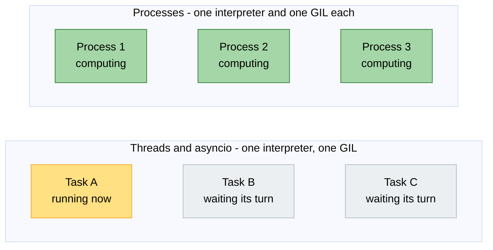
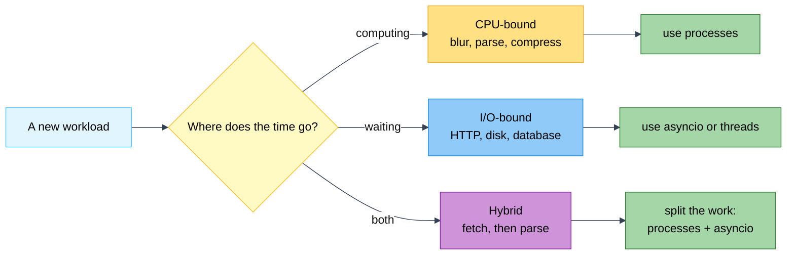
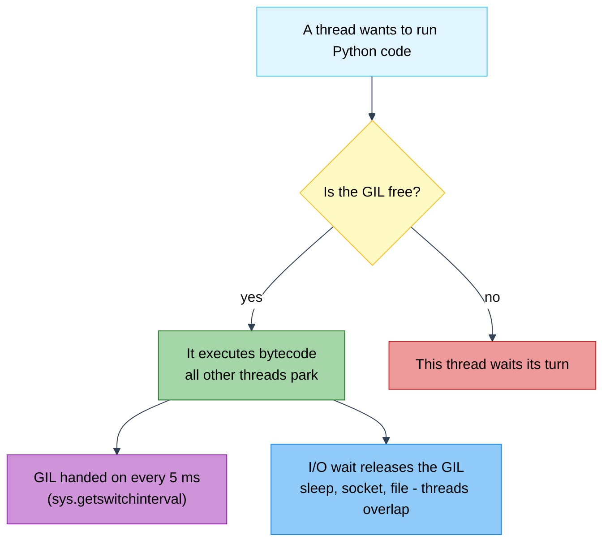
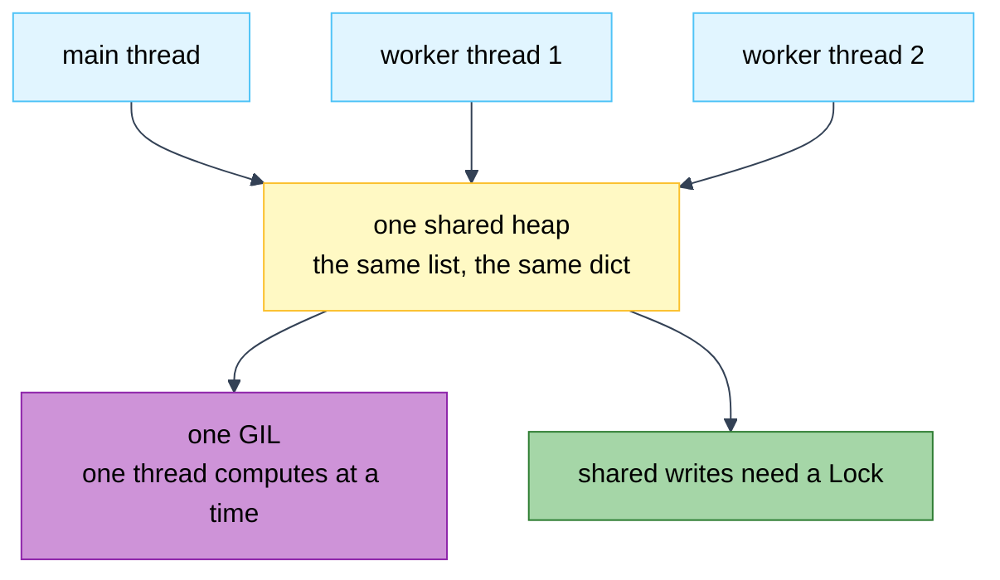
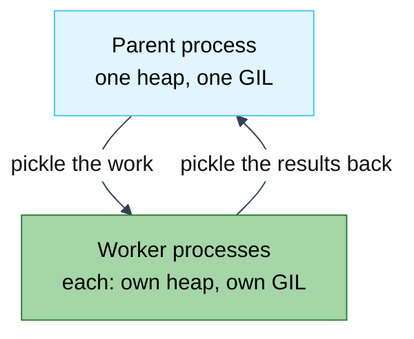
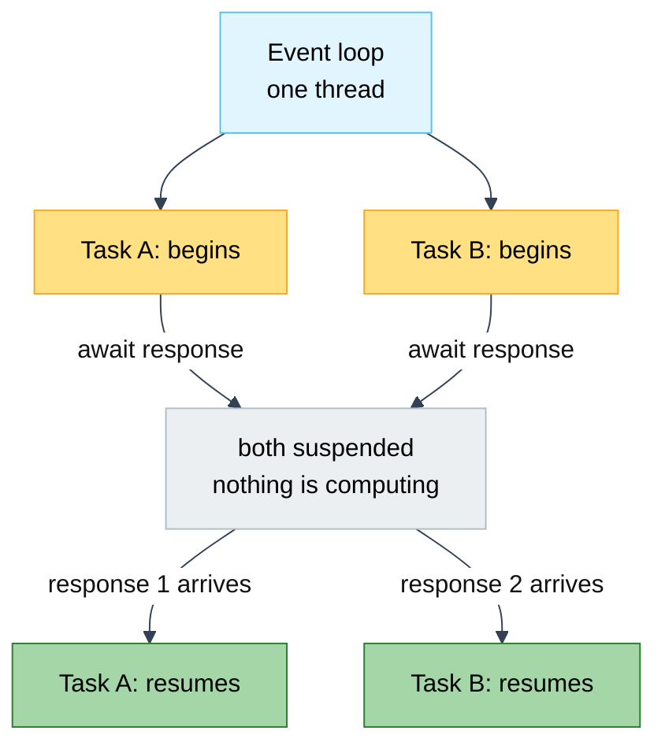
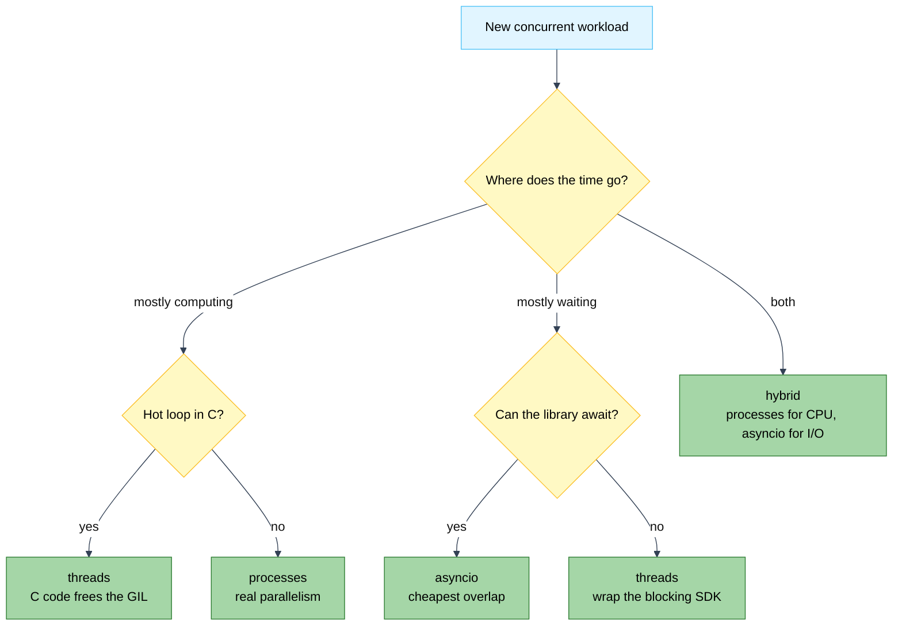
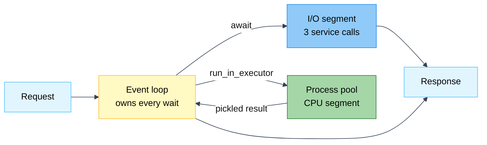

# Lab: Threading vs Multiprocessing vs asyncio — Which Concurrency Tool When?

Difficulty: Advanced | ~60 min | Requires Lab 5 (recommended) + comfort with functions and `time.perf_counter()`

---

## 1. Lab Title

**Threading vs Multiprocessing vs asyncio** — open the machinery, then run the
same CPU-bound task (blurring 100 synthetic images in pure Python) and the same
I/O-bound task (100 fake 50 ms network calls) under four execution strategies —
sequential, threads, asyncio, processes — and watch the results *invert*. The
GIL decides who wins and who wastes your time.

---

## 2. Problem Statement / Use Case Overview

A team has to pick one concurrency tool for a real workload. Before writing any
code, they need one fact: **is the work CPU-bound (computing) or I/O-bound
(waiting)?** This lab answers it by timing things, not by quoting rules.

- **CPU work:** threads and asyncio stay within noise of the baseline. Only
  processes go faster.
- **I/O work:** the table flips. asyncio turns about 5 s into about 0.05 s,
  threads do well, and processes lose because of what they cost to start.

A table of claims is not enough. So the lab opens with four short cells that show
how each tool actually behaves:

- **Who really runs** — every thread shares one process id, while every worker
  process has its own.
- **What memory is shared** — one shared counter loses about 6,000 of its 8,000
  updates when unguarded, and 0 once a `Lock` guards it.
- **What has to cross a process boundary** — a `lambda` cannot be pickled, and
  fails with a `PicklingError`.

Section 7 explains all of it with diagrams. The two ledgers at the end are the
prediction coming true.

---

## 3. Input Data

No external files, no API keys, no network. Everything is in-code, and the two
benchmark workloads live in `workloads.py`:

- **100 synthetic images** — grids of pixel brightness values, generated by
  `make_image()` in `workloads.py`. Fixed size (100×100) and fixed count, so
  every strategy competes on identical work.
- **A pure-Python `blur()` filter** — nested loops averaging each pixel's 3×3
  neighbourhood. 100% CPU-bound: no I/O and no C helpers, so the GIL is never
  released while it runs.
- **100 fake network calls** — `fetch(n)` (in `workloads.py`) just sleeps
  50 ms to simulate one round trip. Fully deterministic and offline.

The anatomy cells add three more callables to the same module, all for the same
reason as `blur` — a process worker must be able to import them by name:

- **`probe_worker(label)`** — pauses 50 ms, then returns a **dict** reporting
  `label`, `pid`, `thread_id` and `thread_name`. Sent to raw threads, a thread
  pool and a process pool to expose who is actually executing. A dict rather
  than a tuple so the notebook can ask for `row["pid"]` instead of counting
  commas in a `for pid, tid, name` loop.
- **`bump_unlocked(steps)` / `bump_locked(steps)`** — a read-modify-write on the
  module-level `COUNTER`, with and without `COUNTER_LOCK`. The shape of every
  race you will ever have.
- **`counter_total()` / `reset_counter()`** — the only way the notebook reads or
  clears that counter, so no cell touches its internals and no measurement
  inherits the previous one's leftovers.

`workloads.py` is a deliberate part of the design: the work lives in an
importable module so `ProcessPoolExecutor` *worker processes* can load it by
name. A function defined only inside a notebook cell cannot be shipped to
another process on Windows/macOS (spawn) — Section 5 catches that error live.

---

## 4. Processing

1. **Mechanics 1 — threads.** Four `threading.Thread` objects append to one
   shared list: one pid, four thread ids, zero copying.
2. **Mechanics 2 — both pools.** The same probe through a `ThreadPoolExecutor`
   and a `ProcessPoolExecutor`: one pid for the thread pool, one pid per worker
   for the process pool.
3. **Mechanics 3 — races and locks.** 4 × 2,000 read-modify-writes on shared
   state: unguarded (updates lost), guarded by `COUNTER_LOCK` (none lost), then
   the same guarded function in processes (each worker mutates a private copy).
4. **Mechanics 4 — start methods and pickling.** What `spawn` is, what it
   costs, and why a `lambda` cannot be shipped to a worker.
5. **Part 1 — sequential baseline.** Blur all 100 images in a plain loop,
   timed with `time.perf_counter()`.
6. **Part 2 — threads.** The same task via `ThreadPoolExecutor` — expect no
   speedup, the GIL lets only one thread compute at a time.
7. **Part 2 (cont.) — asyncio.** The same task as one coroutine — also no
   speedup, because the coroutine never `await`s, so the event loop has
   nothing to switch to.
8. **Part 3 — processes.** The same task via `ProcessPoolExecutor` — each
   process has its own interpreter and its own GIL, so the blurs run on
   several cores at once — expect a real speedup.
9. **Part 4 — I/O-bound.** Repeat the full comparison on 100 fake 50 ms
   requests in one cell. The winners invert: asyncio collapses ~5 s into
   ~0.05 s, threads come second, processes pay startup overhead and lose.
10. **Ledgers.** Two tables built with `tabulate`, one per bottleneck.

---

## 5. Output

Real numbers from a clean run (Windows 11, Python 3.13.3, 4 cores). Absolute
values vary from machine to machine and run to run — the *shape* is what
matters, and each block below says what to look for.

**Who is running (mechanics 1 and 2)** — one pid shared by every thread, a
distinct pid per process worker:

```
parent pid       : 21352
pids seen        : [21352]   <- one interpreter, so one pid
distinct threads : 4   <- four separate threads though
thread names     : ['inspector-0', 'inspector-1', 'inspector-2', 'inspector-3']

threads    -> 1 distinct pid(s): [21352]
processes  -> 4 distinct pid(s): [12072, 12540, 20936, 35460]
```

**Shared state (mechanics 3)** — the unguarded loop loses most of its updates,
the locked one loses none, and the process run leaves the parent untouched:

```
4 threads, no lock: 2092/8000 survived, 5908 lost to the race
4 threads, Lock   : 8000/8000 survived, 0 lost

4 processes, Lock : per-worker totals [2000, 2000, 2000, 2000] (each a multiple of 2000), parent still sees 0
```

The exact surviving count is timing-dependent — it will be somewhere between
1,000 and 8,000. The three invariants are what matter: unguarded loses updates,
locked loses none, and processes never write back to the parent.

**Start methods and pickling (mechanics 4)** — Windows only has `spawn`, and the
`lambda` fails exactly where the theory says it must:

```
start method here : spawn
available here    : ['spawn']

lambda via pool   : PicklingError: Can't pickle <function <lambda> at 0x000001DAD147A0C0>:
attribute lookup <lambda> on __main__ failed
```

(On Linux the same cell reports `fork` as the default, and lists
`['fork', 'spawn', 'forkserver']`. The `PicklingError` is the same on every
platform.)

**The two ledgers** — threads ≈ asyncio ≈ baseline on CPU work while processes
win; the table then inverts on I/O work, with asyncio ahead by two orders of
magnitude:

```
CPU-bound: blurring 100 images of 100x100 (lower is better)
+------------+-----------+---------------+
| strategy   | elapsed   | vs baseline   |
+============+===========+===============+
| sequential | 2.41s     | 1x            |
+------------+-----------+---------------+
| threads    | 1.35s     | 1.79x         |
+------------+-----------+---------------+
| asyncio    | 1.93s     | 1.25x         |
+------------+-----------+---------------+
| processes  | 1.01s     | 2.39x         |
+------------+-----------+---------------+

I/O-bound: 100 fake 50 ms requests (lower is better)
+------------+-----------+---------------+
| strategy   | elapsed   | vs baseline   |
+============+===========+===============+
| sequential | 5.06s     | 1x            |
+------------+-----------+---------------+
| threads    | 0.66s     | 7.63x         |
+------------+-----------+---------------+
| asyncio    | 0.06s     | 81.15x        |
+------------+-----------+---------------+
| processes  | 1.78s     | 2.84x         |
+------------+-----------+---------------+
```

Read the CPU table with care. The `threads` row above prints **1.79x**, which
looks like a real speedup and is not one. Threads still run on one GIL, so the
same total work executes either way — the only difference is that the run
happened to measure a *slower* baseline. The threads run is not faster; the
sequential run was unluckily slow.

That is the first thing to understand about this table: the baseline is the
noisy number, not the competitor.

- Across six captured runs on this machine, sequential measured 1.29–2.86 s,
  threads 1.20–2.43 s and asyncio 1.11–2.62 s.
- The same 100 blurs therefore produced apparent thread speedups ranging from
  0.94x to 1.79x, all of them the same work.
- The honest expectation is "within noise of the baseline". A laptop with a
  browser open can swing by 40% either way.

The noise also hides how big the process win really is. This machine spends about
0.32 s just starting a pool. Take that out of the run above and you get
2.41 s / (1.01 s − 0.32 s) = 3.5x on a 4-core machine. The ceiling is the core
count, but pickling 100 images in and 100 results out eats into it.

This is also why a single measurement cannot settle a concurrency question. If
you want a number you can trust, run each strategy five times, discard the
fastest and slowest, and compare the medians. Part 3 of the Optional Exercise
builds exactly that harness.

If your process row prints barely under the baseline, re-run the CPU section once
or twice before concluding anything. The I/O table is stable from run to run,
because its 50 ms sleeps are timers rather than CPU contention.

---

## 6. Tech Stack

- **Python 3.11+** (this lab needs nothing newer; 3.10 also works)
- **`tabulate == 0.10.0`** — renders the two comparison ledgers
- Everything else is the **standard library**: `threading`,
  `ThreadPoolExecutor`, `multiprocessing`, `ProcessPoolExecutor`, `asyncio`,
  `time`, `os`
- No GPU, no paid services, no external network. A few hundred MB of RAM on
  any laptop CPU. The process pool spawns up to `os.cpu_count()` workers, so a
  2-second CPU benchmark and a 5-second I/O benchmark make the whole notebook
  run in roughly 30 seconds.
- Platform note: on Windows the process pool uses `spawn` only (~0.3 s to boot a
  worker, and the process timings are noticeably slower than on Linux). The
  *shape* of the ledgers is the same everywhere.

---

## 7. Underlying Concepts

Three tools answer one question: *how do I stop wasting time?* They differ in
**what runs**, **where it runs**, and **what that costs**. Read this section in
order — each part maps onto one step of the notebook.

**If you only read five lines, read these:**

1. Work is either **computing** (CPU-bound) or **waiting** (I/O-bound). Find out
   which one you have; it decides everything else.
2. **Threads** live inside one interpreter. They are cheap and can share data
   easily, but a built-in lock (the GIL) lets only one of them compute at a time.
3. **Processes** are separate interpreters. They really do compute at the same
   time, but each one costs time to start and every value you pass must be copied
   (pickled).
4. **asyncio** runs many tasks on one thread and switches only where a task
   says `await`. It is the cheapest way to wait, and useless for computing.
5. Most real systems need **two** of these, not one.

### 7.1 Concurrency is a shape; parallelism is a fact

**In one line:** concurrency means juggling many tasks; parallelism means they
really run at the same instant.

- **Concurrency** is about the shape of your program. It juggles several tasks.
  It does not promise they run at the same time.
- **Parallelism** is about what the machine does. Several tasks really do run at
  the same moment, on different cores.
- One chef stirring four pans is concurrent, not parallel. Four chefs on four
  burners is both.

Under CPython's GIL, threads and asyncio give you the first one only. Processes
give you the second.



Read it like this. In the top row, only one box is lit. The interpreter hands
that one core around in slices. In the bottom row, every box is lit, because each
one is a separate interpreter with a core of its own.

### 7.2 Where does the time go? CPU-bound, I/O-bound, hybrid

**In one line:** work out whether your program is computing or waiting. That one
answer picks the tool.

- **CPU-bound** — the time goes into computing. The CPU sits near 100%. Examples:
  blurring an image, parsing a large JSON file, compression, simulation.
  Managing waits cannot help here. You need more computing power.
- **I/O-bound** — the time goes into waiting for something outside the program:
  the network, a disk, a database, a lock. The CPU is idle, often under 10%.
  Examples: 100 HTTP calls, reading 100 files, polling a queue.
- **Hybrid** — both, taking turns. Most real services are like this: fetch (I/O),
  parse (CPU), write (I/O). Hybrid work often needs *two* tools, not one (see 7.9).

How to tell, before you write any concurrency code: run the program and watch the
CPU. Pinned near 100% on one core means CPU-bound. Idle means I/O-bound.

This lab skips that measurement on purpose. `blur` is CPU-bound and `fetch` is
I/O-bound by design.



### 7.3 The GIL — why threads cannot compute in parallel

**In one line:** CPython lets one thread run Python code at a time. So threads
can *wait* in parallel, but never *compute* in parallel.

**What it is.** A lock inside every interpreter. It exists because Python's
internal bookkeeping was not thread-safe, and the team that wrote CPython judged
one big lock to be cheaper than fixing all of it.

**What it is not.** A lock around "your function". The interpreter holds it around
*bytecode execution*, and lets go of it whenever a thread blocks on something
else.

| Code | GIL released? | What that means |
|---|---|---|
| `blur` — pure Python loops | only every `sys.getswitchinterval()` (0.005 s) | threads queue up; no CPU speedup |
| `time.sleep(0.05)`, socket read, file read | yes, for the whole wait | threads overlap the wait |
| A C extension that releases (NumPy, zlib, `hashlib` on large inputs) | yes | threads *can* parallelise if the hot loop lives in C |

Four things to remember:

- **Thread CPU speedup is about 1.0x.** You pay the cost of handing work over and
  get nothing back. That is why the threads row hovers around 1.0x in the CPU
  ledger in Section 5.
- **`sys.setswitchinterval(x)`** trades fairness against overhead. A lower number
  means threads switch more often: fairer, but more overhead.
- **"It looks atomic" is a bug, not a guarantee.** On CPython 3.13 a plain
  `counter += 1` from several threads often survives, because the whole update
  usually fits inside one 5 ms switch window. Put *anything* between the read and
  the write, even `time.sleep(0)`, and updates start disappearing (Section 4).
  Never rely on the accident. Lock it.
- **Free-threaded CPython is a different build** (PEP 703, opt-in). It changes the
  arithmetic, but the default interpreter, the one that produced every number in
  this lab, still has the GIL. On Python 3.13 or newer you can check with
  `sys._is_gil_enabled()`.



Follow the blue path and you see why `fetch` gets faster with threads. Follow the
purple path and you see why `blur` does not. The red path is all a thread can do
while another thread computes.

### 7.4 Threading — many workers, one heap

**In one line:** threads are cheap workers that share one heap. Great for waiting
in parallel, dangerous for writing.

A **thread** is an OS thread that the interpreter schedules your Python code on.
The API is small, and worth knowing by hand before you reach for a pool:

```python
t = threading.Thread(target=fn, name="worker-0", daemon=False)
t.start()      # hand it to the OS; returns immediately
t.join()       # block until it finishes - without this, the work is not done
t.is_alive()   # still running?
```

**The shared heap is the whole story.** Threads share one heap, so every object you
pass is *the same object*. Nothing is copied. Nothing is pickled. That is the win
(a shared cache, a shared connection, a shared queue) and the danger:

- **The race.** Any read-modify-write of shared state can be split in half by a
  GIL handoff. Section 4 loses 5,974 of 8,000 updates unguarded, and 0 once a
  lock guards the loop.
- **The lock.** `threading.Lock()` is a one-at-a-time gate. It has `acquire()`
  and `release()`, but you will almost always write it as `with lock:`, which
  releases the lock even if the body raises an error. The same module has
  siblings: `RLock` (reentrant), `Event` (a one-shot flag), `Condition`
  (wait/notify), `Barrier` (a rendezvous), `Semaphore` (cap how many threads run
  at once). The cost is that a locked section runs one at a time. Hold a lock
  across I/O and your thread pool turns back into a sequential program. Take two
  locks in different orders and you get a **deadlock**, where every thread is
  waiting for a lock nobody will release.
- **Daemon threads** are killed abruptly when the interpreter exits. No cleanup,
  no flush, possibly a half-written file. Non-daemon threads make the interpreter
  wait for them. Choose deliberately.
- **Cost.** A thread costs about 50-100 microseconds to create, plus about 8 MB of
  address space. A process costs milliseconds and tens of MB. That thousand times
  gap is the whole reason threads are the default for I/O fan-out and processes
  are not.
- **Under the GIL**, threads are a way to **wait** in parallel, never a way to
  **compute** in parallel.



Every thread funnels into the yellow box. That is the cheap part (no data copies)
and the dangerous part (four threads, one shared object). Purple is the ceiling on
computing. Green is what you add to make the sharing safe.

### 7.5 Multiprocessing — many interpreters, many heaps

**In one line:** a process is a second Python program, with its own memory and its
own GIL. Real parallelism, paid for with startup cost and pickling.

A **process** is a separate OS process. It has its own interpreter, its own heap
and its own GIL. Nothing is shared unless you build a channel, so CPU work
genuinely runs on several cores. It is the only tool here that does.

**The start method decides how a child is born** (`mp.get_start_method()`):

| Method | Platforms | How the child starts | What it costs you |
|---|---|---|---|
| `fork` | Linux, BSD | OS clones the parent; memory copied on write | Cheap (~1 ms), but inherits open files and sockets — dangerous if the parent has threads |
| `spawn` | Windows, macOS (default) | Fresh interpreter that re-imports the parent's `__main__` by name | Slow (~100–500 ms), inherits nothing, and needs `if __name__ == "__main__":` in scripts |
| `forkserver` | Linux, BSD (opt-in) | A clean server process does the forking | Fork-like cost with fork-like isolation from parent threads |

Windows offers **only `spawn`**, and macOS has defaulted to `spawn` since Python
3.8. That brings two consequences, and the notebook shows both:

1. **Everything crossing the boundary must be picklable.** `pool.map(fn, items)`
   pickles `fn` and every item, then unpickles every result. A lambda or a nested
   function cannot be pickled. Section 5 catches the `PicklingError`. That is
   exactly why `blur`, `fetch` and the probes live in `workloads.py`.
2. **Moving data is the tax.** Shipping 100 x 100 images in, and 100 blurred images
   back out, is real work. It is part of why the CPU ledger reads about 2x instead
   of 4x. Send back aggregates instead of full intermediate results, split the work
   into chunks, or reach for `multiprocessing.shared_memory` or `Manager` when the
   workers genuinely have to share something.

Four more things worth knowing before you ship a process pool:

- **Failures stay contained, but they are loud.** A worker that crashes makes the
  whole pool unusable, and every pending future raises `BrokenProcessPool`.
- **Exceptions do travel back.** They surface at `future.result()`.
- **`maxtasksperchild` recycles workers**, so one leaky task cannot pile up memory
  across a long-lived pool.
- **Forking a parent that has threads** is a classic source of deadlocks. Use
  `spawn` or `forkserver` instead.



No shared objects, so no locks. But every arrow is a pickle. That trade —
isolation, plus a tax on data — is the whole character of multiprocessing.

### 7.6 asyncio — many tasks, one thread, no OS help

**In one line:** asyncio runs many tasks on one thread, and switches only where a
task says `await`.

Everything rests on one cooperative rule. A coroutine gives control back to the
event loop in one place only: at an `await`.

- `async def` defines a **coroutine function**. Calling it gives you a coroutine
  object that has not done anything yet. The loop still has to schedule it.
- `await` is the **only** place a task can stop. At an `await`, the loop parks
  that task, runs any other task that is ready, and comes back when the awaited
  operation finishes.
- `asyncio.gather(c1, ..., cN)` schedules N coroutines and returns when they have
  all finished. That is why 100 x 50 ms waits collapse to about 60 ms.
- **Nothing interrupts you.** With one thread, no other task can cut into the
  middle of a line. So you get no locks, and no races caused by being cut off.
  Your coroutines can still change shared state at every `await`, so you still need
  the same discipline. The runtime just does not force it on you.
- **Cost.** A task is a coroutine object plus a little bookkeeping. Far cheaper than
  a thread, which is why one thread can hold tens of thousands of requests in
  flight at once.

Two failure modes to remember:

1. **No `await`, no concurrency.** A coroutine that computes (our `blur`), or calls
   something **blocking** (`time.sleep`, a synchronous HTTP client, a plain file
   read), runs all the way to the end with the loop frozen behind it. Every other
   task stalls. This is called **head-of-line blocking**, and it is the number-one
   asyncio bug in production code.
2. **The cure is a bridge to the other two tools.**
   `await asyncio.to_thread(blocking_call, ...)` hands the work to a thread pool.
   `await loop.run_in_executor(process_pool, fn, arg)` hands it to a process pool.
   Either way the event loop keeps owning every wait (see 7.9).



Only the `await` lines let the loop breathe. Delete them, as the CPU coroutine in
Section 8 of the notebook does, and the loop never gets the wheel again.

### 7.7 The three compared

**In one line:** two rows decide almost every real choice — *can it use more than
one core?* and *how expensive is it to pass data?*

| | Threads (`threading`, `ThreadPoolExecutor`) | Processes (`multiprocessing`, `ProcessPoolExecutor`) | asyncio (`asyncio`) |
|---|---|---|---|
| **Unit of execution** | one OS thread inside one interpreter | a whole separate process, with its own interpreter | a coroutine task on one event loop |
| **Memory model** | one shared heap — every thread sees every object | private heap per worker; nothing shared unless you build it | one shared heap (single thread) |
| **True CPU parallelism** | No — one GIL serialises all bytecode | **Yes** — one GIL per process | No — one thread |
| **I/O concurrency** | Yes — waits overlap | Yes — waits overlap, but one heavy process each | **Best** — tens of thousands of tasks per thread |
| **Cost to start a worker** | ~50–100 µs | ~100–500 ms (`spawn`), ~1 ms (`fork`) | ~1 µs per task, no OS object |
| **Cost to hand work over** | free — only a pointer is copied | pickle the args, unpickle the result | free; only happens at `await` |
| **Shared mutable state** | possible and dangerous — needs a `Lock` | impossible by default — isolate instead | safe from interruption, but still re-entrant at `await` |
| **Failure blast radius** | a crash or race corrupts the whole process | worker crash is contained; the pool raises `BrokenProcessPool` | one blocking call stalls every task |
| **Practical ceiling** | hundreds to thousands of threads | about the core count for CPU work (dozens) | tens of thousands of tasks |
| **Choose it when** | blocking third-party SDKs, moderate waits, shared caches | CPU-bound work: images, parsing, compression | thousands of network waits: HTTP, DB, queues |
| **Main API surface** | `ThreadPoolExecutor`, `threading.Lock` | `ProcessPoolExecutor`, `multiprocessing.Queue` | `asyncio.gather`, `asyncio.to_thread`, `run_in_executor` |

Now check this table against the ledgers in Section 5. Threads sit around 1.0x on
CPU work: starting and handing over are cheap, but there is no CPU parallelism to
buy. On I/O work they reach about 8x, because waiting is exactly what they overlap.

Processes flip the two rows that matter. They are the only tool with CPU
parallelism, and the most expensive at everything else. So they top the CPU ledger,
lose to asyncio on the I/O ledger, and would lose to plain sequential if each call
did very little work.

### 7.8 Choosing: the decision tree

**In one line:** match the tool to the bottleneck, then check that each job is big
enough to be worth the coordination.



There is no best tool, only the tool that matches the bottleneck. And there is one
more check this diagram cannot show: **is each job big enough to pay for the
coordination?** A 20 ms job does not recover a 300 ms process spawn.

### 7.9 When one answer is not enough: the hybrid

**In one line:** most systems need two tools, and the event loop is the one that
owns everything.

Most systems are hybrid (see 7.2), so the production answer is often two tools
joined by `run_in_executor`. The event loop owns every wait. It hands CPU segments
to a process pool, waits for the result, and keeps serving I/O meanwhile. Part 2 of
the Optional Exercise builds exactly this, and shows the total landing near the
*larger* of the two segments instead of their sum.



Total time lands near the *larger* segment, not the sum. That is the whole payoff
of the hybrid.

---

## 8. Prerequisites

- Lab 1–5, especially the asyncio basics from Lab 5 (`async def`, `await`,
  `asyncio.gather`).
- Comfort with list comprehensions, `with` blocks, and `time.perf_counter()`.
- No prior threading or multiprocessing experience required.

---

## 9. Environment / Dependencies Setup

From the lab folder (`Lab6/`):

```bash
pip install tabulate==0.10.0
jupyter notebook lab-concurrency-models.ipynb
```

The notebook's first cell runs the same `pip install`. Run the notebook **from
the `Lab6` folder** — it imports the sibling module `workloads.py`, and the
worker *processes* import it too, so the current folder must be on the path.

Only `tabulate` is third-party; `concurrent.futures`, `asyncio`, and `time`
are standard library.

---

## 10. Step-wise Development Instructions

### How to use this section

The notebook keeps each section's prose to one or two lines. The explanation
lives in two places instead: the comments inside each code cell, and the step
notes here. Read the comments while you run the cells. Read these notes
afterwards, to find out what each line was actually doing.

### Step 1 — Sanity-check the workload

The whole lab stands on `workloads.py`. Open it: `make_image` builds a fake
100×100 image, `blur` is a pure-Python box blur, and `IMAGES` holds 100 of them.
The same module also holds the anatomy helpers — `probe_worker`,
`bump_unlocked` / `bump_locked`, and `counter_total` / `reset_counter` —
because anything sent to a worker process has to be importable by name.

`timeit` is defined here rather than imported. It wraps `time.perf_counter()`
so that every benchmark below stays one line instead of three.

```python
import time
from workloads import blur, fetch, IMAGES

# timeit wraps any callable and returns (result, elapsed_seconds).
# Every benchmark below is then one line instead of three.
def timeit(fn, *args):
    """Run fn(*args), return (result, elapsed_seconds)."""
    start = time.perf_counter()      # monotonic, high-resolution wall clock
    result = fn(*args)               # the work being measured
    return result, time.perf_counter() - start

# Sanity check: blur one image to prove the workload actually works.
blur(IMAGES[0])
print(f"Task: blur {len(IMAGES)} images of {len(IMAGES[0])}x{len(IMAGES[0])}")
```

**What to look for.** One line confirming 100 images of 100×100. If `blur` were
broken you would want to know now, not after the two ledgers.

### Step 2 — Mechanics 1: what a thread actually is

Four `threading.Thread` objects, one shared list. The lesson is the process id.
Threads are *inside* your interpreter, so they share one heap, one GIL, and one
pid. No data is copied anywhere in this cell.

Three calls cover the whole API:

- `Thread(target=fn, args=(...))` builds the thread. `args=` is how the thread
  receives its arguments.
- `start()` hands it to the OS and returns immediately.
- `join()` blocks until the thread has finished. Leave it out and the cell can
  print before the work is done.

`probe_worker` returns a dict with four keys: `label`, `pid`, `thread_id` and
`thread_name`. A dict rather than a tuple, so the code can ask for `row["pid"]`
by name instead of counting commas in `for pid, tid, name`.

```python
import os
import threading
from workloads import probe_worker

# One shared list is the whole message bus: every thread appends to the *same*
# object, so nothing is copied and nothing is pickled.
observations = []

def inspect(label):
    """Thread body: run one probe, then hand the result back through the list."""
    observations.append(probe_worker(label))

# args=(n,) is how a Thread passes arguments to its target function.
names = [f"inspector-{i}" for i in range(4)]
probes = [threading.Thread(target=inspect, args=(n,), name=n) for n in names]

for thread in probes:
    thread.start()   # returns at once; the thread runs in the background
for thread in probes:
    thread.join()    # block until it finishes - without join, the work is not done

# Read the results back. Every pid is the same: one interpreter, one GIL.
pids = sorted({row["pid"] for row in observations})
thread_ids = {row["thread_id"] for row in observations}

print(f"parent pid       : {os.getpid()}")
print(f"pids seen        : {pids}   <- one interpreter, so one pid")
print(f"distinct threads : {len(thread_ids)}   <- four separate threads though")
print(f"thread names     : {sorted({row['thread_name'] for row in observations})}")
```

**What to look for.** One pid, and four different thread ids. Everything you
passed to a thread is the *same* object, which is free — and dangerous (Step 4).

### Step 3 — Mechanics 2: the same probe, two pools

One callable, one set of arguments, two pool classes. The thread pool keeps
everything inside a single pid. The process pool reports a distinct pid per
worker, because each worker is a separate interpreter with its own GIL.

Two details are what make this measurement honest:

- **16 tasks, not 4.** With only four tasks, one fast worker could drain the
  whole queue and you would "prove" that a process pool only uses one process.
- **`probe_worker` waits 50 ms on purpose.** Under `spawn` a worker needs a few
  hundred ms to boot, so instant tasks would all land on whichever worker booted
  first.

Thread ids are deliberately not printed here. An id only means something inside
one interpreter, and separate processes are free to hand out the same id, so the
number would be noise dressed up as a result.

```python
from concurrent.futures import ProcessPoolExecutor, ThreadPoolExecutor

# 16 tasks x 50 ms each is more work than one worker can chew through, so every
# worker of each pool gets used. Otherwise the fast one drains the queue and the
# pid count lies. Same callable, same arguments: only the pool class differs.
labels = [f"task-{i}" for i in range(16)]
probes_by_pool = {}

# One loop over both pool classes, so the class is the only variable.
for label, pool_class in (("threads", ThreadPoolExecutor),
                          ("processes", ProcessPoolExecutor)):
    with pool_class(max_workers=4) as pool:
        probes_by_pool[label] = list(pool.map(probe_worker, labels))

# Threads report a single pid. Processes report one pid per live worker.
for label, runs in probes_by_pool.items():
    pids = sorted({row["pid"] for row in runs})
    print(f"{label:10} -> {len(pids)} distinct pid(s): {pids}")
```

**What to look for.** `1 distinct pid(s)` on the threads row, and 4 or more on
the processes row.

### Step 4 — Mechanics 3: shared state, races, and locks

This is the most important cell in the lab. Read the race carefully, because
almost every concurrency bug you will ever meet is this bug.

**What a race is.** Two threads change the same thing at once, and one of the
changes is lost. Watch how it happens here:

1. Thread A reads the counter into `mine`.
2. A calls `time.sleep(0)`, which hands the GIL over and comes straight back.
   That pause *is* the race window.
3. Thread B runs the same two steps and writes its own value.
4. A wakes up and writes `mine + 1` — a number built from the old counter. B's
   update is gone.

Any code that reads a value, changes it, and writes it back is a
**read-modify-write**. `counter += 1` is one. So is `total = total + price * qty`.
Real code opens the same window whenever it does *anything* between the read and
the write: waiting on I/O, calling a C library that releases the GIL, or just
running enough lines to hit the 5 ms switch timer.

**What a lock does.** `COUNTER_LOCK` is a one-at-a-time gate. Inside
`with COUNTER_LOCK:` only one thread may run, and the lock is released even if
the body raises. So `bump_locked` performs the same three steps, but no two
threads can be inside the window together — and no update is lost.

**Why processes need no lock.** Each worker imports `workloads.py` fresh, so
each one gets a private `COUNTER`. There is nothing shared left to protect.
Processes do not remove races; they remove the shared state. That is the better
deal once you have already paid for separate memory. The pool decides which
worker takes which task, so a worker may run two of the four and report 4000
rather than 2000 — the point is that every total is a whole multiple of `STEPS`
and none of them contains another worker's work.

`counter_total()` and `reset_counter()` are the only door in, so no cell reaches
into the counter's internals and no measurement inherits the previous one's
leftovers.

```python
from workloads import bump_locked, bump_unlocked, counter_total, reset_counter

# Each of 4 workers tries to add STEPS. With no updates lost the total is
# STEPS * WORKERS, which is what EXPECTED means.
STEPS, WORKERS = 2000, 4
EXPECTED = STEPS * WORKERS

# 1. Four threads, no lock. Thread A reads the counter, yields the GIL, and then
#    writes back a number that no longer includes thread B's update - so B's
#    work silently vanishes. Nothing in the output looks wrong.
reset_counter()
with ThreadPoolExecutor(max_workers=WORKERS) as pool:
    pool.map(bump_unlocked, [STEPS] * WORKERS)      # results not needed
unlocked_total = counter_total()                    # read the one shared object
print(f"4 threads, no lock: {unlocked_total}/{EXPECTED} survived, "
      f"{EXPECTED - unlocked_total} lost to the race")

# 2. The identical loop and the identical threads, but every update now happens
#    under COUNTER_LOCK. Only one thread may be inside the `with` block at a
#    time, so every increment survives and the count is exact on every run.
reset_counter()
with ThreadPoolExecutor(max_workers=WORKERS) as pool:
    pool.map(bump_locked, [STEPS] * WORKERS)
locked_total = counter_total()
print(f"4 threads, Lock   : {locked_total}/{EXPECTED} survived, "
      f"{EXPECTED - locked_total} lost")

# 3. The same function in processes. No lock is even needed, because there is
#    nothing to share: each worker counts into its own copy of COUNTER, so every
#    total is a whole multiple of STEPS and the parent's counter stays at 0.
#    Which worker takes which task is up to the pool, so one worker may run
#    more than one of the 4 tasks and report 4000 instead of 2000.
reset_counter()
with ProcessPoolExecutor(max_workers=WORKERS) as pool:
    per_worker = sorted(pool.map(bump_locked, [STEPS] * WORKERS))
print(f"4 processes, Lock : per-worker totals {per_worker} "
      f"(each a multiple of {STEPS}), parent still sees {counter_total()}")
```

**What to look for.** Three invariants, in this order:

1. No lock: the total lands far below `EXPECTED`, and the output still looks
   perfectly normal. Nothing warns you.
2. Lock: exactly `EXPECTED`, every single run.
3. Processes: every total is a multiple of 2000, they add up to 8000,
   and the parent still sees 0. Nothing crossed the process boundary.

### Step 5 — Mechanics 4: start methods and the pickling rule

How a worker is *started* decides what you are allowed to send it. Windows can
only `spawn`; Linux adds `fork` and `forkserver`. Under `spawn` the function is
pickled and shipped by name.

**Pickling** means turning an object into bytes so another program can rebuild
it. So anything sent to a worker has to be importable by name. That is exactly
why `blur`, `fetch` and `probe_worker` live in `workloads.py`, and why a `lambda`
written in a cell cannot be shipped at all.

```python
import multiprocessing as mp

# The start method decides how a worker process is created. Windows has only spawn.
print(f"start method here : {mp.get_start_method()}")
print(f"available here    : {mp.get_all_start_methods()}")

# Under spawn the function is pickled and shipped by name. A lambda has no
# importable name, so this fails - and we catch it instead of crashing the cell.
try:
    with ProcessPoolExecutor(max_workers=2) as pool:
        pool.submit(lambda n: n, 1).result()
except Exception as exc:
    print(f"lambda via pool   : {type(exc).__name__}: {exc}")
```

**What to look for.** `spawn` on Windows, and a caught `PicklingError` naming
the lambda. This is the most common first failure when moving work into a
process pool, so it is worth seeing it happen once on purpose.

With the machinery established, the rest of the lab measures what it costs.

### Step 6 — Part 1: the sequential baseline

A plain list comprehension, one image at a time. This number is the bar that
every other strategy has to beat.

```python
# The baseline: 100 blurs, one at a time, on one thread.
# _ discards the result list; cpu_seq keeps only the elapsed time.
_, cpu_seq = timeit(lambda: [blur(img) for img in IMAGES])
print(f"sequential: 100 images in {cpu_seq:.2f}s")
```

### Step 7 — Part 2: threads on CPU work

`ThreadPoolExecutor` hands the 100 blurs to up to N worker threads. Handing the
work over is free, because every thread sees the same objects.

But the OS may schedule several threads at once while the GIL lets only one run
Python bytecode. So the pool also pays a handoff cost the sequential loop never
pays. Expect the elapsed time within 30% of the baseline. That is noise, not a
speedup, and on a quiet run it can land slightly *under* 1.0x.

```python
from concurrent.futures import ThreadPoolExecutor

# run_threads spreads work_fn across the items using a thread pool.
# Handing work over is free, because every thread sees the same objects.
def run_threads(work_fn, items):
    """Distribute work_fn across items using a thread pool."""
    with ThreadPoolExecutor() as pool:
        return list(pool.map(work_fn, items))

# The same 100 blurs, now spread across threads. The GIL still allows only one
# thread to run Python code at a time, so expect this near the baseline.
_, cpu_threads = timeit(lambda: run_threads(blur, IMAGES))
print(f"threads: 100 images in {cpu_threads:.2f}s")
```

### Step 8 — Part 2 (cont.): asyncio on CPU work

The coroutine wraps the same comprehension but **never awaits**. `await` is the
only place a coroutine hands control back to the event loop, so with no `await`
there is no switching at all. The coroutine just runs start to finish, like the
sequential loop. Expect the baseline again, within 30%.

Whatever this row prints belongs to the same noise band that swallows the
threads row.

```python
import asyncio

# This coroutine wraps the same comprehension but never awaits. `await` is the
# only place a coroutine hands control back, so the loop never gets the wheel.
async def process_images():
    return [blur(img) for img in IMAGES]

start = time.perf_counter()
await process_images()          # Jupyter already runs a loop, so await directly
cpu_async = time.perf_counter() - start
print(f"asyncio: 100 images in {cpu_async:.2f}s")
```

### Step 9 — Part 3: processes on CPU work

`ProcessPoolExecutor` starts separate Python interpreters. Each one has its own
GIL, so the 100 blurs genuinely run on as many cores at once. This is the first
real speedup.

Two bills come with it:

- **Worker boot time.** Four fresh interpreters cost about 0.3 s on this machine.
- **Pickling.** 100 images go in, and 100 blurred images come back out.

That is why this row reads 1.1x–2.0x rather than 4x. Take the startup cost away
and the run is closer to the core count, which is the real ceiling. If the row
prints barely under the baseline, re-run the cell: a busy laptop slows the
sequential run more than the parallel one, which can make a margin look real when
it is only contention. Part 1 of the Optional Exercise isolates the startup cost
properly.

```python
from concurrent.futures import ProcessPoolExecutor

# run_processes has the same shape as run_threads with a different pool class.
# Only module-level functions survive pickling, which is why `blur` is imported
# from workloads.py instead of being defined in this cell.
def run_processes(work_fn, items):
    """Distribute work_fn across items using a process pool."""
    with ProcessPoolExecutor() as pool:
        return list(pool.map(work_fn, items))

# Each worker process has its own GIL, so these blurs really do run in parallel.
_, cpu_proc = timeit(lambda: run_processes(blur, IMAGES))
print(f"processes: 100 images in {cpu_proc:.2f}s")
```

### Step 10 — Part 4: the I/O-bound task (all four strategies)

`fetch` comes from `workloads.py` for the same reason as `blur`: the process
pool's workers must be able to import it by name. It fakes a network call —
sleep 50 ms, then return. 100 of them take about 5 s sequentially, because the
CPU just sits there.

This time every tool can overlap the waits. `time.sleep` and socket reads both
release the GIL while they wait, so the CPU is never in the way. The winner is
now whoever waits best, not whoever computes fastest — and the costs from
Section 0 start to matter again.

```python
N = 100

# Sequential I/O: 100 x 50ms = ~5s, with the CPU idle the whole time.
_, io_seq_elapsed = timeit(lambda: [fetch(i) for i in range(N)])
print(f"sequential: {N} requests in {io_seq_elapsed:.2f}s")

# Threads on I/O: sleep() releases the GIL, so the waits overlap.
_, io_threads_elapsed = timeit(lambda: run_threads(fetch, range(N)))
print(f"threads: {N} requests in {io_threads_elapsed:.2f}s")

# asyncio on I/O: an `async def` that awaits lets the loop switch between all
# 100 tasks instead of waiting for each one in turn.
async def fetch_async(n):
    await asyncio.sleep(0.05)  # same 50 ms, but the loop switches tasks
    return n * 2

start = time.perf_counter()
await asyncio.gather(*[fetch_async(i) for i in range(N)])   # gather runs them together
io_async_elapsed = time.perf_counter() - start
print(f"asyncio: {N} requests in {io_async_elapsed:.2f}s")

# Processes on I/O: spawn overhead, and no GIL benefit to pay it back.
_, io_proc_elapsed = timeit(lambda: run_processes(fetch, range(N)))
print(f"processes: {N} requests in {io_proc_elapsed:.2f}s")
```

### Step 11 — Reading the two ledgers

The last cell renders both tables. On CPU, processes is the only row reliably
under the baseline, while threads and asyncio scatter around 1.0x. On I/O,
asyncio wins by roughly 80x, threads reach about 8x, and processes come in
behind both.

Then read each row back against Section 7.7. Every row that moved is explained
there.

```python
from tabulate import tabulate

# print_ledger renders one comparison table: each strategy against the baseline.
def print_ledger(title, seq_time, times_dict):
    """Print a comparison table: each strategy vs the sequential baseline."""
    print(title)
    rows = [["sequential", f"{seq_time:.2f}s", "1x"]]
    for name, t in times_dict.items():
        speedup = seq_time / max(t, 1e-9)  # avoid division by zero
        rows.append([name, f"{t:.2f}s", f"{speedup:.2f}x"])
    print(tabulate(rows, headers=["strategy", "elapsed", "vs baseline"], tablefmt="grid"))

# CPU-bound ledger: processes should win, while threads and asyncio sit near baseline.
print_ledger("CPU-bound: blurring 100 images of 100x100 (lower is better)", cpu_seq,
             {"threads": cpu_threads, "asyncio": cpu_async, "processes": cpu_proc})

print()

# I/O-bound ledger: asyncio should crush everything, processes should come last.
print_ledger("I/O-bound: 100 fake 50 ms requests (lower is better)", io_seq_elapsed,
             {"threads": io_threads_elapsed, "asyncio": io_async_elapsed,
              "processes": io_proc_elapsed})
```

---

## 11. Optional Exercise

**Part 1 — find the constant nobody measured.** The process pool's startup cost
hides inside every process timing in the ledgers. Isolate it.

1. Time a bare pool that runs a single trivial task to measure pure startup
   cost — e.g. `pool.map(abs, [1])`. (Not `lambda`: a lambda cannot be pickled
   across the process boundary, which is why the real work lives in
   `workloads.py` in the first place.)
2. Subtract that constant from `cpu_proc` and `io_proc_elapsed` and re-read
   the ledgers.
3. Question: with `os.cpu_count()` workers, what speedup does the CPU task
   approach once startup is removed? (Hint: near the core count, not beyond.)

**Part 2 — build the hybrid.** Section 7.9 describes the production shape: the
event loop owns every wait, and CPU segments go to worker processes.

4. Write a coroutine that awaits `loop.run_in_executor(pool, blur, image)` for
   all 100 images (pass `blur` itself — a lambda would fail to pickle again), and
   `await asyncio.gather(...)` it against 20 `fetch_async` calls at the same
   time. In a notebook `await` it directly; in a script wrap it in `asyncio.run`.
5. Compare the total against the two segments run separately. The sum should
   collapse to roughly the *larger* of the two, not their sum — that is the whole
   argument for the hybrid.

Why this matters in production: if a call's real work is shorter than the pool's
startup cost, then multiprocessing is the wrong tool. The overhead can make it
*slower* than plain sequential. And if a coroutine blocks, one slow call can freeze
every task on the loop, which is why the bridge functions exist.

---

## 12. What We Learnt

- **Classify first (7.2).** Is the bottleneck CPU-bound or I/O-bound? Every other
  decision follows from that one question.
- **Concurrency vs parallelism (7.1).** Threads and asyncio give concurrency on one
  core. Only processes give parallelism across cores.
- **The GIL (7.3).** One thread per interpreter runs bytecode at a time, and lets
  go of it for I/O. That is why threads can *wait* in parallel but never *compute*
  in parallel.
- **Threads share one heap (7.4).** Free to pass data, dangerous to write it. Guard
  every read-modify-write with a `Lock`, or lose about 6,000 of 8,000 updates.
- **Processes own their heap (7.5).** True parallelism, and no shared-state races.
  You pay for it with spawn cost and a pickle on every argument and result.
- **asyncio is cooperative (7.6).** It switches only at `await`, so a coroutine
  that never awaits, or that calls something blocking, stalls everything behind it.
- **The three-way comparison (7.7).** Two rows decide almost everything: CPU
  parallelism, and the cost of passing data. That is why the ledgers invert between
  CPU work and I/O work while the tools never change.
- **Hybrids are normal (7.9).** Processes for the CPU segment, asyncio for the I/O
  segment, joined by `run_in_executor`. The total lands near the larger segment,
  not their sum.
