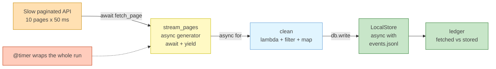

# Lab: The Ultimate Async Data Stream (Capstone)

Difficulty: Advanced | ~50 min | Capstone: requires Labs 1–5

---

## 1. Lab Title

**The Ultimate Async Data Stream** — the capstone lab. A slow, paginated API is
streamed into local storage piece by piece through one architecture that wires
together everything in this catalog: an **async generator** that lazily
paginates the source, an **`async for`** loop that consumes it, a **`@timer`**
decorator that benchmarks the whole run, a **lambda + `filter`/`map`** pipeline
that cleans each page as it arrives, and an **`async with`**-managed store that
guarantees the resource is closed.

---

## 2. Problem Statement / Use Case Overview

A real-time ingestion engine must pull paginated data from a slow API and write
it into local storage *as it arrives* — not by loading every page into memory
first. Two production requirements collide here. The source is **slow**, so
blocking on each page serializes the entire run and idles the process while the
network waits. The stream is **unbounded**, so an eager "fetch everything, then
process" design would need the whole dataset in RAM before the first event can
be stored.

The capstone solution is one architecture: an **async generator** fetches page
*N+1* only after page *N* has been consumed, yielding each page the moment it
arrives; the consumer **cleans** the page inline and **stores** it immediately
through a context-managed resource. Functional programming (Lab 1),
metaprogramming (Lab 4), lazy evaluation (Lab 3), concurrency (Labs 5–6), and
resource safety (Lab 2) all serve one goal — stream, don't dump.

---

## 3. Input Data

No external files, no API keys, no network. One simulated input:

- **A deterministic, paginated event stream** — `TOTAL_PAGES = 10` pages of
  `PAGE_SIZE = 10` events (`100` total), generated by a coroutine `fetch_page(page)`.
  Every page costs a fixed `50 ms` of fake network latency, and returns
  `{"page", "events", "has_more"}`. Each event is a dict with `event_id`
  (`0..99`), `kind` (`"purchase"` when `i % 3 == 0`, else `"click"`), and an
  `amount` (`0..73`). Deterministic by construction, so every learner
  reproduces the same stream and the same kept counts.
- The only file the lab *writes* is `events.jsonl`, created by the notebook's
  own store.

The source is a plain coroutine rather than a real HTTP server so the lab is
fully offline, instantly reproducible, and the lesson stays in the pipeline
instead of the transport.

---

## 4. Processing

1. **Section 1 — `@timer`, extended.** Lab 4's decorator gains an async branch:
   when the wrapped function is a coroutine function, the wrapper becomes an
   `async def` that `await`s the call, so timing works for both function kinds.
2. **Section 2 — the async generator.** `stream_pages()` awaits the slow API for
   a page, `yield`s it, then awaits the next — lazy pagination with non-blocking
   I/O.
3. **Section 3 — prove the laziness.** Consuming only two pages then `break`ing
   costs `2 × 50 ms`; page 3 is never requested.
4. **Section 4 — the cleaning pipeline.** `clean()` applies `filter` (keep
   `amount >= 30`) then `map` (attach `price = amount × 1.08`) via lambdas,
   running on each page the instant it arrives.
5. **Section 5 — the store.** `LocalStore` is an async context manager; its
   `__aexit__` runs on success *and* on crash, reporting committed rows or the
   exception that killed the block.
6. **Section 6 — the capstone.** A `@timer`-decorated `ingest()` opens the store
   with `async with`, consumes the generator with `async for`, cleans each page
   inline, writes it, and reports per-page kept counts.
7. **Section 7 — the ledger.** The file is read back, cross-checked against the
   counters, and summarized in a `tabulate` table.

---

## 5. Output

Real output from a clean run (Windows 11, Python 3.13). Timings vary per machine
and run; the *counts* are deterministic.

```
consumed 2/10 pages in 0.12s
page 1: kept 5/10
page 2: kept 6/10
page 3: kept 6/10
page 4: kept 6/10
page 5: kept 6/10
page 6: kept 6/10
page 7: kept 6/10
page 8: kept 6/10
page 9: kept 7/10
page 10: kept 7/10
committed 61 rows to events.jsonl
ingest ran in 0.62s
fetched: 100 stored: 61
first stored: {'event_id': 5, 'kind': 'click', 'amount': 36, 'price': 38.88}
last stored: {'event_id': 99, 'kind': 'purchase', 'amount': 73, 'price': 78.84}
+---------------------+---------+---------------------------------+
| stage               |   count | what happened                   |
+=====================+=========+=================================+
| fetched (events)    |     100 | 10 pages x 10                   |
+---------------------+---------+---------------------------------+
| kept (amount >= 30) |      61 | 61/100 survived the filter      |
+---------------------+---------+---------------------------------+
| stored (JSON lines) |      61 | events.jsonl, one JSON per line |
+---------------------+---------+---------------------------------+
```

The two numbers to keep in mind: `2/10 pages in 0.12s` is the lazy proof, and
`fetched: 100 stored: 61` is the pipeline's accounting — every event came off
the wire, exactly the ones that survived cleaning reached the file.

---

## 6. Tech Stack

- **Python 3.11+** — `asyncio` (`iscoroutinefunction`, `sleep`), `functools`
  (`wraps`), `json`, `time`; all standard library.
- **`tabulate == 0.10.0`** — renders the final ledger.
- No GPU, no paid services, no external network. A few MB of RAM on any laptop
  CPU. The whole lab completes in under two seconds of compute.

---

## 7. Underlying Concepts

### Async generators: laziness + non-blocking I/O, together

A generator is *lazy*: `yield` pauses it, and it produces the next value only
when asked. An **async generator** keeps that laziness but adds suspension
points: `async def` + `yield` means the function can `await` between yields.
Each `await fetch_page(page)` lets the event loop run other work while the
network waits; the following `yield` hands the finished page to the consumer
and pauses until the next page is requested. That one construct fuses Lab 3
(lazy evaluation, bounded memory) with Lab 5 (non-blocking I/O, an idle-free
loop).

`async for` is the consumer side: it pulls one item, `await`s it, processes it,
and pulls the next. Crucially, the stream stays **pulled**, not **pushed** —
the generator only does work the consumer asks for, so a partial consumption
(pages 1–2 in this lab) pays for exactly what it used.

### Why eager collection is the wrong tool here

Fetching all pages into a list first means: (a) the whole stream must arrive
before the first event is cleaned or stored, and (b) the whole stream lives in
memory at once. For an unbounded ingestion source neither holds. The async
generator inverts both: the first page is processed after ~50 ms while the last
page is still being fetched, and memory holds one page at a time.

### Decorating coroutines

Lab 4's `@timer` called `func(*args, **kwargs)` and timed it. That breaks on an
`async def`: calling a coroutine function returns a coroutine object that runs
nowhere until awaited, so the wrapper would "finish" in microseconds. The fix
is to make the wrapper itself a coroutine when the function is one —
`asyncio.iscoroutinefunction(func)` picks the branch, and the async wrapper
`await`s the call. This is the generic production pattern: a decorator that
must transparently handle both sync and async functions.

### Context managers, async edition

Lab 2's contract — `__enter__`/`__exit__` run on success **and** on exception —
moves to the event loop as `__aenter__`/`__aexit__`, awaited by `async with`.
The guarantee is identical and just as unconditional: the resource is closed no
matter how the block ends. This is where a real engine would open a DB pool
(`__aenter__`) and flush or commit it (`__aexit__`).

### How the pieces connect



Each stage owns one concern: the generator paginates, the pipeline cleans, the
store persists, the decorator measures. That separation is what makes any stage
swappable — which is exactly what the Optional Exercise does.

---

## 8. Prerequisites

- **Labs 1–5** — the capstone deliberately reuses every prior lab's tool:
  lambdas/`filter`/`map` (Lab 1), context managers (Lab 2), generators (Lab 3),
  decorators (Lab 4), and `asyncio` (Lab 5). Lab 6's material is helpful but not
  required.
- Comfort with `async def`, `await`, and running coroutines in a notebook.

---

## 9. Environment / Dependencies Setup

Python 3.11+. From the lab folder:

```bash
python --version                    # must be 3.11+
python -m venv .venv                # optional but recommended
.venv\Scripts\activate              # Windows (macOS/Linux: source .venv/bin/activate)
pip install tabulate==0.10.0 notebook
jupyter notebook lab-ultimate-async-data-stream.ipynb
```

The notebook's **first cell** runs the same pinned `!pip install
tabulate==0.10.0`, so any existing Jupyter/VS Code environment works — run the
first cell and you're set. Only `tabulate` is third-party; `asyncio`,
`functools`, `json`, and `time` are standard library.

---

## 10. Step-wise Development Instructions

Work through the notebook cell by cell. Each step is explained before the code
it runs.

### Step 1 — The slow paginated source

The "API" is `fetch_page(page)`: 50 ms of fake latency, then one deterministic
page of events with `has_more`. This is deliberately the *only* piece treated as
infrastructure — everything above it is the learner's pipeline to build.

```python
import asyncio
import functools
import json
import time

PAGE_SIZE = 10
TOTAL_PAGES = 10

# simulated paginated API: 50 ms latency, deterministic events per page
async def fetch_page(page):
    await asyncio.sleep(0.05)  # 50 ms of fake network latency per page
    events = [
        {
            "event_id": (page - 1) * PAGE_SIZE + i,
            "kind": "purchase" if i % 3 == 0 else "click",
            "amount": i * 7 + page,
        }
        for i in range(PAGE_SIZE)
    ]
    return {"page": page, "events": events, "has_more": page < TOTAL_PAGES}
```

The key line is `has_more: page < TOTAL_PAGES` — that is the pagination
contract the generator reads to know when to stop.

### Step 2 — `@timer`, extended for coroutines

Lab 4's decorator gains one production-grade addition: when the wrapped function
is a coroutine function, the wrapper must be a coroutine too, so it can `await`
the call and time the real run. A naive sync wrapper would return the coroutine
object without executing it.

```python
# detect coroutine function at decoration time, not call time
def timer(func):
    if asyncio.iscoroutinefunction(func):
        # async branch: wrapper must await to actually run the coroutine
        @functools.wraps(func)
        async def wrapper(*args, **kwargs):
            start = time.perf_counter()
            result = await func(*args, **kwargs)
            print(f"{func.__name__} ran in {time.perf_counter() - start:.2f}s")
            return result
        return wrapper
    else:
        # sync branch: plain call, same timing logic
        @functools.wraps(func)
        def wrapper(*args, **kwargs):
            start = time.perf_counter()
            result = func(*args, **kwargs)
            print(f"{func.__name__} ran in {time.perf_counter() - start:.2f}s")
            return result
        return wrapper
```

### Step 3 — The async generator

The heart of the lab. `await` brings in a page from the slow source; `yield`
hands it to the consumer and pauses. The generator fetches nothing until asked,
and only as much as asked.

```python
# async generator: await a slow page, yield it, repeat until done
async def stream_pages():
    page = 1
    while True:
        data = await fetch_page(page)  # suspend; the loop works meanwhile
        yield data                      # hand this page to the consumer now
        if not data["has_more"]:
            return
        page += 1
```

### Step 4 — Prove the laziness

Two pages, then `break`. The timing — `~0.1 s`, not the full `~0.5 s` run —
is direct evidence the generator stopped early and page 3 was never fetched. An
eager list would have paid the whole 10-page latency before yielding anything.

```python
# count how many pages we actually consume; break after 2 to prove laziness
start = time.perf_counter()
seen = 0
async for page in stream_pages():
    seen += 1
    if seen == 2:
        break
print(f"consumed {seen}/{TOTAL_PAGES} pages in {time.perf_counter() - start:.2f}s")
```

### Step 5 — The lambda cleaning pipeline

Lab 1's `filter` → `map` composition, applied as a stream stage. `clean` exists
as a named function only because the Optional Exercise reuses it; the lambdas
themselves stay one-liners so the step reads top-to-bottom.

```python
# filter: keep events with amount >= 30; map: add price = amount * 1.08
def clean(events):
    return list(map(
        lambda ev: {**ev, "price": round(ev["amount"] * 1.08, 2)},
        filter(lambda ev: ev["amount"] >= 30, events)))
```

### Step 6 — The context-managed store

The async twin of Lab 2's `DatabaseConnection`. `__aenter__` opens the file and
counts rows; `__aexit__` closes it unconditionally and reports whether the block
committed or crashed. In a real engine, the enter/exit pair would own a DB pool
or a network flush.

```python
# async context manager: __aenter__ opens, __aexit__ always closes
class LocalStore:
    def __init__(self, path):
        self.path = path
    async def __aenter__(self):
        self.file = open(self.path, "w", encoding="utf-8")
        self.rows = 0
        return self
    async def __aexit__(self, exc_type, exc, tb):
        self.file.close()  # runs on success AND on exception
        if exc_type is None:
            print(f"committed {self.rows} rows to {self.path}")
        else:
            print(f"closed {self.path} after {exc_type.__name__}")
    def write(self, events):
        for ev in events:
            self.file.write(json.dumps(ev) + "\n")
            self.rows += 1
        self.file.flush()  # flush after each batch so data is on disk
```

### Step 7 — The capstone

One decorated function, every feature in the catalog. The `async with` opens the
store; the `async for` pulls one page at a time from the generator; `clean`
scrubs the page before it is written; `@timer` measures the whole stream from
first request to last commit.

```python
# capstone: timer + async with + async for + clean, all in one function
@timer
async def ingest():
    fetched = 0  # total events off the wire
    stored = 0   # events that survived the filter
    async with LocalStore("events.jsonl") as db:
        async for page in stream_pages():        # lazy: one page at a time
            fetched += len(page["events"])       # every event off the wire
            events = clean(page["events"])       # filter + map on arrival
            db.write(events)
            stored += len(events)
            print(f"page {page['page']}: kept {len(events)}/{len(page['events'])}")
    return fetched, stored

fetched, stored = await ingest()
print("fetched:", fetched, "stored:", stored)
```

`await ingest()` works in the notebook because the kernel already runs an event
loop; in a plain `.py` script it would be `asyncio.run(ingest())`.

### Step 8 — Read back and reconcile

The stored file is read and asserted against the counters — every kept event
must be on disk. The ledger makes the three stages visible at a glance.

```python
from tabulate import tabulate

# read back JSONL and cross-check against pipeline counters
with open("events.jsonl", encoding="utf-8") as f:
    rows = [json.loads(line) for line in f]

# every kept event must be on disk, nothing dropped
assert len(rows) == stored == 61
assert fetched == TOTAL_PAGES * PAGE_SIZE

print("first stored:", rows[0])
print("last stored:", rows[-1])
# summary table: fetched vs kept vs stored
ledger = [
    ["fetched (events)", fetched, f"{TOTAL_PAGES} pages x {PAGE_SIZE}"],
    ["kept (amount >= 30)", stored, f"{stored}/{fetched} survived the filter"],
    ["stored (JSON lines)", len(rows), "events.jsonl, one JSON per line"],
]
print(tabulate(ledger, headers=["stage", "count", "what happened"], tablefmt="grid"))
```

---

## 11. Optional Exercise

Make the pipeline resilient, then prove its crash guarantee.

1. Swap the source for a flaky twin: redefine `fetch_page` to raise
   `RuntimeError("gateway timed out")` on `page % 4 == 0`, but only the *first*
   time that page is requested — track already-failed pages in a set, so the
   failure is intermittent. (A guaranteed failure is a broken API; retrying it
   forever is pointless.)
2. Make the generator resilient: replace the single `await fetch_page(page)` with
   a retry loop that tries up to 3 times, sleeping `await asyncio.sleep(0.02)`
   between attempts, and re-raises only after the budget is spent. (Lab 4's
   `@retry` idea, inlined because the loop must live inside the generator.)
3. Re-run `ingest()`. Pages 4 and 8 must be recovered on the retry, the store
   must still print `committed 61 rows`, and `events.jsonl` must still hold all
   61 lines.
4. Prove the crash guarantee: raise a `ValueError` inside an `async with
   LocalStore(...)` block after writing a few rows, catch it, and confirm the
   exit message reports the crash and the file is still readable.

---

## 12. What We Learnt

- **`async def` + `yield` fuses the catalog's two powers:** a lazy, bounded-memory
  stream whose items are produced by non-blocking I/O — the event loop works
  between pages instead of blocking on them.
- **`async for` consumes one item at a time**, awaiting each new page as it
  becomes available; the stream stays *pulled*, so partial consumption pays for
  exactly the pages it used (`2/10 pages in 0.12s`).
- **Decorators generalize to coroutines:** a wrapper that would swallow an
  `async def` call must itself be a coroutine and `await` the real work.
- **`async with` carries Lab 2's guarantee onto the event loop** — the store
  closes and reports on success *and* on crash.
- **Lambda pipelines work as stream stages**, scrubbing each page the instant it
  arrives, before storage — Lab 1's `filter`/`map` pattern, now on the data
  path instead of a static dataset.
- **One architecture, five prior labs:** functional programming, metaprogramming,
  resource safety, concurrency, and lazy evaluation all serve a single
  production-shaped goal — stream, don't dump.
