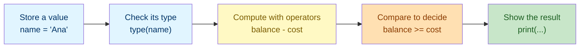

# Lab 1: Variables, Data Types & Operators

Difficulty: Beginner | ~10 min | No prerequisites

## 1. Lab Title

**Variables, Data Types & Operators**

---

## 2. Problem Statement / Use Case Overview

Every Python program — from a simple calculator to a machine-learning pipeline — runs on the same core idea: store a value in a `variable`, understand what `type` of data it is, and use `operators` to compute with it. In this lab you will build a small **personal budget tracker** that stores your name, age, and account balance, then uses arithmetic and comparison operators to check how much is left in the account and whether a purchase fits your budget. By the end you will be comfortable naming variables, inspecting their types with `type()`, and combining numbers and text with operators — the skill you will use in every later lab.

---

## 3. Input Data

None — all values are defined inline in code.

---

## 4. Processing

None — straightforward variable assignment, inspection, arithmetic, and comparison.

---

## 5. Output

Printed results below each code cell.

---

## 6. Tech Stack

This lab uses **only the Python standard library** — no third-party packages are required.

- Python 3.10+ (the interactive environment / interpreter)
- Built-ins used: `print()`, `type()`, `input()` (used only in the optional exercise)

No additional libraries are installed because variables, data types, and operators are core language features.

---

## 7. Underlying Concepts

### Variables

A variable is a **named box** in your program's memory that holds a value. You create one with the equals sign: `name = "Ana"` means "store the text `Ana` in a box called `name`". You can use the box's name anywhere you need the value, and you can put a new value into the same box later (that's called *reassignment*).

### Data Types

Python knows what kind of data a variable holds by its **type**. The four core types in this lab:

- **`str` (string):** a piece of text, written in quotes — `"Ana"`, `"hello"`.
- **`int` (integer):** a whole number with no decimal point — `28`, `-5`.
- **`float` (float):** a number with a decimal point — `500.5`, `3.14`.
- **`bool` (boolean):** a truth value — `True` or `False`.

The built-in **`type()`** function tells you which type a value is. Understanding types matters because operators behave differently on different types: `"2" + "3"` is text joining (`"23"`), while `2 + 3` is arithmetic (`5`).

### Operators

Operators are the symbols that let you do something with values:

- **Arithmetic operators** (numbers): `+` add, `-` subtract, `*` multiply, `/` divide, `//` integer divide, `%` remainder, `**` power.
- **Comparison operators** (compare two values, giving a `bool`): `==` equal, `!=` not equal, `>` greater than, `<` less than, `>=` greater than or equal, `<=` less than or equal.

### How it all connects



You store data first, understand what it is, then use operators to turn it into a decision you can print.

---

## 8. Prerequisites

- **None.** No prior Python experience or prior labs are required for this lab.
- You need a working Python 3.10+ environment (see Section 9).
- Basic comfort with typing commands and running a Jupyter notebook cell is helpful but not required.

---

## 9. Environment / Dependencies Setup

This lab needs only Python 3.10+ and Jupyter. No third-party packages are installed.

**Step 1 — Install Jupyter (optional; needed only if you don't already have it).**

Open a terminal and run:

```bash
python -m pip install --upgrade pip
python -m pip install jupyter
```

**Step 2 — Launch the notebook.**

From inside the `lab1` folder, run:

```bash
jupyter notebook
```

Then open `lab-variables-data-types-operators.ipynb` in the browser window that appears.

**Step 3 — Run the cells.** Click each cell and press `Shift + Enter` to run it, top to bottom.

**Step 4 — Run the tests (optional).** A companion pytest file (`test_variables_data_types_operators.py`) checks these concepts on their own. Run it with:

```bash
python -m pip install pytest
python -m pytest test_variables_data_types_operators.py -v
```

If you prefer to run the code as a plain script instead of a notebook, save the code from Section 10 into a `lab1.py` file and run `python lab1.py`.

---

## 10. Step-wise Development Instructions

Open the notebook and work through each cell below in order. Run the notebook's first cell (the `!pip install` line) once at the start so the kernel is ready, then follow along.

**Cell 1 — Install dependencies (kept for consistency).**

```python
# This lab uses only Python's built-in features, but this cell keeps the
# notebook runnable from a fresh kernel. It installs nothing extra.
!pip install --upgrade pip
```

This first cell satisfies the lab-wide rule that a notebook starts by installing everything it needs. Because this lab needs nothing beyond Python itself, the line only refreshes `pip`.

**Cell 2 — Store your data in variables.**

```python
# A string (str) stores a piece of text, always inside quotes.
student_name = "Ana"
# An integer (int) stores a whole number, no decimal point.
student_age = 28
# A float stores a decimal number.
account_balance = 500.50
# Another integer to represent a purchase price.
laptop_cost = 450

# print() shows a value in the output area below the cell.
print("Hello, my name is " + student_name + " and I am " + str(student_age) + " years old.")
print("I have $" + str(account_balance) + " in my account.")
```

Notice we used `str(student_age)` and `str(account_balance)` — the `str()` function converts a number into text so it can be joined with the strings using `+`. Try running this cell; each `print()` appears on its own line.

**Cell 3 — Inspect the type of each variable.**

```python
# type() tells us what kind of data each variable holds.
# We wrap the result in str() so print() can display it.
print("student_name holds a", type(student_name))
print("student_age holds a", type(student_age))
print("account_balance holds a", type(account_balance))
print("laptop_cost holds a", type(laptop_cost))
```

Run this to confirm each variable holds the type you expect — a `str`, an `int`, a `float`, and an `int`.

**Cell 4 — Calculate with arithmetic operators.**

```python
# Subtract the cost from the balance to see what remains after a purchase.
remaining_balance = account_balance - laptop_cost

# Multiply to estimate a weekly budget (age * 10 is a made-up example).
estimated_weekly_budget = student_age * 10

# Print both results, converted to strings for display.
print("After the purchase I will have $" + str(remaining_balance) + " left.")
print("Your estimated weekly budget is $" + str(estimated_weekly_budget) + ".")
```

Here `-` and `*` are arithmetic operators working on numbers. The result is stored in new variables, then shown with `print()`.

**Cell 5 — Decide with comparison operators.**

```python
# Compare two values. A comparison always produces a bool (True or False).
can_afford = account_balance >= laptop_cost
is_exact_match = remaining_balance == 50.50   # are they the same?

print("Can I afford the laptop?", can_afford)
print("Is the remaining balance exactly 50.50?", is_exact_match)
```

`>=`, `==`, and `>` are comparison operators — they return a `bool`. Here we check whether the balance is at least the laptop's cost and whether the leftover matches a specific value.

**Cell 6 — Combine everything into one short report.**

```python
# Build a single message by joining text and converted values with +
report = "Summary: " + student_name + " is " + str(student_age) + " years old. " \
         "Current balance is $" + str(account_balance) + ". " \
         "Buying the laptop leaves $" + str(remaining_balance) + "."

print(report)
```

This ties the lab together: you stored data, computed on it, and produced one readable sentence from the numbers and text.

---

## 11. Optional Exercise

Change the notebook so the program **asks the user for the purchase price instead of using a fixed number**. Replace the hardcoded `laptop_cost = 450` line with `laptop_cost = int(input("How much does the item cost? "))`, then re-run all cells from Cell 4 onward. Verify that when you type a price larger than your balance, the line `Can I afford the laptop?` prints `False`. (Remember to re-run Cell 4 too, since the calculation depends on the new cost.)

---

## 12. What We Learnt

- How to store a value in a variable with `=` and reuse it by name (Section 7, "Variables").
- The four core data types — `str`, `int`, `float`, `bool` — and how `type()` reveals which one you have (Section 7, "Data Types").
- How arithmetic operators (`+`, `-`, `*`, and more) compute with numbers (Section 7, "Operators").
- How comparison operators (`==`, `>=`, `>`) produce `bool` values you can act on (Section 7, "Operators").
- How to convert numbers to text with `str()` so they can be joined into readable output (Section 10, Cells 2 and 6).
