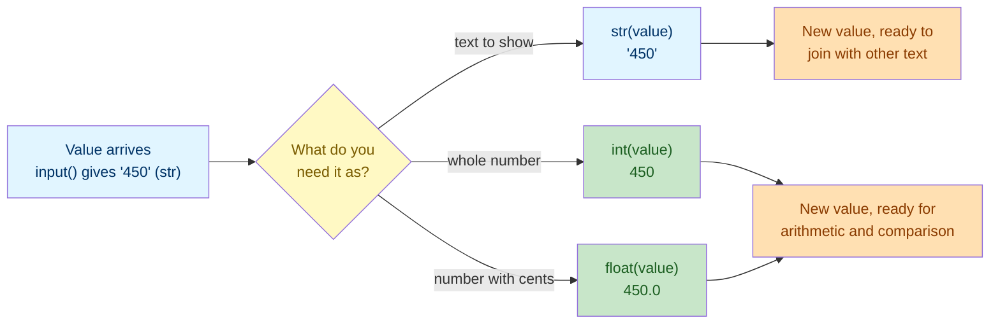
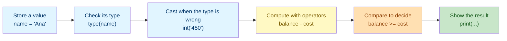

# Lab 1: Variables, Data Types & Operators

Difficulty: Beginner | ~20 min | No prerequisites

## 1. Lab Title

**Variables, Data Types & Operators**

---

## 2. Problem Statement / Use Case Overview

Every Python program — from a simple calculator to a machine-learning pipeline — runs on the same core idea: store a value in a `variable`, understand what `type` of data it is, use `operators` to compute with it, and **cast** between types when the data arrives in the wrong shape. In this lab you will build a small **personal budget tracker** that stores your name, age, and account balance, then uses arithmetic and comparison operators to check how much is left in the account and whether a purchase fits your budget. Along the way you will learn **type casting** — turning a number into text with `str()`, and text back into a number with `int()` and `float()` — which is what makes the final readable report possible. By the end you will be comfortable naming variables, inspecting their types with `type()`, converting between them, and combining numbers and text with operators — the skill you will use in every later lab.

---

## 3. Input Data

None — all values are defined inline in code.

---

## 4. Processing

None — variable assignment, type inspection, type casting, arithmetic, and comparison.

---

## 5. Output

Printed results below each code cell.

---

## 6. Tech Stack

This lab uses **only the Python standard library** — no third-party packages are required.

- Python 3.10+ (the interactive environment / interpreter)
- Built-ins used: `print()`, `type()`, `str()`, `int()`, `float()`, `bool()`, `round()`, and `input()` (used only in the optional exercise)

No additional libraries are installed because variables, data types, and operators are core language features.

---

## 7. Underlying Concepts

### Variables

A variable is a **named box** in your program's memory that holds a value. You create one with the equals sign: `name = "Ana"` means "store the text `Ana` in a box called `name`". You can use the box's name anywhere you need the value, and you can put a new value into the same box later (that's called *reassignment*).

### Data Types

Python knows what kind of data a variable holds by its **type**. The four core types in this lab:

- **`str` (string):** a piece of text, written in quotes — `"Ana"`, `"hello"`.
- **`int` (integer):** a whole number with no decimal point — `28`, `-5`.
- **`float` (float):** a number with a decimal point — `500.5`, `3.14`.
- **`bool` (boolean):** a truth value — `True` or `False`.

The built-in **`type()`** function tells you which type a value is. Understanding types matters because operators behave differently on different types: `"2" + "3"` is text joining (`"23"`), while `2 + 3` is arithmetic (`5`).

### Type Casting

**Casting** is how you tell Python to treat a value as a different type. You
cast by calling the type you want — `str()`, `int()`, `float()` or `bool()` —
and Python hands back a **brand-new value** of that type. The original value is
never modified, so the two can safely live side by side:

```python
student_age = 28
age_as_text = str(student_age)   # age_as_text is "28"; student_age is still 28
```

You need casting for one stubborn reason: **Python will not mix types in
`+`**. Adding two strings joins them; adding two numbers adds them; adding a
string to a number is an error, because Python has no way to guess whether you
meant `"I am " + 28` to mean *text* or *arithmetic*.

| Convert from | Convert to | Function | Example | Result |
|---|---|---|---|---|
| `int` | `str` | `str()` | `str(28)` | `"28"` |
| `float` | `str` | `str()` | `str(500.5)` | `"500.5"` |
| `str` | `int` | `int()` | `int("28")` | `28` |
| `str` | `float` | `float()` | `float("3.14")` | `3.14` |
| `float` | `int` | `int()` | `int(3.9)` | `3` — decimal dropped |
| `int` | `float` | `float()` | `float(10)` | `10.0` |
| any | `bool` | `bool()` | `bool(0)` | `False` |

Four things that catch beginners out, each shown in the notebook:

- **Casting is not rounding.** `int(3.9)` gives `3`, not `4` — it drops the
  decimal part. Use `round(3.9)` when you want the nearest whole number.
- **Casting text is stricter than casting numbers.** `int(3.9)` works, but
  `int("3.9")` raises `ValueError`, because a decimal point is not a whole
  number. Go via `int(float("3.9"))` if you really need to.
- **Empty and zero are falsy.** `bool(0)`, `bool(0.0)` and `bool("")` are all
  `False`; `bool("0")` is `True`, because it is a non-empty string.
- **User input is always text.** `input()` hands back a `str` no matter what was
  typed, so it must be cast before any arithmetic (see the Optional Exercise).



The original value is never touched by any of these arrows — each cast produces
a separate value, so you can keep both the text and the number in your program.

### Operators

Operators are the symbols that let you do something with values:

- **Arithmetic operators** (numbers): `+` add, `-` subtract, `*` multiply, `/` divide, `//` integer divide, `%` remainder, `**` power.
- **Comparison operators** (compare two values, giving a `bool`): `==` equal, `!=` not equal, `>` greater than, `<` less than, `>=` greater than or equal, `<=` less than or equal.

### How it all connects



You store data first, understand what it is, convert it when the type does not
match what you need, then use operators to turn it into a decision you can print.

---

## 8. Prerequisites

- **None.** No prior Python experience or prior labs are required for this lab.
- You need a working Python 3.10+ environment (see Section 9).
- Basic comfort with typing commands and running a Jupyter notebook cell is helpful but not required.

---

## 9. Environment / Dependencies Setup

This lab needs only Python 3.10+ and Jupyter. No third-party packages are installed.

**Step 1 — Install Jupyter (optional; needed only if you don't already have it).**

Open a terminal and run:

```bash
python -m pip install --upgrade pip
python -m pip install jupyter
```

**Step 2 — Launch the notebook.**

From inside the `lab1` folder, run:

```bash
jupyter notebook
```

Then open `lab-variables-data-types-operators.ipynb` in the browser window that appears.

**Step 3 — Run the cells.** Click each cell and press `Shift + Enter` to run it, top to bottom.

**Step 4 — Run the tests (optional).** A companion pytest file (`test_variables_data_types_operators.py`) checks these concepts on their own. Run it with:

```bash
python -m pip install pytest
python -m pytest test_variables_data_types_operators.py -v
```

If you prefer to run the code as a plain script instead of a notebook, save the code from Section 10 into a `lab1.py` file and run `python lab1.py`.

---

## 10. Step-wise Development Instructions

Open the notebook and work through each cell below in order. Run the notebook's first cell (the `!pip install` line) once at the start so the kernel is ready, then follow along.

**Cell 1 — Install dependencies (kept for consistency).**

```python
# This lab uses only Python's built-in features, but this cell keeps the
# notebook runnable from a fresh kernel. It installs nothing extra.
!pip install --upgrade pip
```

This first cell satisfies the lab-wide rule that a notebook starts by installing everything it needs. Because this lab needs nothing beyond Python itself, the line only refreshes `pip`.

**Cell 2 — Store your data in variables.**

```python
# A string (str) stores a piece of text, always inside quotes.
student_name = "Ana"
# An integer (int) stores a whole number, no decimal point.
student_age = 28
# A float stores a decimal number.
account_balance = 500.50
# Another integer to represent a purchase price.
laptop_cost = 450

# print() shows a value in the output area below the cell.
print("Hello, my name is " + student_name + " and I am " + str(student_age) + " years old.")
print("I have $" + str(account_balance) + " in my account.")
```

Notice we used `str(student_age)` and `str(account_balance)` — the `str()` function converts a number into text so it can be joined with the strings using `+`. Try running this cell; each `print()` appears on its own line.

**Cell 3 — Inspect the type of each variable.**

```python
# type() tells us what kind of data each variable holds.
print("student_name holds a", type(student_name))
print("student_age holds a", type(student_age))
print("account_balance holds a", type(account_balance))
print("laptop_cost holds a", type(laptop_cost))
```

Run this to confirm each variable holds the type you expect — a `str`, an `int`, a `float`, and an `int`.

**Cell 4 — Convert values with type casting.**

```python
# Casting means asking Python to treat a value as a different type.
# The cast returns a NEW value - the original variable is unchanged.
age_as_text = str(student_age)          # the int 28 becomes the text "28"
balance_as_text = str(account_balance)  # the float becomes text for printing

print("Age as text:", age_as_text, "-> type", type(age_as_text))
print("Balance as text:", balance_as_text, "-> type", type(balance_as_text))

# Numbers can also be cast into each other. int() drops the decimal part.
whole_number = int(3.9)     # 3.9 becomes 3 - it does NOT round to 4
decimal_number = float(10)  # 10 becomes 10.0 - a float
print("int(3.9) is", whole_number, "and float(10) is", decimal_number)
```

Read the `-> type` part of each line: it proves with `type()` that the new value
really did change type, while `student_age` and `account_balance` keep their
original types. Two details worth pausing on:

- `int(3.9)` gives `3`, not `4`. Casting to `int` **drops** the decimal part; it
  does not round. Use `round(3.9)` when you want the nearest whole number.
- `str(account_balance)` prints `500.5`, not `500.50`. A `float` stores the value
  `500.5` and has no memory of how many zeros you typed. Formatting such as
  `f"{account_balance:.2f}"` is a separate skill, covered in later labs.

**Cell 5 — Cast text into numbers.**

```python
# Anything the user types arrives as text, so cast it before using maths.
quantity = int("3")      # "3" becomes the int 3
unit_price = float("19.99")  # "19.99" becomes the float 19.99
print("3 items at 19.99 each cost:", quantity * unit_price)

# int() only accepts whole numbers written as text, so this would fail:
# print(int("3.9"))   # ValueError - a decimal point is not a whole number

# bool() reads a value as truthy: empty and zero mean False.
print("bool(0):", bool(0), "| bool(''):", bool(""), "| bool('hi'):", bool("hi"))
```

Without the casts, `"3" * "19.99"` would repeat the text three times instead of
multiplying — casting is what turns a label into a number you can calculate with.
The commented-out line is the trap worth remembering: casting the *number* `3.9`
works, but casting the *text* `"3.9"` raises `ValueError`. If you need to do
that, cast twice — `int(float("3.9"))` gives `3`.

**Cell 6 — Cast a price before using it.**

```python
# A price from a form or input() arrives wrapped in quotes, as text.
price_from_form = "450"            # the quotes make this text, not a number
laptop_cost = int(price_from_form)  # cast it once, then treat it as a number

print("Cost as a number:", laptop_cost, "-> type", type(laptop_cost))

# Now the comparison in the next cell works on a real number.
print("Can I still afford it?", account_balance >= laptop_cost)
```

This is the shape of every real casting fix: **cast once, at the moment the
value arrives, then use the plain number everywhere afterwards.** The `laptop_cost`
variable is now an `int` holding `450`, exactly as if you had typed
`laptop_cost = 450`, so the arithmetic and comparison cells that follow need no
changes at all.

**Cell 7 — Calculate with arithmetic operators.**

```python
# Subtract the cost from the balance to see what remains after a purchase.
remaining_balance = account_balance - laptop_cost

# Multiply to estimate a weekly budget (age * 10 is a made-up example).
estimated_weekly_budget = student_age * 10

# Print both results, converted to strings for display.
print("After the purchase I will have $" + str(remaining_balance) + " left.")
print("Your estimated weekly budget is $" + str(estimated_weekly_budget) + ".")
```

Here `-` and `*` are arithmetic operators working on numbers. The result is stored in new variables, then shown with `print()`.

**Cell 8 — Decide with comparison operators.**

```python
# Compare two values. A comparison always produces a bool (True or False).
can_afford = account_balance >= laptop_cost
is_exact_match = remaining_balance == 50.50   # are they the same?

print("Can I afford the laptop?", can_afford)
print("Is the remaining balance exactly 50.50?", is_exact_match)
```

`>=`, `==`, and `>` are comparison operators — they return a `bool`. Here we check whether the balance is at least the laptop's cost and whether the leftover matches a specific value.

**Cell 9 — Combine everything into one short report.**

```python
# Build a single message by joining text and converted values with +
report = "Summary: " + student_name + " is " + str(student_age) + " years old. " \
         "Current balance is $" + str(account_balance) + ". " \
         "Buying the laptop leaves $" + str(remaining_balance) + "."

print(report)
```

This ties the lab together: you stored data, checked its type, cast it when the
type did not match what you needed, computed on it, and produced one readable
sentence from the numbers and text.

---

## 11. Optional Exercise

Change the notebook so the program **asks the user for the purchase price instead of using a fixed number**. Replace the hardcoded `laptop_cost = 450` line with `laptop_cost = int(input("How much does the item cost? "))`, then re-run all cells from Cell 4 onward. Verify that when you type a price larger than your balance, the line `Can I afford the laptop?` prints `False`. (Remember to re-run Cell 4 too, since the calculation depends on the new cost.)

**Extension — cast a price that has cents.** `input()` hands back text, so a
price like `49.99` cannot be used with `int()` — that raises `ValueError`, as
Cell 5 showed. Use `float()` instead:

```python
laptop_cost = float(input("How much does the item cost? "))
```

Re-run the cells and confirm the affordability check still works. Then print the
remaining balance to exactly two decimal places with
`round(account_balance - laptop_cost, 2)`, which casts the result to a `float`
rounded to 2 digits.

---

## 12. What We Learnt

- How to store a value in a variable with `=` and reuse it by name (Section 7, "Variables").
- The four core data types — `str`, `int`, `float`, `bool` — and how `type()` reveals which one you have (Section 7, "Data Types").
- How to **cast** a value into another type with `str()`, `int()`, `float()` and `bool()`, and that the cast returns a new value rather than changing the original (Section 7, "Type Casting").
- Why casting is unavoidable: `+` will not mix a string and a number, and `input()` always returns text (Section 7, "Type Casting").
- How arithmetic operators (`+`, `-`, `*`, and more) compute with numbers (Section 7, "Operators").
- How comparison operators (`==`, `>=`, `>`) produce `bool` values you can act on (Section 7, "Operators").
- How to convert numbers to text with `str()` so they can be joined into readable output (Section 10, Cells 2, 4 and 9).
- The three casting traps to remember: `int(3.9)` truncates instead of rounding, `int("3.9")` raises `ValueError`, and `bool("")` is `False` while `bool("0")` is `True` (Section 10, Cells 4 and 5).
