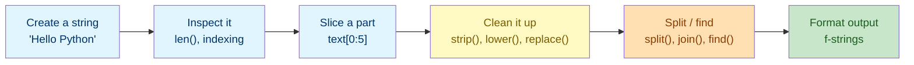

# Lab 2: Strings

Difficulty: Beginner | ~10 min | No prerequisites

## 1. Lab Title

**Strings**

---

## 2. Problem Statement / Use Case Overview

Almost nothing you type into a program arrives tidy. A user's name, a search query, or a scraped review is often full of stray spaces, mixed capitalization, and missing words. In this lab you will practice **working with text** in Python: create strings, inspect single characters with indexing, pull out parts with slicing, and clean up messy input with methods such as `strip()`, `lower()`, `replace()`, and `find()`. You will split text into a list of words and join it back together, then build readable output with **f-strings** — the skills you need before moving on to collections and control flow.

---

## 3. Input Data

This lab takes no specific external input — the text values are defined inline in the code.

---

## 4. Processing

The processing is a small sequence of steps, done with plain Python:

1. **Create** a string and inspect it with `len()` and indexing.
2. **Slice** it to extract substrings.
3. **Clean** it with `strip()`, `lower()`, and `replace()`; locate text with `find()`.
4. **Split** it into words and **join** them back into one string.
5. **Format** the results into readable output with f-strings.

---

## 5. Output

This lab produces no special output beyond the printed results of each code snippet as you run it.

---

## 6. Tech Stack

This lab uses **only the Python standard library** — no third-party packages are required.

- Python 3.10+ (the interactive environment / interpreter)
- Built-ins used: `len()`, `print()`, and the string methods `strip()`, `lower()`, `replace()`, `find()`, `split()`, `join()`

No additional libraries are installed because strings are a core language feature.

---

## 7. Underlying Concepts

### Strings

A **string** (`str`) is a piece of text wrapped in quotes. It is a *sequence*: the characters are ordered, and each one has a position (index) starting at `0`. The built-in `len()` returns how many characters it has.

### Indexing and Slicing

- **Indexing** pulls out a single character by position: `text[0]` is the first character, `text[-1]` is the last (negative indexes count back from the end).
- **Slicing** pulls out a substring: `text[start:end]` includes the character at `start` but stops just *before* `end`. `text[start:]` runs to the end; `text[-n:]` keeps the last `n` characters.

### String Methods

Methods are actions a string performs on itself, called with `text.method()`:

- `strip()` removes whitespace from both ends.
- `lower()` / `upper()` change case; `title()` capitalizes each word.
- `replace(old, new)` swaps every occurrence of `old` for `new`.
- `find(text)` returns the index of the first occurrence, or `-1` if missing.
- `split()` breaks the string into a list at a separator (default: whitespace).
- `join()` merges a list of strings into one, using the separator.

### f-strings

An **f-string** (a string prefixed with `f`) embeds values directly using `{braces}` — far cleaner than joining with `+`. A format spec like `{price:.2f}` rounds a number to two decimal places.

### How it all connects



You start with a string, inspect and slice it, clean it, break it into pieces, and finally build readable output.

---

## 8. Prerequisites

- **None.** No prior Python experience or prior labs are required.
- You need a working Python 3.10+ environment (see Section 9).
- Basic comfort with running a Jupyter notebook cell is helpful but not required.

---

## 9. Environment / Dependencies Setup

This lab needs only Python 3.10+ and Jupyter. No third-party packages are installed.

**Step 1 — Create and activate a virtual environment (optional but recommended).**

Open a terminal and run (Windows):

```bash
python -m venv labenv
labenv\Scripts\activate
```

On macOS/Linux, activation is `source labenv/bin/activate` instead.

**Step 2 — Install Jupyter (optional; needed only if not already installed).**

With the environment active, run:

```bash
python -m pip install --upgrade pip
python -m pip install jupyter
```

**Step 3 — Launch the notebook.**

From inside the `lab2` folder, run:

```bash
jupyter notebook
```

Then open `lab-strings.ipynb` in the browser. Make sure the notebook kernel is the one from `labenv`.

**Step 4 — Run the cells.** Click each cell and press `Shift + Enter` to run it, top to bottom. The notebook's first cell (the `!pip install` line) installs nothing extra and should print "Requirement already satisfied".

**Step 5 — Run the tests (optional).** A companion pytest file (`test_strings.py`) checks these concepts on their own. Run it with:

```bash
python -m pip install pytest
python -m pytest test_strings.py -v
```

If you prefer a plain script, save the code from Section 10 into `lab2.py` and run `python lab2.py`.

---

## 10. Step-wise Development Instructions

Open the notebook and work through each cell below in order.

**Cell 1 — Install dependencies (kept for consistency).**

```python
# This lab uses only Python's built-in features, but this cell keeps the
# notebook runnable from a fresh kernel. It installs nothing extra.
!pip install --upgrade pip
```

This first cell satisfies the lab-wide rule that a notebook starts by installing everything it needs. Because this lab needs nothing beyond Python itself, the line only refreshes `pip`.

**Cell 2 — Create a string, measure it, and inspect characters.**

```python
# A str stores text inside quotes. This is a clean example.
clean_message = "Hello Python"
# This one has extra spaces at the start and end, like copied text.
messy_message = "   Hello   Python   "

# len() returns the number of characters in a string.
print("Length of clean_message:", len(clean_message))
# Indexing: the first character is at position 0.
print("First character:", clean_message[0])
# Negative indexing counts back from the end, starting at -1.
print("Last character:", clean_message[-1])
```

This prepares two strings: one clean and one messy (to use with `strip()` later). `len()` counts characters, and indexing pulls out single characters — `[0]` is the first, `[-1]` the last.

**Cell 3 — Slice a string to grab a part of it.**

```python
# Slice [0:5] grabs the substring from position 0 up to (not including) 5.
first_five = clean_message[0:5]
print("Slice [0:5] ->", first_five)

# [5:] means "from position 5 until the very end".
from_sixth_char = clean_message[5:]
print("Slice [5:] ->", from_sixth_char)

# [-3:] keeps the last 3 characters of the string.
print("Slice [-3:] ->", clean_message[-3:])
```

Slicing uses `[start:end]`. `[0:5]` gives `"Hello"`, `[5:]` gives the rest, and `[-3:]` gives the last three characters. Note that `[5:]` begins with a space.

**Cell 4 — Clean text with string methods.**

```python
# 1. strip() removes extra whitespace from both ends of a string.
cleaned = messy_message.strip()
print("After strip(): ", cleaned)

# 2. lower() converts every character to lowercase.
normalized = cleaned.lower()
print("After lower(): ", normalized)

# 3. replace() swaps every occurrence of one text for another.
replaced = normalized.replace("hello", "hi")
print("After replace(): ", replaced)

# 4. find() gives the index where a substring first appears, or -1 if missing.
word_position = cleaned.find("Hello")
print("Index of 'Hello':", word_position)
```

`strip()` clears the outer spaces (`"Hello   Python"`). `lower()` makes all text lowercase. `replace()` swaps `"hello"` for `"hi"`. `find()` reports that `"Hello"` sits at index `0`.

**Cell 5 — Split text into words and join it back.**

```python
# split() with no argument splits on any whitespace and drops empty parts.
word_list = cleaned.split()
print("Split into words:", word_list)

# join() glues a list back into a single string, using the separator in front.
rejoined = ", ".join(word_list)
print("Rejoined:", rejoined)
```

`split()` turns `"Hello   Python"` into the list `["Hello", "Python"]`. `join()` reverses it: joining with `", "` produces `"Hello, Python"`.

**Cell 6 — Format readable output with f-strings.**

```python
# f-strings insert the values of variables directly into the text.
student_name = "Ana"
numeric_score = 92
print(f"{student_name} scored {numeric_score} on the quiz.")

# The {value:.2f} specifier rounds a number to two decimal places.
price = 19.5
print(f"The item costs ${price:.2f}.")
```

The `f` before the quote lets you put `{student_name}` and `{numeric_score}` directly into the text. `{price:.2f}` rounds `19.5` to `19.50`, ideal for displaying money.

---

## 11. Optional Exercise

Use the **`title()`** method to turn `"hello, data course"` into title case (`"Hello, Data Course"`), then print it with an f-string. Next, use slicing to remove the first word of `cleaned`: save `cleaned[:cleaned.find(" ")]` into `first_word`, save `cleaned[cleaned.find(" ") + 1:]` into `rest_of_message`, and print both. Run the new cell to confirm each line prints as expected.

---

## 12. What We Learnt

- How to create a string and measure it with `len()` (Section 7, "Strings").
- How to access single characters with positive indexing (`[0]`) and negative indexing (`[-1]`).
- How to slice a substring with `[start:end]`, including open-ended slices like `[5:]` and `[-3:]`.
- How to clean text with `strip()`, `lower()`, `replace()`, and `find()`.
- How to split text into a list with `split()` and merge it back with `join()`.
- How to build readable output with f-strings and format numbers with `:.2f`.