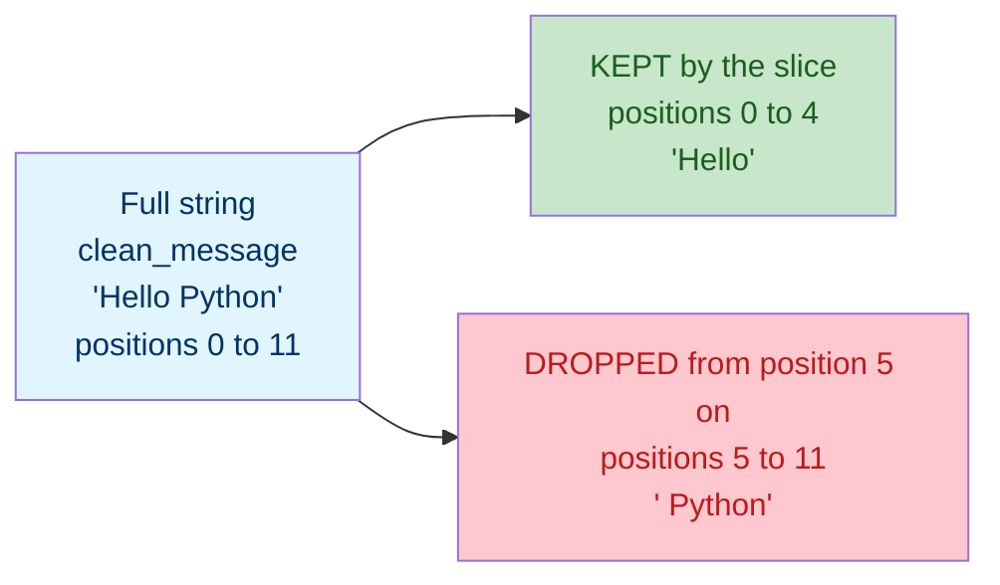
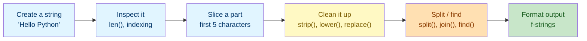

# Lab 2: Strings

Difficulty: Beginner | ~10 min | No prerequisites

## 1. Lab Title

**Strings**

---

## 2. Problem Statement / Use Case Overview

Almost nothing you type into a program arrives tidy. A user's name, a search query, or a scraped review is often full of stray spaces, mixed capitalization, and missing words. In this lab you will practice **working with text** in Python: create strings, inspect single characters with indexing, pull out parts with slicing, and clean up messy input with methods such as `strip()`, `lower()`, `replace()`, and `find()`. You will split text into a list of words and join it back together, then build readable output with **f-strings** — the skills you need before moving on to collections and control flow.

---

## 3. Input Data

None — all text values are defined inline in code.

---

## 4. Processing

None — string creation, slicing, cleaning, splitting, joining, and formatting.

---

## 5. Output

Printed results below each code cell.

---

## 6. Tech Stack

This lab uses **only the Python standard library** — no third-party packages are required.

- Python 3.10+ (the interactive environment / interpreter)
- Built-ins used: `len()`, `print()`, and the string methods `strip()`, `lower()`, `replace()`, `find()`, `split()`, `join()`

No additional libraries are installed because strings are a core language feature.

---

## 7. Underlying Concepts

### Strings

A **string** (`str`) is a piece of text wrapped in quotes. It is a *sequence*: the characters are ordered, and each one has a position (index) starting at `0`. The built-in `len()` returns how many characters it has.

### Indexing and Slicing

**Indexing** pulls out a **single** character by position:

- `text[0]` — the character at position `0`, the very first one.
- `text[-1]` — the character at position `-1`, the very last one. Negative indexes count *backwards* from the end: `-1` is the last character, `-2` is the one before it, and so on.

> **Note — positions start at `0`, never at `1`.** Python counts the first character as position `0`, the second as `1`, the third as `2`, and so on, so nothing is ever at position `1`-for-the-first-character. This is *zero-based indexing*, and it is the single biggest source of off-by-one bugs:
> - `"Hello"` has 5 characters, and they sit at positions `0, 1, 2, 3, 4` — there is no position `5`.
> - Because of that, the `end` you write is always **one past the last position you want to keep**. To keep the first five characters you write `end` as `5` (not `4`), so `text[0:5]` gives five characters, not four.
> - The same rule applies to the *value* you pass: `text[5]` is the sixth character (`" "` in `"Hello Python"`), because the first five characters used up positions `0`–`4`.

**Slicing** pulls out a whole **run** of characters, not just one. The syntax is `text[start:end]`, and three rules explain every slice you will ever write:

- **`start` = where to begin.** It is the first position you **keep**, so it is *included* in the result.
- **`end` = where to stop.** It is the first position you **drop**, so it is *excluded* from the result. The word "end" is misleading — it means "stop *before* this position", not "include this position".
- **Leave either one out and Python fills in a default:** an empty `start` means "from the very beginning" (the same as `0`), and an empty `end` means "carry on to the very end". That is why `text[:5]` and `text[0:5]` are identical, and why `text[5:]` runs all the way to the last character.

Read any slice out loud as **"from `start`, up to but not including `end`"**. The "not including" part is the one beginners miss — it is why `text[0:5]` gives five characters and not six.

Every form used in this lab, shown against the lab's own `clean_message = "Hello Python"` (12 characters, so the positions run from `0` to `11` — the first character is `0`, **not** `1`):

| Slice | Read it as | Positions kept | Result |
|---|---|---|---|
| `text[0]` | one position only | `0` | `"H"` |
| `text[0:5]` | from `0`, up to but **not** including `5` | `0, 1, 2, 3, 4` | `"Hello"` |
| `text[:5]` | from the start, up to but **not** including `5` | `0, 1, 2, 3, 4` | `"Hello"` |
| `text[5:]` | from `5` to the end | `5` … `11` | `" Python"` |
| `text[-3:]` | from 3-from-the-end to the end | `9, 10, 11` | `"hon"` |

Two more things worth knowing:

- **A negative `start` counts from the end, and an omitted `end` still means "to the end".** So `text[-3:]` is the shortest way to say "the last 3 characters": start at the third character from the end, then keep going.
- *(For completeness only: a slice can take a third part for stepping through the string, `text[::2]`, which takes every second character. This lab does not need it.)*

The boundary is easiest to see as a picture. `text[0:5]` splits the one string into two parts — the characters the slice **keeps**, and the characters it **drops** starting at the `end` value:



The green part is everything `text[0:5]` returns. The red part begins at position `5` — the `end` value itself, which is never included. That same red position is the first character of the *next* slice, which is why `text[5:]` returns `" Python"`, with a leading space.

### When a Slice Runs Off the End

Slicing is **forgiving** about positions that do not exist, while single indexing is **strict**. That difference is worth knowing before you write a slice whose bounds come from `find()` or `len()`:

```python
# "hello" has 5 characters, so the real positions are 0 to 4.
greeting = "hello"

# 1. An end past the last character is fine - Python stops at the end.
print(repr(greeting[0:6]))    # 'hello'   (same as greeting[0:])

# 2. Any oversized end behaves the same way.
print(repr(greeting[0:99]))   # 'hello'

# 3. A start past the end keeps nothing at all - an empty string, no error.
print(repr(greeting[6:]))     # ''

# 4. An end BEFORE the start also keeps nothing - the range is empty.
print(repr(greeting[4:2]))    # ''

# 5. A single index has no such grace: position 6 does not exist.
# Uncomment to see the error Python raises.
# print(greeting[6])          # IndexError: string index out of range
```

- **An `end` that is too large is treated as "to the end".** `greeting[0:6]`, `greeting[0:99]` and `greeting[0:]` all return the whole string, so a slice computed with a slightly wrong bound degrades gracefully instead of crashing.
- **A `start` past the end, or an `end` before the `start`, returns `""` — the empty string.** This is a valid result, not a failure. It is the one case to watch for, because an empty result often means the bounds were computed wrongly (`find()` returned `-1`, so you sliced `[:-1]`). Checking `if not result:` catches it.
- **A single index out of range raises `IndexError`.** `greeting[6]` fails loudly, because `greeting[6]` claims "give me the character at position 6" and no such character exists — there is nothing sensible to return instead.
- **The one slicing mistake Python *does* reject is a step of `0`.** `greeting[::0]` raises `ValueError: slice step cannot be zero`, since "take every 0th character" cannot be carried out. It is the only out-of-range-style slicing error you will meet.

The mental model in one line: **a slice always answers — it just may answer with less than you expected — while a single index insists the position exist.**

### String Methods

Methods are actions a string performs on itself, called with `text.method()`:

- `strip()` removes whitespace from both ends.
- `lower()` / `upper()` change case; `title()` capitalizes each word.
- `replace(old, new)` swaps every occurrence of `old` for `new`.
- `find(text)` returns the index of the first occurrence, or `-1` if missing.
- `split()` breaks the string into a list at a separator (default: whitespace).
- `join()` merges a list of strings into one, using the separator.

### f-strings

An **f-string** (a string prefixed with `f`) embeds values directly using `{braces}` — far cleaner than joining with `+`. A format spec like `{price:.2f}` rounds a number to two decimal places.

### How it all connects



You start with a string, inspect and slice it, clean it, break it into pieces, and finally build readable output.

---

## 8. Prerequisites

- **None.** No prior Python experience or prior labs are required.
- You need a working Python 3.10+ environment (see Section 9).
- Basic comfort with running a Jupyter notebook cell is helpful but not required.

---

## 9. Environment / Dependencies Setup

This lab needs only Python 3.10+ and Jupyter. No third-party packages are installed.

**Step 1 — Create and activate a virtual environment (optional but recommended).**

Open a terminal and run (Windows):

```bash
python -m venv labenv
labenv\Scripts\activate
```

On macOS/Linux, activation is `source labenv/bin/activate` instead.

**Step 2 — Install Jupyter (optional; needed only if not already installed).**

With the environment active, run:

```bash
python -m pip install --upgrade pip
python -m pip install jupyter
```

**Step 3 — Launch the notebook.**

From inside the `lab2` folder, run:

```bash
jupyter notebook
```

Then open `lab-strings.ipynb` in the browser. Make sure the notebook kernel is the one from `labenv`.

**Step 4 — Run the cells.** Click each cell and press `Shift + Enter` to run it, top to bottom. The notebook's first cell (the `!pip install` line) installs nothing extra and should print "Requirement already satisfied".

**Step 5 — Run the tests (optional).** A companion pytest file (`test_strings.py`) checks these concepts on their own. Run it with:

```bash
python -m pip install pytest
python -m pytest test_strings.py -v
```

If you prefer a plain script, save the code from Section 10 into `lab2.py` and run `python lab2.py`.

---

## 10. Step-wise Development Instructions

Open the notebook and work through each cell below in order.

**Cell 1 — Install dependencies (kept for consistency).**

```python
# This lab uses only Python's built-in features, but this cell keeps the
# notebook runnable from a fresh kernel. It installs nothing extra.
!pip install --upgrade pip
```

This first cell satisfies the lab-wide rule that a notebook starts by installing everything it needs. Because this lab needs nothing beyond Python itself, the line only refreshes `pip`.

**Cell 2 — Create a string, measure it, and inspect characters.**

```python
# A str stores text inside quotes. This is a clean example.
clean_message = "Hello Python"
# This one has extra spaces at the start and end, like copied text.
messy_message = "   Hello   Python   "

# len() returns the number of characters in a string.
print("Length of clean_message:", len(clean_message))
# Indexing: the first character is at position 0.
print("First character:", clean_message[0])
# Negative indexing counts back from the end, starting at -1.
print("Last character:", clean_message[-1])
```

This prepares two strings: one clean and one messy (to use with `strip()` later). `len()` counts characters, and indexing pulls out single characters — `[0]` is the first, `[-1]` the last.

**Cell 3 — Slice a string to grab a part of it.**

```python
# Slice [0:5] grabs the substring from position 0 up to (not including) 5.
first_five = clean_message[0:5]
print("Slice [0:5] ->", first_five)

# [5:] means "from position 5 until the very end".
from_sixth_char = clean_message[5:]
print("Slice [5:] ->", from_sixth_char)

# [-3:] keeps the last 3 characters of the string.
print("Slice [-3:] ->", clean_message[-3:])
```

All three slices above use the same two-part template, `text[start:end]`, so it helps to read each one piece by piece:

- **`clean_message[0:5]`** — `start` is `0`, so begin at the very first character; `end` is `5`, so stop *before* position `5`. Positions `0`–`4` are kept, which is the five characters of `"Hello"`. Position `5` (the space) is left out.
- **`clean_message[5:]`** — `start` is `5` and `end` is **missing**, and a missing `end` means "go all the way to the end of the string". Position `5` is the space right after `"Hello"`, which is why the result is `" Python"` with a leading space.
- **`clean_message[-3:]`** — `start` is `-3`, so count backwards from the end: `-1` is `"n"`, `-2` is `"o"`, `-3` is `"h"`. With no `end` it runs to the end, giving the last three characters, `"hon"`.

Notice how the three slices chain together: `[0:5]` stops just before position `5`, and `[5:]` starts exactly at position `5` — so together they rebuild the whole string with no character lost or repeated. That "stop before" / "start at" pairing is the whole trick to slicing.

**Cell 4 — See what happens when a slice runs off the end.**

```python
# "hello" has 5 characters, so the real positions are 0 to 4.
greeting = "hello"

# 1. An end past the last character is fine - Python stops at the end.
print(repr(greeting[0:6]))    # 'hello'   (same as greeting[0:])

# 2. Any oversized end behaves the same way.
print(repr(greeting[0:99]))   # 'hello'

# 3. A start past the end keeps nothing at all - an empty string, no error.
print(repr(greeting[6:]))     # ''

# 4. An end BEFORE the start also keeps nothing - the range is empty.
print(repr(greeting[4:2]))    # ''

# 5. A single index has no such grace: position 6 does not exist.
# Uncomment to see the error Python raises.
# print(greeting[6])          # IndexError: string index out of range
```

`repr()` is used here so an empty result is visible: plain `print("")` shows a blank line, while `repr("")` shows `''` and tells you exactly what came back. The first four lines all succeed, because a slice must always return *something* — an `end` past the end just means "to the end", and a range with no characters in it means `""`. Only line 5 fails, and it is left commented out so the cell does not stop with a traceback: a single index claims a specific position, so if that position does not exist Python raises `IndexError` rather than guessing.

**Cell 5 — Clean text with string methods.**

```python
# 1. strip() removes extra whitespace from both ends of a string.
cleaned = messy_message.strip()
print("After strip(): ", cleaned)

# 2. lower() converts every character to lowercase.
normalized = cleaned.lower()
print("After lower(): ", normalized)

# 3. replace() swaps every occurrence of one text for another.
replaced = normalized.replace("hello", "hi")
print("After replace(): ", replaced)

# 4. find() gives the index where a substring first appears, or -1 if missing.
word_position = cleaned.find("Hello")
print("Index of 'Hello':", word_position)
```

`strip()` clears the outer spaces (`"Hello   Python"`). `lower()` makes all text lowercase. `replace()` swaps `"hello"` for `"hi"`. `find()` reports that `"Hello"` sits at index `0`.

**Cell 6 — Split text into words and join it back.**

```python
# split() with no argument splits on any whitespace and drops empty parts.
word_list = cleaned.split()
print("Split into words:", word_list)

# join() glues a list back into a single string, using the separator in front.
rejoined = ", ".join(word_list)
print("Rejoined:", rejoined)
```

`split()` turns `"Hello   Python"` into the list `["Hello", "Python"]`. `join()` reverses it: joining with `", "` produces `"Hello, Python"`.

**Cell 7 — Format readable output with f-strings.**

```python
# f-strings insert the values of variables directly into the text.
student_name = "Ana"
numeric_score = 92
print(f"{student_name} scored {numeric_score} on the quiz.")

# The {value:.2f} specifier rounds a number to two decimal places.
price = 19.5
print(f"The item costs ${price:.2f}.")
```

The `f` before the quote lets you put `{student_name}` and `{numeric_score}` directly into the text. `{price:.2f}` rounds `19.5` to `19.50`, ideal for displaying money.

---

## 11. Optional Exercise

Use the **`title()`** method to turn `"hello, data course"` into title case (`"Hello, Data Course"`), then print it with an f-string. Next, use slicing to remove the first word of `cleaned`: save `cleaned[:cleaned.find(" ")]` into `first_word`, save `cleaned[cleaned.find(" ") + 1:]` into `rest_of_message`, and print both. Here `find()` supplies the **`end`** value dynamically — `[:that_index]` stops just before the first space (the first word), and `[that_index + 1:]` starts just after it (the rest of the message). Run the new cell to confirm each line prints as expected.

---

## 12. What We Learnt

- How to create a string and measure it with `len()` (Section 7, "Strings").
- How to access single characters with positive indexing (`[0]`) and negative indexing (`[-1]`).
- How to slice a substring with `[start:end]`: `start` is the first character **kept**, `end` is the first character **dropped** (Section 7, "Indexing and Slicing").
- How to leave out `start` (`text[:5]` = first five characters) or leave out `end` (`text[5:]` = everything from position 5 on, `text[-3:]` = last three characters).
- How slicing handles out-of-range bounds: an oversized `end` returns the rest of the string and an impossible range returns `""`, while a single out-of-range index raises `IndexError` (Section 7, "When a Slice Runs Off the End").
- How to clean text with `strip()`, `lower()`, `replace()`, and `find()`.
- How to split text into a list with `split()` and merge it back with `join()`.
- How to build readable output with f-strings and format numbers with `:.2f`.