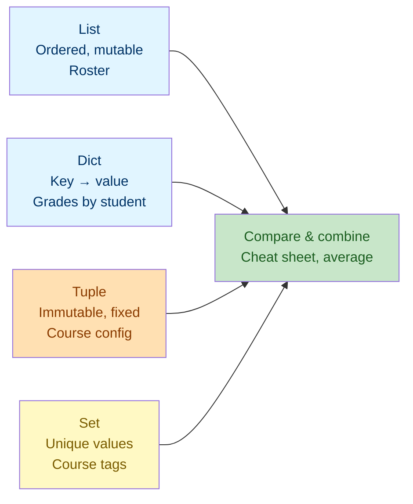

# Lab 3: Collections — Lists, Dictionaries, Tuples & Sets

Difficulty: Intermediate | ~45 min | Requires Lab 1

## 1. Lab Title

**Collections — Lists, Dictionaries, Tuples & Sets**

---

## 2. Problem Statement / Use Case Overview

Real programs rarely store a single value — they store *many*, and the shape of that collection matters. A class roster grows as students enroll; grades are best looked up by a student's name; a course's fixed settings must not be accidentally changed; and you often need to know whether an item exists at all. In this lab you will build a small **classroom gradebook** using Python's four core collection types — the ordered, mutable **list**; the key-value **dictionary**; the immutable **tuple**; and the unique-value **set** — You will work through what each type actually lets you *do* (adding, removing, reordering, searching, merging, slicing and set algebra), nest them inside one another for tables and structured records, and finish with a side-by-side view of when to reach for each structure.

---

## 3. Input Data

None — all sample collections are defined inline in code.

---

## 4. Processing

None — collection creation, per-type operations (add, remove, reorder, merge, set algebra), nesting, slicing, iteration, and comparison.

---

## 5. Output

Printed results below each code cell. Every cell in Section 10 lists the exact
line it prints, so you can check your own output as you go rather than waiting
for the end. The two cheat-sheet cells (Cells 23 and 24) print the same
comparison tables shown in Section 7, which keeps the prose and the output from
drifting apart.

---

## 6. Tech Stack

This lab uses **only the Python standard library** — no third-party packages are required.

- Python 3.10+ (the interactive environment / interpreter)
- Built-ins used: `len()`, `sum()`, `min()`, `max()`, `sorted()`, `list()`, `dict()`, `set()`, `print()`, and collection literals (`[]`, `{}`, `()`)

No additional libraries are installed because collections are a core language feature.

---

## 7. Underlying Concepts

### Four Core Collection Types

- **List** (`[...]`): an *ordered* sequence of items that you can add to, change, or remove from. Best for data whose position matters and that changes over time, like a roster.
- **Dictionary** (`{key: value, ...}`): maps keys to values for fast lookup by name. Best when data is naturally "field = value", like a grade keyed by a student.
- **Tuple** (`(..., ...)`): an *ordered* collection that is *immutable* — it cannot be changed after creation. Best for fixed records, like a course's configuration.
- **Set** (`{...}`): stores only *unique* values and answers membership questions very fast. Best when you care what exists, not how many times or in what order.

### Key Differences

- **Ordered vs unordered:** lists and tuples preserve insertion order; dicts (in Python 3.7+) and sets mostly do too, but sets offer no indexing.
- **Mutable vs immutable:** lists, dicts, and sets change in place; tuples cannot.
- **Duplicates:** lists, tuples, and dicts allow duplicates; sets drop them.
- **Lookup style:** lists and tuples use *position*; dicts use *keys*; sets use membership (`in`).

### Slicing a Sequence

Lists and tuples slice with the *same* `[start:end]` rule as strings (see [Lab 2, Section 7](../Lab2/lab-strings.md)): **`start` is the first item kept, `end` is the first item dropped.** Positions, not names — for `scores = [88, 92, 79, 93, 85]`:

> **Note — positions start at `0`, never at `1`.** The first item is at position `0`, so a 4-item list uses positions `0, 1, 2, 3` and there is no position `4`. The `end` you write is therefore always **one past the last position you want to keep** — to take the first two items you write `end` as `2`, not `1`.

- `scores[1:3]` keeps positions 1 and 2 — `[92, 79]`.
- `scores[:2]` means the same as `scores[0:2]` — the first two items, `[88, 92]`.
- `scores[2:]` has no `end`, so it runs to the end of the list — `[79, 93, 85]`.
- `scores[-2:]` starts 2 from the end, so it gives the last two items — `[93, 85]`.

One difference from strings: slicing a list returns a **new list** containing copies of those items — it does not cut the original, and the original is unchanged.

Sequences are also forgiving in the same way strings are (see [Lab 2, Section 7](../Lab2/lab-strings.md)):

- An `end` past the last position simply returns the rest — `scores[1:99]` gives `[92, 79, 93, 85]`, not an error.
- A `start` past the end, or an `end` before the `start`, gives an **empty list** — `scores[9:]` and `scores[3:1]` both give `[]`. An empty result usually means the bounds were computed wrongly, so check for it when a count matters.
- A single index out of range is the strict case — `scores[9]` raises `IndexError: list index out of range`.

### What Each Structure Can Do

The four types differ as much in *what they let you do* as in what they hold. Read each row as a capability list — anything missing is an operation that structure refuses on purpose:

| Purpose | List | Tuple | Dict | Set |
|---|---|---|---|---|
| **Create** | `[...]` | `(...)` | `{key: value}` | `{...}`, `set(items)` |
| **Add** | `append(x)`, `insert(i, x)`, `extend([...])` | ✗ immutable | `d[key] = value` | `add(x)` |
| **Remove** | `remove(x)`, `pop()`, `pop(i)` | ✗ immutable | `del d[key]`, `pop(key)`, `pop(key, default)` | `remove(x)`, `discard(x)`, `pop()` |
| **Read one** | `l[i]`, `l[-1]` | `t[i]`, `t[-1]` | `d[key]`, `d.get(key, default)` | membership only — `x in s` |
| **Slice** | `l[a:b]` | `t[a:b]` | ✗ not position-based | ✗ not ordered |
| **Search** | `in`, `index(x)`, `count(x)` | `in`, `index(x)`, `count(x)` | `key in d` | `in` |
| **Reorder** | `sort()`, `sort(reverse=True)`, `reverse()` | ✗ immutable | ✗ no defined order | ✗ no defined order |
| **Combine** | `+` (concatenation) | `+` (concatenation) | `update({...})`, `{**a, **b}` | `\|` union, `&` intersection, `-` difference, `^` symmetric difference |
| **Size** | `len()` | `len()` | `len()` | `len()` |

- **Lists are the generalists.** They are the only type that can be reordered after creation, and the only one that supports both positional and value-based lookup.
- **Dicts trade position for keys.** Anything position-based — indexing, slicing, `sort()` — is unavailable, and in exchange you get O(1) lookup by name plus clean merging.
- **Sets trade order and indexing for uniqueness.** No `s[0]`, no slicing, no sorting in place, and any output order is arbitrary. In exchange you get the fastest membership test and the set algebra above.
- **Tuples keep only the read-only half.** `count()`, `index()`, `in`, unpacking and slicing all work; every "add", "remove" and "reorder" cell above is empty by design, and that immutability is the feature — a value that cannot change needs no defensive copying.
- **Two ways to nest.** A **dict of dicts** is keyed by name and reached key-then-key (`report_card["Ana"]["math"]`); a **list of dicts** is one record per item and reached index-then-key (`enrolments[0]["name"]`). Both nest as deep as you like, and each level uses the access syntax its own type provides.

### Choosing a Structure

The rule of thumb: a list for ordered sequences that change, a dict for name-based lookups, a tuple for fixed records, and a set for uniqueness and membership. The choice depends on what your data represents and what operations you need — not on personal preference.

### How it all connects



Each structure fits a different need, and you choose the one that matches how your data is used — then iterate over and combine them freely.

---

## 8. Prerequisites

- **Lab 1 (Variables, Data Types & Operators):** you should be comfortable with variables, `print()`, and f-strings.
- No third-party libraries or external accounts required.

---

## 9. Environment / Dependencies Setup

This lab needs only Python 3.10+ and Jupyter. No third-party packages are installed.

**Step 1 — Create and activate a virtual environment (optional but recommended).**

Open a terminal and run (Windows):

```bash
python -m venv labenv
labenv\Scripts\activate
```

On macOS/Linux, activation is `source labenv/bin/activate` instead.

**Step 2 — Install Jupyter (optional; needed only if not already installed).**

With the environment active, run:

```bash
python -m pip install --upgrade pip
python -m pip install jupyter
```

**Step 3 — Launch the notebook.**

From inside the `lab3` folder, run:

```bash
jupyter notebook
```

Then open `lab-collections.ipynb` in the browser. Make sure the notebook kernel is the one from `labenv`.

**Step 4 — Run the cells.** Click each cell and press `Shift + Enter` to run it, top to bottom. The notebook's first cell (the `!pip install` line) installs nothing extra and should print "Requirement already satisfied".

**Step 5 — Run the tests (optional).** A companion pytest file (`test_collections.py`) checks these concepts on their own. Run it with:

```bash
python -m pip install pytest
python -m pytest test_collections.py -v
```

If you prefer a plain script, save the code from Section 10 into `lab3.py` and run `python lab3.py`.

---

## 10. Step-wise Development Instructions

Open the notebook and work through each cell below in order. Every numbered cell
below maps to one notebook cell, so the count here matches the notebook exactly.

The lab is deliberately broken into small steps — one idea per cell — so that
nothing in a cell is more than a few lines long. Each block shows the notebook
cells it comes from, and the explanation sits *above* the code rather than
inside it.

### Cell 1 — Title

The lab title and difficulty. Nothing to run.

### Cell 2 — Setup

A markdown note, not code: it records the interpreter and display settings the
lab assumes. Read it, then move on.

### Cell 3 — Install Dependencies

A single `pip` line. The lab uses only the standard library, so this is a
formality that keeps the setup identical to every other lab in the series.

*Notebook cells: install*

```python
# This lab uses only Python's built-in features, but this cell keeps the
# notebook runnable from a fresh kernel. It installs nothing extra.
!pip install --upgrade pip
```

### Cell 4 — Create a List

Start with the collection the gradebook is really made of: a roster. Declare
`students`, read one item by position, change one item in place with an
assignment, and then append a fifth name.

| Line | What it teaches |
|---|---|
| `students = [...]` | A list literal — order is preserved, items may repeat |
| `students[1]` | Zero-based indexing: position `1` is the *second* item |
| `students[0] = "Adam"` | Lists are mutable, so items can be replaced |
| `students.append("Eve")` | `append()` adds one item to the end |

*Notebook cells: lists, lists-code*

```python
# Start a list of student names, then add one more.
students = ["Ana", "Ben", "Clara"]
students.append("Dina")
print("Roster after append:", students)

# Lists support indexing, just like strings.
print("Second student:", students[1])

# Mutable: overwrite one element in place.
students[0] = "Adam"
print("Roster after update:", students)
```

### Cell 5 — Slicing a List

Lists slice with exactly the same rule as strings, because both are sequences.

| Slice | Result | Why |
|---|---|---|
| `students[:2]` | first two items | start omitted means 0 |
| `students[1:3]` | items 1 and 2 | `end` is *one past* the last item kept |
| `students[2:]` | everything from position 2 | `end` omitted means "to the end" |
| `students[-1:]` | the last item | negative start counts back from the end |

Note that `students[-1]` is the last item but `students[-1:]` is a one-item
*slice* — it returns a list, not a bare string.

*Notebook cells: slicing, slicing-code*

```python
# Lists slice by position, with the same start/end rule as strings.
print("[:2] first two:", students[:2])

# [1:3] keeps positions 1 and 2 - position 3 is the first item dropped.
print("[1:3] middle two:", students[1:3])

# No end value means "to the end of the list".
print("[2:] from position 2:", students[2:])

# A negative start counts from the end, so this is the last item.
print("[-1:] last item:", students[-1:])
```

### Cell 6 — Slicing Edge Cases

Slices are forgiving where indexes are strict. This is the single most common
source of surprise when you are new to Python, so it is worth stating plainly:

| Expression | Result | Explanation |
|---|---|---|
| `students[1:99]` | rest of the list | An oversized `end` is clamped, not an error |
| `students[9:]` | `[]` | An impossible range returns an empty list |
| `students[99]` | `IndexError` | A single index out of range is strict |
| `students[1:2:0]` | `ValueError` | A slice step can never be zero |

*Notebook cells: slicing-edges, slicing-edges-code*

```python
# Slices are forgiving: an oversized end returns the rest, not an error.
print("[1:99] oversized end:", students[1:99])

# An impossible range returns an empty list, not an error.
print("[9:] impossible range:", students[9:])

# A single index out of range is strict (uncomment to see the error).
# print(students[99])      # IndexError: list index out of range
```

### Cell 7 — List: Add Items

| Call | Effect | Watch out for |
|---|---|---|
| `insert(i, x)` | Puts `x` at position `i`, pushing later items along | Later positions all shift |
| `extend([a, b])` | Adds each item of the argument to the list | `append([a, b])` would nest a list inside a list — a very common bug |
| `append(x)` | Adds exactly one item to the end | — |

*Notebook cells: listadd, listadd-code*

```python
# Lists are mutable, so they can grow as the class fills up.
roster = ["Ana", "Ben", "Clara", "Dina"]

# insert(1, "Eve") puts Eve at position 1 and pushes the rest along.
roster.insert(1, "Eve")
print("After insert:", roster)

# extend() adds several items at once.
# append() would instead add them as one nested list - a common bug.
roster.extend(["Femi", "Gus"])
print("After extend:", roster)
```

### Cell 8 — List: Remove Items

| Call | Effect | If the value is missing |
|---|---|---|
| `remove(x)` | Deletes the **first** item equal to `x` | Raises `ValueError` |
| `pop()` | Removes and **returns** the last item | `pop()` on an empty list raises `IndexError` |
| `pop(i)` | Removes and returns the item at position `i` | Same as above |

Because `pop()` hands the item back, it is the idiomatic way to take something
*out* of a collection and use it — for example the last student who enrolled.

*Notebook cells: listremove, listremove-code*

```python
# remove("Ben") deletes by value, and raises ValueError if it is missing.
roster.remove("Ben")
print("After remove:", roster)

# pop() takes the last item off the list and hands it back to you.
last_added = roster.pop()
print("After pop:", roster, "| popped:", last_added)
```

### Cell 9 — List: Reorder and Summarise

- `sort()` reorders **in place** and returns `None` — assign the result and you
  get `None`, which is a classic mistake.
- `sort(reverse=True)` sorts the other way round.
- `len()`, `sum()`, `min()` and `max()` work on any collection of numbers and
  return new values without modifying the collection.

*Notebook cells: listsort, listsort-code*

```python
# sort() reorders in place; reverse=True sorts the other way round.
names = ["Dina", "Ana", "Clara", "Ben"]
names.sort()
print("Sorted:", names)
names.sort(reverse=True)
print("Descending:", names)

# len(), sum(), min() and max() work on any collection of numbers.
scores = [88, 92, 79, 93, 85]
print(f"{len(scores)} scores, total {sum(scores)}, lowest {min(scores)}, highest {max(scores)}")
```

### Cell 10 — Nested List: Read a Value

`grade_table` is a list of lists — a table of values, row by row. Each level of
indexing answers one question:

| Expression | Question it answers |
|---|---|
| `grade_table[2]` | Which row? (the third one) |
| `grade_table[2][1]` | Which value in that row? (the second one) |
| `grade_table[1][-1]` | The last value of the second row |

*Notebook cells: nestedlist, nestedlist-code*

```python
# A list can hold other lists - a table of values, row by row.
grade_table = [
    ["Ana", 88, 92],
    ["Ben", 74, 80],
    ["Clara", 91, 95],
]

# Two indexes: first the row, then the position inside that row.
print("Clara's first score:", grade_table[2][1])
print("Second row:", grade_table[1])

# A negative index counts back from the end of the inner list.
print("Ben's second score:", grade_table[1][-1])
```

### Cell 11 — Nested List: Add a Row

- `grade_table.append([...])` adds a whole new row, exactly as `append()` adds a
  single item to a flat list.
- `len(grade_table)` counts the **rows**; `len(grade_table[0])` counts the
  **items in one row**. Same function, different level of nesting.

*Notebook cells: nestedlist-add, nestedlist-add-code*

```python
# append() adds a whole new row, exactly as it adds a single item.
grade_table.append(["Dina", 85, 89])

# len() counts the outer list; len() on a row counts the items in it.
print("Rows:", len(grade_table), "| items in row 1:", len(grade_table[0]))
print("New last row:", grade_table[-1])
```

### Cell 12 — Create a Dictionary

`grades = {"Ana": 88, ...}` maps a key to a value. Keys are unique; values may
repeat. Lookup is by name rather than by position, which is what you want when
the order of a roster is irrelevant but the name is everything.

- `grades["Clara"]` reads a value and raises `KeyError` if the key is absent.
- `grades["Dina"] = 85` adds a new key, or replaces the value if it exists.
- `grades.get("Eve", "none")` returns a default instead of raising — the safe
  way to ask a question you are not sure the answer to.

*Notebook cells: dicts, dicts-code*

```python
# A dict stores key -> value pairs; the key is the student name.
grades = {"Ana": 88, "Ben": 74, "Clara": 91}

# Add a new key, then update an existing value.
grades["Dina"] = 85
grades["Ben"] = 80
print("Grades:", grades)

# Access a value by its key. .get() returns a default instead of crashing.
print("Clara's grade:", grades["Clara"])
print("Eve has no grade:", grades.get("Eve", "none"))
```

### Cell 13 — Dictionary: Look Inside

The three **views** onto the same data. They are live: they update as the dict
changes, and they do not copy anything.

| View | Yields | Typical use |
|---|---|---|
| `report.keys()` | the keys | Check what fields exist |
| `report.values()` | the values | Totals, min/max, membership |
| `report.items()` | `(key, value)` pairs | Loop over both at once |

Wrapping a view in `list()` materialises it so it prints in a stable order —
sets and dicts have no guaranteed order of their own.

The cell starts with `report = dict(grades)`, which makes an independent copy,
so the changes that follow leave the gradebook untouched.

*Notebook cells: dictviews, dictviews-code*

```python
# dict() makes a copy, so these changes leave the gradebook intact.
report = dict(grades)

print("Keys:", list(report.keys()))
print("Values:", list(report.values()))
print("Items:", list(report.items()))
```

### Cell 14 — Dictionary: Remove and Update

| Call | Effect |
|---|---|
| `report.pop("Ben")` | Removes the key **and returns** the value |
| `del report["Dina"]` | Removes the key outright, discarding the value |
| `report.update({...})` | Merges another dict in; repeated keys are overwritten |

`pop()` versus `del` is the same choice as `pop()` versus `remove()` on a list:
use `pop()` when you want the value, `del` when you do not.

*Notebook cells: dictedit, dictedit-code*

```python
report = dict(grades)

# del removes a key outright; .pop() removes it and hands back the value.
removed = report.pop("Ben")
print("After pop:", report, "| Ben had", removed)
del report["Dina"]
print("After del:", report)

# .update() merges another dict in, overwriting the keys it repeats.
report.update({"Ana": 90, "Eve": 77})
print("After update:", report)
```

### Cell 15 — Dictionary: Merge Into a New Dict

`{**course_defaults, **course_overrides}` builds a **new** dict from two others
and leaves both untouched. Where the same key appears in both, the one on the
right wins — so the second argument acts as the override.

This is the non-destructive counterpart to `.update()`, which edits the left
dict in place. Defaults-plus-overrides is the pattern for configuration; it is
worth recognising the moment you see it.

*Notebook cells: dictmerge, dictmerge-code*

```python
course_defaults = {"course": "Intro to Data", "credits": 3}
course_overrides = {"credits": 4, "room": "B2"}

# Later keys win, so credits becomes 4.
course = {**course_defaults, **course_overrides}
print("Merged course:", course)
print("Defaults untouched:", course_defaults)
```

### Cell 16 — Nested Dict: Access and Update

A dict value can itself be a dict, giving a natural two-level structure:
outer key = student, inner key = subject.

- `report_card["Ana"]["math"]` chains two lookups.
- `report_card["Ana"].get("history", "not taken")` puts the default on the
  **inner** dict — the safe place to ask about a subject that may not exist.
- `report_card["Ben"]["math"] = 82` updates that single value and nothing else.
  Python does not need the whole nested structure rebuilt; it walks to the
  value and replaces it.

*Notebook cells: nesteddict, nesteddict-code*

```python
report_card = {
    "Ana": {"math": 95, "science": 88},
    "Ben": {"math": 78, "science": 92},
}

# The outer key gives the student, the inner key gives the subject.
print("Ana's math grade:", report_card["Ana"]["math"])

# .get() on the inner dict returns a default instead of raising KeyError.
print("Ana's history grade:", report_card["Ana"].get("history", "not taken"))

# Assigning to a nested key updates that one value and nothing else.
report_card["Ben"]["math"] = 82
print("Ben's math after update:", report_card["Ben"]["math"])
```

### Cell 17 — Nested: A List of Dict Records

The mirror image of the previous cell: the list index picks the record, the key
picks the field. `enrolments[0]["name"]` is "how many enrolments, and who was
the first?". Choose this shape when the records share the same fields but have
no natural single key, and the dict-of-dicts shape when each record has its own
identifier.

*Notebook cells: listofdicts, listofdicts-code*

```python
enrolments = [
    {"name": "Ana", "course": "Intro to Data"},
    {"name": "Ben", "course": "Statistics"},
]

print("First enrolment:", enrolments[0]["name"], "->", enrolments[0]["course"])
print("Second enrolment:", enrolments[1]["name"], "->", enrolments[1]["course"])
```

### Cell 18 — Tuple: Immutable and Fixed

- A tuple literal uses parentheses: `course_info = ("Intro to Data", 3, 25)`.
- Unpacking `course_name, credit_hours, max_seats = course_info` gives three
  named variables in one line — the main reason to reach for a tuple.
- Tuples reject modification, so they are the right choice for a record that
  must not change: `course_info[0] = "Changed"` raises `TypeError`. The
  commented line in the cell is there to demonstrate exactly that.

*Notebook cells: tuples, tuples-code*

```python
# A (course name, credits, max seats) record that must not change.
course_info = ("Intro to Data", 3, 25)
print("Course info:", course_info)

# Unpack a tuple into three named variables in a single line.
course_name, credit_hours, max_seats = course_info
print(f"{course_name}: {credit_hours} credits, max {max_seats} seats")

# Tuples reject modification (uncomment to see the error).
# course_info[0] = "Changed"
```

### Cell 19 — Tuple: Search and Slice

Immutability blocks every *change*, but the read-only operations all still work:

| Call | Returns |
|---|---|
| `seats.count(25)` | How many times the value appears |
| `seats.index(30)` | Position of the first occurrence |
| `30 in seats` | Whether the value is present at all |
| `seats[:2]` | A **tuple** slice — `(25, 25)` |
| `seats[-1:]` | A one-item **tuple** — `(30,)`, note the trailing comma |

A tuple slice is still a tuple, so a single-item result is written `(30,)`:
the comma is what distinguishes one-item tuples from parenthesised values.

*Notebook cells: tuplessearch, tuplessearch-code*

```python
# count() and index() answer questions about a tuple's contents.
seats = (25, 25, 30)
print("How many 25s:", seats.count(25))
print("First position of 30:", seats.index(30))
print("Is 30 included?", 30 in seats)

# Tuples slice like lists, and the result is still a tuple.
print("First two:", seats[:2], "| last one:", seats[-1:])
```

### Cell 20 — Set: Unique Values and Membership

- Duplicates collapse: `{"data", "python", "data", "stats"}` holds three values.
- `"python" in course_tags` tests membership directly — the fastest way to ask
  "is this allowed?".
- `add()` inserts one value; `discard()` removes quietly even if the value was
  not there. (`remove()` would raise `KeyError` — sets are strict, lists are not.)
- Sets have no order of their own, so wrap them in `sorted()` to print or
  compare results in a predictable order.

*Notebook cells: sets, sets-code*

```python
# Note the repeated "data": a set stores it only once.
course_tags = {"data", "python", "data", "stats"}
print("Unique tags:", course_tags)

# 'in' tests membership directly.
print("Is 'python' offered?", "python" in course_tags)
print("Is 'ml' offered?", "ml" in course_tags)

# add() inserts one value; discard() removes quietly even if it is absent.
course_tags.add("sql")
course_tags.discard("ml")
# sorted() fixes the print order, because a set has no order of its own.
print("Tags now:", sorted(course_tags))
```

### Cell 21 — Set: Compare Two Sets

The four operators answer group questions in a single expression:

| Expression | Question | Result type |
|---|---|---|
| `a \| b` | In either one? (union) | New set |
| `a & b` | In **both**? (intersection) | New set |
| `a - b` | Only in the left one? (difference) | New set |
| `a ^ b` | In one but **not both**? (symmetric difference) | New set |

None of them modify either operand. `set(some_list)` is the one-way conversion
from a list, dropping duplicates as a side effect.

*Notebook cells: setcompare, setcompare-code*

```python
evening_courses = {"python", "sql", "ml"}
core_courses = {"python", "stats"}

print("Either one (union):", sorted(evening_courses | core_courses))
print("In both (intersection):", sorted(evening_courses & core_courses))
print("Only in evening (difference):", sorted(evening_courses - core_courses))
print("In one but not both (symmetric):", sorted(evening_courses ^ core_courses))

# set() turns any list into a set, dropping the duplicates.
print("Unique from a list:", sorted(set([1, 2, 2, 3, 3, 3])))
```

### Cell 22 — Combine Them: Class Average

The iteration pattern you will reuse everywhere: loop over `dict.items()` to get
both halves of each pair, `total += value` to accumulate, and divide by `len()`.

*Notebook cells: iterate, iterate-code*

```python
# .items() gives us (student_name, student_grade) pairs one at a time.
total_points = 0
for student_name, student_grade in grades.items():
    # Accumulate each grade into the running total.
    total_points = total_points + student_grade

# len() works on collections too; the average is total / number of students.
class_average = total_points / len(grades)
print(f"Class average: {class_average:.2f}")
```

### Cell 23 — Quick Cheat Sheet

A one-glance summary of what each type *is*. Each notebook cell printed the same
four lines, so the text here and the printed output cannot drift apart.

*Notebook cells: cheatsheet, cheatsheet-code*

```python
# A dict whose values are the “when to use” rule for each structure.
cheatsheet = {
    "list": "ordered items, can change",
    "dict": "map keys to values",
    "tuple": "fixed, immutable record",
    "set": "unique values, fast membership",
}

# The {name:<6} format spec left-aligns the name in a 6-wide column.
for structure_name, best_use in cheatsheet.items():
    print(f"{structure_name:<6} -> {best_use}")
```

### Cell 24 — Operations Cheat Sheet

The same four types, but now showing what each one actually *lets you do*. This
is the table to come back to when choosing a structure for a new problem.

*Notebook cells: opssheet, opssheet-code*

```python
# The same four structures, this time grouped by the operations they allow.
operations_sheet = {
    "list": "append, insert, extend, remove, pop, sort, index, count, slice",
    "dict": "keys, values, items, get, update, pop, del, merge with {**a, **b}",
    "set": "add, remove, discard, in, union |, intersection &, difference -",
    "tuple": "index, count, in, unpack, slice - but no add or remove",
}

for structure_name, allowed_operations in operations_sheet.items():
    print(f"{structure_name:<6} -> {allowed_operations}")
```

## 11. Optional Exercise

Add two new students to the `grades` dict — `"Omar"` with `73` and `"Lena"` with `96` — then re-run the class-average cell and report the new average. Next, collect every grade into a set with `set(grades.values())` and print the number of **distinct** grade values, which will be smaller than the number of students whenever two share a score.

---

## 12. What We Learnt

- Lists are ordered and mutable — ideal for sequences that grow, such as a roster (Section 7, "List").
- The full list of operations each type allows — and the ones it refuses — in one comparison table (Section 7, "What Each Structure Can Do").
- List mutation: `insert()`/`extend()` to add, `remove()`/`pop()` to take out, in-place `sort()` to reorder, plus the `len()`/`sum()`/`min()`/`max()` built-ins (Section 10, Cells 7–9).
- Slicing a list follows the same `[start:end]` rule as strings, and a slice returns a new list, leaving the original untouched (Section 10, Cells 5 and 6).
- Nesting in both directions: a list of lists for tables, a dict of dicts and a list of dicts for structured records — and reading a nested value takes one index per level (Section 10, Cells 10, 11, 16 and 17).
- Dict operations: `keys()`/`values()`/`items()` views, `del`/`pop()` to remove, `update()` to edit in place, and `{**a, **b}` to merge without touching either (Section 10, Cells 13–15).
- Tuples are immutable fixed records, safely unpackable into variables, and still support `count()`, `index()`, `in` and slicing — a tuple slice is still a tuple (Section 10, Cells 18 and 19).
- Sets store unique values, answer membership questions quickly, and add set algebra: `add()`, `discard()`, union `|`, intersection `&`, difference `-` and symmetric difference `^` (Section 10, Cells 20 and 21).
- Iteration with `.items()`, `len()`, and `sum()` works across all collection types (Section 10, Cell 22).
- Lists and tuples are sequences, so they slice with the same `[start:end]` rule as strings — and a slice gives back a new list, leaving the original untouched (Section 7, "Slicing a Sequence").
- Slicing degrades gracefully when a bound runs off the end (you get less, or an empty list), while an out-of-range single index raises `IndexError` (Section 7, "Slicing a Sequence").
- Choosing a structure is driven by what your data represents and what operations you need — the cheat-sheet dict captures that logic (Section 7, "Choosing a Structure").