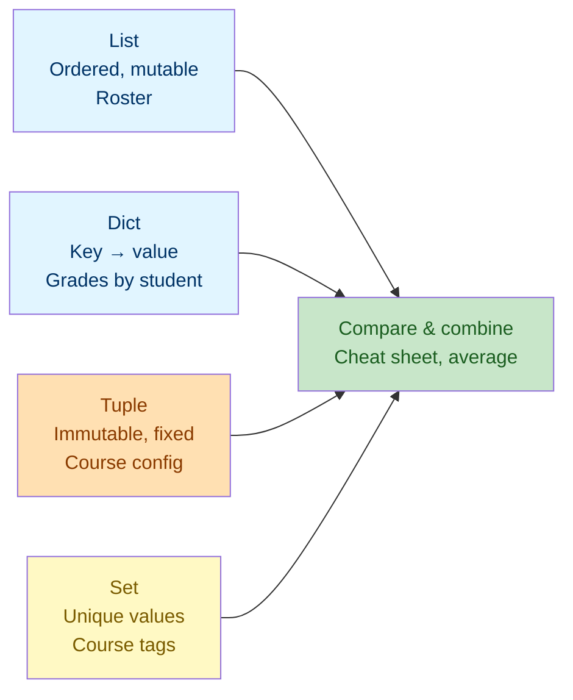

# Lab 3: Collections — Lists, Dictionaries, Tuples & Sets

Difficulty: Intermediate | ~15 min | Requires Lab 1

## 1. Lab Title

**Collections — Lists, Dictionaries, Tuples & Sets**

---

## 2. Problem Statement / Use Case Overview

Real programs rarely store a single value — they store *many*, and the shape of that collection matters. A class roster grows as students enroll; grades are best looked up by a student's name; a course's fixed settings must not be accidentally changed; and you often need to know whether an item exists at all. In this lab you will build a small **classroom gradebook** using Python's four core collection types — the ordered, mutable **list**; the key-value **dictionary**; the immutable **tuple**; and the unique-value **set** — and, through short focused exercises, learn **when to reach for each structure**.

---

## 3. Input Data

None — all sample collections are defined inline in code.

---

## 4. Processing

None — collection creation, access, iteration, and comparison.

---

## 5. Output

Printed results below each code cell.

---

## 6. Tech Stack

This lab uses **only the Python standard library** — no third-party packages are required.

- Python 3.10+ (the interactive environment / interpreter)
- Built-ins used: `len()`, `sum()`, `print()`, and collection literals (`[]`, `{}`, `set()`)

No additional libraries are installed because collections are a core language feature.

---

## 7. Underlying Concepts

### Four Core Collection Types

- **List** (`[...]`): an *ordered* sequence of items that you can add to, change, or remove from. Best for data whose position matters and that changes over time, like a roster.
- **Dictionary** (`{key: value, ...}`): maps keys to values for fast lookup by name. Best when data is naturally "field = value", like a grade keyed by a student.
- **Tuple** (`(..., ...)`): an *ordered* collection that is *immutable* — it cannot be changed after creation. Best for fixed records, like a course's configuration.
- **Set** (`{...}`): stores only *unique* values and answers membership questions very fast. Best when you care what exists, not how many times or in what order.

### Key Differences

- **Ordered vs unordered:** lists and tuples preserve insertion order; dicts (in Python 3.7+) and sets mostly do too, but sets offer no indexing.
- **Mutable vs immutable:** lists, dicts, and sets change in place; tuples cannot.
- **Duplicates:** lists, tuples, and dicts allow duplicates; sets drop them.
- **Lookup style:** lists and tuples use *position*; dicts use *keys*; sets use membership (`in`).

### Choosing a Structure

The rule of thumb: a list for ordered sequences that change, a dict for name-based lookups, a tuple for fixed records, and a set for uniqueness and membership. The choice depends on what your data represents and what operations you need — not on personal preference.

### How it all connects



Each structure fits a different need, and you choose the one that matches how your data is used — then iterate over and combine them freely.

---

## 8. Prerequisites

- **Lab 1 (Variables, Data Types & Operators):** you should be comfortable with variables, `print()`, and f-strings.
- No third-party libraries or external accounts required.

---

## 9. Environment / Dependencies Setup

This lab needs only Python 3.10+ and Jupyter. No third-party packages are installed.

**Step 1 — Create and activate a virtual environment (optional but recommended).**

Open a terminal and run (Windows):

```bash
python -m venv labenv
labenv\Scripts\activate
```

On macOS/Linux, activation is `source labenv/bin/activate` instead.

**Step 2 — Install Jupyter (optional; needed only if not already installed).**

With the environment active, run:

```bash
python -m pip install --upgrade pip
python -m pip install jupyter
```

**Step 3 — Launch the notebook.**

From inside the `lab3` folder, run:

```bash
jupyter notebook
```

Then open `lab-collections.ipynb` in the browser. Make sure the notebook kernel is the one from `labenv`.

**Step 4 — Run the cells.** Click each cell and press `Shift + Enter` to run it, top to bottom. The notebook's first cell (the `!pip install` line) installs nothing extra and should print "Requirement already satisfied".

**Step 5 — Run the tests (optional).** A companion pytest file (`test_collections.py`) checks these concepts on their own. Run it with:

```bash
python -m pip install pytest
python -m pytest test_collections.py -v
```

If you prefer a plain script, save the code from Section 10 into `lab3.py` and run `python lab3.py`.

---

## 10. Step-wise Development Instructions

Open the notebook and work through each cell below in order.

**Cell 1 — Install dependencies (kept for consistency).**

```python
# This lab uses only Python's built-in features, but this cell keeps the
# notebook runnable from a fresh kernel. It installs nothing extra.
!pip install --upgrade pip
```

This first cell satisfies the lab-wide rule that a notebook starts by installing everything it needs. Because this lab needs nothing beyond Python itself, the line only refreshes `pip`.

**Cell 2 — List: ordered and mutable.**

```python
# Start a list of student names, then add one more.
students = ["Ana", "Ben", "Clara"]
students.append("Dina")
print("Roster after append:", students)

# Lists support indexing, just like strings.
print("Second student:", students[1])

# Mutable: overwrite one element in place.
students[0] = "Adam"
print("Roster after update:", students)
```

A list keeps items in order and changes over time: `append()` adds `"Dina"`, indexing by `[1]` reads `"Ben"`, and assignment to `students[0]` replaces `"Ana"` with `"Adam"`.

**Cell 3 — Dictionary: key → value lookups.**

```python
# A dict stores key -> value pairs; the key is the student name.
grades = {"Ana": 88, "Ben": 74, "Clara": 91}

# Add a new key, then update an existing value.
grades["Dina"] = 85
grades["Ben"] = 80
print("Grades:", grades)

# Access a value by its key. .get() returns a default instead of crashing.
print("Clara's grade:", grades["Clara"])
print("Eve has no grade:", grades.get("Eve", "none"))
```

A dict maps each student's name to their grade. `grades["Clara"]` returns `91`, and `grades["Eve"] = 85` adds a key. `.get("Eve", "none")` returns `"none"` rather than raising an error, because `"Eve"` is absent.

**Cell 4 — Tuple: immutable and fixed.**

```python
# A (course name, credits, max seats) record that must not change.
course_info = ("Intro to Data", 3, 25)
print("Course info:", course_info)

# Unpack a tuple into three named variables in a single line.
course_name, credit_hours, max_seats = course_info
print(f"{course_name}: {credit_hours} credits, max {max_seats} seats")

# Tuples reject modification (uncomment to see the error).
# course_info[0] = "Changed"
```

A tuple stores a fixed record. Unpacking assigns all three values in one line. The commented line shows that tuples reject modification — a guarantee that config stays intact.

**Cell 5 — Set: unique values and fast membership.**

```python
# Note the repeated "data": a set stores it only once.
course_tags = {"data", "python", "data", "stats"}
print("Unique tags:", course_tags)

# 'in' tests membership directly.
print("Is 'python' offered?", "python" in course_tags)
print("Is 'ml' offered?", "ml" in course_tags)
```

A set drops the duplicate `"data"`, leaving three unique tags. Membership checks with `in` answer `True`/`False` without scanning a list one item at a time.

**Cell 6 — Combine them: compute a class average.**

```python
# .items() gives us (student_name, student_grade) pairs one at a time.
total_points = 0
for student_name, student_grade in grades.items():
    # Accumulate each grade into the running total.
    total_points = total_points + student_grade

# len() works on collections too; the average is total / number of students.
class_average = total_points / len(grades)
print(f"Class average: {class_average:.2f}")
```

Collections combine nicely. The `for` loop iterates over the dict via `.items()`, summing each grade, then `len(grades)` gives the count so the average works out to `86.00`.

**Cell 7 — Choosing the right structure.**

```python
# A dict whose values are the "when to use" rule for each structure.
cheatsheet = {
    "list": "ordered items, can change",
    "dict": "map keys to values",
    "tuple": "fixed, immutable record",
    "set": "unique values, fast membership",
}

# The {name:<6} format spec left-aligns the name in a 6-wide column.
for structure_name, best_use in cheatsheet.items():
    print(f"{structure_name:<6} -> {best_use}")
```

This dict captures the "when to use" rule for each structure. The `{name:<6}` spec left-aligns the names so the cheat sheet lines up in neat columns.

---

## 11. Optional Exercise

Add two new students to the `grades` dict — `"Omar"` with `73` and `"Lena"` with `96` — then re-run the class-average cell and report the new average. Next, collect every grade into a set with `set(grades.values())` and print the number of **distinct** grade values, which will be smaller than the number of students whenever two share a score.

---

## 12. What We Learnt

- Lists are ordered and mutable — ideal for sequences that grow, such as a roster (Section 7, "List").
- Dictionaries map keys to values for fast name-based lookup, with `get()` for safe access (Section 7, "Dictionary").
- Tuples are immutable fixed records, safely unpackable into variables (Section 7, "Tuple").
- Sets store unique values and answer membership questions quickly (Section 7, "Set").
- Iteration with `.items()`, `len()`, and `sum()` works across all collection types (Section 10, Cell 6).
- Choosing a structure is driven by what your data represents and what operations you need — the cheat-sheet dict captures that logic (Section 7, "Choosing a Structure").