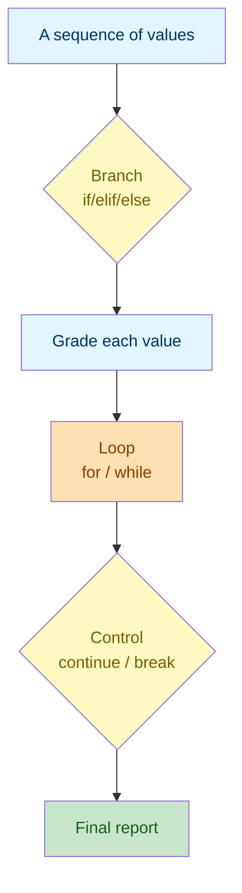

# Lab 4: Control Flow — Conditionals & Loops

Difficulty: Advanced | ~15 min | Requires Labs 1–3

## 1. Lab Title

**Control Flow — Conditionals & Loops**

---

## 2. Problem Statement / Use Case Overview

The real power of a program comes from making decisions and repeating work. A grade-report system must decide each student's letter grade, scan a list for failures, and build a tidy summary — all with logic that runs *conditionally* and *in loops*. In this lab you will assemble that system, learning the **logic backbone** you will reuse for the rest of the course: `if/elif/else` branching, `for` and `while` loops, plus `enumerate()`, `zip()`, and the `break`/`continue` keywords.

---

## 3. Input Data

This lab takes no specific external input — the sample score lists are defined inline in the code.

---

## 4. Processing

The processing is a short sequence of steps, done with plain Python:

1. **Branch** with `if/elif/else` to map a score to a letter grade.
2. **Iterate** with a `for` loop to grade every score.
3. **Pair** values with `enumerate()` and `zip()` to keep index and parallel data aligned.
4. **Control** the loop with `continue` and `break`.
5. **Repeat** with a `while` loop when the iteration count is unknown.
6. **Assemble** a final filtered report.

---

## 5. Output

This lab produces no special output beyond the printed results of each code snippet as you run it.

---

## 6. Tech Stack

This lab uses **only the Python standard library** — no third-party packages are required.

- Python 3.10+ (the interactive environment / interpreter)
- Built-ins used: `print()`, `len()`, `sum()`, built-in iterators `enumerate()` and `zip()`

No additional libraries are installed because control flow is a core language feature.

---

## 7. Underlying Concepts

### Conditional Branching

`if/elif/else` evaluates its branches **top to bottom** and runs the *first* one whose condition is `True`. This is how a program makes decisions: each branch is an alternative outcome, and only one runs. In `final_grade()`, a score of `92` is `>= 90`, so the `if` branch returns `"A"` and the `elif`s are never reached.

### Loops

A **`for` loop** visits every element of a sequence in order — you know how many iterations there are (one per item). A **`while` loop** repeats **as long as its condition is `True`**, which suits situations where the number of iterations isn't known in advance. A `while` loop will run forever unless something in its body eventually makes the condition `False` — always update the variable in the condition.

### Pairing Tools

- **`enumerate()`** yields `(index, value)` pairs, so you don't manage a position counter by hand.
- **`zip()`** pairs two sequences element by element, so parallel lists stay aligned without index arithmetic.

### Loop Control

- **`continue`** skips the rest of the current iteration and moves to the next one.
- **`break`** ends the entire loop immediately.

Together they let a loop skip unwanted items (`continue`) and stop as soon as a goal is reached (`break`).

### Conditional Expressions and Comprehensions

A **conditional expression** (`value_if_true if condition else value_if_false`) is a one-line `if/else` used to pick a value. A **list comprehension** (`[expr for item in seq if condition]`) builds a new list from a filter in a single line. Both are concise ways to express common branching/iteration patterns.

### How it all connects



Control flow is the backbone: branches decide, loops repeat, and `continue`/`break` steer the loop — all feeding a final report.

---

## 8. Prerequisites

- **Labs 1“3:** you should be comfortable with variables, `print()`, f-strings, and the core collection types (lists and dicts are used throughout).
- No third-party libraries or external accounts required.

---

## 9. Environment / Dependencies Setup

This lab needs only Python 3.10+ and Jupyter. No third-party packages are installed.

**Step 1 — Create and activate a virtual environment (optional but recommended).**

Open a terminal and run (Windows):

```bash
python -m venv labenv
labenv\Scripts\activate
```

On macOS/Linux, activation is `source labenv/bin/activate` instead.

**Step 2 — Install Jupyter (optional; needed only if not already installed).**

With the environment active, run:

```bash
python -m pip install --upgrade pip
python -m pip install jupyter
```

**Step 3 — Launch the notebook.**

From inside the `lab4` folder, run:

```bash
jupyter notebook
```

Then open `lab-control-flow.ipynb` in the browser. Make sure the notebook kernel is the one from `labenv`.

**Step 4 — Run the cells.** Click each cell and press `Shift + Enter` to run it, top to bottom. The notebook's first cell (the `!pip install` line) installs nothing extra and should print "Requirement already satisfied".

**Step 5 — Run the tests (optional).** A companion pytest file (`test_control_flow.py`) checks these concepts on their own. Run it with:

```bash
python -m pip install pytest
python -m pytest test_control_flow.py -v
```

If you prefer a plain script, save the code from Section 10 into `lab4.py` and run `python lab4.py`.

---

## 10. Step-wise Development Instructions

Open the notebook and work through each cell below in order.

**Cell 1 — Install dependencies (kept for consistency).**

```python
# This lab uses only Python's built-in features, but this cell keeps the
# notebook runnable from a fresh kernel. It installs nothing extra.
!pip install --upgrade pip
```

This first cell satisfies the lab-wide rule that a notebook starts by installing everything it needs. Because this lab needs nothing beyond Python itself, the line only refreshes `pip`.

**Cell 2 — Branch with if / elif / else.**

```python
def final_grade(score):
    # 90+ is an A; each band drops a letter down to F below 60.
    if score >= 90:
        return "A"
    elif score >= 80:
        return "B"
    elif score >= 70:
        return "C"
    elif score >= 60:
        return "D"
    else:
        return "F"
```

`final_grade()` is a helper extracted because the same decision is reused for every student. The branches evaluate in order: `92` hits `>= 90` first and returns `"A"`; `55` falls through all four `elif`s into `else` and returns `"F"`.

**Cell 3 — Iterate with a for loop.**

```python
quiz_scores = [92, 67, 55, 81, 74]

for score in quiz_scores:
    print(f"{score} -> {final_grade(score)}")
```

A `for` loop visits each score in order and applies the grading logic. This is a one-statement body, so it needs no indentation beyond the `for` line itself.

**Cell 4 — Track position with enumerate().**

```python
student_names = ["Ana", "Ben", "Clara", "Dina", "Eli"]

for position, student_name in enumerate(student_names):
    # Both lists share the same length, so position lines them up.
    print(f"{position}: {student_name} scored {quiz_scores[position]}")
```

`enumerate()` yields `(position, value)` pairs, so we get the index alongside the name without a manual counter.

**Cell 5 — Pair sequences with zip().**

```python
for student_name, score in zip(student_names, quiz_scores):
    # Conditional expression: one-line if/else returning a string.
    status = "PASS" if final_grade(score) != "F" else "FAIL"
    print(f"{student_name}: {score} -> {status}")
```

`zip()` pairs names with scores directly, removing the index arithmetic. The conditional expression assigns `"PASS"` or `"FAIL"` in one line.

**Cell 6 — Control loop flow with break and continue.**

```python
for student_name, score in zip(student_names, quiz_scores):
    # Skip anyone who failed; no message for an F.
    if final_grade(score) == "F":
        continue
    print(f"{student_name} passed with {score}")
    if score >= 90:
        # We found the top scorer; stop scanning the rest.
        print(f"{student_name} is the top scorer — stopping the scan.")
        break
```

`continue` skips failing students (`Clara` at `55`), and `break` stops the whole loop as soon as the top scorer (`Ana`, `92`) is found — so `Ben`, `Dina`, and `Eli` are never processed.

**Cell 7 — Repeat with a while loop.**

```python
queue_index = 0
while queue_index < len(student_names):
    print(f"Processing student at position {queue_index}")
    queue_index += 1   # advance the counter so the loop can end
```

A `while` loop repeats while `queue_index < len(student_names)` is true. `queue_index += 1` advances the counter each pass — without it, the loop would never end.

**Cell 8 — Assemble the final report.**

```python
# List comprehension: keep the name only when the score is 60 or above.
passed_students = [name for name, s in zip(student_names, quiz_scores) if s >= 60]
print("Students who passed:", passed_students)

average_score = sum(quiz_scores) / len(quiz_scores)
print(f"Class average: {average_score:.1f}")

# {name:>5} right-aligns the name in a 5-wide column for a neat table.
for student_name, score in zip(student_names, quiz_scores):
    print(f"{student_name:>5}: {score:>3} -> {final_grade(score)}")
```

This ties it together: a list comprehension filters who passed, `sum()` and `len()` compute the average, and a final loop prints a right-aligned table using f-string alignment specs.

---

## 11. Optional Exercise

Rewrite the **final report cell** to use a `while` loop instead of `for` + `zip`, driving both lists by a `cursor` index variable (starting at `0`). Inside the loop, `continue` past failing students and `break` once you have printed **three** passing students. Confirm the three printed names match the top three of the pass list (`Ana`, `Ben`, `Dina`).

---

## 12. What We Learnt

- `if/elif/else` runs the first branch whose condition is true — the basis of all decision logic (Section 7, "Conditional Branching").
- `for` loops visit every element of a sequence in order (Section 7, "Loops").
- `enumerate()` yields (position, value) pairs and removes manual index bookkeeping.
- `zip()` pairs two sequences element by element for parallel iteration.
- `continue` skips one iteration and `break` ends the loop entirely (Section 7, "Loop Control").
- `while` loops repeat until a condition is false, ideal for unknown iteration counts.
- Combining branching + loops + conditionals is the reusable logic backbone for every later lab.