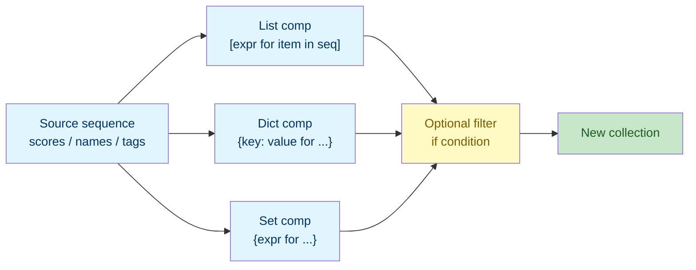

# Lab 5: Comprehensions

Difficulty: Advanced | ~20 min | Requires Labs 1–4

## 1. Lab Title

**Comprehensions**

---

## 2. Problem Statement / Use Case Overview

As your programs grow, the pattern of "loop over a collection, calculate something, collect the results, maybe filter some out" appears constantly. Writing it as a multi-line `for` loop each time is verbose. In this lab you will learn **comprehensions** — one-line expressions that build lists, dictionaries, and sets — including conditional filtering. As the **capstone** for the Basic level, it asks you to combine the collections (Lab 3), loops (Lab 4), and conditionals (Lab 4) you have learned so far into compact, idiomatic code you will use in every later lab.

---

## 3. Input Data

This lab takes no specific external input — all sample collections are defined inline in the code.

---

## 4. Processing

The processing is a short sequence of steps:

1. **Transform** a list with a basic list comprehension.
2. **Filter** with `if` and choose values with a conditional expression.
3. **Build** a dictionary comprehension, typically with `zip()`.
4. **Build** a set comprehension to collect unique values.
5. **Combine** structures and **contrast** a comprehension with its loop equivalent.

---

## 5. Output

This lab produces no special output beyond the printed results of each code snippet as you run it.

---

## 6. Tech Stack

This lab uses **only the Python standard library** — no third-party packages are required.

- Python 3.10+ (the interactive environment / interpreter)
- Built-ins used: `print()`, the iterator `zip()`

No additional libraries are installed because comprehensions are a core language feature.

---

## 7. Underlying Concepts

### What a Comprehension Is

A **comprehension** is a single expression that builds a new collection. It is shorthand for a `for` loop that appends to a list (or inserts into a dict or set). Three kinds exist:

- **List comprehension:** `[expr for item in seq]`
- **Dictionary comprehension:** `{key: value for ...}`
- **Set comprehension:** `{expr for ...}`

### Parts of a Comprehension

Every comprehension has the same structure, read left to right:

1. **Expression** — what to put in the new collection (e.g., `score + 5`).
2. **Iteration** — the `for item in seq` that supplies values.
3. **Optional filter** — an `if condition` at the end that keeps only items where the condition is `True`.

So `[score + 5 for score in scores if score >= 60]` reads: "a value of `score + 5`, for each `score` in `scores`, but only when `score >= 60`."

### Conditional Expressions vs. Filtering

- `[x if cond else y for x in seq]` — a **per-item choice**: every item produces something, but the value depends on `cond`.
- `[x for x in seq if cond]` — a **filter**: items where `cond` is `False` are dropped entirely.

Do not confuse the two: one changes values, the other removes items.

### When a Comprehension Is the Right Tool

Use a comprehension when you are transforming or filtering one sequence into a new collection. They are concise and idiomatic, and they replace the common "start empty, loop, append" pattern. If the logic needs side effects (like `print()` per item) or several statements, a plain loop is clearer.

### How it all connects



A source sequence feeds one of three comprehension kinds, an optional filter narrows it, and a new collection comes out.

---

## 8. Prerequisites

- **Labs 1“4:** comfort with variables, strings, the four collection types (Lab 3), and `for` loops plus `if` conditionals (Lab 4). This lab is the capstone, so it combines all of them.
- No third-party libraries or external accounts required.

---

## 9. Environment / Dependencies Setup

This lab needs only Python 3.10+ and Jupyter. No third-party packages are installed.

**Step 1 — Create and activate a virtual environment (optional but recommended).**

Open a terminal and run (Windows):

```bash
python -m venv labenv
labenv\Scripts\activate
```

On macOS/Linux, activation is `source labenv/bin/activate` instead.

**Step 2 — Install Jupyter (optional; needed only if not already installed).**

With the environment active, run:

```bash
python -m pip install --upgrade pip
python -m pip install jupyter
```

**Step 3 — Launch the notebook.**

From inside the `lab5` folder, run:

```bash
jupyter notebook
```

Then open `lab-comprehensions.ipynb` in the browser. Make sure the notebook kernel is the one from `labenv`.

**Step 4 — Run the cells.** Click each cell and press `Shift + Enter` to run it, top to bottom. The notebook's first cell (the `!pip install` line) installs nothing extra and should print "Requirement already satisfied".

**Step 5 — Run the tests (optional).** A companion pytest file (`test_comprehensions.py`) checks these concepts on their own. Run it with:

```bash
python -m pip install pytest
python -m pytest test_comprehensions.py -v
```

If you prefer a plain script, save the code from Section 10 into `lab5.py` and run `python lab5.py`.

---

## 10. Step-wise Development Instructions

Open the notebook and work through each cell below in order.

**Cell 1 — Install dependencies (kept for consistency).**

```python
# This lab uses only Python's built-in features, but this cell keeps the
# notebook runnable from a fresh kernel. It installs nothing extra.
!pip install --upgrade pip
```

This first cell satisfies the lab-wide rule that a notebook starts by installing everything it needs. Because this lab needs nothing beyond Python itself, the line only refreshes `pip`.

**Cell 2 — List comprehension basics.**

```python
scores = [92, 67, 55, 81, 74]

# Apply an expression to every element, collecting the results.
score_plus_bonus = [score + 5 for score in scores]
print("With bonus:", score_plus_bonus)
```

`[score + 5 for score in scores]` builds a new list where every score has `5` added. Read it as "a list of `score + 5`, for each `score` in `scores`."

**Cell 3 — Conditional filtering.**

```python
# Keep only scores that meet the pass threshold.
passed_scores = [score for score in scores if score >= 60]
print("Passing scores:", passed_scores)

# The same idea with a conditional expression picks PASS/FAIL per item.
status_list = ["PASS" if score >= 60 else "FAIL" for score in scores]
print("Status list:", status_list)
```

The first comprehension **filters**: `if score >= 60` keeps only passing scores. The second uses a **conditional expression** inside the expression slot, so every item stays but its value becomes `"PASS"` or `"FAIL"`. Compare the two — one removes items, the other relabels them.

**Cell 4 — Dictionary comprehension.**

```python
student_names = ["Ana", "Ben", "Clara", "Dina", "Eli"]

# Pair each name with its score to build a gradebook.
grades = {name: score for name, score in zip(student_names, scores)}
print("Gradebook:", grades)
```

`{name: score for name, score in zip(...)}` builds a dict whose keys are names and values are scores. `zip()` pairs each name with its matching score (Lab 4), and the comprehension turns those pairs into a key-value map.

**Cell 5 — Set comprehension.**

```python
all_tags = ["python", "data", "python", "stats", "data"]

# Collect each distinct tag once; duplicates are dropped.
unique_tags = {tag for tag in all_tags}
print("Unique tags:", unique_tags)
```

`{tag for tag in all_tags}` collects each tag once. Because the result is a set, the duplicate `"python"` and `"data"` are collapsed, leaving three unique values. (Set print order is not guaranteed.)

**Cell 6 — Combine structures into a summary.**

```python
# Dict comprehension with a conditional expression, then a filtered list.
grade_map = {name: ("PASS" if score >= 60 else "FAIL") for name, score in zip(student_names, scores)}
print("Results:", grade_map)

passing_names = [name for name, score in zip(student_names, scores) if score >= 60]
print("Passing:", passing_names)
```

These combine everything: a dict comprehension that pairs each name with a `PASS`/`FAIL` value, and a filtered list comprehension that keeps only passing names from the same parallel lists.

**Cell 7 — Comprehension vs. loop.**

```python
# The loop form: initialize, append conditionally, then finish.
passed = []
for score in scores:
    if score >= 60:
        passed.append(score)
print("Loop result:", passed)

# The same result as a comprehension in one line.
print("Comprehension result:", [score for score in scores if score >= 60])
```

Side by side, the comprehension and the loop produce identical output. The comprehension is shorter, but the loop is what it stands for — recognizing the equivalence lets you trust the concise form.

---

## 11. Optional Exercise

Build a dict comprehension that maps every student name to the **square** of that student's score — e.g. `{"Ana": 92**2, "Ben": 67**2, ...}` — using `zip(student_names, scores)`. Then use a set comprehension to collect the **distinct** values from a `final_grades` dict built as `{name: final_grade_result(name) for name in ...}`, writing `{grade for grade in final_grades.values()}` to print the unique letter grades present.

---

## 12. What We Learnt

- A list comprehension `[expr for item in seq]` builds a list in one line (Section 7, "Parts of a Comprehension").
- Adding `if condition` filters which items are included, distinct from a conditional expression that relabels every item.
- A dict comprehension `{key: value for ...}` builds a lookup table, often with `zip()`.
- A set comprehension `{expr for ...}` collects unique values automatically.
- Conditional expressions and filters inside comprehensions combine collections, loops, and conditionals into one concise expression.
- Every comprehension is shorthand for a `for` loop — the capstone skill tying together Labs 3 and 4.