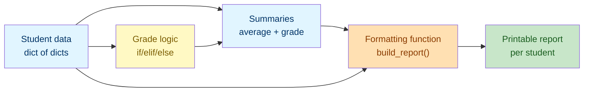

# Lab 6: Mini Project — Student Report Generator

Difficulty: Advanced (Capstone) | ~30 min | Requires Labs 1–5

## 1. Lab Title

**Mini Project — Student Report Generator**

---

## 2. Problem Statement / Use Case Overview

This is the **capstone** mini project for the Basic level. It ties together everything you have learned — variables (Lab 1), strings and f-strings (Lab 2), a dictionary of student data (Lab 3), and conditional grade logic and loops (Lab 4). You will build a small, self-contained program that reads a gradebook and prints a clean, readable **student report** for each learner. It is the kind of tool you might hand to a teacher at the end of a term, and running it end to end exercises every core skill you have built so far.

---

## 3. Input Data

None — all student records are defined inline in code.

---

## 4. Processing

None — data definition, grading, averaging, and report generation.

---

## 5. Output

Printed student reports below each code cell.

---

## 6. Tech Stack

This lab uses **only the Python standard library** — no third-party packages are required.

- Python 3.10+ (the interactive environment / interpreter)
- Built-ins used: `print()`, `sum()`, `len()`, `list()`

No additional libraries are installed — the point of the capstone is that pure Python, plus f-strings and dictionaries, is enough to build a useful tool.

---

## 7. Underlying Concepts

### The Shape of the Data

The gradebook is a **dictionary of dictionaries**: the outer dict maps each name to an inner dict holding that student's record. This nested shape (built in Lab 3) is a natural mainstay of real record-based data — a row per entity, with fields inside.

### Nested Access

To reach a value you chain keys: `student_data["Ana"]["course"]` gets the course for Ana, and `student_data["Ben"]["scores"]` gets that student's list of scores. `info["scores"]` inside a loop over `.items()` is the same idea, one level deeper.

### The Pipeline Pattern

The project follows a pipeline:
1. **Data** defines the input.
2. **Logic** transforms it (grade scores).
3. **Derived data** stores results (the summaries dict).
4. **Rendering** formats data into output (the report string).
5. **Iteration** applies rendering to every record.

Separating these steps keeps the code readable and each piece testable in its own cell — the same structure you will reuse for real scripts.

### Why a Formatting Function

`build_report(name)` is extracted (per the lab rule to minimize helpers) because it is called once per student and it isolates a single, teachable idea: turning one record into a formatted string. It reads the raw record and the computed summary, then returns a multi-line string built with f-strings.

### How it all connects



The gradebook flows through grading logic into summary data, which the formatting function pulls together with the raw record to produce each printable report.

---

## 8. Prerequisites

- **Labs 1“5:** this capstone assumes comfort with variables, strings and f-strings (Labs 1“2), dictionaries (Lab 3), loops and `if/elif/else` (Lab 4), and comprehensions (Lab 5, though not strictly required here).
- No third-party libraries or external accounts required.

---

## 9. Environment / Dependencies Setup

This lab needs only Python 3.10+ and Jupyter. No third-party packages are installed.

**Step 1 — Create and activate a virtual environment (optional but recommended).**

Open a terminal and run (Windows):

```bash
python -m venv labenv
labenv\Scripts\activate
```

On macOS/Linux, activation is `source labenv/bin/activate` instead.

**Step 2 — Install Jupyter (optional; needed only if not already installed).**

With the environment active, run:

```bash
python -m pip install --upgrade pip
python -m pip install jupyter
```

**Step 3 — Launch the notebook.**

From inside the `lab6` folder, run:

```bash
jupyter notebook
```

Then open `lab-student-report-generator.ipynb` in the browser. Make sure the notebook kernel is the one from `labenv`.

**Step 4 — Run the cells.** Click each cell and press `Shift + Enter` to run it, top to bottom. The notebook's first cell (the `!pip install` line) installs nothing extra and should print "Requirement already satisfied".

**Step 5 — Run the tests (optional).** A companion pytest file (`test_student_report_generator.py`) checks these concepts on their own. Run it with:

```bash
python -m pip install pytest
python -m pytest test_student_report_generator.py -v
```

If you prefer a plain script, save the code from Section 10 into `lab6.py` and run `python lab6.py`.

---

## 10. Step-wise Development Instructions

Open the notebook and work through each cell below in order.

**Cell 1 — Install dependencies (kept for consistency).**

```python
# This lab uses only Python's built-in features, but this cell keeps the
# notebook runnable from a fresh kernel. It installs nothing extra.
!pip install --upgrade pip
```

This first cell satisfies the lab-wide rule that a notebook starts by installing everything it needs. Because this lab needs nothing beyond Python itself, the line only refreshes `pip`.

**Cell 2 — Define the student data.**

```python
# A dictionary of student data: name -> (course, scores, attendance).
student_data = {
    "Ana":   {"course": "Data 101", "scores": [92, 88, 95], "attendance": 0.90},
    "Ben":   {"course": "Data 101", "scores": [67, 60, 72], "attendance": 0.85},
    "Clara": {"course": "Stats 210", "scores": [55, 48, 61], "attendance": 0.78},
}

print("Students:", list(student_data.keys()))
```

Here the outer dict maps each name to a nested dict holding `course`, `scores` (a list), and `attendance` (a float). `list(student_data.keys())` prints just the names.

**Cell 3 — Define the grading logic.**

```python
# Turn a numeric average into a letter grade.
def final_grade(average):
    if average >= 90:
        return "A"
    elif average >= 80:
        return "B"
    elif average >= 70:
        return "C"
    elif average >= 60:
        return "D"
    else:
        return "F"
```

This reuses the `if/elif/else` grade logic from Lab 4. It is kept as a function because every student is graded the same way. High scores bcompute to higher letters; anything below 60 is an `F`.

**Cell 4 — Compute each student's summary.**

```python
# Compute each student's average and letter grade.
summaries = {}
for name, info in student_data.items():
    average = sum(info["scores"]) / len(info["scores"])
    summaries[name] = {"average": average, "grade": final_grade(average)}

print(summaries)
```

For each student, `sum()` and `len()` (Lab 3) compute the average from the scores list, and `final_grade()` turns it into a letter. The result is stored in a second dict for later use.

**Cell 5 — Build a formatting function.**

```python
# A formatting function turns one student's summary into a printable report.
def build_report(name):
    info = student_data[name]
    summary = summaries[name]
    lines = [
        f"Student: {name}",
        f"Course:  {info['course']}",
        f"Average: {summary['average']:.1f}  Grade: {summary['grade']}",
        f"Attendance: {info['attendance'] * 100:.0f}%",
    ]
    return "\n".join(lines)

print(build_report("Ana"))
```

`build_report()` reads the raw record and the computed summary, then builds a list of formatted lines with f-strings. `:.1f` rounds the average to one decimal, and `* 100:.0f` turns the attendance ratio into a percentage. `"\n".join(lines)` merges the lines with newlines.

**Cell 6 — Generate and print every report.**

```python
# Print a report for every student in the gradebook.
for name in student_data:
    print(build_report(name))
    print()
```

Iterating the dict yields each student name in turn; `build_report(name)` renders it and `print()` displays it. The extra `print()` adds a blank line between reports so the output stays readable.

---

## 11. Optional Exercise

Add an **honor roll** to the report: after the `Attendance:` line, append the line `Honor Roll` only if the student earned a grade of `A` **and** has attendance of `0.85` or higher. Modify `build_report()` to check `summary["grade"] == "A" and info["attendance"] >= 0.85`, conditionally appending `"Honor Roll"` to `lines`. Then re-run the generate cell and verify that only `Ana` receives the `Honor Roll` line.

---

## 12. What We Learnt

- How to model record-based data as a dict of dicts, with nested access by chaining keys (Section 7, "The Shape of the Data").
- How to use `if/elif/else` logic to map a numeric average to a letter grade (from Lab 4).
- How to loop with `.items()`, iterate a dict's keys, and compute with `sum()` and `len()` (from Lab 3).
- How to extract a formatting function that renders one record as a printable multi-line string.
- How to combine f-strings and formatting specs (`.1f`, `* 100:.0f`) into clean, labeled output.
- How to tie variables, strings, collections, conditionals, and loops into one working mini project — the capstone of the Basic level.