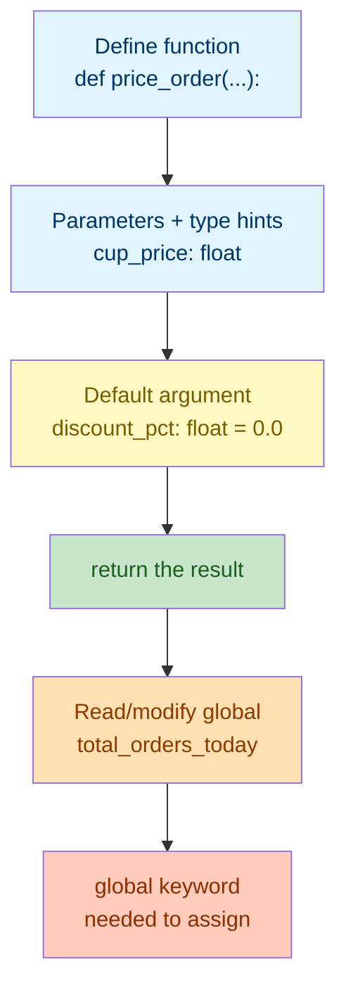

# Lab 1: Functions I & Scope

Difficulty: Beginner | ~20 min | Requires basic Python (variables, operators)

## 1. Lab Title

**Functions I & Scope**

---

## 2. Problem Statement / Use Case Overview

Repeating the same calculation over and over — with slightly different numbers each time — is exactly what functions are for. In this lab you will build a small **coffee shop order calculator**: a set of functions that price a single order, apply a discount, and print a receipt. Along the way you'll learn to define functions with `def`, return values instead of just printing them, add type hints so the function's contract is clear, and use default and keyword arguments so callers only supply what's different. You'll also see the difference between a **local** variable (only visible inside a function) and a **global** one (shared across the whole program), and how the `global` keyword lets a function deliberately change a global variable.

---

## 3. Input Data

This lab takes no specific external input — all sample values are defined inline in the code.

---

## 4. Processing

The processing is a small sequence of steps, done with plain Python functions:

1. **Define** a function with `def` that computes the price of one order and `return`s it.
2. **Add parameters with type hints** so it's clear what the function expects and returns.
3. **Add a default argument** (discount) so most calls don't need to mention it.
4. **Call the function with keyword arguments** for clarity at the call site.
5. **Read** a global variable from inside a function (local vs. global scope).
6. **Modify** a global variable from inside a function using the `global` keyword.

---

## 5. Output

This lab produces no special output beyond the printed results of each code snippet as you run it.

---

## 6. Tech Stack

This lab uses **only the Python standard library** — no third-party packages are required.

- Python 3.10+ (the interactive environment / interpreter)
- Built-ins used: `print()`, `round()`
- Language features: `def`, `return`, type hints, default arguments, keyword arguments, the `global` keyword

No additional libraries are installed because functions and scope are core language features.

---

## 7. Underlying Concepts

### Defining Functions

A function is a named, reusable block of code. You define one with `def function_name(parameters):`, followed by an indented body. Instead of printing a result directly, a function should usually **`return`** it — that hands the value back to whoever called the function, so it can be reused, stored in a variable, or printed later. A function that doesn't `return` anything implicitly returns `None`.

### Parameters, Type Hints, and Return Values

A **parameter** is a named input a function expects (`cup_price` in `def price_order(cup_price):`). A **type hint** — `cup_price: float` — documents what type a parameter *should* be, and `-> float` after the parameters documents the return type. Python does not enforce these at runtime; they exist to make the function's contract readable to humans (and tools like editors) without changing behavior.

### Default and Keyword Arguments

A **default argument** gives a parameter a fallback value used when the caller doesn't supply one: `def price_order(cup_price: float, quantity: int, discount_pct: float = 0.0)` means `discount_pct` is optional. A **keyword argument** is a call where you name the parameter explicitly — `price_order(cup_price=4.5, quantity=2)` — which makes the call self-documenting and lets you skip arguments that have defaults, in any order, as long as you name them.

### Local vs. Global Scope

A variable created **inside** a function (a **local** variable) only exists while that function is running, and disappears when it returns — it is invisible outside the function. A variable created **outside** any function, at the top level of your script, is a **global** variable — visible for reading anywhere, including inside functions. If a function only *reads* a global variable, no special keyword is needed.

### The `global` Keyword

If a function tries to **assign** a new value to a name that's also a global variable, Python assumes you meant a *new local* variable by that name — it will not touch the global one, and reading it beforehand raises an error. The **`global`** keyword tells Python explicitly: "this name refers to the global variable, not a new local one," so an assignment inside the function updates the shared global value instead of shadowing it.

### How it all connects



A function's signature (parameters, hints, defaults) defines its contract; `return` hands back the result; scope rules decide whether the function can see — or change — data outside itself.

---

## 8. Prerequisites

- **Basic Python:** comfort with variables, data types (`str`, `int`, `float`), and operators (see the Variables & Operators lab).
- No third-party libraries or external accounts required.

---

## 9. Environment / Dependencies Setup

This lab needs only Python 3.10+ and Jupyter. No third-party packages are installed.

**Step 1 — Install Jupyter (optional; needed only if you don't already have it).**

Open a terminal and run:

```bash
python -m pip install --upgrade pip
python -m pip install jupyter
```

**Step 2 — Launch the notebook.**

From inside the `Lab1` folder, run:

```bash
jupyter notebook
```

Then open `lab-functions-scope.ipynb` in the browser window that appears.

**Step 3 — Run the cells.** Click each cell and press `Shift + Enter` to run it, top to bottom.

**Step 4 — Run the tests (optional).** A companion pytest file (`test_functions_scope.py`) checks these concepts on their own. Run it with:

```bash
python -m pip install pytest
python -m pytest test_functions_scope.py -v
```

If you prefer to run the code as a plain script instead of a notebook, save the code from Section 10 into a `lab1.py` file and run `python lab1.py`.

---

## 10. Step-wise Development Instructions

Open the notebook and work through each cell below in order.

**Cell 1 — Install dependencies (kept for consistency).**

```python
# This lab uses only Python's built-in features, but this cell keeps the
# notebook runnable from a fresh kernel. It installs nothing extra.
!python -m pip install --upgrade pip
```

This first cell satisfies the lab-wide rule that a notebook starts by installing everything it needs. Because this lab needs nothing beyond Python itself, the line only refreshes `pip`.

**Cell 2 — Define a function with parameters, type hints, and a return value.**

```python
def price_order(cup_price: float, quantity: int) -> float:
    # Multiply price by quantity and hand the result back to the caller.
    total = cup_price * quantity
    return total


# Call it and store the result in a variable, since it returns a value.
order_total = price_order(4.5, 2)
print(f"Price for 2 cup(s) at $4.5: ${order_total}")
```

`price_order` takes two parameters with type hints (`cup_price: float`, `quantity: int`) and declares it returns a `float` (`-> float`). The hints don't change behavior — they document the contract. `return total` hands the value back so we can store it in `order_total` instead of only printing inside the function.

**Cell 3 — Add a default argument for the discount.**

```python
def price_order(cup_price: float, quantity: int, discount_pct: float = 0.0) -> float:
    subtotal = cup_price * quantity
    # Apply the discount only if one was given; 0.0 means "no discount".
    discounted = subtotal * (1 - discount_pct / 100)
    return round(discounted, 2)


# No discount supplied - discount_pct falls back to its default, 0.0.
print(f"Price for 2 cup(s) at $4.5: ${price_order(4.5, 2)}")
```

`discount_pct: float = 0.0` is a default argument: callers who don't care about a discount can omit it entirely, and the function still works. Redefining `price_order` here replaces the Cell 2 version for the rest of the notebook.

**Cell 4 — Call the function with keyword arguments.**

```python
# Keyword arguments name each parameter, making the call self-documenting.
price_a = price_order(cup_price=4.5, quantity=3, discount_pct=10.0)
price_b = price_order(quantity=1, cup_price=5.0, discount_pct=20.0)

print(f"Price for 3 cup(s) at $4.5 with 10.0% off: ${price_a}")
print(f"Price for 1 cup(s) at $5.0 with 20.0% off: ${price_b}")
```

Keyword arguments (`cup_price=4.5`) let you pass values by name instead of position — notice `price_b` supplies `quantity` before `cup_price` and still works correctly, because the names (not the order) tell Python which parameter gets which value.

**Cell 5 — Read a global variable from inside a function.**

```python
# A global variable, defined at the top level (outside any function).
total_orders_today = 0


def describe_orders_so_far() -> str:
    # Reading a global variable from inside a function needs no special keyword.
    return f"Orders logged so far: {total_orders_today}"


print(f"Orders logged so far (before any order): {total_orders_today}")
print(describe_orders_so_far().replace("Orders logged so far: ", "Orders logged so far (via function): "))
```

`describe_orders_so_far()` reads `total_orders_today` even though that variable is defined outside the function — reading a global works automatically because Python looks it up in the enclosing (global) scope when there's no local variable by that name.

**Cell 6 — Modify a global variable with the `global` keyword.**

```python
# global lets this function mutate the shared counter instead of making a local.
def log_order() -> None:
    # Without this, the next line would create a *local* variable instead.
    global total_orders_today
    total_orders_today += 1


log_order()
log_order()
log_order()

print(f"Orders logged so far (after 3 orders): {total_orders_today}")
```

`total_orders_today += 1` is an *assignment*, not just a read — without `global total_orders_today`, Python would treat `total_orders_today` inside the function as a brand-new local variable and raise an error when it tried to read it before assigning. The `global` keyword tells Python to update the shared global variable instead.

**Cell 7 — Combine everything into a receipt function.**

```python
# Combines all previous ideas: default arg, keyword arg, and the global counter.
def print_receipt(cup_price: float, quantity: int, discount_pct: float = 0.0) -> None:
    global total_orders_today  # update the same counter used elsewhere
    total = price_order(cup_price, quantity, discount_pct)  # reuse earlier function
    total_orders_today += 1
    discount_note = f" ({discount_pct}% off)" if discount_pct else ""  # show discount only if > 0
    print(f"Receipt: {quantity} cup(s) x ${cup_price} = ${total}{discount_note} -> total orders today: {total_orders_today}")


# Call with positional, then keyword, then mixed arguments.
print_receipt(4.5, 2)
print_receipt(4.5, 3, discount_pct=10.0)
print_receipt(cup_price=5.0, quantity=1, discount_pct=20.0)
```

`print_receipt` ties everything together: it calls `price_order` (reusing a function), reads and updates the global `total_orders_today` (using `global`), and uses a default argument so the first call can omit the discount entirely.

---

## 11. Optional Exercise

Add a new parameter `tax_pct: float = 8.0` to `price_order`, applied *after* the discount (so the discount reduces the subtotal first, then tax is added on top of the discounted amount). Re-run Cell 7's three `print_receipt` calls and confirm every total is now slightly higher than before, since 8% tax is added by default.

---

## 12. What We Learnt

- How to define a function with `def` and hand back a result with `return` (Section 7, "Defining Functions").
- How type hints (`param: type` and `-> type`) document a function's contract without changing its behavior (Section 7, "Parameters, Type Hints, and Return Values").
- How default arguments make parameters optional, and how keyword arguments make calls self-documenting (Section 7, "Default and Keyword Arguments").
- The difference between a local variable (only visible inside its function) and a global variable (visible everywhere) (Section 7, "Local vs. Global Scope").
- Why assigning to a global variable inside a function requires the `global` keyword, while reading one does not (Section 7, "The `global` Keyword").
