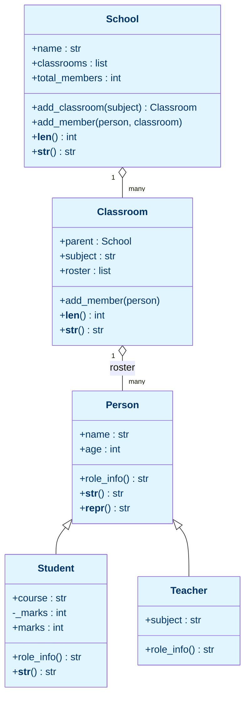

# Lab 10: Mini Project — School Management System

Difficulty: Advanced (Capstone) | ~30 min | Requires Labs 6-9

## 1. Lab Title

**Mini Project — School Management System (Sunrise High)**

---

## 2. Problem Statement / Use Case Overview

This is the **capstone** mini project for the Intermediate level — the single
lab that pulls together every Object-Oriented Programming concept you have
built since Lab 6, and it is the direct heir to the **Basic-level capstone**
(Lab 6, the Student Report Generator).

Where the Basic capstone taught you that variables, dicts, loops, and
conditionals are enough to build a useful tool, this capstone shows that
**classes are enough to model a real organisation**. You will build a small
School Management System for **Sunrise High**, in which:

- `Person` is a base class (superclass) with shared `name` and `age`.
- `Student` and `Teacher` are subclasses that each override the polymorphic
  `role_info()` method.
- `Student` hides its marks behind a private attribute and a validating
  **property** (encapsulation from Lab 8).
- `School` **contains** an inner `Classroom` class (inner classes), each holding
  a roster of `Person` objects.
- A **classmethod** counter tracks the total number of members across all
  classrooms.
- **Dunder methods** (`__len__`, `__str__`, `__repr__`) give friendly behaviour
  to the objects (the capstone for Lab 9).

Running the system end to end — adding people to classes and printing a school
report whose lines all come from `role_info()` and `__str__` — exercises every
pillar of OOP you have learned this level.

---

## 3. Input Data

All data is defined in code (synthetic / simulated state for Sunrise High):

- **People** — created as `Student` and `Teacher` objects:
  - `Student("Ana", 15, "Math", 88)`
  - `Student("Ben", 14, "Math", 72)`
  - `Student("Leo", 16, "Physics", 92)`
  - `Student("Mia", 15, "Physics", 81)`
  - `Teacher("Mr. Bell", 38, "Math")`
  - `Teacher("Ms. Ruiz", 45, "Physics")`
- **Classrooms** — `"Math"` and `"Physics"` subjects, created through the
  `School.add_classroom()` method.

No external files, databases, or APIs are used. Every piece of data lives in
memory inside our objects.

---

## 4. Processing

1. **Define `Person`** — the base class with `__init__`, `role_info()`,
   `__str__`, and `__repr__`.
2. **Define `Student(Person)`** — calls `super().__init__`, stores private
   `_marks`, adds a validated `marks` property, and overrides `role_info()`.
3. **Define `Teacher(Person)`** — stores a `subject` and overrides
   `role_info()`.
4. **Define `School`** — holds a list of classrooms and an inner `Classroom`
   class; `add_classroom()` creates a room, and a `@classmethod` counter tracks
   every member added.
5. **Demonstrate polymorphism** — build one mixed list of Students and
   Teachers and call `role_info()` on each through the same method name.
6. **Exercise dunders and properties** — show `repr()`, `str()`, the validating
   marks property, and `len(school)`.
7. **Run the full system** — add every person to a classroom and print the
   school report; confirm `len(school)` equals the classmethod counter.

---

## 5. Output

Below is the exact output the notebook produces when you run every cell top to
bottom.

The **polymorphism** cell prints one line per person, each object resolving
`role_info()` to its own version:

```
Student Ana takes Math and scored 88
Student Leo takes Physics and scored 92
Teacher Mr. Bell teaches Math
Teacher Ms. Ruiz teaches Physics
```

The **dunder / property** cell shows `repr`, `str`, the validating setter, and
`len()` on an empty school:

```
repr: Person('Ana', 15)
str: Ana (Math)
Marks property: 88
Invalid marks rejected: Marks must be between 0 and 100
len(school): 0
School counter: 0
```

The **full system run** cell adds six people across two classrooms and prints
the school report plus the two member totals:

```
Sunrise High School (6 members)
  Math: Ana (Math), Ben (Math), Mr. Bell (age 38)
  Physics: Leo (Physics), Mia (Physics), Ms. Ruiz (age 45)
Total members (len): 6
Classmethod counter: 6
```

Notes:

- `repr(s)` prints `Person('Ana', 15)` because `Student` inherits `Person`'s
  `__repr__` — it is not overridden, so the parent version runs.
- `str(mr_bell)` prints `Mr. Bell (age 38)` because `Teacher` inherits
  `Person`'s `__str__`, while `str(ana)` prints `Ana (Math)` because `Student`
  overrides `__str__`. Both arise naturally from inheritance.
- The two member totals agree (both `6`): `len(school)` sums each classroom's
  roster, and the `School.total_members` classmethod counts every
  `add_member()` call.

---

## 6. Tech Stack

| Tool | Version | Purpose |
|------|---------|---------|
| Python | 3.10+ | Classes, inheritance, polymorphism, encapsulation, inner classes |
| Jupyter | any recent | Notebook execution |

Only the Python standard library is used — no third-party packages are
required.

---

## 7. Underlying Concepts

### The Person hierarchy

`Person` is the **superclass** carrying shared state (`name`, `age`).
`Student` and `Teacher` **inherit** from it, so they all receive `name` and
`age` for free through `super().__init__`. Each subclass then adds its own
state (`course` + `marks`, or `subject`) and overrides `role_info()` to return
type-specific text. This is **polymorphism**: one method name, many behaviours.

### Encapsulation via a validating property

`Student._marks` is private by convention. Outside code must go through the
`marks` **property**, whose setter rejects values outside `0“100`. This is the
same pattern from Lab 8 (the `Product` price setter) — it guarantees a Student
object can never carry invalid marks.

### Inner classes and containment

`School.Classroom` is an **inner class**: it lives inside `School` to signal
that a classroom only makes sense within a school. Each classroom holds its own
`roster` list of `Person` objects — a mix of students and teachers, which is
only possible because both are `Person`.

### Class methods and dunder methods

`School.total_members` is a **class attribute**, updated through the
`@classmethod increment_members()`. Unlike instance data, it is shared by every
`School` / `Classroom` — it counts members across all rooms. **Dunder
methods** (from Lab 9) give objects friendly behaviour: `__len__` makes
`len(school)` return the member count, `__str__` controls `print()`, and
`__repr__` gives a developer-facing representation.



The diagram shows two relationships: **inheritance** (`Student` and `Teacher`
derive from `Person` — the `role_info()` they each override is polymorphism),
and **containment** (`School` owns many `Classroom`s, and each `Classroom`
holds a `roster` of `Person` objects).

---

## 8. Prerequisites

- **Labs 6“9** — this capstone expects comfort with the full Intermediate
  OOP stack:
  - Lab 6 (recursion/algorithms) — optional, but the foundation of the level.
  - Lab 7 (file handling) — optional reading; not required for this lab.
  - Lab 8 (OOP I) — classes, `__init__`, `self`, properties, inheritance,
    `super()`, and polymorphism.
  - Lab 9 (OOP II / dunder methods) — `__str__`, `__repr__`, `__len__`, and
    class methods.
- Python 3.10 or higher and Jupyter.

---

## 9. Environment / Dependencies Setup

This lab uses only Python's standard library — no third-party packages needed.

```bash
# Create and activate a virtual environment (Windows shown)
python -m venv labenv
labenv\Scripts\activate            # macOS/Linux: source labenv/bin/activate

# Upgrade pip (optional; no extra installs needed)
python -m pip install --upgrade pip

# Install Jupyter (optional; skip if you already have it)
python -m pip install notebook

# Launch the notebook
python -m jupyter notebook lab-school-management-system.ipynb
```

`requirements.txt` is not needed here: the notebook imports nothing beyond
`Person`, `Student`, `Teacher`, `School` (all stdlib / built-in Python).

---

## 10. Step-wise Development Instructions

Open the notebook and work through each cell below in order.

**Cell 1 — Install dependencies (kept for consistency).**

```python
# This lab uses only Python's built-in features, but this cell keeps the
# notebook runnable from a fresh kernel. It installs nothing extra.
!pip install --upgrade pip
```

This cell keeps the notebook runnable from a fresh kernel. Since this lab needs
nothing beyond Python itself, the line only refreshes `pip`.

**Cell 2 — Define the `Person` base class.**

```python
# A base class captures what every member has in common: a name and an age.
class Person:
    # --- constructor: store the two shared attributes ---
    def __init__(self, name, age):
        self.name = name  # instance attribute, unique per object
        self.age = age

    # --- role_info: placeholder that subclasses override (polymorphism) ---
    def role_info(self):
        return f"Base person {self.name}, age {self.age}"

    # --- __str__: friendly text shown by print()/str() ---
    def __str__(self):
        return f"{self.name} (age {self.age})"

    # --- __repr__: unambiguous, debug-friendly representation ---
    def __repr__(self):
        return f"Person('{self.name}', {self.age})"
```

`Person` stores the attributes every member shares. `role_info()` is a
placeholder that subclasses override; `__str__` / `__repr__` (from Lab 9) give
readable and developer-facing representations.

**Cell 3 — Define the `Student` subclass (encapsulation).**

```python
# Student inherits from Person: it reuses name/age and adds its own fields.
class Student(Person):
    # --- constructor: set up shared state, then Student-specific fields ---
    def __init__(self, name, age, course, marks):
        super().__init__(name, age)  # let Person set up name and age
        self.course = course
        self._marks = marks  # single underscore -> 'private' by convention

    # --- property: expose the private _marks as a read-able attribute ---
    @property
    def marks(self):
        return self._marks

    # --- property setter: validate a value before storing it ---
    @marks.setter
    def marks(self, value):
        if value < 0 or value > 100:
            raise ValueError("Marks must be between 0 and 100")
        self._marks = value

    # --- override role_info to return Student-specific info ---
    def role_info(self):
        return f"Student {self.name} takes {self.course} and scored {self.marks}"

    # --- __str__: override the friendly display for a student ---
    def __str__(self):
        return f"{self.name} ({self.course})"
```

`super().__init__` runs the parent constructor so `name` and `age` are set
once. Marks are stored in a private `_marks` attribute and exposed through a
validating property. `role_info()` is overridden.

**Cell 4 — Define the `Teacher` subclass.**

```python
# Teacher also inherits from Person and overrides role_info.
class Teacher(Person):
    # --- constructor: reuse the base constructor, then add the subject ---
    def __init__(self, name, age, subject):
        super().__init__(name, age)  # reuse the base constructor
        self.subject = subject

    # --- override role_info to return Teacher-specific info ---
    def role_info(self):
        return f"Teacher {self.name} teaches {self.subject}"
```

`Teacher` adds a `subject` and overrides `role_info()` differently than
`Student` — the two overrides together enable polymorphism.

**Cell 5 — Define `School` with its inner `Classroom` class.**

```python
# School is the master class: it owns inner Classroom objects and counts
# every member added across all of them.
class School:
    # --- class attribute: shared counter, updated via a classmethod ---
    total_members = 0  # shared by every School object

    # --- constructor ---
    def __init__(self, name):
        self.name = name
        # each School holds a list of its Classrooms
        self.classrooms = []

    # --- classmethod: keep the shared member counter in sync ---
    # A classmethod receives the class, so it can read/write cls.total_members.
    @classmethod
    def increment_members(cls):
        cls.total_members += 1

    # --- nested Classroom class: belongs to exactly one School ---
    class Classroom:
        def __init__(self, parent, subject):
            self.parent = parent  # back-reference to the owning School
            self.subject = subject
            self.roster = []  # people assigned to this classroom

        def add_member(self, person):
            # Add one person to the roster, then update the global tally.
            self.roster.append(person)
            School.increment_members()

        # len(classroom) = number of people in its roster.
        def __len__(self):
            return len(self.roster)

        # Friendly one-line summary for print(classroom).
        def __str__(self):
            return f"{self.subject} ({len(self.roster)} members)"

    # --- helpers: create classrooms and route members into them ---
    def add_classroom(self, subject):
        # Build a new inner Classroom that points back at this School.
        room = self.Classroom(self, subject)
        self.classrooms.append(room)
        return room

    def add_member(self, person, classroom):
        # Delegate to the given classroom's own add_member().
        classroom.add_member(person)

    # --- dunder methods: make School feel like a natural Python object ---
    # len(school) = total people across all classrooms.
    def __len__(self):
        return sum(len(c) for c in self.classrooms)

    # A readable multi-line summary of the whole school.
    def __str__(self):
        lines = [f"{self.name} School ({len(self)} members)"]
        for c in self.classrooms:
            names = ", ".join(str(p) for p in c.roster)
            lines.append(f"  {c.subject}: {names}")
        return "\n".join(lines)
```

Read this top to bottom: a **class attribute** `total_members` plus
`@classmethod increment_members()`; then the **inner class** `Classroom` with
its own roster; then the outer `School` methods `add_classroom()` and
`add_member()` (which routes to a classroom's roster), and finally `__len__`
and `__str__`. Note that `__str__` in `School` reuses every person's own
`__str__` — a nicely layered use of dunders.

**Cell 6 — Demonstrate polymorphism.**

```python
# Build a mixed list of students and teachers, then call the
# overridden role_info() on each one -- no type checks needed.
people = [
    Student("Ana", 15, "Math", 88),
    Student("Leo", 16, "Physics", 92),
    Teacher("Mr. Bell", 38, "Math"),
    Teacher("Ms. Ruiz", 45, "Physics"),
]

# Each object runs its own role_info() version via polymorphism.
for p in people:
    print(p.role_info())  # the object knows how to describe itself
```

A single list mixes Students and Teachers. The loop calls `role_info()` on each
through the common `Person` interface, and each object runs its own version —
polymorphism.

**Cell 7 — Dunder methods and property validation.**

```python
# Demonstrate properties, validation, and magic methods on a student.
s = Student("Ana", 15, "Math", 88)

# repr/str come from the inherited and overridden dunders.
print("repr:", repr(s))
print("str:", str(s))

# marks is a property exposing the private _marks.
print("Marks property:", s.marks)

# The setter rejects an out-of-range value before it is stored.
try:
    s.marks = -5
except ValueError as e:
    print("Invalid marks rejected:", e)  # setter blocked the bad value

# Build a school and two classrooms to check the aggregation.
school = School("Sunrise High")
math = school.add_classroom("Math")
physics = school.add_classroom("Physics")

# Both totals are 0 before any member has been added.
print("len(school):", len(school))  # empty so far
print("School counter:", School.total_members)  # shared class attribute
```

`repr`/`str` come from the dunders, `s.marks = -5` is rejected by the property
setter, and `len(school)` / `School.total_members` both report `0` before any
member is added.

**Cell 8 — Run the full system.**

```python
# Populate each classroom; every add bumps the shared member counter.
math.add_member(Student("Ana", 15, "Math", 88))
math.add_member(Student("Ben", 14, "Math", 72))
math.add_member(Teacher("Mr. Bell", 38, "Math"))

physics.add_member(Student("Leo", 16, "Physics", 92))
physics.add_member(Student("Mia", 15, "Physics", 81))
physics.add_member(Teacher("Ms. Ruiz", 45, "Physics"))

# print(school) triggers School.__str__, using each person's own __str__.
print(school)

# The two totals agree because both count every member added.
print("Total members (len):", len(school))  # uses School.__len__
print("Classmethod counter:", School.total_members)  # matches len
```

Every person is added to a classroom. `print(school)` triggers
`School.__str__`, which calls each member's own `__str__`. The two totals
(`len(school)` and the classmethod counter) both equal `6`.

---

## 11. Optional Exercise

Add a **`__add__` operator** to `Person` so that adding two people returns a
`sorted` list joining them, and give `School` a `report()` method that prints
every member's `role_info()` in every classroom.

1. In `Person`, add:

```python
    def __add__(self, other):
        return [str(self), str(other)]
```

2. In `School`, add a method that prints each person's polymorphic info:

```python
    def report(self):
        for c in self.classrooms:
            print(f"--- {c.subject} ---")
            for p in c.roster:
                print("  " + p.role_info())
```

3. Build a small school, call `report()`, and confirm each line is
   type-specific (Student vs. Teacher). Then try `ana + mr_bell` and print the
   resulting two-element list. Verify the output is sensible for both.

---

## 12. What We Learnt

- **Inheritance** lets `Student` and `Teacher` reuse `name`/`age` from a
  `Person` superclass via `super().__init__` (from Lab 8).
- **Polymorphism** lets one loop call `role_info()` and get the correct
  student or teacher text automatically.
- **Encapsulation** — a private `_marks` attribute exposed through a
  validating property that rejects out-of-range values.
- **Inner classes** — `School.Classroom` lives inside `School` to express
  containment, and its roster can hold a *mix* of person types.
- **Class methods & class attributes** — `School.total_members` + a
  `@classmethod` count members across every classroom.
- **Dunder methods** — `__len__` powers `len(school)`, `__str__` powers
  `print()`, and `__repr__` gives a developer-facing form (capstone of Lab 9).
- **Composition** — `Student`, `Teacher`, `School`, and `Classroom` together
  model a real organisation, tying together the entire Intermediate OOP stack
  in one working capstone project.
