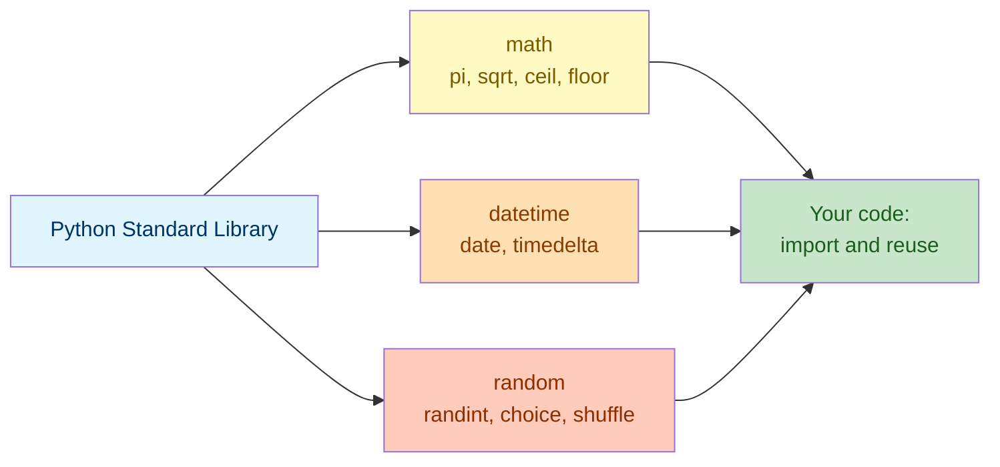

# Lab 2: Imports & Modules

Difficulty: Beginner | ~15 min | Requires Lab 1 (Functions I & Scope)

## 1. Lab Title

**Imports & Modules**

---

## 2. Problem Statement / Use Case Overview

Python ships with a huge standard library of pre-built tools — but only if you know to reach for them instead of writing your own. In this lab you will build a small **event-planning helper**: it computes circle areas and triangle sides with `math`, works out due dates and days-until-deadline with `datetime`, and picks a random dice roll and shuffles a guest list with `random`. Along the way you'll practice the different ways to `import` a module, and build the habit of checking the standard library before writing something from scratch.

---

## 3. Input Data

This lab takes no specific external input — all sample values are defined inline in the code.

---

## 4. Processing

The processing is a small sequence of steps, done with the Python standard library:

1. **Import** the `math` module and use it for geometry (`pi`, `sqrt`, `ceil`, `floor`).
2. **Import specific names** from `datetime` (`date`, `timedelta`) to compute due dates.
3. **Import** the `random` module to roll a dice, pick a name, and shuffle a list.
4. **Compare** `import module`, `from module import name`, and `import module as alias`.
5. **Combine** modules in one function that reports days until an event.

---

## 5. Output

This lab produces no special output beyond the printed results of each code snippet as you run it.

---

## 6. Tech Stack

This lab uses **only the Python standard library** — no third-party packages are required.

- Python 3.10+ (the interactive environment / interpreter)
- Standard library modules: `math`, `datetime`, `random`

No additional libraries are installed because this lab is specifically about using what already ships with Python.

---

## 7. Underlying Concepts

### What Is a Module?

A **module** is just a Python file full of pre-written functions, constants, and classes that someone else (in this case, the Python core team) already wrote and tested. Instead of writing your own square-root function or date-math logic, you `import` the module and reuse its tools. The **standard library** is the collection of modules that ships with Python itself — no installation needed, just an `import` line.

### Three Ways to Import

- **`import math`** — imports the whole module. You access its contents with a prefix: `math.sqrt(16)`, `math.pi`. This is the clearest style, since every call shows which module it came from.
- **`from math import sqrt, pi`** — imports specific names directly into your code. You can then call `sqrt(16)` and `pi` without the prefix. Convenient for names you use often, but it's less obvious at a glance where `sqrt` came from.
- **`import datetime as dt`** — imports the whole module under a shorter alias. Useful for modules with long names, or when a project convention expects a specific alias (like `import numpy as np` in data science code, though that's a third-party package, not standard library).

There's no single "correct" style — pick whichever keeps your code most readable for the situation, and stay consistent within one file.

### `math` — Numeric Tools

The `math` module provides constants like `math.pi` and functions like `math.sqrt()` (square root), `math.ceil()` (round up to the next whole number), and `math.floor()` (round down). These replace hand-written formulas you'd otherwise have to get exactly right yourself.

### `datetime` — Dates and Time Spans

The `datetime` module's `date` class represents a calendar date (year, month, day). A `timedelta` represents a *span* of time (like "14 days") that you can add to or subtract from a `date` to get another `date`. Subtracting two `date` objects gives you a `timedelta` back, whose `.days` attribute tells you how many days apart they are.

### `random` — Unpredictable Choices

The `random` module generates values that are different (unpredictable) each time your program runs: `random.randint(a, b)` picks a whole number between `a` and `b` (inclusive), `random.choice(sequence)` picks one random item from a list, and `random.shuffle(list)` reorders a list's items randomly, in place.

### How it all connects



Each standard library module solves one category of problem well; `import` is the single step that brings any of them into your own code.

---

## 8. Prerequisites

- **Lab 1 (Functions I & Scope):** you should be comfortable defining a function with `def`, type hints, and `return`.
- No third-party libraries or external accounts required.

---

## 9. Environment / Dependencies Setup

This lab needs only Python 3.10+ and Jupyter. No third-party packages are installed — every module used ships with Python.

**Step 1 — Install Jupyter (optional; needed only if you don't already have it).**

Open a terminal and run:

```bash
python -m pip install --upgrade pip
python -m pip install jupyter
```

**Step 2 — Launch the notebook.**

From inside the `Lab2` folder, run:

```bash
jupyter notebook
```

Then open `lab-imports-modules.ipynb` in the browser window that appears.

**Step 3 — Run the cells.** Click each cell and press `Shift + Enter` to run it, top to bottom.

**Step 4 — Run the tests (optional).** A companion pytest file (`test_imports_modules.py`) checks these concepts on their own. Run it with:

```bash
python -m pip install pytest
python -m pytest test_imports_modules.py -v
```

If you prefer to run the code as a plain script instead of a notebook, save the code from Section 10 into a `lab2.py` file and run `python lab2.py`.

---

## 10. Step-wise Development Instructions

Open the notebook and work through each cell below in order.

**Cell 1 — Install dependencies (kept for consistency).**

```python
# This lab uses only Python's standard library, but this cell keeps the
# notebook runnable from a fresh kernel. It installs nothing extra.
!python -m pip install --upgrade pip
```

This first cell satisfies the lab-wide rule that a notebook starts by installing everything it needs. Because every module in this lab already ships with Python, the line only refreshes `pip`.

**Cell 2 — Import and use the `math` module.**

```python
# import math gives us math functions under the 'math.' namespace.
import math


# --- Circle area ---
radius = 4
circle_area = math.pi * radius ** 2  # pi constant from the module
print(f"Circle area for radius {radius}: {circle_area:.2f}")


# --- Right-triangle hypotenuse ---
side_a = 3
side_b = 4
hypotenuse = math.sqrt(side_a ** 2 + side_b ** 2)  # Pythagorean theorem
print(f"Hypotenuse of a {side_a}-{side_b} triangle: {hypotenuse}")


# --- Rounding helpers ---
rounded_up = math.ceil(7.2)    # always round up
rounded_down = math.floor(7.8)  # always round down
print(f"ceil(7.2) = {rounded_up}, floor(7.8) = {rounded_down}")
```

`import math` brings in the whole module, so every tool is accessed with the `math.` prefix. `math.pi` is a constant, while `math.sqrt()`, `math.ceil()`, and `math.floor()` are functions — no need to write your own square-root or rounding logic.

**Cell 3 — Import and use the `datetime` module.**

```python
# from-import pulls names directly so you skip the 'datetime.' prefix.
from datetime import date, timedelta


# --- Pick a fixed starting date ---
today = date(2026, 9, 1)
print(f"Today's date: {today}")


# --- Compute a due date 14 days from now ---
due_date = today + timedelta(days=14)  # add 14 days to today
print(f"Assignment due date (14 days later): {due_date}")


# --- Days remaining (timedelta subtraction) ---
days_until_due = (due_date - today).days  # difference in whole days
print(f"Days until due: {days_until_due}")


# --- Weekday name via strftime ---
print(f"Day of the week: {today.strftime('%A')}")
```

`from datetime import date, timedelta` imports just the two names we need, so we can write `date(...)` instead of `datetime.date(...)`. Adding a `timedelta` to a `date` moves it forward in time; subtracting two `date`s gives back a `timedelta`, whose `.days` is a plain integer. `.strftime('%A')` formats the date as a full weekday name.

**Cell 4 — Import and use the `random` module.**

```python
# random module: pseudo-random numbers and random picks.
import random


# --- Dice roll: random integer between 1 and 6 inclusive ---
dice_roll = random.randint(1, 6)
print(f"Dice roll (1-6): {dice_roll}")
print(f"Is it a valid roll? {1 <= dice_roll <= 6}")


# --- Pick one name at random from a list ---
sample_names = ["Ana", "Ben", "Clara", "Dina", "Eli"]
chosen_name = random.choice(sample_names)  # one random element
print(f"Randomly chosen name: {chosen_name}")
print(f"Is it one of our sample names? {chosen_name in sample_names}")


# --- Shuffle a copy so the original list stays unchanged ---
shuffled_names = sample_names.copy()  # shuffle a copy, keep original
random.shuffle(shuffled_names)  # reorders in place
print(f"Original order:  {sample_names}")
print(f"Shuffled order:  {shuffled_names}")
print(f"Same people, same count? {sorted(shuffled_names) == sorted(sample_names)}")
```

`random.randint(1, 6)` simulates a dice roll, `random.choice(...)` picks one random item from `sample_names`, and `random.shuffle(...)` reorders `shuffled_names` in place — note we `.copy()`d the list first so the original `sample_names` stays untouched. Because these values are different every run, we also print a `True`/`False` check confirming the result is *valid*, not just its exact value.

**Cell 5 — Compare the three import styles side by side.**

```python
# Variant 1: from-import for selected names (no prefix needed).
from math import sqrt, pi

print(f"sqrt(16) using direct import: {sqrt(16)}")
print(f"pi using direct import: {pi:.4f}")


# Variant 2: module alias keeps the module name short.
import datetime as dt

new_year = dt.date(2027, 1, 1)
print(f"Aliased import example: {new_year}")
```

This cell shows `from module import name` (no prefix needed for `sqrt`/`pi`) alongside `import module as alias` (`dt.date(...)` instead of `datetime.date(...)`). All three styles you've now used — `import math`, `from datetime import date, timedelta`, `import datetime as dt` — import the *same* underlying code; they only differ in how you refer to it afterward.

**Cell 6 — Combine modules into one function.**

```python
# Reuses the date/timedelta imported earlier in this notebook.
def days_until_event(event_name: str, event_date: date, today: date) -> str:
    # Whole days between the two dates.
    delta = (event_date - today).days
    return f"{event_name} is in {delta} day(s), on {event_date.strftime('%B %d, %Y')}"


# --- Create two future dates ---
project_deadline = today + timedelta(days=21)
team_lunch = today + timedelta(days=5)


# --- Call the helper with each event ---
print(days_until_event("Project Deadline", project_deadline, today))
print(days_until_event("Team Lunch", team_lunch, today))
```

`days_until_event` reuses the `date`/`timedelta` subtraction pattern from Cell 3 inside a reusable function (as you practiced in Lab 1), formatting the result with `.strftime()` for a friendly output.

---

## 11. Optional Exercise

Add a new sample list `sample_colors = ["red", "blue", "green", "yellow"]` and use `random.choice()` to pick a random color for each name in `sample_names`, printing a line like `"Ana's color: blue"` for every name. (Hint: loop over `sample_names` with a `for` loop, calling `random.choice(sample_colors)` once per name.)

---

## 12. What We Learnt

- What a module is, and why the standard library saves you from reinventing common tools (Section 7, "What Is a Module?").
- The three import styles — `import module`, `from module import name`, `import module as alias` — and when each is convenient (Section 7, "Three Ways to Import").
- How `math` provides constants and functions for numeric work (Section 7, "`math` — Numeric Tools").
- How `datetime.date` and `datetime.timedelta` represent calendar dates and time spans, and how subtracting two dates gives you a `timedelta` (Section 7, "`datetime` — Dates and Time Spans").
- How `random.randint()`, `random.choice()`, and `random.shuffle()` introduce controlled randomness into a program (Section 7, "`random` — Unpredictable Choices").
