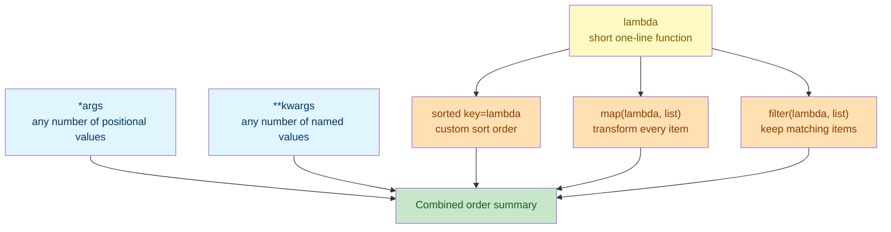

# Lab 3: Functions II

Difficulty: Intermediate | ~25 min | Requires Lab 1 (Functions I & Scope) and Lab 2 (Imports & Modules)

## 1. Lab Title

**Functions II — `*args`, `**kwargs`, Lambdas, and Functional Tools**

---

## 2. Problem Statement / Use Case Overview

Real functions often need to accept a *variable* number of inputs, or a small one-off calculation that doesn't deserve a full `def`. In this lab you will extend a small **shop order system**: functions that accept any number of item prices with `*args`, accept arbitrary named order details with `**kwargs`, and short throwaway calculations written as `lambda` expressions. You'll then apply those lambdas with `map()` (transform every item), `filter()` (keep only some items), and `sorted(key=...)` (control sort order) — the three functional tools that let you process a list of data in a single readable line instead of a hand-written loop.

---

## 3. Input Data

This lab takes no specific external input — all sample values are defined inline in the code.

---

## 4. Processing

The processing is a small sequence of steps, done with plain Python:

1. **Accept any number of positional arguments** with `*args` and sum them.
2. **Accept any number of named arguments** with `**kwargs` and build a label from them.
3. **Write short lambda expressions** for one-line calculations.
4. **Sort** a list of dictionaries by a computed key using `sorted(key=...)`.
5. **Transform** every item in a list with `map()`.
6. **Keep only matching items** in a list with `filter()`.
7. **Combine** `*args`, `**kwargs`, and functional tools into one order-summary function.

---

## 5. Output

This lab produces no special output beyond the printed results of each code snippet as you run it.

---

## 6. Tech Stack

This lab uses **only the Python standard library** — no third-party packages are required.

- Python 3.10+ (the interactive environment / interpreter)
- Built-ins used: `sum()`, `sorted()`, `map()`, `filter()`, `list()`
- Language features: `*args`, `**kwargs`, `lambda`

No additional libraries are installed because these are core language features.

---

## 7. Underlying Concepts

### `*args` — Variable Positional Arguments

Putting a `*` before a parameter name (`*amounts`) tells Python "collect any number of positional arguments into a tuple called `amounts`." A caller can pass zero, one, or a hundred values, and the function still works without you writing a different function signature for each case. Inside the function, `amounts` behaves like a regular tuple — you can loop over it, call `sum()` on it, and so on.

### `**kwargs` — Variable Keyword Arguments

Putting `**` before a parameter name (`**details`) tells Python "collect any number of *keyword* arguments into a dictionary called `details`." A caller can pass any named fields they like — `name="Mug", color="Blue"` — and the function receives them as `{"name": "Mug", "color": "Blue"}`, without the function needing to declare every possible field name in advance.

### Lambda Expressions

A **`lambda`** is a small, unnamed (anonymous) function written in one line: `lambda x: x ** 2` is equivalent to writing `def square(x): return x ** 2`, just without a name and limited to a single expression (no statements, no multiple lines). Lambdas are most useful when you need a quick function *as an argument to another function* — like the `key=` argument to `sorted()` — and giving it a full `def` elsewhere would be more ceremony than the one-off calculation deserves.

### `sorted(key=...)`

`sorted(iterable, key=function)` sorts `iterable` by calling `function` on each item and comparing those results, instead of comparing the raw items directly. This is how you sort a list of dictionaries (which have no natural order) by one specific field — `sorted(products, key=lambda item: item["price"])` sorts by each product's `"price"` value.

### `map()` and `filter()`

- **`map(function, iterable)`** applies `function` to *every* item in `iterable` and returns an iterator of the results — used for transforming a whole list (e.g., discounting every price).
- **`filter(function, iterable)`** keeps only the items where `function(item)` is truthy — used for narrowing a list down to matching items (e.g., only prices under $5).

Both return a lazy iterator, not a list — wrap the call in `list(...)` to see (or store) the actual results, as this lab does throughout.

### How it all connects



`*args`/`**kwargs` make a function's *signature* flexible about how many/which arguments it accepts; lambdas give you a throwaway function to hand to `sorted()`, `map()`, or `filter()`, which each apply that function across a whole collection in one line.

---

## 8. Prerequisites

- **Lab 1 (Functions I & Scope):** comfort with `def`, parameters, type hints, and `return`.
- **Lab 2 (Imports & Modules):** comfort reading and running notebook cells built on earlier labs (no specific module knowledge is reused here).
- No third-party libraries or external accounts required.

---

## 9. Environment / Dependencies Setup

This lab needs only Python 3.10+ and Jupyter. No third-party packages are installed.

**Step 1 — Install Jupyter (optional; needed only if you don't already have it).**

Open a terminal and run:

```bash
python -m pip install --upgrade pip
python -m pip install jupyter
```

**Step 2 — Launch the notebook.**

From inside the `Lab3` folder, run:

```bash
jupyter notebook
```

Then open `lab-functions-ii.ipynb` in the browser window that appears.

**Step 3 — Run the cells.** Click each cell and press `Shift + Enter` to run it, top to bottom.

**Step 4 — Run the tests (optional).** A companion pytest file (`test_functions_ii.py`) checks these concepts on their own. Run it with:

```bash
python -m pip install pytest
python -m pytest test_functions_ii.py -v
```

If you prefer to run the code as a plain script instead of a notebook, save the code from Section 10 into a `lab3.py` file and run `python lab3.py`.

---

## 10. Step-wise Development Instructions

Open the notebook and work through each cell below in order.

**Cell 1 — Install dependencies (kept for consistency).**

```python
# This lab uses only Python's built-in features, but this cell keeps the
# notebook runnable from a fresh kernel. It installs nothing extra.
!python -m pip install --upgrade pip
```

This first cell satisfies the lab-wide rule that a notebook starts by installing everything it needs. Because this lab needs nothing beyond Python itself, the line only refreshes `pip`.

**Cell 2 — Accept any number of positional arguments with `*args`.**

```python
# *amounts collects any number of positional float arguments into one tuple.
# The signature stays the same whether we pass 3 values, 5 values, or none.

def total_sales(*amounts: float) -> float:
    # sum(...) works directly on the collected tuple of amounts.
    return sum(amounts)


# A single function call handles three values, five values, or none at all.
print(f"Total of 3 sales: {total_sales(25.0, 40.0, 15.5)}")
print(f"Total of 5 sales: {total_sales(10, 20, 30, 40, 50)}")

# No arguments -> amounts is (), and sum(()) returns 0.
print(f"Total of 0 sales: {total_sales()}")  # empty tuple sums to 0
```

`*amounts` collects every positional argument passed to `total_sales` into one tuple, no matter how many are given — three values, five values, or none at all (`sum(())` is `0`). This is why the function works identically across all three calls without needing three different definitions.

**Cell 3 — Accept any number of named arguments with `**kwargs`.**

```python
# **details collects any number of keyword=value pairs into a dictionary.
# We never declare the field names in advance -- callers decide them.

def build_product_label(**details: str) -> str:
    # Build one "key: value" fragment per keyword argument.
    parts = [f"{key}: {value}" for key, value in details.items()]

    # Join every fragment with a comma + space into one label string.
    return ", ".join(parts)


# Each caller passes a completely different set of field names.
label_a = build_product_label(name="Mug", color="Blue", price="$8")
label_b = build_product_label(name="Notebook", pages="200")


print(label_a)
print(label_b)
```

`**details` collects every keyword argument into a dictionary. `label_a` and `label_b` pass completely different sets of field names — `color`/`price` vs. `pages` — and the function handles both without needing to know the field names in advance.

**Cell 4 — Write lambda expressions, and sort with one.**

```python
# lambda: a tiny anonymous function, useful for short one-off expressions.
# "lambda x: x ** 2" is shorthand for "def square(x): return x ** 2" --
# except the value of the single expression is returned automatically.

square = lambda x: x ** 2   # one parameter
add = lambda a, b: a + b    # two parameters


print(f"square(5) = {square(5)}")
print(f"add(3, 4) = {add(3, 4)}")


# Our unsorted list of product records.
products = [
    {"name": "Mug", "price": 8.0},
    {"name": "Notebook", "price": 3.5},
    {"name": "Pen", "price": 1.25},
]

# sorted(key=...) accepts a function that decides what to compare on.
# The lambda returns each item's "price", so we sort by price value.
sorted_by_price = sorted(products, key=lambda item: item["price"])

# Print each product in sorted order, cheapest first.
for product in sorted_by_price:
    print(f"{product['name']}: ${product['price']}")
```

`square` and `add` show lambda's basic shape: `lambda parameters: expression`, with the expression's value returned automatically (no `return` keyword). `sorted(products, key=lambda item: item["price"])` is the more typical real-world use — the lambda tells `sorted()` *what to compare* (each product's price) without needing a separate named function just for this one sort.

**Cell 5 — Transform with `map()`, keep matches with `filter()`.**

```python
# Our raw list of prices to process.
prices = [8.0, 3.5, 1.25, 12.0]

# map() applies a function to EVERY element and returns an iterator of results.
# Here the lambda discounts each price by 10% and rounds to 2 decimals.
discounted_prices = list(map(lambda p: round(p * 0.9, 2), prices))

# map/filter return a lazy iterator, so we wrap each in list(...) to print it.
print(f"Original prices: {prices}")
print(f"Discounted prices (10% off): {discounted_prices}")


# filter() keeps only the elements for which the predicate returns True.
# Here the lambda keeps only prices strictly under $5.
affordable_prices = list(filter(lambda p: p < 5.0, prices))
print(f"Prices under $5: {affordable_prices}")
```

`map(lambda p: round(p * 0.9, 2), prices)` applies the discount formula to *every* price and returns a new sequence of the same length. `filter(lambda p: p < 5.0, prices)` instead *keeps only* the prices for which the lambda returns `True`, so the result can be shorter than the input. Both `map()` and `filter()` return an iterator, so we wrap each in `list(...)` to see the actual values.

**Cell 6 — Combine everything into an order-summary function.**

```python
# *args and **kwargs can be combined in a single signature.
# Positional values land in item_prices; named values land in order_info.

def summarize_order(*item_prices: float, **order_info: str) -> str:
    # Sum all the positional prices to get the subtotal.
    subtotal = sum(item_prices)

    # .get(key, default) returns the value, or the default if the key is
    # missing -- so calls that omit a detail still work safely.
    customer = order_info.get("customer", "Guest")
    priority = order_info.get("priority", "standard")
    return f"Order for {customer} ({priority}): {len(item_prices)} item(s), subtotal ${subtotal:.2f}"


# First call passes both named details; second call relies on the defaults.
print(summarize_order(8.0, 3.5, 1.25, customer="Ana", priority="rush"))
print(summarize_order(12.0, customer="Ben"))


# A fuller product catalogue, including whether each item is in stock.
products_full = [
    {"name": "Mug", "price": 8.0, "in_stock": True},
    {"name": "Notebook", "price": 3.5, "in_stock": False},
    {"name": "Pen", "price": 1.25, "in_stock": True},
    {"name": "Backpack", "price": 45.0, "in_stock": True},
]

# Chain filter -> sort -> map to build a clean one-way pipeline.

# Step 1: filter() keeps only the products that are in stock.
in_stock_products = list(filter(lambda p: p["in_stock"], products_full))

# Step 2: sorted(key=...) reorders that smaller list by price, cheapest first.
cheapest_first = sorted(in_stock_products, key=lambda p: p["price"])

# Step 3: map() extracts just each product's name into a new list.
product_names = list(map(lambda p: p["name"], cheapest_first))

print(f"In-stock products, cheapest first: {product_names}")
```

`summarize_order` mixes `*item_prices` (any number of prices) with `**order_info` (any named details), using `.get(key, default)` so missing details fall back sensibly instead of raising an error. The final three lines chain `filter()` (keep in-stock only), `sorted(key=...)` (cheapest first), and `map()` (extract just the names) — a common real-world pattern for narrowing, ordering, then reshaping a list of records.

---

## 11. Optional Exercise

Add a `min_price: float = 0.0` keyword-only filter to the final pipeline: after filtering for `in_stock`, add a second `filter()` call that keeps only products with `"price"` greater than or equal to `10.0`, then re-run the `sorted()` and `map()` steps on the smaller list. Confirm the final printed list only contains `"Backpack"` (the only in-stock product at or above $10).

---

## 12. What We Learnt

- How `*args` lets a function accept any number of positional arguments as a tuple (Section 7, "`*args` — Variable Positional Arguments").
- How `**kwargs` lets a function accept any number of named arguments as a dictionary (Section 7, "`**kwargs` — Variable Keyword Arguments").
- How `lambda` writes a short, unnamed function in one line, most useful as an argument to another function (Section 7, "Lambda Expressions").
- How `sorted(key=...)` uses a function to decide sort order instead of comparing items directly (Section 7, "`sorted(key=...)`").
- How `map()` transforms every item in a list and `filter()` keeps only matching items, both returning a lazy iterator you wrap in `list(...)` (Section 7, "`map()` and `filter()`").
- How `*args`, `**kwargs`, and functional tools combine to build flexible, reusable data-processing functions (Section 10, Cell 6).
