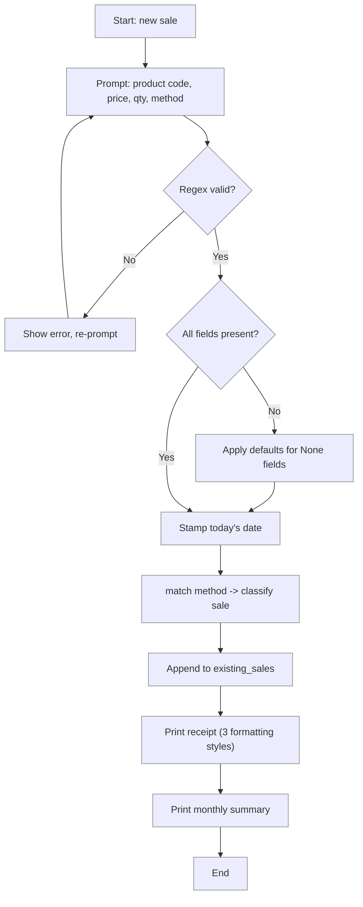

# Lab 4 — Miscellaneous Python Topics: A Practical Sampler

**Difficulty: Intermediate | ~25 min | Requires Lab 2**

---

## 2. Problem Statement / Use Case Overview

Python has several powerful features that don't fit neatly into a single category
but appear constantly in real-world code. This lab brings together six of them
through the lens of a **small-shop sales tool**:

| Topic | Why it matters in this lab |
|---|---|
| `match`/`case` pattern matching | Classify a sale by its payment method |
| `None` and identity checks | Handle missing or optional data safely |
| User input handling | Let the cashier enter details interactively |
| `range()` and the `array` module | Generate number sequences and store compact typed numeric data |
| Working with dates (`datetime`) | Stamp each sale with a date, compute month totals |
| Regular expressions (`re`) | Validate and parse product codes like `SKU-1234-AB` |
| String formatting (`f""`, `.format()`, `%`) | Display receipts and reports in three styles |

By the end you will have a script that **reads sales interactively, validates
product codes, stamps dates, classifies payment methods, and prints a
formatted receipt** — all while exercising every topic above.

---

## 3. Input Data

- **Interactive input** — product code, price, quantity, payment method.
- **Seed data** — a small list of previous sales to combine with new ones:

```python
existing_sales = [
    {"product": "SKU-1001-A1", "price": 12.50, "qty": 3, "method": "cash", "date": "2026-08-28"},
    {"product": "SKU-2045-B2", "price": 49.99, "qty": 1, "method": "card", "date": "2026-08-29"},
    {"product": "SKU-0310-C3", "price": 7.25, "qty": 5, "method": "cash", "date": "2026-08-30"},
]
```

---

## 4. Processing

1. **Input** — Prompt the cashier for a product code, price, quantity, and
   payment method (cash, card, or mobile).
2. **Validate** — Use a regex to confirm the product code format `SKU-NNNN-LL`
   (four digits, two letters). Reject invalid codes.
3. **Sequences** — Use `range()` to generate a number sequence and the `array`
   module to store compact typed quantities.
4. **Date stamp** — Attach today's date to the new sale.
5. **Classify** — Use `match`/`case` on the payment method to label each sale
   ("Cash Payment", "Card Payment", "Mobile Wallet").
6. **Combine** — Append the new sale to `existing_sales`.
7. **None check** — If any field is missing, substitute a default.
8. **Report** — Print a receipt using f-strings and a monthly summary using
   `%`-formatting and `.format()`.

---

## 5. Output

Below is the exact output the notebook produces when you run it (the three
seeded sales plus one new sale entered interactively — in the notebook the
inputs are pre-filled).

```
--- Product Code Validation ---
SKU-1001-A1  ->  Valid
SKU-2045-B2  ->  Valid
SKU-0310-C3  ->  Valid
INVALID-XYZ  ->  Invalid (expected SKU-NNNN-LL)

--- Payment Method Classification ---
$25.00 by cash   -> Cash Payment
$49.99 by card   -> Card Payment
$15.00 by mobile -> Mobile Wallet

--- range() and array ---
1 2 3 4 5 
Array: [3, 1, 5, 2, 4]
Sum: 15 | Max: 5

--- Today's Date ---
2026-09-02

--- Monthly Summary (3 sales in Aug 2026) ---
Total revenue: $269.95
Average sale:  $89.98

--- Full Receipt (f-string) ---
| SKU-1001-A1       | 3 x $12.50 | $37.50 | cash   | 2026-08-28 |
| SKU-2045-B2       | 1 x $49.99 | $49.99 | card   | 2026-08-29 |
| SKU-0310-C3       | 5 x $7.25  | $36.25 | cash   | 2026-08-30 |

--- Full Receipt (.format()) ---
| SKU-1001-A1       | 3 x $12.50 | $37.50 | cash   | 2026-08-28 |
| SKU-2045-B2       | 1 x $49.99 | $49.99 | card   | 2026-08-29 |
| SKU-0310-C3       | 5 x $7.25  | $36.25 | cash   | 2026-08-30 |

--- Full Receipt (%-formatting) ---
| SKU-1001-A1       | 3 x $12.50 | $37.50 | cash   | 2026-08-28 |
| SKU-2045-B2       | 1 x $49.99 | $49.99 | card   | 2026-08-29 |
| SKU-0310-C3       | 5 x $7.25  | $36.25 | cash   | 2026-08-30 |
```

---

## 6. Tech Stack

| Tool | Version | Purpose |
|---|---|---|
| Python | 3.10+ | `match`/`case` requires 3.10 |
| `re` | stdlib | Regular expressions |
| `datetime` | stdlib | Date handling |
| `array` | stdlib | Compact typed number sequences |

No third-party packages are required.

---

## 7. Underlying Concepts

### Pattern Matching with `match`/`case`

Python 3.10 introduced structural pattern matching. It works like a
switch statement but is far more powerful — it can destructure values,
match wildcards, and combine conditions.

### `None` Identity Checks

Always use `is None` / `is not None` instead of `== None`. The `is`
operator compares identity (same object in memory), which is the correct
semantic for singletons like `None`.

### Input Handling

`input()` returns a string. You must cast it to the right type and guard
against empty strings or bad values. In a notebook we simulate input by
assigning variables directly.

### Sequences: `range()` and `array`

- **`range(start, stop)`** produces a lazy sequence of integers without
  building a full list in memory, which is why it is the default for counting
  loops (`for i in range(1, 6)`). You can turn one into a list with
  `list(range(...))` when you actually need the values.
- **`array`** is a module (imported as `from array import array`) that stores
  numbers in a compact, fixed-width C-like layout. The first argument is a
  type code — `'i'` for signed integers, `'f'` for floats. It supports the
  usual sequence operations (`.append()`, `sum()`, `max()`, indexing), but
  keeps large numeric datasets far smaller in memory than equivalent lists.

### Regular Expressions

The pattern `r"SKU-\d{4}-[A-Z]{2}"` enforces the format:
- `SKU-` — literal prefix
- `\d{4}` — exactly four digits
- `-` — literal dash
- `[A-Z]{2}` — exactly two uppercase letters

### String Formatting — Three Styles

| Style | Example | Best for |
|---|---|---|
| f-string | `f"${price:.2f}"` | Most situations (Python 3.6+) |
| `.format()` | `"${:.2f}".format(price)` | Template strings, compatibility |
| `%`-formatting | `"$%.2f" % price` | Legacy code, simple substitutions |



---

## 8. Prerequisites

- Python 3.10 or higher installed on your machine.
- Familiarity with Python dictionaries, lists, and basic string methods.
- Completion of Lab 2 (Functions & Scope) recommended.

---

## 9. Environment / Dependencies Setup

No third-party packages are needed — every module used (`re`, `datetime`) is
part of the Python standard library.

To run the notebook:

```bash
# Create a virtual environment (optional but recommended)
python -m venv .venv
source .venv/bin/activate   # Windows: .venv\Scripts\activate

# Upgrade pip (optional; no extra installs needed)
pip install --upgrade pip

# Install Jupyter (optional; skip if you already have it)
pip install notebook

# Launch the notebook
jupyter notebook lab-miscellaneous-topics.ipynb
```

---

## 10. Step-wise Development Instructions

Open the notebook and work through each cell below in order.

**Cell 1 — Install dependencies (optional).**

```python
# This lab uses only Python's built-in features, but this cell keeps the
# notebook runnable from a fresh kernel. It installs nothing extra.
!pip install --upgrade pip
```

This cell keeps the notebook runnable from a fresh kernel. Because this lab
needs nothing beyond Python itself, the line only refreshes `pip`.

**Cell 2 — `match`/`case` pattern matching.**

Define a function that classifies payment methods using structural pattern
matching.

```python
# match/case: a modern alternative to long if/elif chains.
def classify_method(method):
    """Return a label for the given payment method using match/case."""
    match method:
        case "cash":
            return "Cash Payment"
        case "card":
            return "Card Payment"
        case "mobile":
            return "Mobile Wallet"
        case _:  # wildcard: anything not matched above
            return "Unknown Method"


# Classify each example sale and print its label.
print("--- Payment Method Classification ---")
for method, amount in [("cash", 25.00), ("card", 49.99), ("mobile", 15.00)]:
    label = classify_method(method)
    print(f"${amount:.2f} by {method:<8} -> {label}")
```

`match`/`case` reads top to bottom and returns a label for the first pattern
that matches; the `_` wildcard catches anything else.

**Cell 3 — None checks and defaults.**

Show how `is None` works and apply it to fill missing sale fields.

```python
# None often means "missing"; fill each missing field with a safe default.
def apply_defaults(sale):
    """Fill in None fields with sensible defaults."""
    if sale.get("product") is None:
        sale["product"] = "SKU-0000-XX"
    if sale.get("price") is None:
        sale["price"] = 0.00
    if sale.get("qty") is None:
        sale["qty"] = 1
    if sale.get("method") is None:
        sale["method"] = "cash"
    return sale  # mutate in place and return for convenience


# Build an incomplete sale, fill the gaps, and show the result.
incomplete = {"product": None, "price": 5.99, "qty": None, "method": "card"}
fixed = apply_defaults(incomplete)
print(f"After defaults: {fixed}")
```

Each field that is `None` gets a sensible default; the dict is mutated and also
returned so both uses work.

**Cell 4 — Identity checks (`is` vs `==`).**

Demonstrate why `is` is the correct way to test for `None`.

```python
# None is a singleton; compare it with 'is', not with ==.
value = None
print(f"value is None:      {value is None}")
print(f"value == None:      {value == None}")
print(f"value is not None:  {value is not None}")
print()

# A custom class can make == lie, but 'is' always checks identity.
class Strict:
    def __eq__(self, other):
        return True  # pretends to equal everything

obj = Strict()
print(f"obj == None is {obj == None}  (misleading! )")  # == calls Strict.__eq__
print(f"obj is None is {obj is None}  (correct)")       # is checks identity only
```

`==` can be overridden by a class's `__eq__`, so a custom object may claim to
equal `None`. `is` compares identity, which is always reliable for the `None`
singleton.

**Cell 5 — User input handling (simulated).**

In a notebook we assign variables directly; in a real CLI script you would
use `input()`.

```python
# Simulated cashier input (all strings from a terminal or form)
raw_code   = "SKU-4501-D7"
raw_price  = "29.95"
raw_qty    = "2"
raw_method = "card"

# Validate and cast: strip whitespace, convert to the right type.
product = raw_code.strip()
price   = float(raw_price)   # string -> number
qty     = int(raw_qty)       # string -> integer
method  = raw_method.strip().lower()

new_sale = {
    "product": product,
    "price": price,
    "qty": qty,
    "method": method,
    "date": None,
}
print(f"Parsed sale: {new_sale}")
```

`input()` always returns a string, so we strip whitespace and cast each raw
value to its target type before building the sale dict.

**Cell 6 — `range()` and the `array` module.**

Generate a number sequence with `range(start, stop)` for a loop, and store the
daily quantities in a compact typed `array` from the `array` module.

```python
# range(): a lazy sequence of integers, handy in for loops.
from array import array

print("--- range() ---")
for i in range(1, 6):
    print(i, end=" ")
print()

# A typed array keeps numeric data compact in memory ('i' = signed int).
daily_qty = array('i', [3, 1, 5, 2])
daily_qty.append(4)
print("Array:", list(daily_qty))
print("Sum:", sum(daily_qty), "| Max:", max(daily_qty))
```

`range(1, 6)` yields `1 2 3 4 5` without building a full list. The `array` uses
a fixed-width typed layout (`'i'` = signed integer), so it stores numeric data
more compactly than a plain list while still supporting `append`, `sum`, and
`max`.

**Cell 7 — Working with dates.**

Stamp today's date onto a sale record using `datetime.date.today()`.

```python
# date.today() captures the real current date, no arguments needed.
from datetime import date

today = date.today()
new_sale["date"] = today  # stamp the earlier parsed sale with today's date

print(f"--- Today's Date ---")
print(f"{today}")
print(f"Formatted: {today.strftime('%B %d, %Y')}")  # e.g. September 07, 2026
print(f"Month/Year: {today.strftime('%m/%Y')}")
```

`date.today()` needs no arguments and returns the real current date. The
`strftime` format codes control how it is displayed.

**Cell 8 — Regular expressions.**

Validate product codes with a compiled pattern.

```python
# re.compile pre-parses the pattern once for reuse and speed.
import re

SKU_PATTERN = re.compile(r"SKU-\d{4}-[A-Z]{2}")

print("--- Product Code Validation ---")
for code in ["SKU-1001-A1", "SKU-2045-B2", "SKU-0310-C3", "INVALID-XYZ"]:
    valid = "Valid" if SKU_PATTERN.fullmatch(code) else "Invalid (expected SKU-NNNN-LL)"
    print(f"{code:<16} ->  {valid}")
```

`re.compile` parses the pattern once so it can be reused. `fullmatch` requires
the entire string to match the `SKU-NNNN-LL` shape.

**Cell 9 — Seed data and new sale.**

Build the sales list, combine old and new records.

```python
# Our running dataset: a list of sale dictionaries.
existing_sales = [
    {"product": "SKU-1001-A1", "price": 12.50, "qty": 3, "method": "cash",  "date": date(2026, 8, 28)},
    {"product": "SKU-2045-B2", "price": 49.99, "qty": 1, "method": "card",  "date": date(2026, 8, 29)},
    {"product": "SKU-0310-C3", "price":  7.25, "qty": 5, "method": "cash",  "date": date(2026, 8, 30)},
]

existing_sales.append(new_sale)  # add the sale we parsed in an earlier cell
print(f"Total sales records: {len(existing_sales)}")
```

**Cell 10 — String formatting: f-strings.**

Print the receipt using f-strings.

```python
# F-string formatting: values go directly inside the string.
def print_receipt_fstring(sales):
    print("--- Full Receipt (f-string) ---")
    for s in sales:
        total = s["price"] * s["qty"]
        line = f"| {s['product']:<16} | {s['qty']} x ${s['price']:.2f} | ${total:.2f} | {s['method']:<6} | {s['date']} |"
        print(line)


print_receipt_fstring(existing_sales)
```

**Cell 11 — String formatting: `.format()`.**

Print the same receipt with `.format()`.

```python
# .format(): placeholders {} are filled by named values.
def print_receipt_format(sales):
    print("--- Full Receipt (.format()) ---")
    for s in sales:
        total = s["price"] * s["qty"]
        line = "| {product:<16} | {qty} x ${price:.2f} | ${total:.2f} | {method:<6} | {date} |"
        print(line.format(product=s["product"], qty=s["qty"],
                          price=s["price"], total=total,
                          method=s["method"], date=s["date"]))


print_receipt_format(existing_sales)
```

**Cell 12 — String formatting: `%`-formatting.**

Print the receipt a third time with `%`-style formatting.

```python
# %-formatting: the oldest style, using % placeholders and a tuple.
def print_receipt_percent(sales):
    print("--- Full Receipt (%-formatting) ---")
    for s in sales:
        total = s["price"] * s["qty"]
        line = "| %-16s | %d x $%.2f | $%.2f | %-6s | %s |"
        print(line % (s["product"], s["qty"], s["price"], total, s["method"], s["date"]))


print_receipt_percent(existing_sales)
```

**Cell 13 — Monthly summary.**

Compute totals and print a summary using a mix of formatting styles.

```python
# Summarize August sales from the receipt data.
target_month = 8
target_year  = 2026
month_sales  = [s for s in existing_sales if s["date"].month == target_month]
total_rev    = sum(s["price"] * s["qty"] for s in month_sales)
avg_sale     = total_rev / len(month_sales) if month_sales else 0  # avoid division by 0

print("--- Monthly Summary ({} sales in {} {}---".format(
    len(month_sales),
    date(target_year, target_month, 1).strftime("%b"),
    target_year))
print("Total revenue: $%.2f" % total_rev)
print("Average sale:  $%.2f" % avg_sale)
```

Only the August sales are kept, their revenue is summed, the average is guarded
against division by zero, and the results print with `.format()` and
`%`-formatting.

---

## 11. Optional Exercise

**Extend the lab by adding a discount tier.**

Modify the `classify_sale` function (from Step 2) so that it also accepts an
optional `discount` parameter (a percentage, e.g. `10` for 10%). If the
discount is not `None`, include it in the classification label:

```
cash with 10% discount -> "Cash Payment (10% off)"
```

Then update the receipt printing to show a "Discounted" column when a discount
is present. Update the monthly summary to subtract discounts from the total.

**Hints:**
- Add `discount=None` to the function signature.
- Use an `if discount is not None` check inside the `match`/`case` block.
- For the receipt, use an f-string with a ternary: `f"{d}%" if d else "-"`.

---

## 12. What We Learnt

- **`match`/`case`** provides a clean, readable way to branch on the structure
  of a value — much more expressive than a chain of `if`/`elif`.
- **`is None`** is the correct identity check for singletons; `== None` can be
  overridden by custom classes and is therefore unreliable.
- **User input** always arrives as a string; validate and cast early.
- **`range()` and `array`** generate integer sequences without a full list, and
  store numeric data compactly with a typed `array`.
- **`datetime.date.today()`** gives you today's date; `strftime` controls the
  output format.
- **Regular expressions** like `r"SKU-\d{4}-[A-Z]{2}"` make validation short
  and declarative.
- **Three formatting styles** — f-strings, `.format()`, and `%` — all produce
  the same output; f-strings are the modern default, but you will encounter all
  three in existing codebases.
