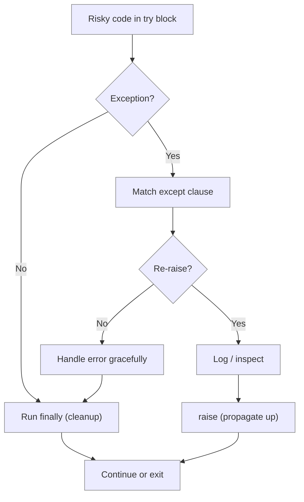

# Lab 5 — Error Handling: Writing Code That Fails Gracefully

**Difficulty: Intermediate | ~25 min | Requires Lab 3**

---

## 2. Problem Statement / Use Case Overview

Any program that takes user input, reads files, or calls external services will
eventually receive something unexpected. Without error handling, a single bad
input crashes the entire program. This lab teaches you to **catch, raise, and
re-raise** errors so your code fails *gracefully* — telling the user what went
wrong and continuing to process everything else.

We build on the **small-shop order system** from previous labs: a function that
validates order quantities, prices, and product codes, catches every kind of
bad input the cashier might enter, defines a custom `InvalidOrderError` for
business-rule violations, and still cleans up resources even when something
goes wrong.

---

## 3. Input Data

This lab takes no specific external input — all sample data is defined inline in the code.

---

## 4. Processing

1. **Basic try/except** — Wrap `float()` conversion in a try block; catch
   `ValueError` when the string is not a number.
2. **Multiple specific exceptions** — Handle `ValueError`, `TypeError`, and
   `ZeroDivisionError` in separate except clauses for a single operation.
3. **try/finally** — Show that `finally` always runs, even after an error —
   the key pattern for resource cleanup.
4. **Custom exceptions** — Define `InvalidOrderError` (inherits from
   `Exception`) and raise it when business rules are violated.
5. **Re-raising errors** — Catch an exception, log it, then re-raise it so
   the caller can also handle it.
6. **Robust validation function** — Combine all techniques into one
   `validate_order()` function that checks every field, raises custom
   exceptions for bad data, and reports all errors without crashing early.

---

## 5. Output

This lab produces no special output beyond the printed results of each code snippet as you run it.

---

## 6. Tech Stack

| Tool | Version | Purpose |
|---|---|---|
| Python | 3.10+ | Exception handling, custom classes |
| `io` | stdlib | `StringIO` to simulate file cleanup |

No third-party packages are required.

---

## 7. Underlying Concepts

### The try/except/finally Block

Python wraps risky code in a `try` block. If an error occurs inside `try`,
Python jumps to the matching `except` block instead of crashing. The `finally`
block runs *always* — whether an exception happened or not — making it the
right place for cleanup (closing files, releasing locks).

### Catching Specific Exceptions

Always catch the *most specific* exception you expect: `except ValueError:`
rather than `except Exception:`. Catching everything silently hides bugs. You
can stack multiple `except` clauses to handle different errors differently.

### Custom Exceptions

Create a class that inherits from `Exception` to represent domain-specific
errors. Custom exceptions carry meaningful names (`InvalidOrderError` tells
you *what* went wrong), can hold extra data (the field and value), and
separate business-rule errors from Python runtime errors.

### Re-raising Errors

Use `raise` inside an `except` block to log or inspect an exception and then
let it propagate up to the caller. This preserves the original traceback and
ensures the error isn't silently swallowed.



---

## 8. Prerequisites

- Python 3.10 or higher.
- Completion of Lab 3 (Functions II) — familiarity with `def`, parameters,
  and `return`.
- No prior exception-handling experience required.

---

## 9. Environment / Dependencies Setup

This lab uses only Python's standard library — no third-party packages needed.

```bash
# Create a virtual environment (optional but recommended)
python -m venv .venv
source .venv/bin/activate   # Windows: .venv\Scripts\activate

# Upgrade pip (optional; no extra installs needed)
pip install --upgrade pip

# Install Jupyter (optional; skip if you already have it)
pip install notebook

# Launch the notebook
jupyter notebook lab-error-handling.ipynb
```

---

## 10. Step-wise Development Instructions

Open the notebook and work through each cell below in order.

**Cell 1 — Install dependencies.**

```python
# This lab uses only Python's built-in features, but this cell keeps the
# notebook runnable from a fresh kernel. It installs nothing extra.
!pip install --upgrade pip
```

This cell keeps the notebook runnable from a fresh kernel. Because this lab
needs nothing beyond Python itself, the line only refreshes `pip`.

**Cell 2 — Basic try/except: catching ValueError on bad price input.**

```python
# parse_price converts text to a float, catching bad input gracefully.
def parse_price(raw):
    try:
        return float(raw)  # "29.95" -> 29.95
    except ValueError:
        print(f"  Error: '{raw}' is not a valid price")
        return None  # caller can detect failure by checking for None


# --- call the function with valid and invalid inputs ---
print("--- Basic try/except ---")
print("Parsing '29.95':", parse_price("29.95"))  # valid number
print("Parsing 'abc':", parse_price("abc"))       # invalid -> handled
print("Parsing '':", parse_price(""))             # also invalid
```

`float("29.95")` succeeds and returns `29.95`. `float("abc")` raises
`ValueError`, which the `except` block catches — printing a friendly message
instead of crashing. `float("")` also raises `ValueError` because an empty
string is not a number.

**Cell 3 — Multiple specific exceptions on one operation.**

```python
# process_quantity divides a total by a quantity, catching each error type.
def process_quantity(quantity, total_price):
    try:
        result = total_price / quantity
        print(f"  Processing quantity {quantity}: result = {result}")
    except TypeError:  # e.g. dividing by a string
        print(f"  Error: Cannot divide string by int")
        return None
    except ZeroDivisionError:  # quantity was 0
        print(f"  Error: division by zero")
        return None
    return result


# --- call with different inputs to exercise every branch ---
print("--- Multiple Specific Exceptions ---")
print(process_quantity(5, 100))        # works normally
print(process_quantity("five", 100))  # TypeError path
print(process_quantity(0, 100))        # ZeroDivisionError path
print(process_quantity(3.5, 112))      # float is fine
```

Three different failure modes — wrong type, zero value, and success — each
handled by its own `except` clause. The `TypeError` handler returns `None`
implicitly; the `ZeroDivisionError` handler returns `None` explicitly. Only
the successful call prints a result.

**Cell 4 — try/finally: cleanup that always runs.**

```python
# finally always runs, so cleanup happens whether an error occurred or not.
print("--- try/finally Cleanup ---")

for qty in [5, "bad"]:
    resource = "file_sim.txt"

    try:
        print(f"OPENED: resource {resource}")
        if isinstance(qty, int):
            print(f"  Processing {resource} ...")
        else:
            raise RuntimeError("simulated crash!")  # force an error
    except RuntimeError as e:
        print(f"  Error: {e}")
    finally:
        print(f"CLOSED: resource {resource}")  # runs in BOTH cases

    print("Processing continued after error.\n")
```

The `finally` block runs whether the `try` succeeds or raises an exception.
This is the standard pattern for closing files, releasing database connections,
or freeing any resource — guaranteeing no leaks even when errors occur.

**Cell 5 — Custom exception: InvalidOrderError.**

```python
# A custom exception carries extra fields to aid diagnosis.
class InvalidOrderError(Exception):
    def __init__(self, field, value, message):
        super().__init__(message)  # keep the normal message behaviour
        self.field = field  # which field was invalid
        self.value = value  # what value was supplied


# --- raise and catch the custom exception ---
print("--- Custom Exception: InvalidOrderError ---")

try:
    qty = 0
    if qty < 1:
        raise InvalidOrderError("quantity", qty,
            f"Order for 'Shirt' must have quantity >= 1, got {qty}")
except InvalidOrderError as e:  # catch our own type specifically
    print(f"{type(e).__name__}: {e}")
```

`InvalidOrderError` inherits from `Exception` and carries the field name and
invalid value — giving callers structured data about *what* went wrong, not
just a message string. Raising it with `raise` and catching it with
`except InvalidOrderError as e` is the same pattern as built-in exceptions.

**Cell 6 — Re-raising errors: log then propagate.**

```python
# Log the problem, then re-raise so the caller still sees the error.
def divide_for_report(a, b):
    try:
        return a / b
    except ZeroDivisionError:
        print(f"ERROR (logged): division by zero")
        raise  # bare raise -> send the SAME exception onward


# --- outer handler catches the re-raised exception ---
print("--- Re-raising Errors ---")

try:
    divide_for_report(100, 0)
except ZeroDivisionError as e:  # caught again by the outer block
    print(f"Traceback caught: {e}")
```

The inner `except` prints a log message and then `raise`s the exception again
*without arguments* — this re-raises the original with its full traceback. The
outer `try/except` catches it, showing how the error propagates up the call
chain. This pattern is essential for logging without swallowing errors.

**Cell 7 — Robust order validation: tying everything together.**

```python
# Robust validation: collect every problem, then raise one rich error.
def validate_order(order):
    errors = []

    # 1. check product name -- must be a non-empty string.
    if not isinstance(order.get("product"), str) or not order["product"].strip():
        errors.append("requires a valid product name")

    # 2. check price -- must be a positive number (even if given as text).
    try:
        price = float(order.get("price", 0))
        if price <= 0:
            errors.append(
                f"Price for '{order.get('product')}' must be > 0, got {price:.2f}")
    except (TypeError, ValueError):
        errors.append(f"Price '{order.get('price')}' is not a valid number")

    # 3. check quantity -- must be a positive whole number.
    try:
        qty = int(order.get("quantity", 0))
        if qty < 1:
            errors.append(
                f"Order for '{order.get('product')}' must have quantity >= 1, got {qty}")
    except (TypeError, ValueError):
        errors.append(
            f"Quantity '{order.get('quantity')}' is not a valid integer")

    # 4. raise if any problem was found.
    if errors:
        raise InvalidOrderError("order", str(order), "; ".join(errors))

    return True


# --- test data: one valid order and three with different problems ---
orders = [
    {"product": "Shirt",  "price": 25.00, "quantity": 2},   # valid
    {"product": "Hat",    "price": 15.00, "quantity": -2},  # bad qty
    {"product": "Scarf",  "price": -15.00, "quantity": 1},  # bad price
    {"product": "",       "price": 40.00, "quantity": 1},   # empty name
]


# --- validate each order and report results ---
print("--- Robust Order Validation ---")

valid = 0
for i, order in enumerate(orders, 1):
    try:
        validate_order(order)
        print(f"  Order {i} PASSED")
        valid += 1
    except InvalidOrderError as e:
        print(f"  Order {i} FAILED: {e}")

print(f"Processing complete: {valid} valid, {len(orders) - valid} invalid.")
```

This function validates every field, collects *all* errors before raising (not
just the first one), and uses the custom `InvalidOrderError` to carry the full
error message. The caller loops through orders and catches one exception per
bad order — no crash, no silent failure, complete visibility into what went
wrong.

---

## 11. Optional Exercise

Extend `validate_order` to also validate an optional `"discount"` field:

- If `"discount"` is present, it must be a number between `0` and `50`
  (inclusive).
- If it's missing, default to `0` (no discount).
- If it's out of range, add an error to the errors list: `"Discount must be
  0-50, got {value}"`.

Test your updated function by adding a fifth order with `"discount": 75` and
confirm the error message appears in the output.

---

## 12. What We Learnt

- **`try`/`except`** catches specific errors and prevents crashes — always
  catch the narrowest exception type you expect.
- **Stacking `except` clauses** lets you handle different error types with
  different logic (print a message, return `None`, log, etc.).
- **`finally`** runs whether the `try` block succeeded or failed — use it for
  resource cleanup (closing files, releasing connections).
- **Custom exceptions** (classes inheriting from `Exception`) carry meaningful
  names and extra data, separating business-rule errors from runtime errors.
- **Re-raising** (`raise` without arguments inside `except`) preserves the
  original traceback while letting you log or inspect the error first.
- **Collecting all errors** before raising (instead of failing on the first
  one) gives users complete feedback in a single pass.
