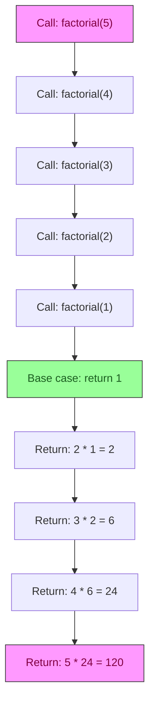

# Lab 6 — Recursion & Algorithms: Thinking in Steps

**Difficulty: Intermediate | ~25 min | Requires Lab 3**

---

## 2. Problem Statement / Use Case Overview

Many programming problems are naturally solved by breaking them into smaller
versions of themselves — that is the essence of **recursion**. Once you
understand recursion, you can also study **algorithms**: step-by-step procedures
for searching, sorting, and checking data.

This lab covers two pillars:

1. **Recursive functions** — factorial, Fibonacci sequence, and summing a list
   by breaking it into head + tail.
2. **Classic beginner algorithms** — linear search (find an item in a list),
   bubble sort (order items by price), and palindrome checking (detect whether
   a product code reads the same forwards and backwards).

We use a **small-shop inventory** theme: a list of product dictionaries with
names, prices, and stock counts. By the end, you will search the inventory,
sort it by price, check product codes for palindromes, and combine recursion
with algorithms in a practical scenario.

---

## 3. Input Data

This lab takes no specific external input — all sample data is defined inline in the code.

---

## 4. Processing

1. **Recursive factorial** — define a base case (`n <= 1 → return 1`) and a
   recursive case (`n * factorial(n - 1)`); print each call to show the call
   stack unwinding.
2. **Recursive Fibonacci** — define a base case (`n <= 1 → return n`) and a
   recursive case (`fib(n-1) + fib(n-2)`); trace the repeated work, then
   mention memoization as the optimization.
3. **Recursive sum** — sum a list by adding the head element to the sum of the
   tail (`lst[0] + recursive_sum(lst[1:])`), with an empty-list base case.
4. **Linear search** — iterate through the inventory comparing each item's
   price (or name) to a target; return the index when found.
5. **Bubble sort** — repeatedly swap adjacent elements that are out of order;
   print the list after each pass to show the step-by-step sorting.
6. **Palindrome check** — recursively compare the first and last characters,
   then shrink inward; return `True` if all pairs match.
7. **Practical scenario** — combine recursive binary search on a sorted
   inventory list to find a product by price.

---

## 5. Output

This lab produces no special output beyond the printed results of each code snippet as you run it.

---

## 6. Tech Stack

| Tool | Version | Purpose |
|---|---|---|
| Python | 3.10+ | Recursion, list operations, algorithms |

No third-party packages are required.

---

## 7. Underlying Concepts

### What Is Recursion?

A **recursive function** calls itself on a smaller input until it reaches a
**base case** — the condition that stops the recursion. Every recursive
function needs both:

- **Base case**: the simplest input that can be answered directly (e.g.,
  `factorial(1) = 1`).
- **Recursive case**: the function calls itself with a smaller or simpler
  argument (e.g., `n * factorial(n - 1)`).

Without a base case, the function calls itself forever (infinite recursion)
and Python hits its recursion limit.

### How the Call Stack Works

When a function calls itself, Python pushes a new **stack frame** onto the
call stack — a record of the function's local variables and where to return.
When the base case is reached, frames start popping off, and each frame
computes its result and passes it back to its caller.

### Recursion vs. Iteration

Every recursive solution can be rewritten as a loop (iteration). Recursion
is preferred when the problem is naturally hierarchical (tree traversal,
divide-and-conquer). Iteration is preferred when the problem is linear and
performance matters (Python has a default recursion limit of ~1000).

### Algorithm Efficiency

- **Linear search** scans every element: O(n) time, O(1) space.
- **Bubble sort** compares every adjacent pair multiple times: O(n²) time,
  O(1) space. Good for learning; rarely used in production.
- **Binary search** halves the search space each step: O(log n) time — but
  requires sorted data.



---

## 8. Prerequisites

- Python 3.10 or higher.
- Completion of Lab 3 (Functions II) — familiarity with `def`, parameters,
  and `return`.
- Basic understanding of lists and indexing.

---

## 9. Environment / Dependencies Setup

This lab uses only Python's standard library — no third-party packages needed.

```bash
# Create a virtual environment (optional but recommended)
python -m venv .venv
source .venv/bin/activate   # Windows: .venv\Scripts\activate

# Upgrade pip (optional; no extra installs needed)
pip install --upgrade pip

# Install Jupyter (optional; skip if you already have it)
pip install notebook

# Launch the notebook
jupyter notebook lab-recursion-algorithms.ipynb
```

---

## 10. Step-wise Development Instructions

Open the notebook and work through each cell below in order.

**Cell 1 — Install dependencies.**

```python
# This lab uses only Python's built-in features, but this cell keeps the
# notebook runnable from a fresh kernel. It installs nothing extra.
!pip install --upgrade pip
```

This cell keeps the notebook runnable from a fresh kernel. Because this lab
needs nothing beyond Python itself, the line only refreshes `pip`.

**Cell 2 — Recursive factorial with call stack trace.**

```python
# factorial calls itself on n-1 until it hits the base case (n <= 1).

def factorial(n, depth=0):
    indent = "  " * depth  # visual indentation for each recursion level

    if n <= 1:              # base case: stop recursing
        print(f"{indent}factorial(1) -> 1")
        return 1

    print(f"{indent}factorial({n})")

    # Recursive step: multiply n by the factorial of n-1.
    result = n * factorial(n - 1, depth + 1)

    if depth > 0:  # show the unwinding in a readable form
        print(f"{indent}-> {n} * {result // n} = {result}")

    return result


print("--- Recursive Factorial ---")

# Run the factorial on 5 and print the final result.
ans = factorial(5)
print(f"factorial(5) = {ans}")
```

The `depth` parameter tracks indentation so you can visually follow each
call deeper into the stack. The base case is `n <= 1` returning `1`. Each
recursive frame multiplies `n` by the result of `factorial(n - 1)`.

**Cell 3 — Recursive Fibonacci with repeated-work trace.**

```python
# Fibonacci: each call branches into two recursive calls.

call_count = 0  # count every call to show the repeated work


def fib(n):
    global call_count
    call_count += 1  # record this call for the "repeated work" trace

    if n <= 1:  # base case: F(0)=0, F(1)=1
        return n

    # Recursive definition of F(n): F(n-1) + F(n-2).
    return fib(n - 1) + fib(n - 2)


print("--- Recursive Fibonacci ---")

result = fib(5)
print(f"fib(5) = {result}")

# The counter reveals that many subproblems are solved repeatedly.
print(f"  Total calls: {call_count}  <- repeated work (no memoization)")
```

Fibonacci's recursion tree branches into two calls per frame, causing the
same subproblem to be solved many times. `fib(5)` triggers 15 calls. A
**memoization** decorator (`functools.lru_cache`) or a bottom-up loop would
reduce this to O(n).

**Cell 4 — Recursive sum of inventory prices.**

```python
# Recursive sum: add head + sum(tail) until the list is empty.

def recursive_sum(lst, depth=0):
    indent = "  " * depth

    if not lst:  # base case: empty list sums to 0
        print(f"{indent}<- base case: 0")
        return 0

    head = lst[0]      # first element
    tail = lst[1:]     # everything after it
    print(f"{indent}{head} + recursive_sum({tail})")

    # Recursive step: head plus the sum of the remaining tail.
    return head + recursive_sum(tail, depth + 1)


prices = [29.99, 49.99, 99.99, 14.99, 79.99]

print("--- Recursive Sum of Inventory Prices ---")
print(f"Prices: {prices}")

total = recursive_sum(prices)
print(f"Total: {total:.2f}")
```

The list is split into `head` (first element) and `tail` (the rest). The
base case is an empty list returning `0`. Each recursive call adds the head
to the sum of the tail, building up the total as frames return.

**Cell 5 — Linear search returning index.**

```python
# Linear search: scan every item until the target name is found.

def linear_search(inventory, target_name):
    # Walk through every item; enumerate also gives us its index.
    for i, item in enumerate(inventory):
        match = "FOUND" if item["name"] == target_name else "no match"
        print(f"  Comparing {item['name']} ({item['price']}) -> {match}")

        if item["name"] == target_name:
            return i  # found: report its index

    return -1  # not found


inventory = [
    {"name": "T-Shirt",  "price": 29.99, "stock": 12},
    {"name": "Hoodie",   "price": 49.99, "stock": 8},
    {"name": "Jacket",   "price": 99.99, "stock": 3},
    {"name": "Cap",      "price": 14.99, "stock": 20},
    {"name": "Sneakers", "price": 79.99, "stock": 5},
]

print("--- Linear Search ---")
print("Inventory:")

# Print the inventory with index, name, price, and stock level.
for i, item in enumerate(inventory):
    print(f"  {i}: {item['name']:9s} ${item['price']:.2f}  (x{item['stock']})")

# Search for items that exist and don't exist.
for target in ["Jacket", "Scarf"]:
    print(f"\nSearching for {target}...")

    idx = linear_search(inventory, target)

    if idx >= 0:
        print(f"  -> Found at index {idx}")
    else:
        print(f"  Not found: {target}")
```

Linear search checks each element from left to right. Worst case, it
examines every element (O(n)). It returns the index of the first match or
`-1` if the target is not in the list.

**Cell 6 — Bubble sort with step-by-step output.**

```python
# Bubble sort: swap adjacent out-of-order pairs, largest 'bubbles' last.

def bubble_sort(inventory):
    arr = [item["price"] for item in inventory]  # work on prices only
    n = len(arr)

    for pass_num in range(n - 1):  # each pass places one value correctly
        for j in range(n - 1 - pass_num):  # unsorted tail shrinks each pass
            if arr[j] > arr[j + 1]:  # out of order? swap them
                arr[j], arr[j + 1] = arr[j + 1], arr[j]

        # After each pass, print the progress of the sort.
        print(f"Pass {pass_num + 1}: {arr}")

    return arr


print("--- Bubble Sort (by price) ---")

sorted_prices = bubble_sort(inventory)

# The items themselves don't move; rebuild the name list by price.
sorted_names = [
    item["name"] for item in sorted(inventory, key=lambda x: x["price"])
]
print(f"Sorted inventory: {sorted_names}")
```

Bubble sort works by repeatedly stepping through the list, comparing
adjacent elements, and swapping them if they are in the wrong order. After
each pass, the largest unsorted element "bubbles up" to its correct
position. The inner loop shrinks by one each pass because the end is sorted.

**Cell 7 — Palindrome checker using recursion.**

```python
# Compare characters from both ends, moving inward each recursive call.

def is_palindrome(s, left=0, right=None):
    if right is None:
        right = len(s) - 1  # start at the last character

    if left >= right:  # pointers crossed / meet -> all pairs matched
        return True

    if s[left] != s[right]:  # mismatched ends -> not a palindrome
        return False

    # All pairs so far match: shrink the window and check the next ones.
    return is_palindrome(s, left + 1, right - 1)


print("--- Palindrome Check on Product Codes ---")

codes = ["racecar", "hello", "abcba", "abba"]

for code in codes:
    result = "palindrome" if is_palindrome(code) else "not a palindrome"
    print(f"  '{code}' -> {result}")
```

The recursive palindrome check compares characters at the outermost positions
(`left` and `right`), then moves inward. The base case is when the pointers
meet or cross — all pairs matched. If any pair doesn't match, it returns
`False` immediately.

**Cell 8 — Practical scenario: recursive binary search on sorted inventory.**

```python
# Binary search: halve the search range each call on a sorted list.

def binary_search(sorted_prices, names, target, low, high):
    if low > high:  # range exhausted -> target not present
        return None

    mid = (low + high) // 2  # middle index of the current range

    # Report which midpoint is being checked while we search.
    print(f"  Checking mid={mid}: price={sorted_prices[mid]} -> ", end="")

    if sorted_prices[mid] == target:  # exact hit
        print(f"FOUND -> {names[mid]} (${target})")
        return mid

    elif sorted_prices[mid] < target:  # target is larger -> search right half
        print("go right")
        return binary_search(sorted_prices, names, target, mid + 1, high)

    else:  # target is smaller -> search left half
        print("go left")
        return binary_search(sorted_prices, names, target, low, mid - 1)


# Sort by price once, keeping parallel name/price lists for the search.
sorted_by_price = sorted(inventory, key=lambda x: x["price"])
prices_sorted = [item["price"] for item in sorted_by_price]
names_sorted = [item["name"] for item in sorted_by_price]

print("--- Practical Scenario: Recursive Binary Search ---")
print(f"Sorted prices: {prices_sorted}")

# Try one price that exists and one that does not.
for target in [49.99, 60.00]:  # one present, one absent
    print(f"Searching for ${target}...")

    idx = binary_search(
        prices_sorted, names_sorted, target, 0, len(prices_sorted) - 1
    )

    # Absent prices report here; hits already printed "FOUND" inside the call.
    if idx is None:
        print(f"  Not found: ${target}")
```

Binary search works on **sorted** data and eliminates half the remaining
candidates at each step. This makes it O(log n) — far faster than linear
search for large datasets. The recursive version calls itself on the left or
right half depending on whether the middle element is greater or less than
the target.

---

## 11. Optional Exercise

Implement a **recursive function** called `count_stock(inventory, threshold)`
that counts how many products in the inventory have a stock level greater than
or equal to `threshold`. Use the same head/tail recursion pattern from Cell 4.

Then, use binary search to find the product closest to a target price of
`$65.00` in the sorted inventory (the product whose price differs least from
the target).

Test both with the existing inventory list and print the results.

---

## 12. What We Learnt

- **Recursion** solves problems by calling a function on a smaller input;
  every recursive function needs a **base case** (stops) and a **recursive
  case** (progresses toward the base).
- The **call stack** tracks each recursive call's state; frames are pushed on
  the way down and popped on the way up as results propagate back.
- **Recursive Fibonacci** demonstrates the cost of repeated work — without
  memoization, the same subproblems are recomputed exponentially many times.
- **Linear search** is simple and works on unsorted data: O(n) time.
- **Bubble sort** is easy to understand but slow: O(n²) time — suitable for
  learning, not for large datasets.
- **Recursive palindrome checking** elegantly compares outer characters and
  shrinks inward until the base case is reached.
- **Binary search** is dramatically faster than linear search (O(log n)) but
  requires sorted data; the recursive version mirrors the divide-and-conquer
  pattern of recursion itself.
