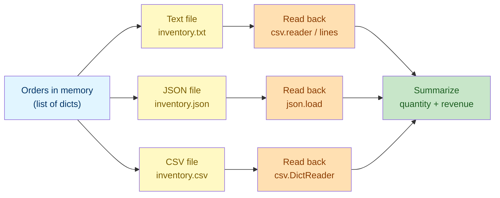

# Lab 7 — File Handling: Text, JSON & CSV

**Difficulty: Intermediate | ~25 min | Requires Lab 4**

---

## 2. Problem Statement / Use Case Overview

A small shop keeps its daily orders in memory, but data in memory disappears
when the program exits. To persist it — and to share it with other tools — the
shop needs to save orders to **files**. This lab teaches you the three most
common file formats a Python program handles: **plain text**, **JSON** (for
structured data), and **CSV** (for tabular data). You will learn the safe way
to open and close files (`with open(...)`), the meaning of each file mode
(`'w'`, `'r'`, `'a'`), and how to handle missing files without crashing.

The result is an **inventory export pipeline**: the same set of orders saved
to `.txt`, `.json`, and `.csv`, then read back from all three so the shop can
summarize its revenue.

---

## 3. Input Data

All data is defined in code (synthetic / simulated):

- **Order dictionaries** — each has `product`, `qty`, and `price` fields.
- **Three sample orders**: Widget (qty 3, $9.99), Gadget (qty 1, $14.50), and
  Shirt (qty 2, $25.00).

Files are created and read within the notebook's working directory. No
external datasets, databases, or APIs are used.

---

## 4. Processing

1. **Write a text file** with mode `'w'` (create/overwrite) and read it back
   with mode `'r'`.
2. **Append** to an existing text file with mode `'a'` and read its lines
   with `readlines()`.
3. **JSON serialization** — `json.dump` a list of dicts to a file, then
   `json.load` it back, using `utf-8` encoding.
4. **Error handling** — catch `FileNotFoundError` when reading a missing file,
   and confirm the `with` context manager closes the handle automatically.
5. **`csv.reader`** — read raw rows as lists of strings.
6. **`csv.DictReader`** — read rows as dicts keyed by the header fieldnames.
7. **`csv.DictWriter`** — write a header plus rows from dicts (with
   `newline=""`).
8. **Inventory pipeline** — save the same orders to `.txt`, `.json`, and
   `.csv`, re-read all three, and summarize quantity and revenue.
9. **Safe deletion** — remove a single file with `Path.unlink()` and an entire
   folder with `shutil.rmtree()`, guarding each with an `.exists()` check.

---

## 5. Output

Below is the exact output the notebook produces when you run every cell top to
bottom.

```
--- Text write/read ---
Widget,3,9.99
Gadget,1,14.50

--- Append + readlines ---
1: Widget,3,9.99
2: Gadget,1,14.50
3: Shirt,2,25.00

--- JSON dump/load ---
Type: list
  {'product': 'Widget', 'qty': 3, 'price': 9.99}
  {'product': 'Gadget', 'qty': 1, 'price': 14.5}
  {'product': 'Shirt', 'qty': 2, 'price': 25.0}

--- Missing file handling ---
Gracefully caught: [Errno 2] No such file or directory: 'no_such_file.txt'
Read first line: Widget,3,9.99
Handle closed after with block: True

--- csv.reader raw rows ---
['product', 'qty', 'price']
['Widget', '3', '9.99']
['Gadget', '1', '14.50']
['Shirt', '2', '25.00']

--- csv.DictReader ---
Fieldnames: ['product', 'qty', 'price']
{'product': 'Widget', 'qty': '3', 'price': '9.99'}
{'product': 'Gadget', 'qty': '1', 'price': '14.50'}
{'product': 'Shirt', 'qty': '2', 'price': '25.00'}

--- csv.DictWriter wrote orders.csv ---
product,qty,price
Widget,3,9.99
Gadget,1,14.5
Shirt,2,25.0

--- Inventory Pipeline Summary ---
Records: 3 (txt), 3 (json), 3 (csv)
Total items sold: 6
Total revenue: $94.47

--- Delete files/folders ---
File exists after delete: False
Folder exists after delete: False
```

Note: when JSON and the `csv.DictWriter` write a float like `14.50`, they store
it as `14.5` — the trailing zero is dropped. This is normal and expected.

---

## 6. Tech Stack

| Tool | Version | Purpose |
|------|---------|---------|
| Python | 3.10+ | File I/O, JSON, CSV |
| `json` | stdlib | Serialize/deserialize structured data |
| `csv` | stdlib | Read/write tabular data |
| `pathlib` | stdlib | Object-oriented paths |
| `shutil` | stdlib | Delete files/folders |

No third-party packages are required.

---

## 7. Underlying Concepts

### The `with open(...)` Context Manager

Files live outside your program, on disk. When you open a file you hold an
operating-system resource (a handle) that must be **closed** when you finish —
otherwise the file stays locked and data can be lost. The `with` statement
manages this for you: it opens the file, runs your block, and **guarantees**
the file is closed when the block ends, even if an error occurs inside it.

```python
with open("inventory.txt", "w", encoding="utf-8") as f:
    f.write("Widget,3,9.99\n")
# f is closed automatically here
```

### File Modes

The mode string tells Python what you want to do with the file:

- `'r'` — **read** (default). The file must already exist, or Python raises
  `FileNotFoundError`.
- `'w'` — **write**. Creates the file, or *overwrites* it if it exists.
- `'a'` — **append**. Creates the file, or *adds to the end* if it exists.

Using the right mode prevents accidentally destroying data.

### Encoding

Text is stored as bytes; a file's **encoding** maps those bytes to characters.
`utf-8` is the modern standard and supports the full Unicode range (accents,
symbols, emoji). Always pass `encoding="utf-8"` to avoid platform defaults
that may differ between machines.

### JSON and CSV — Two Views of Structured Data

- **JSON** stores *nested* structured data (lists of dicts) and preserves
  types (`int`, `float`, `bool`, `None`). Great for exchanging data with web
  APIs and other programs.
- **CSV** stores *flat tabular* data (rows and columns) as plain text. Great
  for spreadsheets. Everything is a string, so you parse numbers yourself.

### Deleting Files and Folders

Removing files requires separate tools, and both are destructive — so you must
guard against deleting the wrong path:

- **`Path.unlink()`** (from `pathlib`) removes a single file.
- **`shutil.rmtree()`** removes a folder and **everything inside it**.

Both raise an error if the target does not exist, so the safe pattern checks
`.exists()` first:

```python
if path.exists():
    path.unlink()
```

### Summary: The File-Handling Pipeline

Shop orders flow from memory into three file formats, then back out again for
summarization:



Each format is a different way of persisting the *same* underlying data. The
pipeline teaches you to choose the right format for the job: text for simple
logs, JSON for structured exchange, CSV for spreadsheet-style tables.

---

## 8. Prerequisites

- Python 3.10 or higher.
- Completion of Lab 4 (Miscellaneous Topics) — comfort with dicts, lists,
  f-strings, and `try/except`.
- No prior file-handling experience required.

---

## 9. Environment / Dependencies Setup

This lab uses only Python's standard library — no third-party packages needed.

```bash
# Create a virtual environment (optional but recommended)
python -m venv .venv
source .venv/bin/activate   # Windows: .venv\Scripts\activate

# Upgrade pip (optional; no extra installs needed)
pip install --upgrade pip

# Install Jupyter (optional; skip if you already have it)
pip install notebook

# Launch the notebook
jupyter notebook lab-file-handling.ipynb
```

---

## 10. Step-wise Development Instructions

Open the notebook and work through each cell below in order.

**Cell 1 — Install dependencies.**

```python
# This lab uses only Python's standard library, but this cell keeps the
# notebook runnable from a fresh kernel. It installs nothing extra.
!pip install --upgrade pip
```

This cell keeps the notebook runnable from a fresh kernel. Because this lab
needs nothing beyond Python's standard library, the line only refreshes `pip`.

**Cell 2 — Write a text file with `'w'`, read it back with `'r'`.**

```python
# Helper 1: open a file and write/create text into it.
def write_text_file(path, content, mode="w", encoding="utf-8"):
    with open(path, mode, encoding=encoding) as f:  # 'with' auto-closes the file
        f.write(content)


# Helper 2: open a file and read all of it back as one string.
def read_text_file(path, encoding="utf-8"):
    with open(path, "r", encoding=encoding) as f:
        return f.read()


# Write two order lines, then read them back.
write_text_file("orders.txt", "Widget,3,9.99\nGadget,1,14.50\n")
content = read_text_file("orders.txt")

print("--- Text write/read ---")
print(content)
```

We define two reusable helpers. `write_text_file` defaults to mode `'w'`
(create/overwrite) and `read_text_file` always uses `'r'`. Both use the `with`
context manager so the file handles are closed automatically. Writing
`"Widget,3,9.99\nGadget,1,14.50\n"` and reading it back gives you exactly that
string.

**Cell 3 — Append mode `'a'` + read lines.**

```python
# mode="a" appends instead of overwriting the existing file.
write_text_file("orders.txt", "Shirt,2,25.00\n", mode="a")

with open("orders.txt", "r", encoding="utf-8") as f:
    lines = f.readlines()  # returns a list, one string per line

print("--- Append + readlines ---")

for i, line in enumerate(lines, 1):  # number from 1 for readability
    print(f"{i}: {line.strip()}")  # strip() removes the trailing newline
```

Passing `mode="a"` **appends** `"Shirt,2,25.00\n"` to the end of the existing
file instead of erasing it. `readlines()` returns each line as its own string;
`.strip()` removes the trailing newline for clean printing.

**Cell 4 — JSON dump to file + json.load read back.**

```python
# json module turns Python objects into text (and back again).
import json


def save_json_data(path, data, encoding="utf-8"):
    with open(path, "w", encoding=encoding) as f:
        json.dump(data, f, indent=2)  # indent=2 keeps the file human-readable


def load_json_data(path, encoding="utf-8"):
    with open(path, "r", encoding=encoding) as f:
        return json.load(f)


# The list of orders we will serialize to JSON and CSV.
orders = [
    {"product": "Widget", "qty": 3, "price": 9.99},
    {"product": "Gadget", "qty": 1, "price": 14.50},
    {"product": "Shirt",  "qty": 2, "price": 25.00},
]

# Write orders to a JSON file, then read them back.
save_json_data("orders.json", orders)
loaded = load_json_data("orders.json")  # comes back as a list of dicts

print("--- JSON dump/load ---")
print("Type:", type(loaded).__name__)

for o in loaded:
    print(" ", o)
```

`json.dump(data, f, indent=2)` serializes the list of dicts, pretty-printing
it with two-space indentation. `json.load(f)` parses the text back into a
Python list of dicts *preserving types* — that's why `type(loaded)` is `list`.
We pass `encoding="utf-8"` so any non-ASCII characters survive the round-trip.

**Cell 5 — Handle FileNotFoundError with the context manager.**

```python
print("--- Missing file handling ---")

# Attempting to read a file that does not exist raises FileNotFoundError.
try:
    data = read_text_file("no_such_file.txt")
except FileNotFoundError as e:  # catch the specific error, keep running
    print(f"Gracefully caught: {e}")


# Demonstrating the with-open context manager closes the handle
with open("orders.txt", "r", encoding="utf-8") as f:
    first_line = f.readline()  # read just the next line

print("Read first line:", first_line.strip())
print("Handle closed after with block:", f.closed)  # True: context manager did its job
```

Opening a file that doesn't exist with `'r'` raises `FileNotFoundError`. We
wrap the call in `try/except` so the notebook keeps running instead of
crashing. Then we re-open an existing file inside a `with` block and confirm
the handle is closed afterwards via `f.closed`.

**Cell 6 — CSV with csv.reader (read raw rows).**

```python
# Rebuild orders.txt as a CSV file with a header row.
import csv

with open("orders.txt", "w", encoding="utf-8") as f:
    f.write("product,qty,price\nWidget,3,9.99\nGadget,1,14.50\nShirt,2,25.00\n")


# csv.reader splits each line into a list of cell values.
print("--- csv.reader raw rows ---")

with open("orders.txt", "r", encoding="utf-8") as f:
    for row in csv.reader(f):
        print(row)
```

We first (re)write a CSV-shaped text file, then use `csv.reader` to parse each
line into a **list of strings**. The header row appears as its own list too;
`csv.reader` doesn't treat it specially.

**Cell 7 — csv.DictReader (read as dictionaries).**

```python
# csv.DictReader uses the header row as dictionary keys.
print("--- csv.DictReader ---")

with open("orders.txt", "r", encoding="utf-8") as f:
    reader = csv.DictReader(f)
    print("Fieldnames:", reader.fieldnames)  # keys come from the header

    for row in reader:
        print(row)  # OrderedDict like {'product': 'Widget', ...}
```

`csv.DictReader` automatically uses the **first row as fieldnames** and maps
every subsequent row to a dict keyed by those fieldnames. That's why
`reader.fieldnames` is `['product', 'qty', 'price']` and each row is a readable
dict.

**Cell 8 — csv.DictWriter (write header + rows).**

```python
# csv.DictWriter writes dicts using a fixed column order.
fieldnames = ["product", "qty", "price"]

with open("orders.csv", "w", newline="", encoding="utf-8") as f:
    writer = csv.DictWriter(f, fieldnames=fieldnames)
    writer.writeheader()  # emit the column names as the first row
    writer.writerows(orders)  # one row per dict in the list


print("--- csv.DictWriter wrote orders.csv ---")

with open("orders.csv", "r", encoding="utf-8") as f:
    print(f.read())
```

`csv.DictWriter` is the reverse of `DictReader`: pass a list of `fieldnames`
dictating column order, call `writeheader()` to emit the header row, then
`writerows(orders)` to write each dict as a row. The `newline=""` argument is
important — on Windows it prevents extra blank lines between rows.

**Cell 9 — Inventory export pipeline (text, JSON & CSV).**

```python
# --- Write: export the same orders to all three formats ---

# Plain-text: one comma-separated line per order.
with open("inventory.txt", "w", encoding="utf-8") as f:
    for o in orders:
        f.write(f"{o['product']},{o['qty']},{o['price']:.2f}\n")

# JSON: reuse the helper defined earlier.
save_json_data("inventory.json", orders)

# CSV: header + rows via DictWriter.
with open("inventory.csv", "w", newline="", encoding="utf-8") as f:
    writer = csv.DictWriter(f, fieldnames=fieldnames)
    writer.writeheader()
    writer.writerows(orders)


# --- Reload: read the data back from all three formats ---

# TXT: split lines into dicts by mapping columns with zip().
txt_orders = [dict(zip(fieldnames, line.strip().split(",")))
              for line in read_text_file("inventory.txt").splitlines()]

# JSON: preserves types automatically.
json_orders = load_json_data("inventory.json")

# CSV: DictReader maps the header row onto each data row.
with open("inventory.csv", "r", encoding="utf-8") as f:
    csv_orders = list(csv.DictReader(f))


# --- Summarize: totals across the reloaded data ---

total_qty = sum(int(r["qty"]) for r in txt_orders)
revenue = sum(float(r["price"]) * int(r["qty"]) for r in json_orders)

print("--- Inventory Pipeline Summary ---")
print(f"Records: {len(txt_orders)} (txt), {len(json_orders)} (json), {len(csv_orders)} (csv)")
print(f"Total items sold: {total_qty}")
print(f"Total revenue: ${revenue:.2f}")
```

This ties everything together. Step 1 **exports** the same three orders to a
text file (via an f-string loop), a JSON file (via `save_json_data`), and a
CSV file (via `DictWriter`). Step 2 **reloads** each: text rows are re-parsed
with `split(",")`, JSON is parsed back preserving types via `json.load`, and
CSV rows come back as dicts via `DictReader`. Step 3 **summarizes**: total
items sold (6) and total revenue ($94.47).

**Cell 10 — Delete files and folders safely.**

```python
from pathlib import Path
import shutil

tmp_file = Path("delete_me.txt")
tmp_dir = Path("delete_me_folder")


# Create throwaway file and folder to delete.
tmp_file.write_text("temp data", encoding="utf-8")
tmp_dir.mkdir(exist_ok=True)
(tmp_dir / "inside.txt").write_text("nested", encoding="utf-8")


# Delete the file, then the folder (only if they exist).
if tmp_file.exists():
    tmp_file.unlink()  # remove a single file

if tmp_dir.exists():
    shutil.rmtree(tmp_dir)  # remove a folder and everything inside


print("--- Delete files/folders ---")
print("File exists after delete:", tmp_file.exists())
print("Folder exists after delete:", tmp_dir.exists())
```

`Path.unlink()` deletes a single file and `shutil.rmtree()` deletes a folder
with all its contents. Both raise an error if the path doesn't exist, so we
guard each call with an `.exists()` check. This is the same safe-delete pattern
you'll want whenever a script cleans up temporary files it created.

---

## 11. Optional Exercise

Extend the pipeline to add a **fourth order** — a "Mug" with qty `4` and price
`7.25` — before the export step. Rerun the pipeline and confirm the summary
updates: it should report 4 records per format, a total of **10** items sold,
and revenue of **$123.47**. Then, in the JSON cell, change the `json.dump`
call to use `indent=4` instead of `indent=2` and confirm the file is written
with 4-space indentation.

---

## 12. What We Learnt

- **`with open(...)`** is the safe way to read/write files — it closes the
  handle automatically, even on errors (via the context manager).
- **File modes** control how a file is opened: `'r'` reads, `'w'` creates or
  overwrites, `'a'` appends — picking the right one prevents data loss.
- **`encoding="utf-8"`** ensures text (including accents and symbols) survives
  the round-trip between memory and disk.
- **`json.dump`/`json.load`** serialize and deserialize nested Python
  structures while preserving types.
- **`csv.reader`** parses rows into plain string lists; **`csv.DictReader`**
  maps the header row onto each row to produce dicts.
- **`csv.DictWriter`** writes a header plus rows from dicts, and needs
  `newline=""` on Windows.
- **`FileNotFoundError`** is raised when opening a missing file with `'r'` —
  catch it to fail gracefully.
- **`Path.unlink()`** deletes a single file and **`shutil.rmtree()`** deletes a
  folder and all its contents — always guard both with an `.exists()` check.
- The **same data** can be persisted as text, JSON, or CSV; the right choice
  depends on whether you need simple logs, structured exchange, or
  spreadsheet-style tables.
