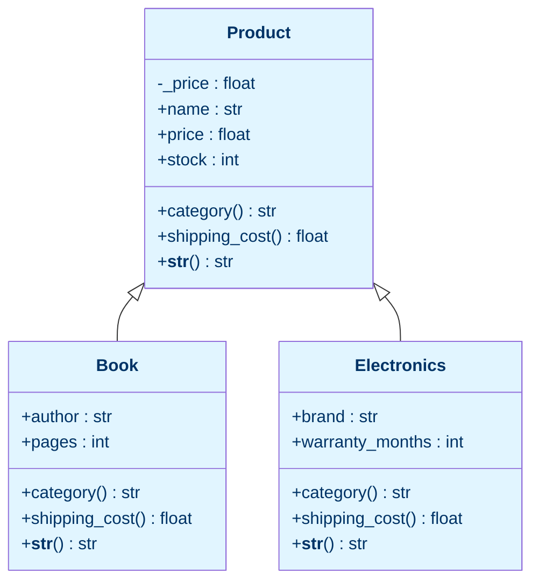

# Lab 8 — OOP I: Core Concepts

**Difficulty: Intermediate | ~25 min | Requires Lab 3**

---

## 1. Lab Title

**Object-Oriented Programming I: Classes, Encapsulation, Inheritance & Polymorphism**

---

## 2. Problem Statement / Use Case Overview

Your small shop needs a cleaner way to model its products than the plain
dictionaries you used in earlier labs. Instead of scattered dictionaries, you
will model each item as an **object**, and group related items into
**classes**.

This lab introduces the four pillars of OOP, one step at a time:

1. **Classes & objects** — a blueprint (`class`) and the concrete things made
   from it (objects / instances).
2. **Encapsulation** — keeping an object's data private behind controlled
   getter/setter methods (properties) so invalid values are rejected.
3. **Inheritance** — a `Book` and an `Electronics` class that reuse everything
   from a `Product` parent, then add their own attributes.
4. **Polymorphism** — the same method name (e.g., `shipping_cost`) behaving
   differently depending on the object type, called through a common interface.

By the end you will build an **inventory report** that iterates a single mixed
list of Products, Books, and Electronics — each object handling its own string
representation and shipping cost.

---

## 3. Input Data

This lab takes no specific external input — all object data is defined inline in the code.

---

## 4. Processing

1. **Define the `Product` class** — a simple blueprint with `__init__`,
   attributes, a `category()` method, a `shipping_cost()` method, and `__str__`.
2. **Create objects** — build `Cap` and `Hoodie` instances, read their
   attributes, and call their methods.
3. **Encapsulate** — improve `Product` so price is stored as a private
   `_price` attribute, read and written only through a validating property.
4. **Name mangling** — see how `__value` (double underscore) is renamed by
   Python so direct outside access fails.
5. **Inherit** — define `Book(Product)`, calling `super().__init__` to reuse the
   shared attributes, then add `author` and `pages`.
6. **Inherit again** — define `Electronics(Product)` the same way, adding
   `brand` and `warranty_months`.
7. **Override + `super()`** — see how `category()` and `__str__()` are
   overridden to extend the parent's version instead of replacing it.
8. **Polymorphism** — call `shipping_cost()` on a mixed list; each object runs
   its own version.
9. **Inventory report** — iterate a list of mixed types, printing each with
   `__str__` and summing total shipping.

---

## 5. Output

This lab produces no special output beyond the printed results of each code
snippet as you run it. The key outputs you should see:

- **Step 2:** `Cap - $14.99 (x20)` and `Hoodie - $49.99 (x8)`, plus the direct
  attribute reads (`Name: Cap`, `Price: 14.99`, `Stock: 20`) and method calls
  (`Shipping for the cap: 1.2`, `Shipping for the hoodie: 4.0`).
- **Step 3:** `Price via property: 14.99`, `Price after update: 19.99`, then
  `Rejected: Price cannot be negative`.
- **Step 4:** `Reveal: s3cr3t`, `Direct access fails: ...`, and
  `Mangled name: s3cr3t`.
- **Step 5–6:** the Book and Electronics lines, e.g.
  `Python Crash Course - $44.99 (x15) | by Eric Matthes (544p)` and
  `Wireless Mouse - $29.99 (x30) | LogiTech (24mo warranty)`, plus
  `True` for the `isinstance` checks.
- **Step 7:** `Parent category: General merchandise`,
  `Book category: General merchandise -> Books`, and
  `Electronics category: General merchandise -> Electronics`.
- **Step 8:** three shipping lines (Book `$2.25`, Electronics `$3.60`, Product
  `$1.60`).
- **Step 9 — inventory report:** a `=== INVENTORY REPORT ===` heading, five
  product lines, and a total:
  `Total shipping for all items: $15.25`.

---

## 6. Tech Stack

| Tool | Version | Purpose |
|---|---|---|
| Python | 3.10+ | Classes, objects, properties, inheritance, polymorphism |

No third-party packages are required.

---

## 7. Underlying Concepts

### What Is a Class?

A **class** is a blueprint describing the data (attributes) and behavior
(methods) an object will have. An **object** (or instance) is a concrete
realisation of that blueprint — a specific `Cap` at `$14.99`, not the abstract
idea of "a product".

The constructor `__init__` runs automatically when you create an object. Its
first parameter is always `self`, the object being created, which you fill with
attributes using `self.attribute = value`.

### Encapsulation & Properties

**Encapsulation** hides an object's internal state from direct outside access,
instead exposing controlled methods. Python does this by convention:

- `_name` (single underscore) — "private by convention": you signal "don't
  touch from outside", though it is still technically accessible.
- `__name` (double underscore) — triggers **name mangling**: Python renames it
  internally to `_ClassName__name`, making accidental or direct access fail.

A **property** wraps a private attribute with a getter and a setter. The setter
can validate the value — for example, refusing a negative price — so an object
can never hold invalid data.

```python
# The key idea of encapsulation: outside code reads `product.price`,
# never the raw `product._price`.
class Product:
    def __init__(self, name, price):
        self._price = price        # stored privately by convention

    @property
    def price(self):               # getter: product.price
        return self._price

    @price.setter
    def price(self, value):        # setter: product.price = 19.99
        if value < 0:
            raise ValueError("Price cannot be negative")
        self._price = value
```

### Inheritance & `super()`

**Inheritance** lets a child class reuse the parent's attributes and methods.
`Book` and `Electronics` inherit from `Product`, so they automatically get
`name`, `price`, `stock`, and the properties.

`super()` lets the child call the parent's method:

- `super().__init__(...)` runs the parent constructor to set shared attributes.
- `super().__str__()` reuses the parent's string then extends it.
- `super().category()` reuses the parent's category and appends to it.

### Polymorphism

**Polymorphism** ("many forms") means you can call the *same* method name on
different types and each runs *its* version. Every subclass defines its own
`shipping_cost()`, yet the caller just writes `item.shipping_cost()`. Wrapping
objects in a loop and calling that one name works uniformly — the object knows
which behaviour to use.



The diagram shows the class hierarchy: `Product` is the parent; `Book` and
`Electronics` inherit from it. Each child overrides `category()`,
`shipping_cost()`, and `__str__()` — the same method names resolving to
different behaviour depending on the concrete type (polymorphism).

---

## 8. Prerequisites

- Python 3.10 or higher.
- Completion of Lab 3 (Functions II) — comfortable with `def`, parameters,
  and `return`.
- Basic understanding of lists and printing with f-strings.

---

## 9. Environment / Dependencies Setup

This lab uses only Python's standard library — no third-party packages needed.

```bash
# Create a virtual environment (optional but recommended)
python -m venv .venv
source .venv/bin/activate   # Windows: .venv\Scripts\activate

# Upgrade pip (optional; no extra installs needed)
pip install --upgrade pip

# Install Jupyter (optional; skip if you already have it)
pip install notebook

# Launch the notebook
jupyter notebook lab-oop-core-concepts.ipynb
```

---

## 10. Step-wise Development Instructions

Open the notebook and work through each cell below in order.

**Cell 1 — Install dependencies.**

```python
# This lab uses only Python's built-in features, but this cell keeps the
# notebook runnable from a fresh kernel. It installs nothing extra.
!pip install --upgrade pip
```

This cell keeps the notebook runnable from a fresh kernel. Because this lab
needs nothing beyond Python itself, the line only refreshes `pip`.

**Cell 2 — Step 1: define the `Product` class.**

We start with the smallest useful class: a blueprint with three attributes and
two methods. Nothing is hidden yet.

```python
# A class is a blueprint. The class name is written in CapWords by convention.
class Product:
    # __init__ runs automatically when we create a new object ("instance").
    def __init__(self, name, price, stock):
        # We store each value on `self`, the object being created.
        self.name = name    # public attribute: anyone can read or write it
        self.price = price  # public attribute
        self.stock = stock  # public attribute

    # A method is a function that belongs to the object (it takes `self`).
    def category(self):
        return "General merchandise"

    # Methods can also compute a value as a "question" we ask the object.
    def shipping_cost(self):
        return round(self.price * 0.08, 2)   # 8% of the price

    # __str__ controls what print(obj) shows -- a friendly one-line summary.
    def __str__(self):
        return f"{self.name} - ${self.price:.2f} (x{self.stock})"
```

`self` is the object being built. Storing values as `self.name = name` gives
each object its own copies of the attributes. The `category()` and
`shipping_cost()` methods are just functions attached to the object.

**Cell 3 — Step 2: create objects and use them.**

```python
# Create two Product objects ("instances") from the same blueprint.
cap = Product("Cap", 14.99, 20)
hoodie = Product("Hoodie", 49.99, 8)

# print() calls __str__ automatically.
print(cap)
print(hoodie)

# We can read public attributes directly with dot notation.
print("Name:", cap.name)
print("Price:", cap.price)
print("Stock:", cap.stock)

# And we can call methods on an object.
print("Category:", cap.category())
print("Shipping for the cap:", cap.shipping_cost())
print("Shipping for the hoodie:", hoodie.shipping_cost())
```

Each object holds its own copies of the attributes. `print(cap)` uses
`__str__`; reading `cap.name` is a direct attribute read; `cap.shipping_cost()`
calls a method on that specific object.

**Cell 4 — Step 3: encapsulate the price with a property.**

Now we improve `Product` so its price can never become invalid. We store the
value in a private `_price` attribute and expose it through a **property** —
a getter for reading and a setter for writing that validates every new value.

```python
# Improve Product so its price is protected: store it as _price (private by
# convention) and expose a property that validates every assigned value.
class Product:
    def __init__(self, name, price, stock):
        self.name = name
        # Single underscore = "private by convention": outside code should go
        # through the property below, not touch _price directly.
        self._price = price
        self.stock = stock

    # @property turns the method price() into an attribute read: product.price
    @property
    def price(self):
        return self._price

    # The setter runs when someone assigns: product.price = 19.99
    @price.setter
    def price(self, value):
        # Validation: reject any price below zero before it is stored.
        if value < 0:
            raise ValueError("Price cannot be negative")
        self._price = value

    def category(self):
        return "General merchandise"

    def shipping_cost(self):
        return round(self.price * 0.08, 2)

    def __str__(self):
        return f"{self.name} - ${self.price:.2f} (x{self.stock})"

# Build a product with the improved class.
cap = Product("Cap", 14.99, 20)

# Reading goes through the property getter.
print("Price via property:", cap.price)

# Assigning runs the setter, which accepts a valid value...
cap.price = 19.99
print("Price after update:", cap.price)

# ...and rejects an invalid one before it can be stored.
try:
    cap.price = -5
except ValueError as error:
    print("Rejected:", error)
```

Assigning `cap.price = 19.99` invokes the property setter. Assigning `-5` is
rejected with a `ValueError` before it can be stored — the object can never
hold an invalid price.

**Cell 5 — Step 4: name mangling with `__`.**

A double underscore is stronger than a convention: Python renames the attribute
so the plain name fails outside the class. We demonstrate it on a tiny separate
class so the idea is isolated.

```python
# Name mangling: a double underscore makes an attribute hard to reach
# from outside the class.
class Password:
    def __init__(self, value):
        # Double underscore triggers "name mangling" inside Python.
        self.__value = value

    def reveal(self):
        return self.__value   # inside the class, the name still works

password = Password("s3cr3t")

# From inside the class (reveal) we can read __value normally.
print("Reveal:", password.reveal())

# Outside, the plain name no longer exists -- this raises AttributeError.
try:
    print(password.__value)
except AttributeError as error:
    print("Direct access fails:", error)

# Python actually renames it to _Password__value (class name prefixed).
print("Mangled name:", password._Password__value)
```

Because `__value` was mangled to `_Password__value`, writing
`password.__value` raises `AttributeError`. You *can* reach it if you know the
mangled name, but the outside world is discouraged from doing so — that's the
point of encapsulation.

**Cell 6 — Step 5: inherit `Book` from `Product`.**

Inheritance lets a child class reuse the parent's attributes and methods, then
add its own. `super().__init__` runs the parent constructor so `name`, `price`,
and `stock` are set once.

```python
# Inheritance: Book reuses everything from Product and adds its own data.
class Book(Product):
    def __init__(self, name, price, stock, author, pages):
        # super() calls the parent constructor to set the shared attributes.
        super().__init__(name, price, stock)
        self.author = author   # extra attributes only a Book has
        self.pages = pages

    # Override: a Book uses a cheaper 5% shipping rate instead of 8%.
    def shipping_cost(self):
        return round(self.price * 0.05, 2)

    # Override that EXTENDS the parent: reuse the parent string, then add to it.
    def __str__(self):
        return super().__str__() + f" | by {self.author} ({self.pages}p)"

    # Override that EXTENDS the parent's category label.
    def category(self):
        return super().category() + " -> Books"

# Create a Book instance.
book = Book("Python Crash Course", 44.99, 15, "Eric Matthes", 544)
print(book)
print("isinstance(book, Product):", isinstance(book, Product))
print("isinstance(book, Book):", isinstance(book, Book))
```

`Book(Product)` declares inheritance. `isinstance` confirms the "is-a"
relationship: a `Book` *is* a `Product` and also a `Book`.

**Cell 7 — Step 6: inherit `Electronics` from `Product`.**

Same pattern, different extra attributes and rules.

```python
# Electronics likewise specialises Product with brand and warranty data.
class Electronics(Product):
    def __init__(self, name, price, stock, brand, warranty_months):
        super().__init__(name, price, stock)
        self.brand = brand
        self.warranty_months = warranty_months

    # Override: electronics ship at 12% because they are heavier.
    def shipping_cost(self):
        return round(self.price * 0.12, 2)

    def __str__(self):
        return super().__str__() + f" | {self.brand} ({self.warranty_months}mo warranty)"

    def category(self):
        return super().category() + " -> Electronics"

# Create an Electronics instance.
phone = Electronics("Wireless Mouse", 29.99, 30, "LogiTech", 24)
print(phone)
print("isinstance(phone, Product):", isinstance(phone, Product))
print("isinstance(phone, Electronics):", isinstance(phone, Electronics))
```

Both subclasses call `super().__init__` — the shared attributes are set in one
place. Each child then stores its own extra attributes.

**Cell 8 — Step 7: method overriding with `super()` in depth.**

Each child overrides `category()`, but instead of starting from scratch it
calls `super().category()` and appends its own label. This is overriding that
*extends* the parent rather than replacing it wholesale.

```python
# The parent's version, then each child's version of the same method.
print("Parent category:", Product("Generic", 5.0, 1).category())
print("Book category:", book.category())
print("Electronics category:", phone.category())
```

Each child reused `super().category()` and appended its own label.

**Cell 9 — Step 8: polymorphism.**

```python
# Polymorphism: the same method name, shipping_cost(), but each object
# runs its own class's version.
for item in [book, phone, cap]:
    print(f"{item.name}: ${item.shipping_cost():.2f}")
```

All three objects expose `shipping_cost()`, but each computes a different
value: books 5%, electronics 12%, generic products 8%. The loop calls the same
name and each object runs its own version — polymorphism.

**Cell 10 — Step 9: inventory report.**

```python
# Treat every object as a Product; the right method runs automatically.
inventory = [
    cap,
    book,
    phone,
    Book("Fluent Python", 59.99, 10, "Luciano Ramalho", 792),
    Electronics("Bluetooth Speaker", 39.99, 12, "Sony", 12),
]

print("=== INVENTORY REPORT ===")
total_shipping = 0
for item in inventory:
    shipping = item.shipping_cost()
    total_shipping += shipping
    print(item)
print(f"Total shipping for all items: ${total_shipping:.2f}")
```

A single list mixes Products, Books, and Electronics. The loop calls
`shipping_cost()` and `print(item)` (which uses `__str__`) uniformly — each
object knows how to behave. Summing the shipping costs across types is the
practical payoff of inheritance plus polymorphism.

---

## 11. Optional Exercise

Add a fourth subclass, `Clothing(Product)`, with `size` and `material`
attributes. Give it:

- a `__str__` that extends `super().__str__()` with
  ` | size {size} ({material})`;
- a `shipping_cost()` of `6%` of the price (round to two decimals);
- a `category()` that returns `super().category() + " -> Clothing"`;
- a constructor that calls `super().__init__(name, price, stock)` first, then
  stores `size` and `material`.

Create a clothing item (e.g., `Clothing("T-Shirt", 24.99, 40, "M", "Cotton")`),
append it to the `inventory` list, and re-run the report. Confirm the total
shipping now includes the clothing item's 6% charge (it should increase from
`$15.25` to `$16.75`).

---

## 12. What We Learnt

- A **class** is a blueprint; an **object** is a concrete instance created by
  calling the class, which triggers `__init__`.
- **`self`** refers to the object being built/used and lets each instance carry
  its own attributes.
- **Encapsulation** protects data: single-underscore `_attr` is private by
  convention, while double-underscore `__attr` triggers name mangling to
  `_ClassName__attr`.
- **Properties** provide controlled getter/setter access and can **validate**
  values (e.g., reject a negative price) so objects never hold invalid state.
- **Inheritance** lets `Book` and `Electronics` reuse everything from
  `Product`; `super().__init__` runs the parent constructor.
- **Method overriding** lets a child redefine a parent method; calling
  `super().method()` inside it reuses the parent's logic and **extends** it.
- **Polymorphism** means calling the same method name on different types runs
  each type's version — enabling one uniform loop over a mixed list.
- **`__str__`** controls how an object prints to a person; **`__repr__`** is
  the developer-facing representation.