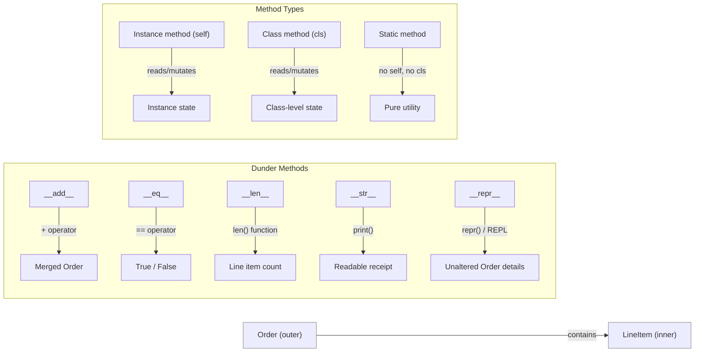

# Lab 9 — OOP II: Advanced Class Tools

**Difficulty: Intermediate | ~25 min | Requires Lab 8**

---

## 1. Lab Title

**Object-Oriented Programming II: Inner Classes, Static & Class Methods, Properties & Dunder Methods**

---

## 2. Problem Statement / Use Case Overview

Your shop now models products with classes (Lab 8), but orders are still handled
with loose lists and dictionaries. It is time to build a proper **Order** class
that groups `LineItem` objects, validates data, supports readable printing, and
lets you combine orders with normal Python operators.

This lab covers five advanced class tools, each studied as its own small step:

1. **Inner (nested) classes** — a `LineItem` class living *inside* `Order`,
   modelling one product line with name, quantity, and price.
2. **Static methods** — utility functions (like a discount calculator) that live
   on the class but need no `self` or `cls`.
3. **Class methods** — alternative constructors (`Order.from_dict`) and
   class-level state (an order counter) that work through `cls`.
4. **Properties** — controlled attribute access with validation (a read-only
   `total_price` and a validated `customer` name).
5. **Dunder (magic) methods** — `__str__`, `__repr__`, `__eq__`, `__len__`, and
   `__add__` so orders print nicely, compare by content, report their size, and
   merge with `+`.

By the end you will build a small ordering system that uses **all five tools
together** in one coherent model.

---

## 3. Input Data

This lab takes no specific external input — all object data is defined inline in the code.

---

## 4. Processing

1. **What is an inner class?** — a tiny `Wrapper` / `Child` example shows the
   nested-class pattern in isolation.
2. **Build the `Order` class in small pieces** — because a class is itself an
   object, we build it up over several short cells:
   - **Part 1:** the inner `LineItem` class plus the constructor and
     `add_item`;
   - **Part 2:** the static `calculate_discount`;
   - **Part 3:** the class methods `from_dict` and `get_order_count`;
   - **Part 4:** the `total_price` and `customer` properties;
   - **Parts 5–7:** the five dunder methods (`__str__`, `__repr__`, `__eq__`,
     `__len__`, `__add__`).
3. **Static method** — call `Order.calculate_discount(...)` with no instance.
4. **Class methods** — build an order from a dictionary with `from_dict`, read
   the shared counter with `get_order_count`.
5. **Properties** — read the computed `total_price`; watch the validated
   `customer` setter and `LineItem` constructor reject bad input.
6. **`__str__` vs `__repr__`** — a friendly multi-line receipt versus an
   unambiguous developer string.
7. **`__eq__` and `__len__`** — content-based equality and line-item count.
8. **`__add__`** — merge two orders with `+`, summing lines of the same product.
9. **Combined demo** — construct, print, compare, count, and combine orders
   using every tool at once.

---

## 5. Output

This lab produces no special output beyond the printed results of each code
snippet as you run it. The key outputs you should see:

- **Step 1:** `Child(42)`.
- **Step 3:** `Discount on $100 at 15%: 15.0`.
- **Step 4:** a multi-line order receipt for Carol ending in
  `Total: $1050.99`, then a line like `Orders created so far: 3` — the **count
  depends on how many orders your session has created**, so expect a larger
  number later in the notebook.
- **Step 5:** `Total via property: 1050.99`,
  `Empty customer rejected: Customer name cannot be empty`, and
  `Line item validation: Quantity must be positive`.
- **Step 6:** the three-line `str` receipt for Dave (total `$13.0`) and one
  `repr` line starting `Order(customer='Dave', ...)`.
- **Step 7:** `order_d == order_e: True`, `order_d == order_f: False`, and
  `len(order_d): 1`.
- **Step 8:** the merged Frank receipt — `Apple x4`, `Banana x2`, `Cherry x4`,
  total `$14.0` — proving the `Apple` quantities were summed.
- **Step 9:** the Alice and Bob receipts, `len(combined): 4`, and a combined
  order whose total is `$31.0`.

The build cells (Step 2, parts 1–7) print nothing; their only effect is adding
each tool to the `Order` class, which the demo cells then use.

The only run-dependent value is the order counter; every receipt, equality,
length, and total is stable regardless of how many times you run the cells.

---

## 6. Tech Stack

| Tool | Version | Purpose |
|---|---|---|
| Python | 3.10+ | Classes, inner classes, static/class methods, properties, dunder methods |

No third-party packages are required.

---

## 7. Underlying Concepts

### Inner (Nested) Classes

An **inner class** is defined inside another class. `LineItem` lives inside
`Order` because a line item has no meaning without its parent order — it is
logically *owned* by the order. You access it as `Order.LineItem(...)`.

### Static Methods

A **static method** (`@staticmethod`) is a plain function that lives on the
class namespace. It receives no implicit first argument (`self` or `cls`), so
it cannot access or modify instance or class state. Use it for utility logic
that logically belongs to the class but does not need the object itself.

### Class Methods

A **class method** (`@classmethod`) receives the class itself as the first
argument, conventionally named `cls`. This makes it perfect for:

- **Alternative constructors** — `cls(...)` inside the method creates an
  instance of the correct class, even in subclasses.
- **Class-level state** — shared counters, registries, or caches that belong to
  the class, not any single instance.

### Properties

A **property** (`@property`) provides controlled attribute access. The getter
returns the value; the setter can validate before assigning. Properties let you
expose computed values (like `total_price`) as if they were plain attributes.

### Dunder (Magic) Methods

Dunder methods let your objects work with Python's built-in syntax:

| Dunder Method | Triggered By | Purpose |
|---|---|---|
| `__str__` | `str(obj)`, `print(obj)` | Human-readable string |
| `__repr__` | `repr(obj)`, REPL display | Unambiguous, developer-facing string |
| `__eq__` | `obj1 == obj2` | Content-based equality |
| `__len__` | `len(obj)` | Report size (number of line items) |
| `__add__` | `obj1 + obj2` | Combine two objects |



The diagram shows the two key ideas: (1) dunder methods map to Python operators
and built-in functions so your objects feel native, and (2) the three method
types differ in what they can access — instances, the class itself, or neither.

---

## 8. Prerequisites

- Python 3.10 or higher.
- Completion of Lab 8 (OOP I) — comfortable with classes, `self`, `__init__`,
  `__str__`, `__repr__`, and properties.
- Basic understanding of lists and f-strings.

---

## 9. Environment / Dependencies Setup

This lab uses only Python's standard library — no third-party packages needed.

```bash
# Create a virtual environment (optional but recommended)
python -m venv .venv
source .venv/bin/activate   # Windows: .venv\Scripts\activate

# Upgrade pip (optional; no extra installs needed)
pip install --upgrade pip

# Install Jupyter (optional; skip if you already have it)
pip install notebook

# Launch the notebook
jupyter notebook lab-oop-advanced-tools.ipynb
```

---

## 10. Step-wise Development Instructions

Open the notebook and work through each cell below in order.

**Cell 1 — Install dependencies.**

```python
# This lab uses only Python's built-in features, but this cell keeps the
# notebook runnable from a fresh kernel. It installs nothing extra.
!pip install --upgrade pip
```

This cell keeps the notebook runnable from a fresh kernel. Because this lab
needs nothing beyond Python itself, the line only refreshes `pip`.

**Cell 2 — Step 1: what is an inner class?**

Before building the real order system, we practise the nested-class pattern on a
tiny example so the concept is isolated.

```python
# An inner (nested) class is simply a class defined inside another class.
# We usually do this when the inner concept only makes sense inside the outer one.

class Wrapper:
    # Child lives inside Wrapper -- you reach it as Wrapper.Child.
    class Child:
        def __init__(self, value):
            self.value = value

        def __str__(self):
            return f"Child({self.value})"

# To create one, we first name the outer class, then the inner class.
child = Wrapper.Child(42)
print(child)   # prints via Child.__str__
```

`Child` only exists as `Wrapper.Child`. The nesting makes the "belongs to"
relationship visible in the code. In the real system, `LineItem` will belong to
`Order` the same way.

**Cells 3–9 — Step 2: build the `Order` class in small pieces.**

Instead of one long class cell, we build the class across several short cells.
A class is itself just an object, so once `Order` is defined we can keep
*attaching* more methods to it from later cells. Within each cell we use the
`@staticmethod` / `@classmethod` / `@property` decorators (which wrap a plain
function), then assign the wrapped result to `Order`. Each cell stays short and
focuses on exactly one tool.

**Cell 3 — Step 2, part 1: the inner `LineItem` class and order basics.**

This cell creates `Order` with the inner `LineItem` class, the shared order
counter, the constructor, and `add_item`.

```python
class Order:
    # --- class attribute: state shared by every Order instance ---
    _id_counter = 0   # counts every Order we create (set from __init__)

    # --- inner class: one product line inside an order ---
    class LineItem:
        def __init__(self, name, quantity, price):
            # Validate at construction so an item can never be invalid.
            if quantity <= 0:
                raise ValueError("Quantity must be positive")
            if price <= 0:
                raise ValueError("Price must be positive")
            self.name = name        # product name, e.g. "Coffee"
            self.quantity = quantity
            self.price = price

        # Computed property: cost of this line (reads like a plain attribute).
        @property
        def total_price(self):
            return round(self.quantity * self.price, 2)

        # Human-readable line for print(order).
        def __str__(self):
            return f"  {self.name} x{self.quantity} @ ${self.price} = ${self.total_price}"

        # Developer-facing, unambiguous representation.
        def __repr__(self):
            return f"LineItem({self.name!r}, {self.quantity!r}, {self.price!r})"

        # Content equality: two lines are equal when all fields match.
        def __eq__(self, other):
            if not isinstance(other, Order.LineItem):
                return NotImplemented
            return (self.name == other.name
                    and self.quantity == other.quantity
                    and self.price == other.price)

        # len(item) returns how many units of this product were ordered.
        def __len__(self):
            return self.quantity

    # --- constructor ---
    def __init__(self, customer):
        Order._id_counter += 1   # bump the shared counter
        self.customer = customer # validated by the property below
        self.items = []          # empty list of lines; fill via add_item()

    def add_item(self, item):
        # One public way to grow the order's list of line items.
        self.items.append(item)
```

`LineItem` is defined *inside* `Order`, so it only exists as `Order.LineItem`.
Its `__eq__` compares all three fields, `__len__` returns the quantity, and the
`total_price` property computes the line's cost. So far `Order` can only hold
items — the five tools still to come are attached in the next cells.

**Cell 4 — Step 2, part 2: attach the static method.**

We define `calculate_discount` as a plain function, wrap it with
`staticmethod()` so Python does not treat it as an instance method, and assign
the wrapped function to `Order`.

```python
# A class is just an object, so we can attach more methods to Order
# from a new cell. staticmethod() wraps the raw function so it is not
# treated as an instance method.

@staticmethod
def calculate_discount(amount, percent):
    # Pure calculation; call it as Order.calculate_discount(100, 15).
    return round(amount * percent / 100, 2)

Order.calculate_discount = calculate_discount
```

A static method receives no `self` and no `cls` — it is a tidy helper that
lives on the class but only uses the arguments you pass it.

**Cell 5 — Step 2, part 3: attach the class methods.**

`classmethod()` wraps each function so Python passes the class itself as the
first argument (conventionally named `cls`).

```python
# classmethod() wraps the function in a descriptor that passes cls.

@classmethod
def from_dict(cls, data):
    # Builds an Order from a plain dictionary of items.
    order = cls(data["customer"])   # cls() constructs the right class
    for item in data["items"]:
        order.add_item(cls.LineItem(item["name"], item["quantity"], item["price"]))
    return order

Order.from_dict = from_dict

@classmethod
def get_order_count(cls):
    # Reads the class attribute shared by all instances.
    return cls._id_counter

Order.get_order_count = get_order_count
```

`from_dict` is an **alternative constructor**: `cls(data["customer"])` creates
an instance of whatever class the method is called on. `get_order_count` reads
the class-level `_id_counter` that every instance shares.

**Cell 6 — Step 2, part 4: attach the properties.**

`property()` combines the getter and setter into one attribute object, which we
then assign to `Order`.

```python
# property() combines the getter and setter into one object we assign.

@property
def total_price(self):
    # Read-only computed property: sum of every line's cost.
    return round(sum(item.total_price for item in self.items), 2)

Order.total_price = total_price

@property
def customer(self):
    return self._customer

@customer.setter
def customer(self, value):
    # Validation: an order must belong to a non-empty customer name.
    if not value or not value.strip():
        raise ValueError("Customer name cannot be empty")
    self._customer = value

Order.customer = customer
```

`total_price` has a getter only, so it is read-only and always computed on
demand. `customer` has both a getter and a setter, and the setter validates the
value before it is stored.

**Cell 7 — Step 2, part 5: attach `__str__` and `__repr__`.**

Dunder methods are plain functions whose names start and end with two
underscores — assign them to `Order` exactly like any other method.

```python
def __str__(self):
    # Multi-line, human-readable receipt for print(order).
    lines = [f"Order for {self.customer}:"]
    for item in self.items:
        lines.append(str(item))
    lines.append(f"  Total: ${self.total_price}")
    return "\n".join(lines)

Order.__str__ = __str__

def __repr__(self):
    # Unambiguous developer representation.
    return f"Order(customer={self.customer!r}, items={self.items!r})"

Order.__repr__ = __repr__
```

**Cell 8 — Step 2, part 6: attach `__eq__` and `__len__`.**

```python
def __eq__(self, other):
    # Two orders are equal when customer and line items both match.
    if not isinstance(other, Order):
        return NotImplemented
    return self.customer == other.customer and self.items == other.items

Order.__eq__ = __eq__

def __len__(self):
    # len(order) = number of distinct line items.
    return len(self.items)

Order.__len__ = __len__
```

`__eq__` returns `NotImplemented` when the other object is not an `Order`, so
Python can fall back to the other side instead of raising. `__len__` reports
the number of line items.

**Cell 9 — Step 2, part 7: attach `__add__`.**

The `__add__` method is the longest — it gets its own cell so the merge logic
is easy to read.

```python
def __add__(self, other):
    # order1 + order2 creates a new Order that merges both line lists.
    if not isinstance(other, Order):
        return NotImplemented
    merged = Order(self.customer)                    # fresh order for the result
    for item in self.items:                          # copy this order's lines first
        merged.add_item(Order.LineItem(item.name, item.quantity, item.price))
    for other_item in other.items:                   # then the other order's lines
        merged_line = None
        for line in merged.items:
            if line.name == other_item.name:         # same product -> merge
                merged_line = line
                break
        if merged_line is not None:
            merged_line.quantity += other_item.quantity   # sum the quantities
        else:
            merged.add_item(Order.LineItem(
                other_item.name, other_item.quantity, other_item.price))
    return merged

Order.__add__ = __add__
```

The `Order` class is complete. The demo cells (Cells 10–16) each **demonstrate
one tool** in isolation, so you can study each concept on its own.

**Cell 10 — Step 3: static method.**

A `@staticmethod` lives on the class but needs no `self` or `cls` — call it on
the class directly, without creating an order.

```python
# Static methods need no instance: call them on the class directly.
print("Discount on $100 at 15%:", Order.calculate_discount(100, 15))
# A static method receives no self or cls, so it cannot touch object or
# class state -- it is just a tidy helper that lives on the class.
```

```text
Discount on $100 at 15%: 15.0
```

**Cell 11 — Step 4: class methods.**

`from_dict` builds an order from a dictionary via `cls(...)`, so it works
correctly even if the class is later subclassed. `get_order_count` reads the
class-level `_id_counter` shared across all instances.

```python
# from_dict is an alternative constructor driven by a dictionary.
order_a = Order.from_dict({
    "customer": "Carol",
    "items": [
        {"name": "Laptop", "quantity": 1, "price": 999.99},
        {"name": "Mouse", "quantity": 2, "price": 25.50},
    ],
})
print(order_a)

# get_order_count reads the class-level counter shared by all instances.
print("Orders created so far:", Order.get_order_count())
```

```text
Order for Carol:
  Laptop x1 @ $999.99 = $999.99
  Mouse x2 @ $25.5 = $51.0
  Total: $1050.99
Orders created so far: 1
```

**Cell 12 — Step 5: properties.**

`total_price` is a **read-only computed property** — no setter, it always sums
the item totals. The `customer` property validates that the name is non-empty,
and `LineItem`'s constructor validates quantity and price.

```python
# Build an order manually, then read the computed total property.
order_b = Order("Carol")
order_b.add_item(Order.LineItem("Laptop", 1, 999.99))
order_b.add_item(Order.LineItem("Mouse", 2, 25.50))
print("Total via property:", order_b.total_price)   # computed on demand

# The customer setter validates its input before storing.
try:
    order_b.customer = None
except ValueError as error:
    print("Empty customer rejected:", error)

# LineItem validates its own values in the constructor.
try:
    Order.LineItem("Bad", 0, 5.0)
except ValueError as error:
    print("Line item validation:", error)
```

```text
Total via property: 1050.99
Empty customer rejected: Customer name cannot be empty
Line item validation: Quantity must be positive
```

**Cell 13 — Step 6: `__str__` vs `__repr__`.**

`__str__` produces a readable multi-line receipt; `__repr__` is an unambiguous
representation showing the class name and all key fields, useful for debugging.

```python
# __str__ is the friendly text for print(); __repr__ is for developers.
order_c = Order("Dave")
order_c.add_item(Order.LineItem("Bread", 3, 3.0))
order_c.add_item(Order.LineItem("Tea", 1, 4.0))
print("str output:")
print(order_c)
print("repr output:")
print(repr(order_c))
```

```text
str output:
Order for Dave:
  Bread x3 @ $3.0 = $9.0
  Tea x1 @ $4.0 = $4.0
  Total: $13.0
repr output:
Order(customer='Dave', items=[LineItem('Bread', 3, 3.0), LineItem('Tea', 1, 4.0)])
```

**Cell 14 — Step 7: `__eq__` and `__len__`.**

Two orders are equal when they have the same customer and the same line items.
`len(order)` returns the number of line items (not the total quantity).

```python
# Content equality and length.
order_d = Order("Eve")
order_d.add_item(Order.LineItem("Cake", 1, 20.0))
order_e = Order("Eve")
order_e.add_item(Order.LineItem("Cake", 1, 20.0))
print("order_d == order_e:", order_d == order_e)   # same customer + items
order_f = Order("Eve")
order_f.add_item(Order.LineItem("Juice", 2, 5.0))
print("order_d == order_f:", order_d == order_f)   # different items
print("len(order_d):", len(order_d))               # one line item
```

```text
order_d == order_e: True
order_d == order_f: False
len(order_d): 1
```

**Cell 15 — Step 8: `__add__`.**

`+` merges two orders. Matching product names have their quantities summed; the
result is a fresh `Order` (the originals are unchanged).

```python
# Combine two orders with +, merging lines that share a product name.
order1 = Order("Frank")
order1.add_item(Order.LineItem("Apple", 3, 2.0))
order1.add_item(Order.LineItem("Banana", 2, 1.5))

order2 = Order("Frank")
order2.add_item(Order.LineItem("Apple", 1, 2.0))   # same product -> merges
order2.add_item(Order.LineItem("Cherry", 4, 0.75))

combined_demo = order1 + order2
print(combined_demo)
```

```text
Order for Frank:
  Apple x4 @ $2.0 = $8.0
  Banana x2 @ $1.5 = $3.0
  Cherry x4 @ $0.75 = $3.0
  Total: $14.0
```

The `Apple` line shows `x4` because `Order.__add__` matched the two `Apple`
lines and summed their quantities (`3 + 1`), while keeping the unit price.

**Cell 16 — Step 9: everything together.**

All five tools at once: `LineItem` objects created through the outer class,
static and class methods, computed properties, and dunder methods for printing,
comparison, size, and addition.

```python
# Everything together: construct, print, compare, and combine.
order_a2 = Order("Alice")
order_a2.add_item(Order.LineItem("Coffee", 2, 5.0))
order_a2.add_item(Order.LineItem("Milk", 1, 8.0))
print(order_a2)

order_b2 = Order("Bob")
order_b2.add_item(Order.LineItem("Bread", 3, 3.0))
order_b2.add_item(Order.LineItem("Tea", 1, 4.0))
print(order_b2)

print("repr(order_a2):", repr(order_a2))
print("Orders created so far:", Order.get_order_count())

combined = order_a2 + order_b2
print("Combined order:")
print(combined)
print("len(combined):", len(combined))
```

```text
Order for Alice:
  Coffee x2 @ $5.0 = $10.0
  Milk x1 @ $8.0 = $8.0
  Total: $18.0
Order for Bob:
  Bread x3 @ $3.0 = $9.0
  Tea x1 @ $4.0 = $4.0
  Total: $13.0
repr(order_a2): Order(customer='Alice', items=[LineItem('Coffee', 2, 5.0), LineItem('Milk', 1, 8.0)])
Orders created so far: 11
Combined order:
Order for Alice:
  Coffee x2 @ $5.0 = $10.0
  Milk x1 @ $8.0 = $8.0
  Bread x3 @ $3.0 = $9.0
  Tea x1 @ $4.0 = $4.0
  Total: $31.0
len(combined): 4
```

(The `Orders created so far` number depends on your session — every `Order(...)`
call and every `+` merge bumps it — but everything else is deterministic.)

---

## 11. Optional Exercise

Add a `remove_item(self, product_name)` method to `Order` that removes the first
`LineItem` matching `product_name`. If the product is not found, raise a
`ValueError` with the message `"Product not found in order"`.

Then:

1. Create an order with three line items.
2. Print the order and confirm `len()` is 3.
3. Remove the middle item.
4. Print the order again and confirm `len()` is 2 and the total has updated.

---

## 12. What We Learnt

- An **inner class** (e.g., `LineItem` inside `Order`) is logically owned by the
  outer class and accessed as `Order.LineItem(...)`.
- A **static method** (`@staticmethod`) is a plain function on the class — it
  needs no `self` or `cls`, so it cannot access instance or class state.
- A **class method** (`@classmethod`) receives `cls`, enabling alternative
  constructors (`from_dict`) that work correctly with subclasses and class-level
  state (`_id_counter`) shared across all instances.
- **Properties** provide controlled attribute access: computed properties
  (like `total_price`) are read-only by default, and setters can validate
  input.
- **`__str__`** controls what `print(obj)` shows; **`__repr__`** provides an
  unambiguous developer-facing representation including the class name and key
  fields.
- **`__eq__`** defines content-based equality so `order1 == order2` compares
  meaningful fields rather than object identity.
- **`__len__`** makes `len(obj)` work — returning the number of line items.
- **`__add__`** lets you combine objects with `+` — here, merging two orders
  and summing matching line items.
- Returning `NotImplemented` from `__eq__` or `__add__` when the other object
  is an unexpected type lets Python fall back to the default behaviour instead
  of raising an error.