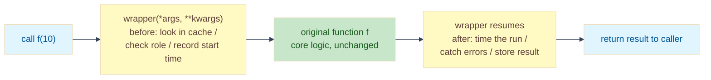

# Lab: The Metaprogramming Toolkit — Decorators, Closures, and Caching

Difficulty: Intermediate | ~40 min | Requires basic Python (functions, classes, try/except)

---

## 1. Lab Title

**The Metaprogramming Toolkit** — wrapping existing functions with four
decorators (`@timer`, `@authenticate`, `@retry`, `@cache`) so you can add
logging, performance tracking, security, and caching to a messy codebase
*without modifying the core functions themselves*.

---

## 2. Problem Statement / Use Case Overview

You inherit a working but messy backend: nobody knows how slow the functions
are, the sensitive ones are callable by anyone, flaky network calls fail the
whole request, and expensive results get recomputed over and over.

**Decorators** wrap a function with another function, so the core stays
untouched while timing, security, retry, and caching happen *around* it. This
lab builds a four-decorator toolkit (`@timer`, `@authenticate`, `@retry`,
`@cache`) from scratch — closures, `*args/**kwargs`, `functools.wraps` — and
proves each one with a working demo.

---

## 3. Input Data

No external files, no API keys. The lab decorates four small in-code functions:

- `find_primes(limit)` — number-theory workload for `@timer`.
- `delete_user(user_id)` — protected action for `@authenticate` (a simulated
  global `current_user` dict gates access).
- `fetch_orders()` — fails like a flaky network call, for `@retry`.
- `expensive(n)` — deliberately slow computation, for `@cache`.

Everything is deterministic in code; `random` is imported only so learners can
swap the deterministic flaky counter for real random failures (Section 11).

---

## 4. Processing

1. **Warm up** — prove a function can wrap another function by hand, and see
   what the naive approach costs (the original function's name is lost).
2. **Part 1 — `@timer`**: measure and print elapsed time, returning the
   function's result untouched.
3. **Part 2 — `@authenticate(role="admin")`**: a *decorator factory* that checks
   a shared user state and raises `PermissionError` on a role mismatch.
4. **Part 3 — `@retry(max_attempts=3)`**: re-run a function that raises
   `ConnectionError`, then give up with a clear error after the attempts run out.
5. **Part 4 — `@cache`**: memoize results in a closure-held dict keyed by the
   call's arguments, skipping re-computation on a hit.
6. **The ledger** — render every decorator, the concern it handles, and its demo
   outcome as a `tabulate` table.

---

## 5. Output

All values are from a clean run. The only machine-dependent value is the
`@timer` elapsed time — the number differs, the shape doesn't.

- Warm up: `HELLO TEAM!`, then `function name is now: wrapper`.
- `@timer`: `find_primes ran in 0.0033s` then `primes found: 303`.
- `@authenticate`: `Deleted user 7`; after the role switch, `Denied: alice needs role 'admin'`.
- `@retry`: `Attempt 1 failed: gateway timed out`, `Attempt 2 failed: ...`, then
  `['order A', 'order B']`; running out of attempts prints
  `giving up after 3 attempts: gateway timed out`.
- `@cache`: the first `expensive(10)` prints `computing expensive ...`, the
  second call is silent (cache hit), `expensive(12)` computes again:

```
computing expensive ...
100
100
computing expensive ...
144
```

Final ledger:

```
+---------------+-----------------------+------------------------------+
| Decorator     | Concern               | Demo outcome                 |
+===============+=======================+==============================+
| @timer        | performance tracking  | prints elapsed seconds       |
+---------------+-----------------------+------------------------------+
| @authenticate | access control        | admin allowed, viewer denied |
+---------------+-----------------------+------------------------------+
| @retry        | flaky-call resilience | 2 retries then success       |
+---------------+-----------------------+------------------------------+
| @cache        | avoid re-computation  | computed once, reused twice  |
+---------------+-----------------------+------------------------------+
```

---

## 6. Tech Stack

- **Python 3.9+** — the entire lab runs on the standard library:
  - `functools.wraps` — preserves a wrapped function's name and docstring,
  - `time.perf_counter` — high-precision timing for `@timer`,
  - `random` — available for the flaky-call simulation (deterministic by default),
  - `tabulate == 0.10.0` — used only to render the final ledger table.

No GPU, no API keys, no paid services. Runs on any laptop CPU with a few MB of RAM.

---

## 7. Underlying Concepts

### Functions are objects

`def` creates a function object just like any other value. It can be passed to a
function as an argument and returned from one as a result. That single fact makes
everything in this lab possible: a decorator is just a function that *takes a
function and returns a new function*.

### The `@` syntax is sugar

Writing:

```python
@timer
def find_primes(limit): ...
```

is exactly equivalent to running `find_primes = timer(find_primes)` after the
`def`. The name `find_primes` no longer points at your original function — it
points at the `wrapper` that `timer` returned. Every call to `find_primes(...)`
now goes through that wrapper.

### Closures: the wrapper's memory

`wrapper` is nested inside `timer`, so it can reference `func` — the variable
from the *enclosing* function's scope. When `timer` returns, its frame would
normally be garbage-collected, but Python keeps it alive because `wrapper` still
references it. This captured state is a **closure**. Each decorator type uses it
to remember something across calls: the original function (`@timer`), the
required role (`@authenticate`), the retry budget (`@retry`), or the whole cache
dict (`@cache`).

### `*args, **kwargs`: forward everything

A wrapper must work for *any* function signature. `*args` collects all positional
arguments into a tuple; `**kwargs` collects all keyword arguments into a dict.
`wrapper(*args, **kwargs)` forwards them verbatim to the original function, so the
decorator never needs to know what arguments the wrapped function takes.

### `functools.wraps`: don't break introspection

The warm-up shows the naive wrapper's flaw: `greet.__name__` becomes `wrapper`.
Tools and debugging rely on a function's `__name__` and `__doc__`. The
`@functools.wraps(func)` decorator inside a wrapper copies those attributes from
the original function onto the wrapper, so `find_primes.__name__` stays
`find_primes`.

### Decorator factories: decorators with arguments

`@timer` takes the function directly, but `@authenticate(role="admin")` and
`@retry(max_attempts=3)` take an argument first. These are **decorator
factories**: calling `authenticate(role)` returns the actual decorator, which
then wraps the function. Three levels nest: `authenticate` (holds the role) →
`decorator` (holds the function) → `wrapper` (holds the call state). Each level
has its own closure scope.

### Aspect-oriented programming

The core function owns only its business logic; timing, authorization, retries,
and caching are **cross-cutting concerns** that would otherwise be copy-pasted
into every function. A decorator attaches each concern around the core without
modifying it — you can add, remove, or reorder concerns independently. That
separation is the takeaway of this lab.

### How a decorated call flows



The wrapper is the only code that sees both sides of the call. Whatever happens
inside the core function, the wrapper can act before, act after, or — with
`@retry` — *not return at all* until the call finally succeeds or the budget is
spent.

---

## 8. Prerequisites

- Comfortable writing functions and `try/except`.
- A basic idea of what a dict is (used for user state and the cache).
- No prior decorator experience needed — that is the whole point of this lab.
- No accounts, API keys, or hardware requirements.

---

## 9. Environment / Dependencies Setup

Python 3.9+. From the lab folder:

```bash
python --version                    # must be 3.9+
python -m venv .venv                # optional but recommended
.venv\Scripts\activate              # Windows (macOS/Linux: source .venv/bin/activate)
pip install tabulate==0.10.0 notebook
jupyter notebook lab-metaprogramming-toolkit.ipynb
```

The notebook's **first cell** also runs `!pip install tabulate==0.10.0`, so any
existing Jupyter/VS Code environment works — run the first cell and you're set.

---

## 10. Step-wise Development Instructions

Work through the notebook cell by cell. Each step is explained before the code
it runs.

### Step 1 — Warm up: functions are objects

Before decorators, see the raw mechanism. `shout` takes a function, builds a
`wrapper` that calls it and transforms the result, and returns the wrapper. We
then rebind the name `greet` to that wrapper — the same thing `@` does for you,
minus the syntax. The second print reveals the cost: `greet.__name__` is now
`wrapper`, because the original function's identity was not carried over.

```python
# Functions are objects, so they can be passed in and returned. Here we
# hand greet to shout, get back a wrapper, and rebind the name greet to it.
def shout(func):
    def wrapper(name):
        return func(name).upper() + "!"
    return wrapper

def greet(name):
    return f"hello {name}"

greet = shout(greet)
print(greet("team"))
print("function name is now:", greet.__name__)
```

This prints `HELLO TEAM!` and `function name is now: wrapper`.

### Step 2 — The imports

Everything except `tabulate` is built into Python: `functools` for
`functools.wraps`, `time` for timing, and `random` for the flaky-call
simulation.

```python
import functools
import random
import time
```

### Step 3 — Part 1: the `@timer` decorator

The pattern every decorator in this lab follows: `timer` takes `func`, defines a
`wrapper`, and returns it. Inside the wrapper, `time.perf_counter()` is read
before and after the real call; the elapsed time is printed, and the result is
passed through untouched. `@functools.wraps(func)` copies `func`'s name and
docstring onto the wrapper so introspection keeps working. `@timer` above
`find_primes` is shorthand for `find_primes = timer(find_primes)`.

```python
# @timer measures a function's run time and prints it, then returns the
# result untouched. @functools.wraps copies the original name/docstring
# onto the wrapper so introspection keeps working.
def timer(func):
    @functools.wraps(func)
    def wrapper(*args, **kwargs):
        start = time.perf_counter()
        result = func(*args, **kwargs)
        elapsed = time.perf_counter() - start
        print(f"{func.__name__} ran in {elapsed:.4f}s")
        return result
    return wrapper

@timer
def find_primes(limit):
    return [n for n in range(2, limit + 1)
            if all(n % d for d in range(2, int(n ** 0.5) + 1))]

primes = find_primes(2000)
print("primes found:", len(primes))
```

The output is the elapsed time (the number varies per machine) and
`primes found: 303`.

### Step 4 — Part 2: the `@authenticate` decorator factory

`@authenticate(role="admin")` needs an argument, so `authenticate` is a factory:
calling it with the role returns the real `decorator`, which in turn returns the
`wrapper`. The wrapper consults a shared `current_user` dict. On a role mismatch
it raises `PermissionError`; otherwise it calls the wrapped function. The demo
runs the delete as an admin, then flips `current_user["role"]` to `"viewer"` and
shows the same call now denied — with the core `delete_user` unchanged.

```python
# @authenticate(role=...) needs an argument, so authenticate is a factory:
# calling it returns the real decorator. The wrapper reads a shared
# current_user dict and raises PermissionError if the role does not match.
current_user = {"name": "alice", "role": "admin"}

def authenticate(role):
    def decorator(func):
        @functools.wraps(func)
        def wrapper(*args, **kwargs):
            if current_user.get("role") != role:
                raise PermissionError(
                    f"{current_user['name']} needs role '{role}'")
            return func(*args, **kwargs)
        return wrapper
    return decorator

@authenticate(role="admin")
def delete_user(user_id):
    return f"Deleted user {user_id}"

print(delete_user(7))

current_user["role"] = "viewer"
try:
    delete_user(7)
except PermissionError as error:
    print("Denied:", error)
```

The output shows `Deleted user 7` then `Denied: alice needs role 'admin'`.

### Step 5 — Part 3: the `@retry` decorator

`retry(max_attempts=3)` is another factory. The wrapper loops through the
attempt budget; each `ConnectionError` is caught, reported, and the loop moves
on. Success returns immediately. If every attempt fails, the last error is
re-raised as a `RuntimeError` *after* the loop. The demo drives a deterministic
`flaky` counter so output is reproducible: two failures then success, and — with
the counter reset to five — three failures then give-up.

```python
# @retry(max_attempts=...) retries the wrapped call when it raises
# ConnectionError (a flaky network in real life). If every attempt fails,
# the last error is re-raised as a RuntimeError after the loop.
def retry(max_attempts=3):
    def decorator(func):
        @functools.wraps(func)
        def wrapper(*args, **kwargs):
            for attempt in range(1, max_attempts + 1):
                try:
                    return func(*args, **kwargs)
                except ConnectionError as error:
                    print(f"Attempt {attempt} failed: {error}")
                    last_error = error
            raise RuntimeError(
                f"giving up after {max_attempts} attempts: {last_error}")
        return wrapper
    return decorator

flaky = {"failures_left": 2}

@retry(max_attempts=3)
def fetch_orders():
    if flaky["failures_left"] > 0:
        flaky["failures_left"] -= 1
        raise ConnectionError("gateway timed out")
    return ["order A", "order B"]

print(fetch_orders())

# Give up path: more failures than attempts.
flaky["failures_left"] = 5
try:
    fetch_orders()
except RuntimeError as error:
    print(error)
```

The output is two `Attempt N failed: gateway timed out` lines followed by
`['order A', 'order B']`, then three attempt lines and
`giving up after 3 attempts: gateway timed out`.

### Step 6 — Part 4: the `@cache` decorator

`cache` creates the `store` dict in its own scope, so every decorated function
gets its own private cache via the closure. `key = args` is a tuple of the
positional arguments — hashable, so it works as a dict key. On a hit the wrapped
function is never called; on a miss it is computed and stored. The demo calls
`expensive(10)` twice: the first prints `computing expensive ...`, the second is
silent and instant.

```python
# @cache memoizes results. store lives in the closure, one dict per
# decorated function. key = args (a tuple, so it is hashable); on a hit
# the function body is skipped entirely.
def cache(func):
    store = {}

    @functools.wraps(func)
    def wrapper(*args, **kwargs):
        key = args
        if key not in store:
            print(f"computing {func.__name__} ...")
            store[key] = func(*args, **kwargs)
        return store[key]
    return wrapper

@cache
def expensive(n):
    time.sleep(0.02)  # pretend this is a slow computation
    return n ** 2

print(expensive(10))
print(expensive(10))  # cached: no "computing" line, returns instantly
print(expensive(12))
```

The output prints `computing expensive ...` once, then `100`, `100`, then
`computing expensive ...` again and `144` for the new argument.

### Step 7 — The toolkit ledger

Finally, collect each decorator, the concern it handles, and what the demo proved
into a `tabulate` table. One glance shows the whole point: four administrative
concerns wrapped around untouched core functions.

```python
from tabulate import tabulate

ledger = [
    ["@timer", "performance tracking", "prints elapsed seconds"],
    ["@authenticate", "access control", "admin allowed, viewer denied"],
    ["@retry", "flaky-call resilience", "2 retries then success"],
    ["@cache", "avoid re-computation", "computed once, reused twice"],
]

print(tabulate(ledger, headers=["Decorator", "Concern", "Demo outcome"], tablefmt="grid"))
```

---

## 11. Optional Exercise

Extend `@cache` so keyword arguments are part of the cache key: replace
`key = args` with `key = (args, frozenset(kwargs.items()))`. To prove it works,
give `expensive` a keyword parameter — `def expensive(n, debug=False):` — then
call `expensive(10)` twice, and between them call `expensive(10, debug=True)`.
The `debug=True` call must compute again (its key differs), while the repeated
`expensive(10)` must hit the cache (no `computing` line). This proves keyword
arguments are now part of the cache key.

---

## 12. What We Learnt

- **Functions are objects** — they can be passed to and returned from other
  functions, which is the raw material of every decorator.
- **`@decorator` is sugar** for `f = decorator(f)`; a decorator takes a function
  and returns a replacement (a wrapper).
- **Closures** let a wrapper remember state from its enclosing scope across
  calls — the original function, the required role, the retry budget, or the
  cache dict.
- **`*args, **kwargs`** let a wrapper forward any arguments to the wrapped
  function without knowing its signature.
- **`functools.wraps`** copies `__name__` and `__doc__` onto the wrapper so
  debugging and introspection aren't broken.
- **Decorator factories** (`@authenticate(role=...)`, `@retry(max_attempts=...)`)
  add arguments by making the decorator itself a returned function.
- **Aspect-oriented programming** separates cross-cutting concerns — timing,
  security, resilience, caching — from core business logic, letting you add,
  remove, or reorder them without touching the functions they protect.
- The happy path only proves a function works; decorators are how you make it
  *production-ready* without rewriting it.
